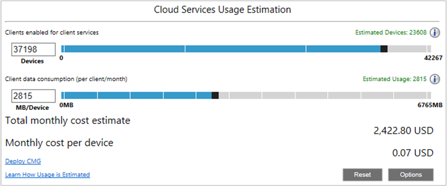

##  Cloud services cost estimator
<!--3555774-->

Some customers are concerned about the potential cost for attaching cloud services in Configuration Manager. This release introduces a new cost estimator tool in the Configuration Manager console. The tool uses the following data to estimate the cost of deploying the cloud management gateway:
- Data from your site database on client settings
- Aggregate, average client usage of management points and distribution points 
- Azure pricing

In the Configuration Manager console, go to the **Monitoring** workspace, and select the **Cloud Management** node. 

By default, the tool shows data based on the following settings:
- Only laptop devices
- Client policy only, not content
- 30 days of client usage data
- 10% of the total clients simultaneously communicating with the cloud service

Select **Options** to include additional device types and content, adjust the percentage of simultaneous clients, adjust the number of CMG instances, or change the Azure region.

The **Estimated devices** value is based on the number of resources in the site database. These devices are running the full Configuration Manager client (not MDM), and are active.
- **Laptops**: Devices with chassis type of portable, laptop, notebook, hand-held, docking station, or subnotebook
- **Servers**: Devices that aren't one of the laptop chassis types, and the machine role is server.
- **Desktops**: All other devices

### Limitations

In this release, the Azure regions, currencies, and prices are fixed. The tool uses the following values:

|Location | Currency | VM instance cost | GB cost |
|---------|---------|---------|---------|
| West US | $ | 99.28 | 0.087 |
| West Europe | € | 80.03 | 0.074 |
| North Europe | £ | 70.73 | 0.065 |

