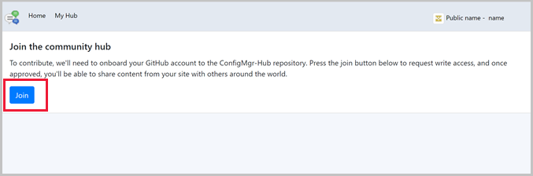

## Community hub and GitHub

The IT Admin community has developed a wealth of knowledge over the years. Rather than re-inventing Scripts and Reports from scratch, we've built a **Community Hub** where IT Admins can share with each other. By leveraging the work of others, you can save hours of work. The community hub fosters creativity by building on others work and having other people build on yours. GitHub already has industry wide processes and tools built for sharing. Now, the community hub will leverage those tools directly in the Configuration Manager Console as foundational pieces for driving this new community.

### Prerequisites

- A GitHub account
  - A GitHub account is only required to contribute and share content from the **My Hub** page.
  - If you don't wish to share, you can use contributions from others without having a GitHub account.
  - If you don't already have a GitHub account, you can create one when you join.

### Try it out!

Try to complete the tasks. Then send [Feedback](/sccm/core/understand/find-help#product-feedback) with your thoughts on the feature.

#### Join the community hub to contribute content

1. Go to the **Hub** node in the **Community** workspace.
1. Click on **My Hub** and you'll be prompted to sign into GitHub. If you don't have a GitHub account you'll redirected to GitHub where you can create one.
1. Once you have signed into GitHub, click the **Join** button to join the Configuration Manager community hub.

   
1. After joining, you'll see your membership request is pending. Your account needs to be approved by the Configuration Manager Hub Content Curation team. Approvals are done once a day, so it may take up to 1 business day for your approval to be granted.
1. Once you're granted access, you'll get an email from GitHub. Open the link in the email to accept the invitation.

#### Contribute content

Once you've accepted the invitation, you're able to contribute content.

1. Go to **Community** > **Hub** > **My Hub**.
1. Click **Add an Item** to open the contribution wizard.
1. Specify the settings for the object:
   - **Type:** Select the type of object you're contributing
     - Report
     - PowerShell script for Run Scripts use
   - **Name:** Name of your object
   - **Description:** The description of the object you're contributing.
1. Click **Next** to submit the contribution.
1. Once the contribution is complete, you'll see the GitHub pull request (PR) link. The link is also emailed to you.
   - You can paste the link into a browser to view the PR. Your PR will go though the standard GitHub merge process.
1. Click **Close** to exit the contribution wizard.
1. Once the PR has been completed and merged, the new item will show up on the community hub home page for others to see.
   - Currently, the audience is limited to other IT admins who are looking at the community hub in the Tech Preview builds.

#### Use the contributions of others
You don't need to sign into GitHub to use contributions others have made.

1. Go to the **Hub** node in the **Community** workspace.
1. Select an item to download.
1. You'll need appropriate permissions to download those objects from the hub and natively import them into your Configuration Manager site.
    - **Create** permission for SMS_Scripts class.
    - **Modify Report** and **Run report** on the object class.

