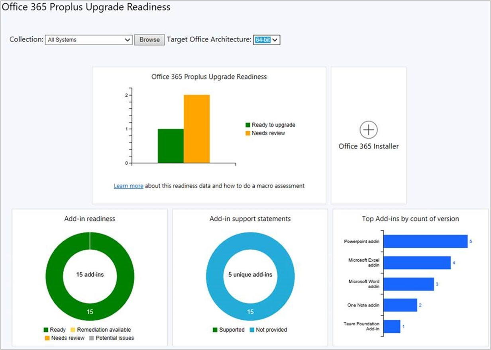

##  Office 365 ProPlus upgrade readiness dashboard

<!--4021125-->
To help you determine which devices are ready to upgrade to Office 365 ProPlus, there's a new readiness dashboard. It includes the **Office 365 ProPlus upgrade readiness** tile that released in Configuration Manager current branch version 1902. There are three new tiles on this dashboard to help you evaluate Office add-in readiness:

- Add-in readiness
- Add-in support statements
- Top add-ins by count of version

In the Configuration Manager console, go to the **Software Library** workspace, expand **Office 365 CLient Management**, and select the **Office 365 ProPlus Upgrade Readiness** node.

For more information on prerequisites and using this data, see [Integration for Office 365 ProPlus readiness](https://docs.microsoft.com/en-us/sccm/sum/deploy-use/office-365-dashboard#bkmk_o365_readiness).
