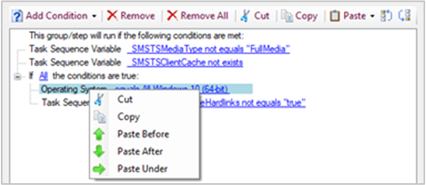

##  Improvements to OS deployment

Based on your UserVoice feedback, this release includes the following improvements to OS deployment:

- ([UserVoice reference](https://configurationmanager.uservoice.com/forums/300492-ideas/suggestions/31606324-allow-us-to-move-task-sequence-step-conditions))<!-- 4621098 --> If you want to reuse the conditions on a step with another step, you can now copy and paste conditions in the task sequence editor. Select a condition to cut or copy it. If a condition has children, it copies the entire block. If there's a condition on the clipboard, you can paste it with the following options:

    - Paste before
    - Paste after
    - Paste under (only applies to nested conditions)

    There are also new options to move conditions up or down the list.

    

