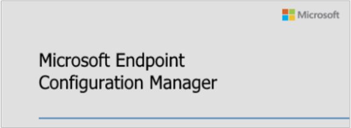

##  Microsoft Endpoint Configuration Manager

<!--4960084-->

Configuration Manager is now part of Microsoft Endpoint Manager.

Microsoft Endpoint Manager is a single, integrated endpoint management platform for managing all of your endpoints. Microsoft is bringing Configuration Manager and Intune together, and removing the licensing and migration barriers. This new suite allows you to leverage your existing Configuration Manager investments, while taking advantage of the power of the Microsoft cloud. Microsoft has simplified all of the various management-related names, brands, and consoles.

The following Microsoft management solutions are all now part of **Microsoft Endpoint Manager**:

- Configuration Manager (ConfigMgr)
- Intune
- Co-management
- Desktop Analytics
- Autopilot
- Other features in the Device Management Admin Console

For more information, see [Brad Anderson's blog post](https://aka.ms/cmannounce).
