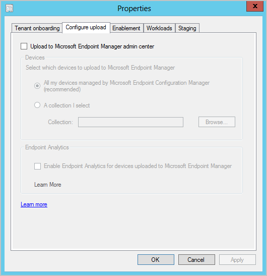
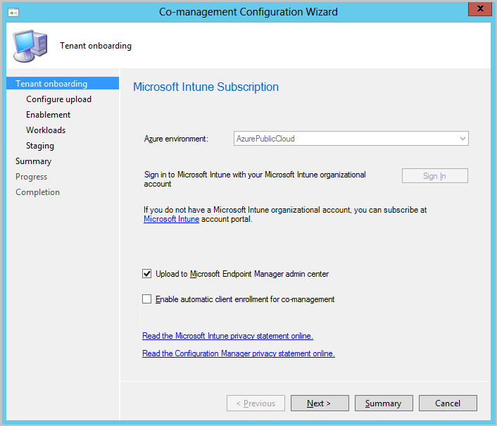
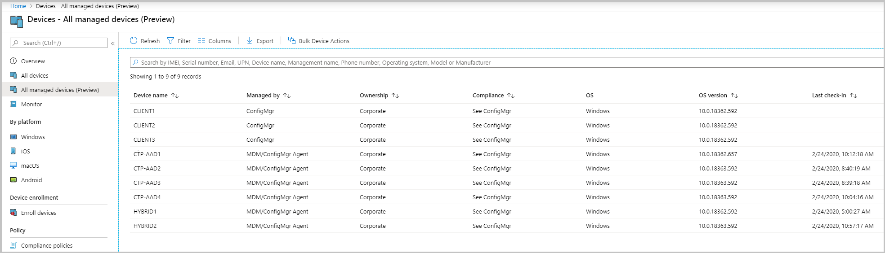
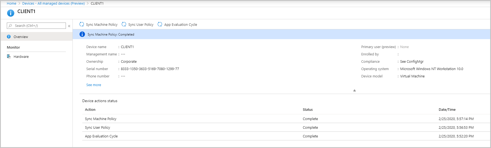

##  Microsoft Endpoint Manager tenant attach: Device sync and device actions
<!--3555758-->
Microsoft Endpoint Manager is an integrated solution for managing all of your devices. Microsoft brings together Configuration Manager and Intune into a single console called **Microsoft Endpoint Manager admin center**. Starting in this release you can upload your Configuration Manager devices to the cloud service and take actions from the **Devices** blade in the admin center.

### Prerequisites

- An account that is a *Global Administrator* for signing  in when applying this change. For more information, see [Azure Active Directory (Azure AD) administrator roles](https://docs.microsoft.com/azure/role-based-access-control/rbac-and-directory-admin-roles#azure-ad-administrator-roles).
   - Onboarding creates a third-party app and a first party service principal in your Azure AD tenant.
- An Azure public cloud environment.
- The user account triggering device actions has the following prerequisites:
   - Has been discovered with [Azure Active Directory user discovery](/configmgr/core/servers/deploy/configure/about-discovery-methods#azureaddisc)
   - Has been discovered with [Active Directory user discovery](/configmgr/core/servers/deploy/configure/about-discovery-methods#bkmk_aboutUser)
   - The **Notify Resource** permission under **Collections** object class in Configuration Manager.

### Internet endpoints

- `https://aka.ms/configmgrgateway`
- `https://gateway.configmgr.manage.microsoft.com`
- `https://us.gateway.configmgr.manage.microsoft.com`
- `https://eu.gateway.configmgr.manage.microsoft.com`

### Log files
Use the following logs, located in &lt;ConfigMgr install directory>\Logs, to monitor the device upload:

- **CMGatewaySyncUploadWorker.log**
- **CMGatewayNotificationWorker.log** 

### Try it out!

Try to complete the tasks. Then send [Feedback](/sccm/core/understand/find-help#product-feedback) with your thoughts on the feature.

#### Enable device upload

- If you have co-management enabled currently, [Edit co-management properties](#bkmk_edit) to enable device upload.
- If you don't have co-management enabled, [Use the **Configure co-management** wizard](#bkmk_config) to enable device upload.
   - You can upload your devices without enabling automatic enrollment for co-management or switching workloads to Intune.
- All Devices managed by Configuration Manager that have **Yes** in the **Client** column will be uploaded. If needed, you can limit upload to a single device collection.   

#####  Edit co-management properties to enable device upload

If you have co-management enabled currently, edit co-management properties to enable device upload using the instructions below:

1. In the Configuration Manager admin console, go to **Administration** > **Overview** > **Cloud Services** > **Co-management**.
1. Right-click your co-management settings and select **Properties**.
1. In the **Configure upload** tab, select **Upload to Microsoft Endpoint Manager admin center**. Click **Apply**.
   - The default setting for device upload is **All my devices managed by Microsoft Endpoint Configuration Manager**. If needed, you can limit upload to a single device collection.

   
1. Sign in with your *Global Administrator* account when prompted.
1. Click **Yes** to accept the **Create AAD Application** notification. This action provisions a service principal and creates an Azure AD application registration to facilitate the sync.
1. Click **OK** to exit the co-management properties once you've done making changes.

#####  Use the Configure co-management wizard to enable device upload
If you don't have co-management enabled, use the **Configure co-management** wizard to enable device upload. You can upload your devices without enabling automatic enrollment for co-management or switching workloads to Intune. Enable device upload using the instructions below:

1. In the Configuration Manager admin console, go to **Administration** > **Overview** > **Cloud Services** > **Co-management**.
1. In the ribbon, click **Configure co-management** to open the wizard.
1. On the **Tenant onboarding** page, select **AzurePublicCloud** for your environment. Azure Government cloud isn't supported.
1. Click **Sign In**. Use your *Global Administrator* account to sign in.
1. Ensure the **Upload to Microsoft Endpoint Manager admin center** option is selected on the **Tenant onboarding** page.
   - Make sure the option **Enable automatic client enrollment for co-management** isn't checked if you don't want to enable co-management now. If you do want to enable co-management, select the option.
   - If you enable co-management along with device upload, you'll be given additional pages in the wizard to complete. For more information, see [Enable co-management](/sccm/comanage/how-to-enable).

   
1. Click **Next** and then **Yes** to accept the **Create AAD Application** notification. This action provisions a service principal and creates an Azure AD application registration to facilitate the sync.
1. On the **Configure upload** page, select the recommended device upload setting for **All my devices managed by Microsoft Endpoint Configuration Manager**. If needed, you can limit upload to a single device collection.
1. Click **Summary** to review your selection, then click **Next**.
1. When the wizard is complete, click **Close**.  

####  Review your upload and perform device actions

##### Review logs

1. Open **CMGatewaySyncUploadWorker.log** from &lt;ConfigMgr install directory>\Logs.
1. The next sync time is noted by log entries similar to `Next run time will be at approximately: 02/28/2020 16:35:31`.
1. For device uploads, look for log entries similar to `Batching N records`. **N** is the number of devices uploaded to the cloud. 
1. The upload occurs every 15 minutes for changes. Once changes are uploaded, it may take an additional 5 to 10 minutes for client changes to appear in **Microsoft Endpoint Manager admin center**.

##### Perform device actions

1. In a browser, navigate to `devicemanagement.microsoft.com`
1. Select **Devices** then **All managed devices** to see the uploaded devices.
   
1. Click on a device to load its **Overview** page.
1. Click on any of the following actions:
   - **Sync Machine Policy**
   - **Sync User Policy**
   - **App Evaluation Cycle**

   