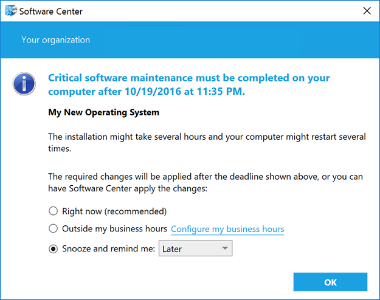
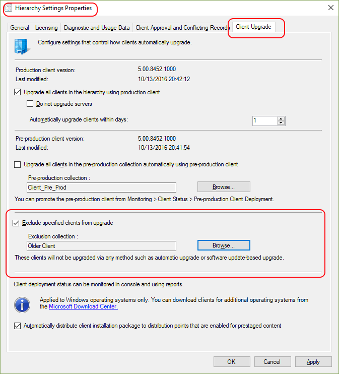

# Capabilities in Technical Preview 1610 for System Center Configuration Manager

*Applies to: System Center Configuration Manager (Current Branch)*

This article introduces the features that are available in the Technical Preview for System Center Configuration Manager, version 1610. You can install this version to update and add new capabilities to your Configuration Manager technical preview site.      Before installing this version of the technical preview, review the introductory topic, [Technical Preview for System Center Configuration Manager](../../core/get-started/technical-preview.md), to become familiar with general requirements and limitations for using a technical preview, how to update between versions, and how to provide feedback about the features in a technical preview.    

**The following are new features you can try out with this version.**  
## Filter by content size in automatic deployment rules
You can now filter on the content size for software updates in automatic deployment rules. For example, you can set the **Content Size (KB)** filter to **< 2048** to only download software updates that are smaller than 2MB. Using this filter prevents large software updates from automatically downloading to better support simplified Windows down-level servicing when network bandwidth is limited. For details, see [Configuration Manager and Simplified Windows Servicing on Down Level Operating Systems](https://blogs.technet.microsoft.com/enterprisemobility/2016/10/07/configuration-manager-and-simplified-windows-servicing-on-down-level-operating-systems/).

#### To configure the Content Size field
To configure the **Content Size (KB)** field, go to the **Software Updates** page in the Create Automatic Deployment Rule Wizard when you create an ADR or go to the **Software Updates** tab in the properties for an existing ADR.

## Improved functionality for required software dialogs
When a user receives required software, from the **Snooze and remind me:** setting, they can select from the following drop-down list of values:
- Later: specifies that notifications are scheduled based on the notification settings configured in Client Agent settings.
- Fixed time: specifies that the notification will be scheduled to display again after the selected time. For example, if a user selects 30 minutes, the notification will display again in 30 minutes.

The maximum snooze time is always based on the notification values configured in the Client Agent settings at every time along the deployment timeline. For example, if the **Deployment deadline greater than 24 hours, remind users every (hours)** setting on the Computer Agent page is configured for 10 hours, and it is more than 24 hours before the deadline when the dialog is launched, the user would be presented with a set of snooze options up to but never greater than 10 hours. As the deadline approaches, the dialog will show fewer options, consistent with the relevant Client Agent settings for each component of the deployment timeline.

Additionally, for a high-risk deployment, such as a task sequence that deploys an operating system, the end-user notification experience is now more intrusive. Instead of a transient taskbar notification, each time the user is notified that critical software maintenance is required, a dialog box such as the following displays on the user's computer:

For more information:
- [Settings to manage high-risk deployments](../../protect/understand/settings-to-manage-high-risk-deployments.md)
- [How to configure client settings](../clients/deploy/configure-client-settings.md)

## Deny previously approved application requests

As an administrator you can now deny a previously approved application request. Once denied, to install this application later users must resubmit a request. Denial does not uninstall the application; rather it forces reapproval for any new request for that application from that user. Previously, application request denial was only available for application requests that had not been approved.

#### Try it out
To deny an application approved request:

1.	In the Configuration Manager console, [create and deploy an application](https://docs.microsoft.com/en-us/sccm/apps/deploy-use/create-applications) that requires approval.
2.	On a client computer, open Software Center and submit a request for the application.
3.	In the Configuration Manager console, approve the application request.
4.	Deny the approved application request: In the Configuration Manager console, navigate **Software Library** > **Overview** > **Application Management** > **Approval Requests** and select the application request you want to deny.  In the ribbon, click **Deny**.

## Exclude clients from automatic upgrade
Technical Preview 1610 introduces a new setting you can use to exclude a collection of clients from automatically installing updated client versions.  This applies to automatic upgrade as well as other methods such as software update-based upgrade, logon scripts, and group policy. This can be used for a collection of computers that need greater care when upgrading the client. A client that is in an excluded collection ignores requests to install updated client software.

### Configure exclusion from automatic upgrade
To configure automatic upgrade exclusions:
1.	In the Configuration Manager console open **Hierarchy Settings** under **Administration > Site Configuration > Sites**, and then select the **Client Upgrade** tab.
2.	Select the checkbox for **Exclude specified clients from upgrade**, and then for **Exclusion collection**, select the collection you want to exclude. You can only select a single collection for exclusion.
3.	Click **OK** to close and save the configuration. Then, after clients update policy, clients in the excluded collection will no longer automatically install updates to the client software.

  

> [!NOTE]
> Although the user interface states that clients will not be upgraded via any method, there are two methods you can use to override these settings. Client push installation and a manual client installation can be used to override this configuration. For more details, see the following section.

### How to upgrade a client that is in an excluded collection
So long as a collection is configured to be excluded, members of that collection can only have their client software upgraded by one of two methods, which override the exclusion:
 - **Client Push Installation** – You can use client push installation to upgrade a client that is in an excluded collection. This is allowed as it is considered to be the intent of the administrator and enables you to upgrade clients without removing the entire collection from exclusion.       
 - **Manual client installation** – You can manually upgrade clients that are in an excluded collection when you use the following command line switch with ccmsetup:  ***/ignoreskipupgrade***

  If you attempt to manually upgrade a client that is a member of the excluded collection and do not use this switch, the client will not install the new client software. For more information see [How to install Configuration Manager Clients Manually](/sccm/core/clients/deploy/deploy-clients-to-windows-computers#a-namebkmkmanuala-how-to-install-configuration-manager-clients-manually).

For more information on client installation methods, see [How to deploy clients to Windows computers in System Center Configuration Manager](/sccm/core/clients/deploy/deploy-clients-to-windows-computers).

## See Also
[Technical Preview for System Center Configuration Manager](../../core/get-started/technical-preview.md)
