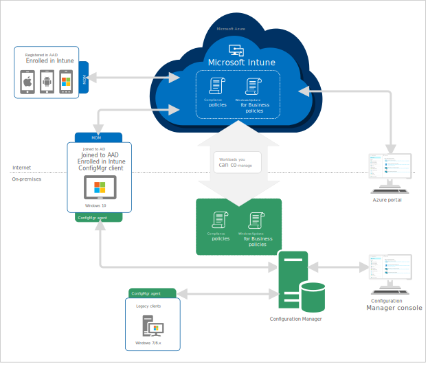

# Capabilities in Technical Preview 1709 for System Center Configuration Manager

*Applies to: System Center Configuration Manager (Technical Preview)*

This article introduces the features that are available in the Technical Preview for System Center Configuration Manager, version 1709. You can install this version to update and add new capabilities to your Configuration Manager technical preview site. Before installing this version of the technical preview, review [Technical Preview for System Center Configuration Manager](../../core/get-started/technical-preview.md) to become familiar with general requirements and limitations for using a technical preview, how to update between versions, and how to provide feedback about the features in a technical preview.     

<!--  Known Issues Template   
**Known Issues in this Technical Preview:**
-   **Issue Name**. Details
    Workaround details.
-->
**Known Issues in this Technical Preview:**
-   **Update to preview version 1709 fails when you have a site server in passive mode**. When you run the preview version 1706, 1707, or 1708 and have a [primary site server in passive mode](/sccm/core/get-started/capabilities-in-technical-preview-1706#site-server-role-high-availability), you must uninstall the passive mode site server before you can successfully update your preview site to version 1709. You can reinstall the passive mode site server after your site runs version 1709.

  To uninstall the passive mode site server:
  1. In the console go to **Administration** > **Overview** > **Site Configuration** > **Servers and Site System Roles**, and then select the passive mode site server.
  2. In the **Site System Roles** pane, right click on the **Site server** role, and then choose **Remove Role**.
  3. Right-click on the passive mode site server, and then choose **Delete**.
  4. After the site server uninstalls, on the active primary site server restart the service **CONFIGURATION_MANAGER_UPDATE**.

**The following are new features you can try out with this version.**  

## Improved VPN Profile experience in Configuration Manager console
<!-- 1313282 -->
With this release, we’ve updated the VPN profile wizard and properties pages to display settings appropriate for the selected platform. Specifically:

- Each platform has its own workflow, meaning that new VPN profiles contain only the setting supported by the platform.
- The **Supported Platforms** pages now appear after the **General** page.  You now choose the platform before setting property values.
- When the platform is set to **Android**, **Android for Work**, or **Windows Phone 8.1**, the **Supported platforms** page is not needed and is not displayed.
- The Configuration Manager client-based workflow has been combined with the hybrid mobile device (MDM) client-based Windows 10 workflows; they support the same settings.
- Each platform workflow includes just the settings appropriate for that workflow.  For example, the Android workflow contains settings appropriate for Android; settings appropriate for iOS or Windows 10 Mobile no longer appear in the Android workflow.
- For Windows 8.1 devices, settings managed by Configuration Manager are clearly marked.
- The Automatic VPN page is obsolete and has been removed.

These changes apply to new VPN profiles.  

To minimize compatibility risk, existing VPN profiles are unchanged.  When you edit an existing profile, the settings appear as they did when the profile was created.  

### Try it out!

Create a new VPN profile using the usual process. Notice that the first page in the VPN profile wizard’s options have changed.

1.	Go to **Assets and Compliance** > **Overview** > **Compliance Settings** > **Company Resource Access** > **VPN Profiles** and then choose **Create VPN Profile**.
2.	Enter a name on the **General** page and choose one of the following options under **Specify the type of VPN profile you want to create**:

    - Windows 10  
    - Windows 8.1  
    - Windows Phone 8.1  
    - iOS and macOS  
    - Android  
    - Android for Work  

3.	If you choose **Windows 8.1**, you also have the option to **Create new profile** or **Import from file**.
4.	Complete the wizard to finish creating the profile.

As you select different platforms, notice that only the settings relevant to the selected platform display.

## Co-management for Windows 10 devices    
<!-- 1350871 -->
Many customers want to manage Windows 10 devices in the same way they manage mobile devices using a simplified, lower cost, cloud-based solution. However, making the transition from traditional management to modern management can be challenging. Starting with the Windows 10, version 1607 (also known as the Anniversary Update), you can join a Windows 10 device to on-premises Active Directory (AD) and cloud-based Azure AD at the same time (hybrid Azure AD). Co-management takes advantage of this improvement and enables you to concurrently manage Windows 10 devices by using both Configuration Manager and Intune. It’s a solution that provides a bridge from traditional to modern management and gives you a path to make the transition using a phased approach. 

### Prerequisites
You must have the following prerequisites in place before you can enable co-management. There are general prerequisites, and different prerequisites for existing Configuration Manager clients and devices that are not clients.

### Known issues
After you create a co-management policy, you cannot edit the policy. To change the policy, delete it, and then recreate it with the settings that you need. 

#### General prerequisites
The following are general prerequisites for you to enable co-management:  

- Technical Preview for Configuration Manager version 1709
- Azure AD 
- EMS or Intune license for all users
- Intune subscription &#40;MDM authority in Intune set to **Intune**&#41;

   > [!Note]  
   > If you have a hybrid MDM environment (Intune integrated with Configuration Manager), you cannot enable co-management. If you are interested in migrating to Intune standalone, see [Start migrating from hybrid MDM to Intune standalone](/sccm/mdm/deploy-use/migrate-hybridmdm-to-intunesa).

#### Additional prerequisites for existing Configuration Manager clients
- Windows 10, version 1709 (Fall Creators Update) and later
- Hybrid Azure AD joined (joined to AD and Azure AD)

#### Additional prerequisites for new Windows 10 devices
- Windows 10, version 1709 (Fall Creators Update) and later
- [Cloud Management Gateway](/sccm/core/clients/manage/manage-clients-internet#cloud-management-gateway) in Configuration Manager

### Workloads you can switch to Intune
After you enable co-management, Configuration Manager continues to manage all workloads. When you decide that you are ready, you can have Intune start managing available workloads. In this release, you can have Intune manage the following workloads.   

#### Compliance policies
Compliance policies define the rules and settings that a device must comply with to be considered compliant by conditional access polices. You can also use compliance policies to monitor and remediate compliance issues with devices independently of conditional access. For details, see [Device compliance policies](https://docs.microsoft.com/en-us/sccm/mdm/deploy-use/device-compliance-policies).  

#### Windows Update for Business policies
Windows Update for Business policies let you configure deferral policies for Windows 10 feature updates or quality updates for Windows 10 devices managed directly by Windows Update for Business. For details, see [Configure Windows Update for Business deferral policies](https://docs.microsoft.com/sccm/sum/deploy-use/integrate-windows-update-for-business-windows-10#configure-windows-update-for-business-deferral-policies).  

### Remote actions available in Intune on Azure for co-managed devices
When a Windows 10 device is enabled for co-management, you have the following remote actions available to you from Intune on Azure:  
- [Factory reset](https://docs.microsoft.com/intune/devices-wipe#factory-reset)
- [Selective wipe](https://docs.microsoft.com/intune/apps-selective-wipe)
- [Delete devices](https://docs.microsoft.com/intune/devices-wipe#delete-devices-from-the-azure-active-directory-portal)
- [Restart device](https://docs.microsoft.com/intune/device-restart)
- [Fresh start](https://docs.microsoft.com/intune/device-fresh-start)

### Prepare Intune for co-management
Before you switch workloads from Configuration Manager to Intune, create the profiles and policies you need in Intune to ensure your devices continue to be protected.
You can create objects in Intune based on the objects that you have in Configuration Manager. Or, if your current strategy is based on legacy or traditional management, you might want to take a step back to rethink what policies and profiles you need for modern management. Use the following resources to create the policies and profiles.    
<!-- - [Device compliance policies](https://docs.microsoft.com/intune/compliance-policy-create-windows)  -->
- [Windows Update for Business policies](https://docs.microsoft.com/intune/windows-update-for-business-configure)  
- [Device configuration profiles](https://docs.microsoft.com/intune/device-profile-create)  

### Architectural overview for co-management
The following diagram provides an architectural overview of co-management and how it fits into existing Configuration and Intune infrastructures.

### Scenarios to enable co-management  
You can enable co-management for both Windows 10 devices enrolled in Microsoft Intune and existing Windows 10 Configuration Manager clients. Both scenarios result in Windows 10 devices concurrently managed by Configuration Manager and Intune, as well as joined to AD and Azure AD.  

#### Devices enrolled in Intune  
When Windows 10 devices are enrolled in Intune, you can install the Configuration Manager client on the devices (using a specific command-line argument) to prepare the clients for co-management. Then, you enable co-management from the Configuration Manager console to start moving specific workloads to Intune for specific Windows 10 devices.  

For Windows 10 devices that are not yet enrolled in Intune, you can use automatic enrollment in Azure to enroll the devices. For new Windows 10 devices, you can use Windows AutoPilot to configure the Out of Box Experience (OOBE), which includes automatic enrollment that enrolls devices in Intune.  

#### Configuration Manager clients
When you have Windows 10 devices that are Configuration Manager clients, you can enroll these devices and enable co-management from the Configuration Manager console. Configuration Manager triggers automatic enrollment into Intune based on the Azure AD tenant information.  

### Prepare Windows 10 devices for co-management
You can enable co-management on Windows 10 devices that are joined to AD and Azure AD, and enrolled in Intune and a client in Configuration Manager. For new Windows 10 devices, and for devices that are already enrolled in Intune, install the Configuration Manager client before they can be co-managed. For Windows 10 devices that are already Configuration Manager clients, you can enroll the devices with Intune and enable co-management in the Configuration Manager console.

#### Command line to install Configuration Manager client
Create an app in Intune for Windows 10 devices that are not already Configuration Manager clients. When you create the app in the next sections, use the following command line:

ccmsetup.msi CCMSETUPCMD="/mp:&#60;*URL of cloud management gateway mutual auth endpoint*&#62;/ CCMHOSTNAME=&#60;*URL of cloud management gateway mutual auth endpoint*&#62; SMSSiteCode=&#60;*Sitecode*&#62; SMSMP=https:&#47;/&#60;*FQDN of MP*&#62; AADTENANTID=&#60;*AAD tenant ID*&#62; AADTENANTNAME=&#60;*Tenant name*&#62; AADCLIENTAPPID=&#60;*Server AppID for AAD Integration*&#62; AADRESOURCEURI=https:&#47;/&#60;*Resource ID*&#62;”

For example, if you had the following values:

- **URL of cloud management gateway mutual auth endpoint**: https:/&#47;contoso.cloudapp.net/CCM_Proxy_MutualAuth/72057594037928100    

   >[!Note]    
   >Use the **MutualAuthPath** value in the **vProxy_Roles** SQL view for the **URL of cloud management gateway mutual auth endpoint** value.

- **FQDN of management point (MP)**: sccmmp.corp.contoso.com    
- **Sitecode**: PS1    
- **Azure AD tenant ID**: 72F988BF-86F1-41AF-91AB-2D7CD011XXXX    
- **Azure AD tenant name**: contoso    
- **Azure AD client app ID**: bef323b3-042f-41a6-907a-f9faf0d1XXXX     
- **AAD Resource ID URI**: ConfigMgrServer    

  > [!Note]    
  > Use the **IdentifierUri** value found in the **vSMS_AAD_Application_Ex** SQL view for the **AAD Resource ID URI** value.

You would use the following command line:

ccmsetup.msi CCMSETUPCMD="/mp:https:/&#47;contoso.cloudapp.net/CCM_Proxy_MutualAuth/72057594037928100    CCMHOSTNAME=contoso.cloudapp.net/CCM_Proxy_MutualAuth/72057594037928100 SMSSiteCode=PS1 SMSMP=https:/&#47;sccmmp.corp.contoso.com AADTENANTID=72F988BF-86F1-41AF-91AB-2D7CD011XXXX AADTENANTNAME=contoso  AADCLIENTAPPID=bef323b3-042f-41a6-907a-f9faf0d1XXXX AADRESOURCEURI=https:/&#47;ConfigMgrServer”

> [!Tip]
>You can find the command-line parameters for your site by using the following steps:     
> 1. In the Configuration Manager console, go to **Administration** > **Overview** > **Cloud Services** > **Co-management**.  
> 2. On the Home tab, in the Manage group, choose **Configure co-management** to open the Co-management Onboarding Wizard.    
> 3. On the Subscription page, click **Sign In** and sign in to your Intune tenant, and then click **Next**.    
> 4. On the Enablement page, click **Copy** in the **Devices enrolled in Intune** section to copy the command line to the clipboard, and then save the command line to use in the procedure to create the app.  
> 5. Click **Cancel** to exit the wizard.

#### New Windows 10 devices
For new Windows 10 devices, you can use the Autopilot service to configure the out of box experience, which includes joining the device to AD and Azure AD, as well as enrolling the device in Intune. Then, create an app in Intune to deploy the Configuration Manager client.  
1. Enable AutoPilot for the new Windows 10 devices. For details, see [Overview of Windows AutoPilot](https://docs.microsoft.com/windows/deployment/windows-10-auto-pilot).  
2. Configure automatic enrollment in Azure AD for your devices to be automatically enrolled into Intune. For details, see [Enroll Windows devices for Microsoft Intune](https://docs.microsoft.com/intune/windows-enroll).
3. Create an app in Intune with the Configuration Manager client package and deploy the app to Windows 10 devices that you want to co-manage. Use the [command line to install Configuration Manager client](#command-line-to-install-configuration-manager-client) when you go through the steps to [install clients from the Internet using Azure AD](https://docs.microsoft.com/en-us/sccm/core/clients/deploy/deploy-clients-cmg-azure).   

#### Windows 10 devices not enrolled in Intune or a Configuration Manager client
For Windows 10 devices that are not enrolled in Intune or have the Configuration Manager client, you can use automatic enrollment to enroll the device in Intune. Then, create an app in Intune to deploy the Configuration Manager client.
1. Configure automatic enrollment in Azure AD for your devices to be automatically enrolled into Intune. For details, see [Enroll Windows devices for Microsoft Intune](https://docs.microsoft.com/intune/windows-enroll).  
2. Create an app in Intune with the Configuration Manager client package and deploy the app to Windows 10 devices that you want to co-manage. Use the [command line to install Configuration Manager client](#command-line-to-install-configuration-manager-client) when you go through the steps to [install clients from the Internet using Azure AD](https://docs.microsoft.com/en-us/sccm/core/clients/deploy/deploy-clients-cmg-azure).

#### Windows 10 devices enrolled in Intune
For Windows 10 devices that are already enrolled in Intune, create an app in Intune to deploy the Configuration Manager client. Use the [command line to install Configuration Manager client](#command-line-to-install-configuration-manager-client) when you go through the steps to [install clients from the Internet using Azure AD](https://docs.microsoft.com/en-us/sccm/core/clients/deploy/deploy-clients-cmg-azure).  

### Switch Configuration Manager workloads to Intune
In the previous section, you prepared Windows 10 devices for co-management. These devices are now joined to AD and Azure AD, and they are enrolled in Intune and have the Configuration Manager client. You likely still have Windows 10 devices that are joined to AD and have the Configuration Manager client, but not joined to Azure AD or enrolled in Intune. The following procedure provides the steps to enable co-management, prepare the rest of your Windows 10 devices (Configuration Manager clients without Intune enrollment) for co-management, and allows you to start switching specific Configuration Manager workloads to Intune.

1. In the Configuration Manager console, go to **Administration** > **Overview** > **Cloud Services** > **Co-management**.    
2. On the Home tab, in the Manage group, choose **Configure co-management** to open the Co-management Onboarding Wizard.    
3. On the Subscription page, click **Sign In** and sign in to your Intune tenant, and then click **Next**.   
4. On the Staging page, configure the following settings and then click **Next**:
    - **Pilot group**: The pilot group contains one or more collections that you select. Use this group as part of your phased rollout of co-management. You can start with a small test collection, and then add more collections to the pilot group as you roll out co-management to more users and devices. You can change the collections in the pilot group at any time from the co-management properties.
    - **Production**: When you select this setting, all supported Windows 10 devices are enabled for co-management. Configure the **Exclusion group** with one or more collections. Devices that are members of any of the collections in this group are excluded from using co-management. 
5. On the Enablement page, choose either **Pilot** or **All** (depending on the settings you configured on the Staging page) to enable Automatic enrollment in Intune, and then click **Next**. When you choose **Pilot**, only the Configuration manager clients that are members of the Pilot group are automatically enrolled in Intune. This allows you to enable co-management on a subset of clients to initially test co-management, and rollout co-management using a phased approach. 
6. On the Workloads page, choose whether to switch Configuration Manager workloads to be managed by Intune, and then click **Next**. Use the sliders to select whether to switch the workload to the Pilot group or for all Windows 10 clients (depending on the settings you configured on the Staging page). 
7. To enable co-management, complete the wizard.  

<!--### Modify your co-management settings
After you enable co-management using the wizard, you can modify your target group and change the workloads that are managed by Configuration Manager and Intune.  
- In the Configuration Manager console, go to **Administration** > **Overview** > **Cloud Services** > **Co-management**.  
Select the co-management object, and then on the Home tab, click **Properties**. -->   

<!--### Monitor co-management
After you have enabled co-management, you can monitor which devices are managed by Configuration Manager and which are managed by Intune. You can also see which Configuration Manager workloads are managed by which product.-->

## See also
For information about installing or updating the technical preview branch, see [Technical Preview for System Center Configuration Manager](/sccm/core/get-started/technical-preview). 
