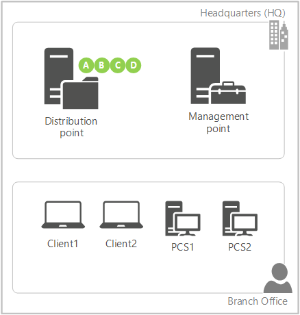

# Capabilities in Technical Preview 1803 for System Center Configuration Manager

*Applies to: System Center Configuration Manager (Technical Preview)*

This article introduces the features that are available in the Technical Preview for Configuration Manager, version 1803. You can install this version to update and add new capabilities to your technical preview site. 

Review the [Technical Preview](/sccm/core/get-started/technical-preview) article before installing this update. That article familiarizes you with the general requirements and limitations for using a technical preview, how to update between versions, and how to provide feedback.     

<!--  Known Issues Template   
## Known Issues in this Technical Preview:
-   **Issue Name**. Details
    Workaround details.
-->

 

**The following are new features you can try out with this version.**  

 
## Pull-distribution points support cloud distribution points as source  
<!--1321554-->
Many customers use [pull-distribution points](/sccm/core/plan-design/hierarchy/use-a-pull-distribution-point) in remote or branch offices, which download content from a source distribution point across the WAN. If your remote offices have a better connection to the internet, or to reduce load on your WAN links, you can now use a [cloud distribution point](/sccm/core/plan-design/hierarchy/use-a-cloud-based-distribution-point) in Microsoft Azure as the source. When you add a source on the **Pull Distribution Point** tab of the distribution point properties, any cloud distribution point in the site is now listed as an available distribution point. The behavior of both site system roles remains the same otherwise. 

### Prerequisites
- The pull-distribution point needs internet access to communicate with Microsoft Azure.
- The content must be distributed to the source cloud distribution point.

> [!Note]  
> This feature does incur charges to your Azure subscription for data storage and network egress. For more information, see the [Cost of using cloud-based distribution](/sccm/core/plan-design/hierarchy/use-a-cloud-based-distribution-point#BKMK_CloudDPCost).

## Partial download support in client peer cache to reduce WAN utilization
<!--1357346-->
Client peer cache sources can now divide content into parts. These parts minimize the network transfer to reduce WAN utilization. The management point provides more detailed tracking of the content parts. It tries to eliminate more than one download of the same content per boundary group. 

### Example scenario
Contoso has a single primary site with two boundary groups: Headquarters (HQ) and Branch Office. There is a 30-minute fallback relationship between the boundary groups. The management point and distribution point for the site are only in the HQ boundary. The branch office location has no local distribution point. Two of the four clients at the branch office are configured as peer cache sources. 

1. You target a deployment with content to all four clients in the branch office. You only distributed the content to the distribution point.
2. Client3 and Client4 do not have a local source for the deployment. The management point instructs the clients to wait 30 minutes before falling back to the remote boundary group.
3. Client1 (PCS1) is the first peer cache source to refresh policy with the management point. Because this client is enabled as a peer cache source, the management point instructs it to immediately start downloading part A from the distribution point.  
4. When Client2 (PCS2) contacts the management point, as part A is already in progress but not yet complete, the management point instructs it to immediately start downloading part B from the distribution point.
5. PCS1 finishes downloading part A, and immediately notifies the management point. As part B is already in progress but not yet complete, the management point instructs it to start downloading part C from the distribution point.
6. PCS2 finishes downloading part B, and immediately notifies the management point. The management point instructs it to start downloading part D from the distribution point. 
7. PCS1 finishes downloading part C, and immediately notifies the management point. The management point informs it that there are no more parts available from the remote distribution point. The management point instructs it to download part B from its local peer, PCS2.
8. This process continues until both client peer cache sources have all of the parts from each other. The management point prioritizes parts from the remote distribution point before instructing the peer cache sources to download parts from local peers. 
9. Client3 is the first to refresh policy after the 30-minute fallback period expires. It now checks back with the management point, which informs the client of new local sources. Instead of downloading the content in full from the distribution point across the WAN, it downloads the content in full from one of the client peer cache sources. Clients prioritize local peer sources. 

> [!Note]  
> If the number of client peer cache sources is greater than the number of content parts, then the management point instructs the additional peer cache sources to wait for fallback like a normal client. 

### Try it out!
 Try to complete the tasks. Then send **Feedback** from the **Home** tab of the ribbon letting us know how it worked.

1. Set up [boundary groups](/sccm/core/servers/deploy/configure/boundary-groups) and [peer cache sources](/sccm/core/plan-design/hierarchy/client-peer-cache) per normal.
2. In the Configuration Manager console, go to the **Administration** workspace, expand **Site Configuration**, and select **Sites**. Click **Hierarchy Settings** in the ribbon. 
3. On the **General** tab, enable the option to **Configure client peer cache sources to divide content into parts**. 
4. Create a required deployment with content.  

   > [!Note]  
   > This functionality only works when the client downloads content in the background, such as with a required deployment. On-demand downloads, such as when the user installs an available deployment in Software Center, behaves as usual.  

1. To see them handling the download of content in parts, examine the **ContentTransferManager.log** on the client peer cache source and the **MP_Location.log** on the management point.  
 

## Maintenance windows in Software Center
<!--1358131-->
Software Center now displays the next scheduled maintenance window. On the Installation Status tab, switch the view from All to Upcoming. It displays the time range and the list of deployments that are scheduled. The list is blank if there are no future maintenance windows. 

## Custom tab for webpage in Software Center
<!--1358132-->
You can now create a customized tab to open a webpage in Software Center. This feature allows you to show content to your end users in a consistent, reliable way. The following list includes a few examples:
- Contact IT: information on how to contact your organization's IT department
- IT Support Center: IT self-service actions such as searching a knowledge base or opening a support ticket.
- End-user documentation: articles for users in your organization on various IT topics such as using applications or upgrading to Windows 10.

### Try it out!
 Try to complete the tasks. Then send **Feedback** from the **Home** tab of the ribbon letting us know how it worked.

1. In the Configuration Manager console, **Administration** workspace, **Client Settings** node, open the **Default Client Settings** policy.
2. Select the **Software Center** group.
3. For **Software Center settings**, click **Customize**.
4. Switch to the **Tabs** tab.
5. Enable the option to **Specify a custom tab for Software Center**.
	1. Enter a name in the **Tab name** text field. This name is what displays to the user in Software Center.
	2. Enter a valid URL in the **Content URL** text field. This URL is the content that Software Center displays when users click this tab.

> [!Tip]  
> Software Center uses Internet Explorer components for rendering the web page.

## Next steps
For information about installing or updating the technical preview branch, see [Technical Preview for System Center Configuration Manager](/sccm/core/get-started/technical-preview).    
