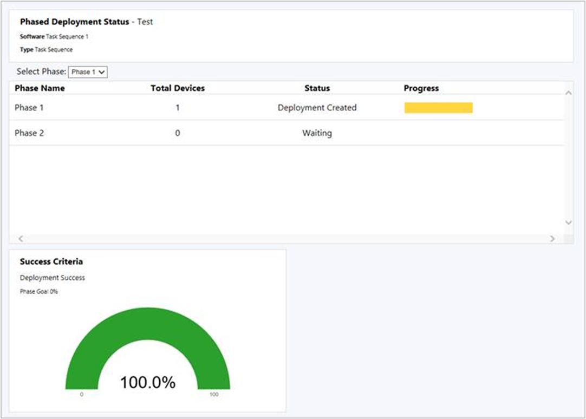

# Capabilities in Technical Preview 1806.2 for System Center Configuration Manager

*Applies to: System Center Configuration Manager (Technical Preview)*

This article introduces the features that are available in the Technical Preview for Configuration Manager, version 1806.2. You can install this version to update and add new capabilities to your technical preview site. 

Review the [Technical Preview](/sccm/core/get-started/technical-preview) article before installing this update. That article familiarizes you with the general requirements and limitations for using a technical preview, how to update between versions, and how to provide feedback.     

<!--  Known Issues Template
## Known Issues in this Technical Preview

###  Known issue title
<!--bugID--
Issue description and cause.

#### Workaround
Steps to workaround, if any.  
-->

## Known Issues in this Technical Preview

###  Version 1806.2 shows Version 1806 in About Configuration Manager
<!--518148-->
After upgrading to technical preview version 1806.2, if you open the **About Configuration Manager** window from the upper left corner of the console, it still shows **Version 1806**. 

#### Workaround
Use the **Site version** property to determine the difference between 1806 and 1806.2:

| Site version  | Version
|---------|---------|
| 5.0.**8672**.1000 | 1806 |
| 5.0.**8685**.1000 | 1806.2 |
 

 

**The following are new features you can try out with this version.**  

##  Improvements to phased deployments

This release includes the following improvements to [phased deployments](/sccm/osd/deploy-use/create-phased-deployment-for-task-sequence):
- [Phased deployment status](#bkmk_pod-monitor)
- [Phased deployment of applications](#bkmk_pod-app)
- [Gradual rollout during phased deployments](#bkmk_pod-throttle)

###  Phased deployment status
<!--1358577-->
Phased deployments now have a native monitoring experience. From the **Deployments** node in the **Monitoring** workspace, select a phased deployment, and then click **View Status** in the ribbon.

This dashboard shows the following information for each phase in the deployment:  

- **Total devices**: How many devices are targeted by this phase.  

- **Status**: The current status of this phase. Each phase can be in one of the following states:  

    - **Deployment created**: The phased deployment created a deployment of the software to the collection for this phase. Clients are actively targeted with this software.  

    - **Waiting**: The previous phase hasn't yet reached the success criteria for the deployment to continue to this phase.  

    - **Begins in # days**: The previous phase met its success criteria, and this phase deploys in the specified number of days. This period corresponds to the phase setting: **Automatically begin this phase after a deferral period (in days)**.  

    - **Ready to begin**: The previous phase met its success criteria, and this phase is ready for an administrator to start the deployment. This period corresponds to the phase setting: **Manually begin the next phase of deployment**.  

    - **Suspended**: An administrator suspended the deployment.  

- **Progress**: The color-coded deployment states from clients. For example: Success, In Progress, Error, Requirements Not Met, and Unknown. 

###  Phased deployment of applications
<!--1358147-->
Create phased deployments for applications. Phased deployments allow you to orchestrate a coordinated, sequenced rollout of software based on customizable criteria and groups.

In the Configuration Manager console, go to the **Software Library**, expand **Application Management**, and select **Applications**. Select an application, and then click **Create Phased Deployment** in the ribbon. 

The behavior of an application phased deployment is the same as for task sequences. For more information, see [Create phased deployments for a task sequence](/sccm/osd/deploy-use/create-phased-deployment-for-task-sequence).

#### Prerequisite
Distribute the content for the application to a distribution point before creating the phased deployment.<!--518293-->

#### Known issue
You can't manually create phases for an application. The wizard automatically creates two phases for application deployments.

###  Gradual rollout during phased deployments
<!--1358578-->
During a phased deployment, the rollout in each phase now happens gradually. This behavior helps mitigate the risk of deployment issues, and decreases the load on the network caused by the distribution of content to clients. The site gradually makes the software available depending on the configuration for each phase. Every client in a phase has a deadline relative to the time the software is made available. The time window between the available time and deadline is the same for all clients in a phase.

When you create a phased deployment and manually configure a phase, on the **Phase Settings** page of the Add Phase Wizard, configure the option: **Gradually make this software available over this period of time (in days)**.

##  Support for new Windows app package formats
<!--1357427-->
Configuration Manager now supports the deployment of new Windows 10 app package (.msix) and app bundle (.msixbundle) formats. The latest [Windows Insider Preview](https://insider.windows.com/) builds currently support these new formats.

For an overview of MSIX, see [A closer look at MSIX](https://blogs.msdn.microsoft.com/sgern/2018/06/18/a-closer-look-at-msix/).

For how to create a new MSIX app, see [MSIX support introduced in Insider Build 17682](https://techcommunity.microsoft.com/t5/MSIX-Blog/MSIX-support-introduced-in-Insider-Build-17682/ba-p/202376).

### Prerequisites
- A Windows 10 client running at least Windows Insider Preview build 17682
- A Windows app package in the MSIX format

### Try it out!
Try to complete the tasks. Then send [Feedback](capabilities-in-technical-preview-1804.md#bkmk_feedback) letting us know how it worked.

1. In the Configuration Manager console, [create an application](/sccm/apps/deploy-use/create-applications). 
2. Select the application installation file **Type** as **Windows app package (*.appx, *.appxbundle, *.msix, *.msixbundle)**.
3. [Deploy the application](/sccm/apps/deploy-use/deploy-applications) to the client running the latest Windows Insider Preview build.

##  Improvement to client push security
<!--1358204-->
When using the [client push](/sccm/core/clients/deploy/plan/client-installation-methods#client-push-installation) method of installing the Configuration Manager client, the site server creates a remote connection to the client to start the install. Starting in this release, the site can require Kerberos mutual authentication before establishing the connection. This enhancement helps to secure the communication between the server and the client. 

Depending on your security policies, your environment may already prefer or require Kerberos over older NTLM authentication. For more information on the security considerations of these authentication protocols, see the [Windows security policy setting to restrict NTLM](https://docs.microsoft.com/windows/security/threat-protection/security-policy-settings/network-security-restrict-ntlm-outgoing-ntlm-traffic-to-remote-servers#security-considerations).

### Prerequisite

To use this feature, clients must be in a trusted Active Directory forest. Kerberos in Windows relies upon Active Directory for mutual authentication. 

### Try it out!

Try to complete the tasks. Then send [Feedback](capabilities-in-technical-preview-1804.md#bkmk_feedback) letting us know how it worked.

When you upgrade the site, the existing behavior persists. Once you *open* the client push installation properties, the site automatically enables the Kerberos check. If necessary, you can allow the connection to fallback to use a less secure NTLM connection, which isn't recommended. 

1. In the Configuration Manager console, go to the **Administration** workspace, expand **Site Configuration**, and select **Sites**. Select the target site. In the ribbon, click **Client Installation Settings** and select **Client Push Installation**.  

2. The site has now enabled the Kerberos check for client push. Click **OK** to close the window.  

3. If necessary for your environment, in the Client Push Installation Properties window, on the **General** tab, see the option to **Allow connection fallback to NTLM**. This option is disabled by default. 

##  Management insights for proactive maintenance
<!--1352184,et al-->
Additional management insights are available in this release to highlight potential configuration issues. Review the following rules in the new **Proactive Maintenance** group:  

- **Unused configuration items**: Configuration items that aren't part of a configuration baseline and are older than 30 days.  

- **Unused boot images**: Boot images not referenced for PXE boot or task sequence use.  

- **Boundary groups with no assigned site systems**: Without assigned site systems, boundary groups can only be used for site assignment.  

- **Boundary groups with no members**: Boundary groups aren’t applicable for site assignment or content lookup if they don’t have any members.  

- **Distribution points not serving content to clients**: Distribution points that haven't served content to clients in the past 30 days. This data is based on reports from clients of their download history.  

- **Expired updates found**: Expired updates aren't applicable for deployment.   

##  Transition mobile apps workload for co-managed devices
<!--1357892-->
Manage mobile apps with Microsoft Intune while continuing to use Configuration Manager to deploy Windows desktop applications. To transition the modern apps workload, go to the co-management properties page. Move the slider bar from Configuration Manager to Pilot or All. 

After you transition this workload, any available apps deployed from Intune are available in the Company Portal. Apps that you deploy from Configuration Manager are available in Software Center. 

For more information, see the following articles:  

- [Co-management for Windows 10 devices](/sccm/core/clients/manage/co-management-overview)  

- [What is Microsoft Intune app management?](https://docs.microsoft.com/intune/app-management)  

##  Boundary group options
<!--1356193-->
Boundary groups now include additional settings to give you more control over content distribution in your environment. This release adds the following options:  

- **Allow peer downloads in this boundary group**: This setting is enabled by default. The management point provides clients a list of content locations that includes peer sources. This setting also affects applying Group IDs for Delivery Optimization.  

    There are two common scenarios in which you should consider disabling this option:  

    - If you have a boundary group that includes all remote networks such as a VPN. Two clients may be in the same boundary group because they're connected through VPN, but in vastly different locations that are inappropriate for peer sharing of content.  

    - If you use a single, large boundary group for site assignment that doesn't include any site system servers.  

- **During peer downloads, only use peers within the same subnet**: This setting is dependent upon the one above. If you enable this option, the management point only includes in the content location list peer sources that are in the same subnet as the client.

## Next steps
For information about installing or updating the technical preview branch, see [Technical Preview for System Center Configuration Manager](/sccm/core/get-started/technical-preview).    
