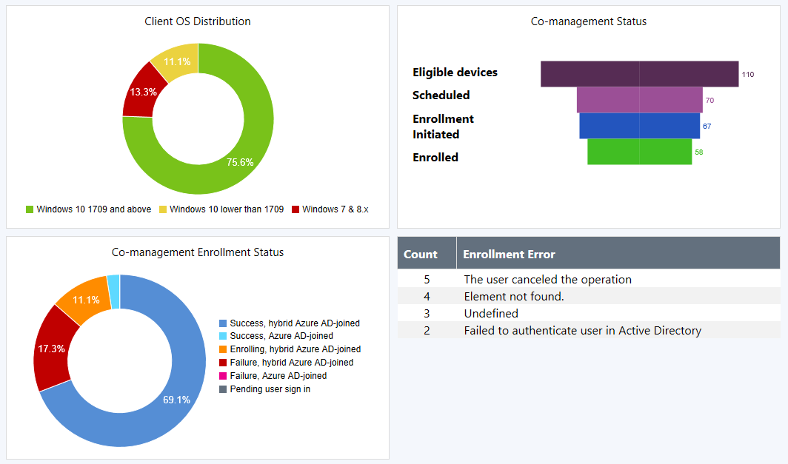

##  Improvement to co-management dashboard
<!--1358980-->

The [co-management dashboard](/sccm/core/clients/manage/co-management-dashboard) is enhanced with more detailed information.  

- The **Co-management enrollment status** tile includes additional states. Select a state in the tile to drill through to a list of devices in that state.  

- A new **Co-management status** tile with a funnel chart showing the following states of the enrollment process:  
    - Eligible devices  
    - Scheduled  
    - Enrollment initiated  
    - Enrolled  

- A new tile with counts of **Enrollment errors**. The screenshot below shows the following example errors:  
    - The user canceled the operation  
    - Element not found  
    - Failed to authenticate user in Active Directory  
    - Undefined  

