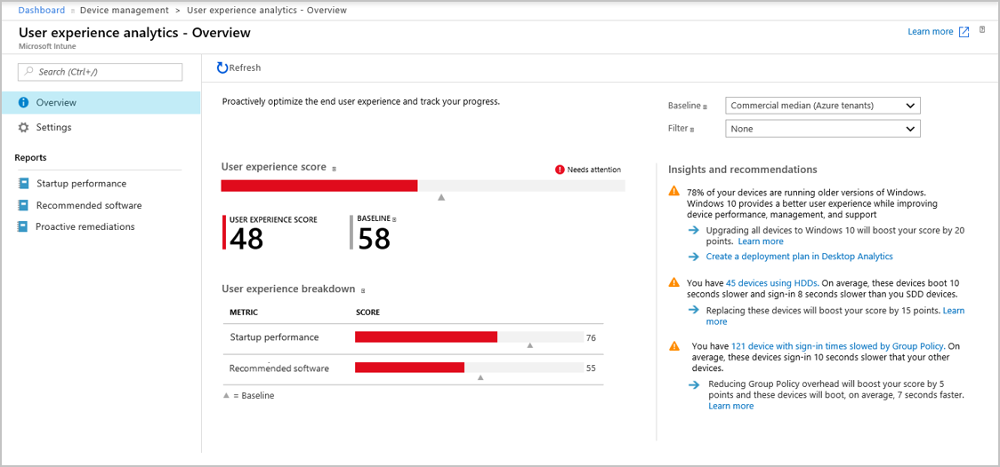
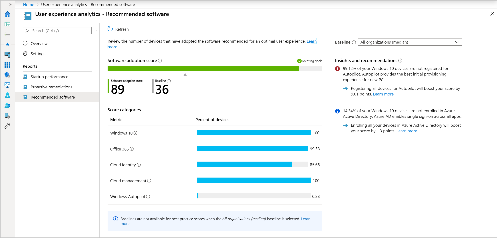
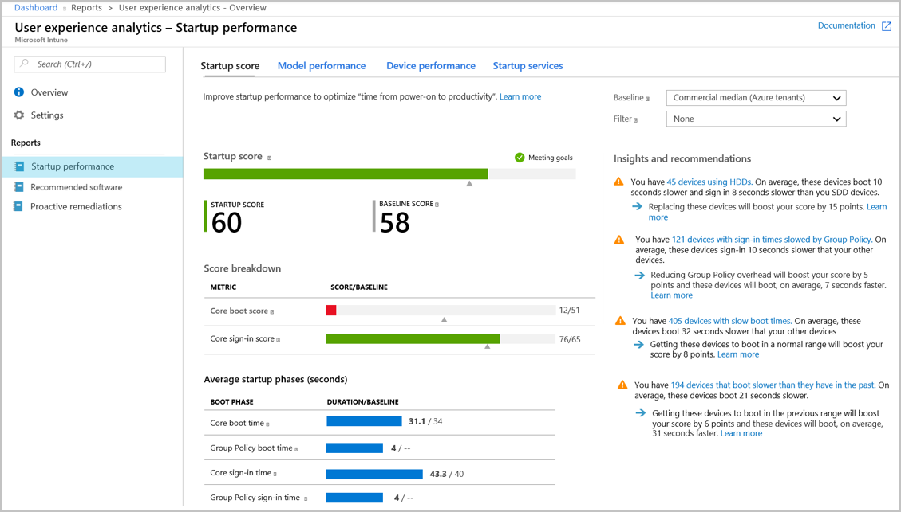
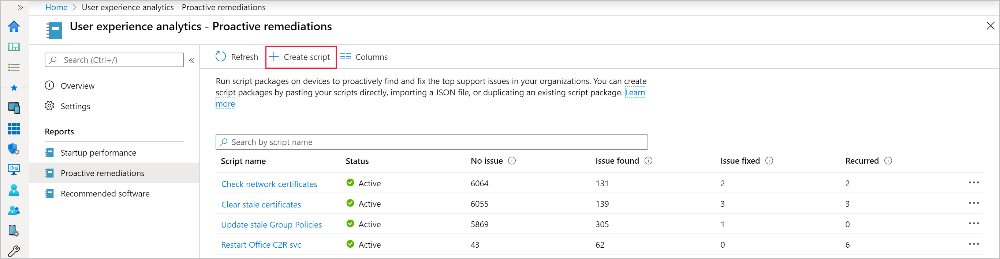
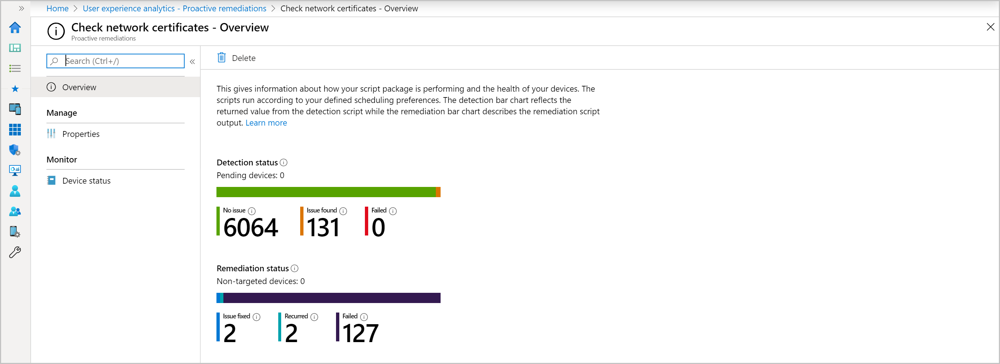
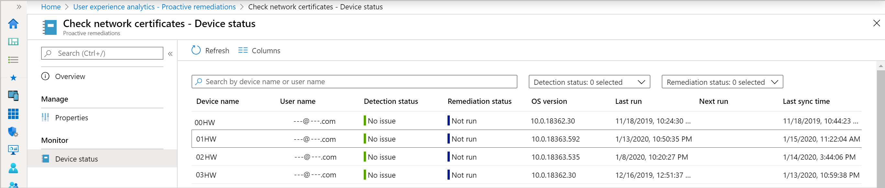
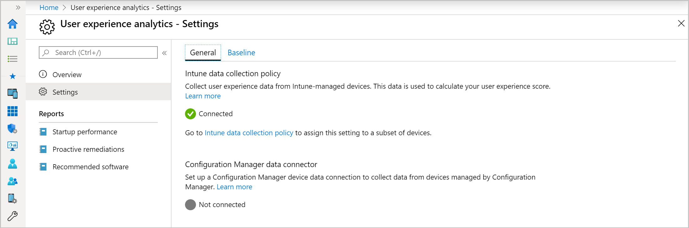
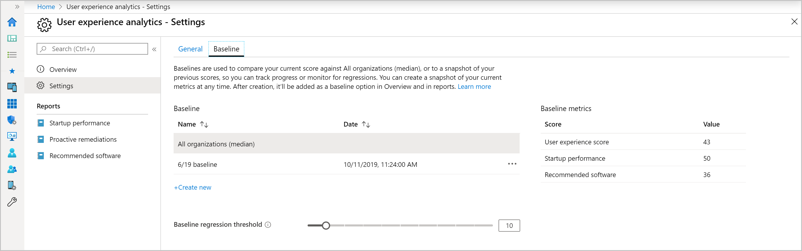
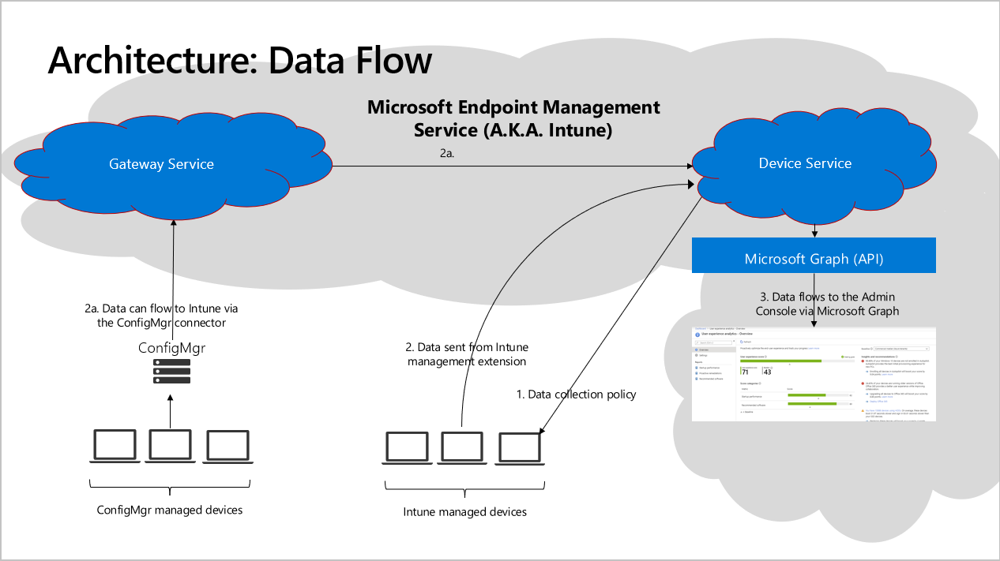

# <a name="bkmk_uea"></a> User experience analytics private preview

> [!Note]  
> This information relates to a preview feature which may be substantially modified before it's commercially released. Microsoft makes no warranties, express or implied, with respect to the information provided here.  

## User experience analytics overview

It's not uncommon for end users to experience long boot times or other disruptions. These disruptions can be due to a combination of:

- Legacy hardware
- Software configurations that aren't optimized for the end-user experience
- Issues caused by configuration changes and updates

These issues and other end-user experience problems persist because IT doesn't have much visibility into the end-user experience. Generally, the only visibility into these issues come from a slow costly support channel that doesn't usually provide clear information about what needs to be optimized. It's not only IT support bearing the cost of these problems. The time information workers spend dealing with issues is also costly. Performance, reliability, and support issues that reduce user productivity can have a large impact on an organization's bottom line as well.

**User experience analytics** aims to improve user productivity and reduce IT support costs by providing insights into the user experience. The insights enable IT to optimize the end-user experience with proactive support and to detect regressions to the user experience by assessing user impact of configuration changes.

This initial release, focuses on three things:

- [**Recommended software**](#bkmk_uea_rs): Recommendations for providing the best user experience
- [**Proactive remediation scripting**](#bkmk_uea_prs): Fix common support issues before end-users notice issues
- [**Start up performance**](#bkmk_uea_bp): Help IT get users from power-on to productivity quickly without lengthy boot and sign in delays

This release is just the beginning. We’ll be rapidly rolling out new insights for other key user-experiences soon after initial release.

## <a name="bkmk_uea_prereq"></a> Getting started

To start using User experience analytics, verify the prerequisites, then start gathering data. 

### Technical Prerequisites

This current preview requires:
- Intune enrolled devices running Windows 10
- Startup performance insights are only available for devices running version 1903 or later of Windows 10.
- Network connectivity from devices to the Microsoft public cloud. For more information, see [endpoints](#bkmk_uea_endpoints).
- The [Intune Service Administrator role](https://docs.microsoft.com/intune/fundamentals/role-based-access-control) is required to [start gathering data](#bkmk_uea_start).
   - By clicking **Start**, you agree to and acknowledge that your customer data may be stored outside the location you selected when you provisioned your Microsoft Intune tenant.
   - After clicking **Start** for gathering data, other read-only roles can view the data.

Configuration Manager devices and Intune enrolled devices on prior versions of Windows 10 aren't currently supported for this preview.

### Licensing Prerequisites

User experience analytics is included in the following plans: 

- [Enterprise Mobility + Security E3](https://www.microsoftvolumelicensing.com/ProductResults.aspx?doc=Product%20Terms,OST&fid=51) or higher
- [Microsoft 365 Enterprise E3](https://www.microsoft.com/en-us/microsoft-365/enterprise?rtc=1) or higher. 

For proactive remediations, users of the device need one of the following licenses:
- Windows 10 Enterprise E3 or E5 (included in Microsoft 365 F1, E3, or E5)
- Windows 10 Education A3 or A5 (included in Microsoft 365 A3 or A5)
- Windows Virtual Desktop Access E3 or E5

### <a name="bkmk_uea_start"></a> Start gathering data

1. Go to `https://devicemanagement.microsoft.com/#blade/Microsoft_Intune_Enrollment/UXAnalyticsMenu`
1. Click **Start**. This will automatically assign a configuration profile to collect boot performance data from all eligible devices. You can [change assigned devices](#bkmk_uea_profile) later. It may take up to 24 hours for startup performance data to populate from your Intune enrolled devices after they reboot.

## Overview page

Once your data is ready, you'll notice some information on the **Overview** page, explained in more detail below:

- The **User experience score** is a 50/50 weighted average of the **Recommended software** and **Startup performance scores**. We’ll be expanding the set of subscores over time.

- You can compare your current score to other scores by setting a baseline.
  - As described in the [baseline](#bkmk_uea_baselines) section, there's a built-in baseline for *Commercial median* to see how you compare to a typical enterprise. You can create new baselines based on your current metrics so you can track progress or view regressions over time.
   - Baseline markers are shown for your overall score and subscores. If any of the scores have regressed by more than the configurable threshold from the selected baseline, the score is displayed in red and the top-level score is flagged as needing attention.
  - A status of **insufficient data** means you don’t have enough devices reporting to provide a meaningful score. We currently require at least five devices.

- **Filters** will enable you to view your score on a subset of devices or users. However, the filter functionality isn't enabled in this preview.

- **Insights and recommendations** is a prioritized list to improve your score. This list is filtered to the subnode's context when you navigate to **Best practices** or **Recommended software**.

[](media/uea-overview-page.png#lightbox)

## <a name="bkmk_uea_rs"></a> Recommended software

Certain software is known to improve the end-user experience, independent of lower-level health metrics. For example, Windows 10 has a much higher Net Promoter score than Windows 7. The **Software adoption** score is a number between 0 and 100 that represents a weighted average of the percent of devices that have deployed various recommended software. The current weighting is higher for Office 365 and Windows than for the other metrics since users interact with them more often. The metrics are described below: 

[](media/uea-recommended-software.png#lightbox)

### <a name="bkmk_uea_win10"></a> Windows 10

Windows 10 provides a better user experience than older versions of Windows. This metric measures the percent of devices on Windows 10 versus an older version of Windows.

The recommended remediation action for moving devices from older versions of Windows is to create a deployment plan using [Desktop Analytics](/sccm/desktop-analytics/overview).

### <a name="bkmk_uea_opp"></a> Office 365

Office 365 provides a better user experience and improved collaboration compared to older versions of Office. This metric measures the percent of devices that have Office 365 installed vs an older version.

The recommended remediation action for moving devices from older versions of Office to Office 365 is upgrading it using either [Microsoft Intune](https://techcommunity.microsoft.com/t5/Enterprise-Mobility-Security/Deploying-Office-365-ProPlus-with-Microsoft-Intune/ba-p/250292) or [Configuration Manager](https://docs.microsoft.com/deployoffice/deploy-office-365-proplus-with-configuration-manager).

### <a name="bkmk_uea_ap"></a> Autopilot

Autopilot provides a great experience for users to enroll new devices for enterprise management. This metric measures the percent of devices that are registered for Autopilot.

The recommended remediation action is to register existing devices in Autopilot using [Microsoft Intune](https://docs.microsoft.com/intune/enrollment-autopilot). Autopilot provides a great user experience for:
- Reprovisioning if the device is ever reset.
- The initial provisioning experience for new devices pre-registered in Autopilot.

### <a name="bkmk_uea_aad"></a> Azure Active Directory

Azure Active Directory (Azure AD) provides users with single sign-on to the apps and services they need. This metric measures the percent of devices enrolled in Azure AD.

Your Microsoft-Intune managed devices are already enrolled in Azure AD. The recommended remediation action for devices managed by Configuration Manager is to either [enroll them in Azure AD](https://docs.microsoft.com/azure/active-directory/devices/hybrid-azuread-join-managed-domains) or [co-manage them](/sccm/comanage/overview). Co-managing devices also improves your cloud management score.

### <a name="bkmk_uea_intune"></a> Cloud management

Microsoft Intune eliminates the need for and performance overhead of Group Policy, resulting in a better end-user experience. This metric measures the percent of PCs enrolled in Microsoft Intune.

The recommended remediation action for devices managed by Configuration Manager that aren't yet enrolled in Intune is to [co-manage them](/sccm/comanage/overview).

### <a name="bkmk_uea_np"></a> No commercial median

The built-in baseline of **Commercial median** doesn't currently have metrics for the subscores listed in the sections above.

## <a name="bkmk_uea_bp"></a> Startup performance

> [!NOTE]
> The data required to compute the startup score for a device is generated during boot time. Depending on power settings and user behavior, it may take weeks after a device has been correctly assigned the policy to show the startup score on the admin console.  

The startup performance score helps IT get users from power-on to productivity quickly, without lengthy boot and sign-in delays. The **Startup score** is a number between 0 and 100. This score is a weighted average of **Boot score** and the **Sign-in** score, which are computed as follows:

- **Boot score**: Based on the time from power-on to sign in. We look at the last boot time from each device, excluding the update phase, then score it from 0 (poor) to 100 (exceptional). These scores are averaged to provide an overall tenant boot score.
- **Sign-in score**: Based on the time from when credentials have been entered until the user can access the desktop. We look at the last sign-in time to each device, excluding first sign-ins or sign-ins immediately after a feature update, then score it from 0 (poor) to 100 (exceptional). These scores are averaged to provide an overall tenant boot score.

[](media/uea-startup-performance.png#lightbox)

The **Startup performance** page also provides a prioritized list of **Insights and recommendations**, described in the following sections:

### <a name="bkmk_uea_hdd"></a> Hard disk drives

Startup performance provides an insight on the number of devices on which the boot drive is a hard disk. Hard disk drives typically result in boot times three to four times longer than solid-state drives. We also report the expected improvement to start up performance you would gain by moving to solid-state drives.

Click though to see the list of devices that have hard disk drives. The recommended action is to upgrade these devices to solid-state drives.

### <a name="bkmk_uea_gp"></a> Group Policy

Startup performance provides an insight on the number of devices that have delays to boot and sign-in times caused by Group Policy. Clicking through takes you to the devices view. The view is sorted by Group Policy time, so you can see affected devices for further troubleshooting.

If you click through to a particular device, you can see its boot and sign-in history. The history helps you determine if the issue is a regression and when it might have occurred.

While there are many articles on how to optimize Group Policies performance, you may choose to migrate to cloud-management instead. Migrating to cloud-management allows you to use [Intune security baselines](https://docs.microsoft.com/intune/protect/security-baselines) and the soon-to-be-released Policy Analytics tool.

### <a name="bkmk_uea_sb"></a> Slow boot and sign-in times

Startup performance provides an insight on the number of devices with slow boot or sign-in times. A boot score or sign-in score of “0” means it's slow. Clicking through takes you to the devices view. The devices are sorted by core boot time or core sign-in time respectively, so you can see affected devices for further troubleshooting.

If you click through to a particular device, you can see its boot and sign-in history. The history helps you determine if the issue was a regression and when it might have occurred.

### More startup performance insights are on the way

We're working on more startup performance insights, which will be available in future previews.

## <a name="bkmk_uea_prs"></a> Proactive remediations

Proactive remediations are script packages that can detect and fix common support issues on a user's device before they even realize there's a problem. These remediations can help reduce support calls. You can create your own script package, or deploy one of the scripts we've written and used in our environment for reducing support tickets.

Each script package consists of a detection script, a remediation script, and metadata. Through Intune, you'll be able to deploy these script packages and see reports on their effectiveness. We're actively developing new scripts and would like to know your experiences using these scripts. Reach out to your user experience analytics preview contact if you have any feedback on the script packages.

### <a name="bkmk_uea_prs_ps1"></a> Get the detection and remediation scripts

1. Copy the scripts from the bottom of this article in the [PowerShell scripts](#bkmk_uea_ps_scripts) section.
    - Script files whose names start with `det` are detection scripts. Remediation scripts start with `rem`.
    - For a description of the scripts, see the [Script descriptions](#bkmk_uea_scripts).
1. Save each script using the provided name. The name is also in the comments at the top of each script.
    - You can use a different script name, but it won't match the name listed in the [Script descriptions](#bkmk_uea_scripts) section.


### <a name="bkmk_uea_prs_deploy"></a> Deploying and monitoring scripts
When the **Microsoft Intune Management Extension** service starts, it gets the scripts from Intune and runs them. The scripts are rerun every 24 hours. To deploy and monitor the scripts, follow the instructions below:

1. Go to the **Proactive remediations** node in the console.
1. Click the **Create** button to create a script package.
     [](media/uea-proactive-remediations-create.png#lightbox)
1. In the **Basics** step, give the script package a **Name** and optionally, a **description**. The **Publisher** field can be edited, but defaults to your tenant name. **Version** can't be edited. 
1. On the **Settings** step, copy the text from the scripts you downloaded into the **Detection script** and **Remediation script** fields. 
   - You need the corresponding detection and remediation script to be in the same package. For example, the `DetGPLastUpd.ps1` detection script corresponds with the `RemGPLastUpd.ps11` remediation script.
       [](media/uea-proactive-remediations-script-settings.png#lightbox)
1. Finish the options on the **Settings** page with the following recommended configurations:
   - **Run this script using the logged-on credentials**: This is dependent on the script. For more information, see the [Script descriptions](#bkmk_uea_scripts).
   - **Enforce script signature check**: No
   - **Run script in 64-bit PowerShell**: No
1. Click **Next** then assign any **Scope tags** you need.
1. In the **Assignments** step, select the device groups to which you want to deploy the script package.
1. Complete the **Review + Create** step for your deployment.
1. Under **Reporting** > **User experience analytics - Proactive remediations**, you can see an overview of your detection and remediation status.
       [](media/uea-proactive-remediations-report-overview.png#lightbox)
1. Click on **Device status** to get status details for each device in your deployment.
       [](media/uea-proactive-remediations-device-status.png#lightbox)


## <a name="bkmk_uea_set"></a> User experience analytics settings

From the settings page, you can select **General** or **Baseline**. Each of these settings is described below:

### <a name="bkmk_uea_gen"></a> General

The **General** page in **Settings** allows you to see if Intune startup performance data collection has been enabled. It's automatically enabled for all your devices by default when you click **Start** to enable user-experience analytics. You have the option to go to the Intune data collection policy node to change the set of devices on which boot and sign-in records are collected.


#### <a name="bkmk_uea_profile"></a> Intune data collection policy

To assign this setting to a subset of devices, [Create a profile](/intune/configuration/device-profile-create#create-the-profile) with  the following information: 

  - **Name**: Enter a descriptive name for the profile, like **Intune data collection policy**
   
  - **Description**: Enter a description for the profile. This setting is optional, but recommended.
    
  - **Platform**: Select **Windows 10 and later**
   
  - **Profile type**: Select **Windows Health monitoring**
   
  - Configure the **Settings**:
   
   	- **Health Monitoring**: Select **Enable** to collect event information from Windows 10 devices
	
	- **Scope**: Select **Boot performance** 

  - Use the [Scope tags](/intune/configuration/device-profile-create#scope-tags) and [Applicability rules](/intune/configuration/device-profile-create#applicability-rules) to filter the profile to specific IT groups or devices in a group that meet a specific criteria.

> [!NOTE]
> There is a placeholder for instructions for configuring the Configuration Manager data connector. However, this functionality has not been implemented in this initial private preview.

  [](media/uea-settings-general.png#lightbox)

### <a name="bkmk_uea_baselines"></a> Baseline management

You can compare your current scores and subscores to others by setting a baseline.

1. There's a built-in baseline for **Commercial median**, which allows you to compare your scores to a typical enterprise.
1. You can create new baselines based on your current metrics to track progress or view regressions over time. Click the **Create new** button and give your new baseline a name. We recommend a name that includes the date, so it’s easier to select from the drop-down in the reports pages.
1. There's a limit of 100 baselines per tenant. You can delete old baselines that are no longer needed.
1. Your current metrics will be flagged red and show as regressed if they fall below the current baseline in your reports. Because it's perfectly normal for metrics to fluctuate from day to day, you can set a regression threshold, which defaults to 10%. With this threshold, metrics are only flagged as regressed if they've regressed by more than 10%.

   [](media/uea-settings-baseline.png#lightbox)

## <a name="bkmk_uea_tshoot"></a> Troubleshooting

To enroll devices to User Experience Analytics, they need to send required functional data to Microsoft. If your environment uses a proxy server, use this information to help configure the proxy.

### <a name="bkmk_uea_endpoints"></a> Endpoints

To enable functional data sharing, configure your proxy server to allow the following endpoints:

> [!Important]  
> For privacy and data integrity, Windows checks for a Microsoft SSL certificate (certificate pinning) when communicating with the required functional data sharing endpoints. SSL interception and inspection aren't possible. To use User Experience Analytics, exclude these endpoints from SSL inspection.<!-- BUG 4647542 -->

| Endpoint  | Function  |
|-----------|-----------|
| `https://*.events.data.microsoft.com` | Used to send [required functional data](#bkmk_uea_datacollection) to the Intune data collection endpoint. |
| `https://graph.windows.net` | Used to automatically retrieve settings  when attaching your hierarchy to User Experience Analytics (on Configuration Manager Server role). For more information, see [Configure the proxy for a site system server](/sccm/core/plan-design/network/proxy-server-support#configure-the-proxy-for-a-site-system-server). |
| `https://*.manage.microsoft.com` | Used to synch device collection and devices with User Experience Analytics (on Configuration Manager Server role only). For more information, see [Configure the proxy for a site system server](/sccm/core/plan-design/network/proxy-server-support#configure-the-proxy-for-a-site-system-server). |


### Proxy server authentication

Make sure that a proxy doesn't block the data because of authentication. If your organization uses proxy server authentication for outbound traffic, use one or more of the following approaches:

#### Bypass (recommended)

Configure your proxy servers to not require proxy authentication for traffic to the data sharing endpoints. This option is the most comprehensive solution. It works for all versions of Windows 10.  

#### User proxy authentication

Configure devices to use the signed-in user's context for proxy authentication. This method requires the following configurations:

- Devices have the current quality update for Windows 10
- Configure user-level proxy (WinINET proxy) in **Proxy settings** in the Network & Internet group of Windows Settings. You can also use the legacy Internet Options control panel. 
- Make sure that the users have proxy permission to reach the data sharing endpoints. This option requires that the devices have console users with proxy permissions, so you can't use this method with headless devices.

> [!IMPORTANT]
> The user proxy authentication approach is incompatible with the use of Microsoft Defender Advanced Threat Protection. This behavior is because this authentication relies on the **DisableEnterpriseAuthProxy** registry key set to `0`, while Microsoft Defender ATP requires it to be set to `1`. For more information, see [Configure machine proxy and Internet connectivity settings](https://docs.microsoft.com/windows/security/threat-protection/windows-defender-atp/configure-proxy-internet-windows-defender-advanced-threat-protection).

#### Device proxy authentication

This approach is the most complex because it requires the following configurations:

- Make sure devices can reach the proxy server through WinHTTP in local system context. Use one of the following options to configure this behavior:
  - The command line `netsh winhttp set proxy`
  - Web Proxy Auto-discovery Protocol (WPAD)
  - Transparent proxy
  - Routed connection, or that uses network address translation (NAT)

- Configure proxy servers to allow the computer accounts in Active Directory to access the diagnostic data endpoints. This configuration requires proxy servers to support Windows-Integrated Authentication.  

## <a name="bkmk_uea_faq"></a> Frequently asked questions

### Why are the scripts exiting with a code of 1?

The scripts exit with a code of 1 to signal to Intune that remediation should occur. In this case, exiting a detection script with 1 means it's true that remediation is needed. Many script packages that run solely in CM may show compliant, but exit with a code of 1. For these scripts, exiting with a code of 1 isn't something alarming but you may want to verify the device remediates properly.

### Why did the Update Stale Group Policies script return with error 0x87D00321?

0x87D00321 is a script execution timeout error. This error typically occurs with machines that are connected remotely. A potential mitigation might be to only deploy to a dynamic collection of machines that have internal network connectivity.

## <a name="bkmk_uea_scripts"></a> Script descriptions

This table shows the script names, descriptions, detections, remediations, and configurable items. Script files whose names start with `det` are detection scripts. Remediation scripts start with `rem`. These scripts can be copied from the next section in this article.

|Script name|Description|
|---|---|
|**Update stale Group Policies** </br>`DetGPLastUpd.ps1` </br> `RemGPLastUpd.ps1`| Detects if last Group Policy refresh is greater than `7 days` ago.  </br>Customize the 7-day threshold by changing the value for `$numDays` in the detection script. </br></br>Remediates by running `gpupdate /target:computer /force` and `gpupdate /target:user /force`  </br> </br>Can help reduce network connectivity-related support calls when certificates and configurations are delivered via Group Policy. </br> </br> **Run the script using the logged-on credentials**: Yes|
|**Restart Office Click-to-Run service** </br> `DetectClickToRunServiceState.ps1` </br> `RemediateClickToRunServiceState.ps1`| Detects if the Click-to-Run service is set to automatically start and if the service is stopped. </br> </br> Remediates by setting the service to start automatically and starting the service if it's stopped. </br></br> Helps fix issues where Win32 Office 365 ProPlus won't launch because the Click-to-Run service is stopped. </br> </br> **Run the script using the logged-on credentials**: No|
|**Check network certificates** </br>`DetExpIssuerCerts.ps1` </br>`RemExpIssuerCerts.ps1`|Detects certificates issued by a CA in either the Machine's or User's personal store that are expired, or near expiry. </br> Specify the CA by changing the value for `$strMatch` in the detection script. Specify 0 for `$expiringDays` to find expired certificates, or specify another number of days to find certificates near expiry.  </br></br>Remediates by raising a toast notification to the user. </br> Specify the `$Title` and `$msgText` values with the message title and text you want users to see. </br> </br> Notifies users of expired certificates that might need to be renewed. </br> </br> **Run the script using the logged-on credentials**: No|
|**Clear stale certificates** </br>`DetExpUserCerts.ps1` </br> `RemExpUserCerts.ps1`| Detects expired certificates issued by a CA in the current user's personal store. </br> Specify the CA by changing the value for `$certCN` in the detection script. </br> </br> Remediates by deleting expired certificates issued by a CA from the current user's personal store. </br> Specify the CA by changing the value for `$certCN` in the remediation script. </br> </br> Finds and deletes expired certificates issued by a CA from the current user's personal store. </br> </br> **Run the script using the logged-on credentials**: Yes|

## <a name="bkmk_uea_ps_scripts"></a> PowerShell Scripts

### DetGPLastUpd.ps1

```powershell
#=============================================================================================================================
#
# Script Name:     DetGPLastUpd.ps1
# Description:     Detect if Group Policy has been updated within number of days
# Notes:           Remediate if "Match", $numDays default value of 7, change as appropriate
#
#=============================================================================================================================

# Define Variables
$numDays = 7

try {
    $gpResult = gpresult /R | Select-String -pattern “Last time Group Policy was applied:” | Select-Object -last 1

    if ($gpResult){
    [int]$lastGPUpdateDays = (New-TimeSpan -Start $lastGPUpdateDate -End (Get-Date)).Days
        if ($lastGPUpdateDays -gt $numDays){
            #We want within last $numDays so we get "Match"
            Write-Host "Match"
            exit 1
        }
        else {
            #Script succeeds but > $numDays since last update so remediate
            #Exit 1 for Intune and "Match" for ConfigMan
            Write-Host "No_Match"
            exit 0
        }
    }
}
catch {
    $errMsg = $_.Exception.Message
    Write-Error $errMsg
    exit 1
}
```

### RemGPLastUpd.ps1

```powershell
#=============================================================================================================================
#
# Script Name:     RemGPLastUpd.ps1
# Description:     This script triggers Group Policy update
# Notes:           No variable substitution needed
#
#=============================================================================================================================

try{
    $compGP = gpupdate /target:computer /force | out-string
    $userGP = gpupdate /target:user /force | out-string
    exit 0
}
catch{
    $errMsg = $_.Exception.Message
    Write-Error $errMsg
    exit 1
}
```

### DetectClickToRunServiceState.ps1

```powershell
#=============================================================================================================================
#
# Script Name:     DetectClickToRunServiceState.ps1
# Description:     Detect if Office 16 installed and if "Click to Run Service" is running.
# Notes:           No variable substitution should be necessary
#
#=============================================================================================================================

# Define Variables
$curSvcStat,$svcCTRSvc,$errMsg = "","",""

# Main script
If (-not (Test-Path -Path 'hklm:\Software\Microsoft\Office\16.0')){
    Return "Office 16.0 (or greater) not present on this machine"
	exit 0   
} 

Try{        
    $svcCTRSvc = Get-Service "ClickToRunSvc"
    $curSvcStat = $svcCTRSvc.Status
}

Catch{    
    $errMsg = $_.Exception.Message
    Write-Error $errMsg
    exit 1
}

If ($curSvcStat -eq "Running"){
    Write-Output $curSvcStat
    exit 0                        
}
Else{
    If($curSvcStat -eq "Stopped"){
    Write-Output $curSvcStat
    exit 1     
    }
}
Else{
    Write-Error "Error: " + $errMsg
    exit 1
}
```

### RemediateClickToRunServiceState.ps1

```powershell
#=============================================================================================================================
#
# Script Name:     RemediateClickToRunServiceState.ps1
# Description:     Start the "Click to Run Service" and change its startup type to Automatic
#       Notes:     No variable substitution needed
#
#=============================================================================================================================

# Define Variables
$svcCur = "ClickToRunSvc"
$curSvcStat,$svcCTRSvc,$errMsg = "","",""
$ctr = 0

# Main script
# Make sure nothing has changed since detection, the service exists and is stopped
Try{        
    $svcCTRSvc = Get-Service "ClickToRunSvc"
    $curSvcStat = $svcCTRSvc.Status
    }

Catch{    
    $errMsg = $_.Exception.Message
    }
        
# If the service got started between detection and now (nested if) then return
# If the service got uninstalled or corrupted between detection and now (else) then return the "Error: " + the error
If ($curSvcStat -ne "Stopped"){
    If ($curSvcStat -eq "Running"){
        return
    }
    Else{
        return "Error: " + $errMsg
    }
}

# Service should be there and stopped, change the startup type and start
Try{        
    Set-Service $svcCur -StartupType Automatic
    Start-Service $svcCur
    $svcCTRSvc = Get-Service $svcCur
    $curSvcStat = $svcCTRSvc.Status
        While ($curSvcStat.Equals("Stopped")){
            Start-Sleep -Seconds 5
            ctr++
            if(ctr == 12){
                Return "Service could not be started after 60 seconds"
                break
            }
        }
    }

Catch{    
    $errMsg = $_.Exception.Message
    Return $errMsg
    }

Return $curSvcStat
```

### DetExpIssuerCerts.ps1

```powershell
#=============================================================================================================================
#
# Script Name:     DetExpIssuerCerts.ps1
# Description:     Detect expired certificates issued by "CN=<your CA here>" in either Machine
#                  or User certificate store
# Notes:           Change the value of the variable $strMatch from "CN=<your CA here>" to "CN=..."
#                  For testing purposes the value of the variable $expiringDays can be changed to a positive integer
#                  Don't change the $results variable
#
#=============================================================================================================================

# Define Variables
$results = @()
$expiringDays = 0
$strMatch = "CN=<your CA here>"

try
{
    $results = @(Get-ChildItem -Path Cert:\LocalMachine\My -Recurse -ExpiringInDays $expiringDays | where {$_.Issuer -match $strMatch})
    $results += @(Get-ChildItem -Path Cert:\CurrentUser\My -Recurse -ExpiringInDays $expiringDays | where {$_.Issuer -match $strMatch}) 
    if (($results -ne $null)){
        #Below necessary for Intune as of 10/2019 will only remediate Exit Code 1
        Write-Host "Match"
        Return $results.count
        exit 1
    }
    else{
        #No matching certificates, do not remediate
        Write-Host "No_Match"        
        exit 0
    }   
}
catch{
    $errMsg = $_.Exception.Message
    Write-Error $errMsg
    exit 1
}
```

### RemExpIssuerCerts.ps1

```powershell
#=============================================================================================================================
#
# Script Name:     RemExpIssuerCerts.ps1
# Description:     Raise a Toast Notification if expired certificates issued by "CN=..."
#                  to user or machine on the machine where detection script found them. No remediation action besides
#                  the Toast is taken.
# Notes:           Change the values of the variables $Title and $msgText
#
#=============================================================================================================================

## Raise toast to have user contact whoever is specified in the $msgText

# Define Variables
$delExpCert = 0
$Title = "Title"
$msgText = "message"

# Main script
[Windows.UI.Notifications.ToastNotificationManager, Windows.UI.Notifications, ContentType = WindowsRuntime] | Out-Null
[Windows.UI.Notifications.ToastNotification, Windows.UI.Notifications, ContentType = WindowsRuntime] | Out-Null
[Windows.Data.Xml.Dom.XmlDocument, Windows.Data.Xml.Dom.XmlDocument, ContentType = WindowsRuntime] | Out-Null

$APP_ID = '{1AC14E77-02E7-4E5D-B744-2EB1AE5198B7}\WindowsPowerShell\v1.0\powershell.exe'

$template = @"
<toast>
    <visual>
        <binding template="ToastText02">
            <text id="1">$Title</text>
            <text id="2">$msgText</text>
        </binding>
    </visual>
</toast>
"@

$xml = New-Object Windows.Data.Xml.Dom.XmlDocument
$xml.LoadXml($template)
$toast = New-Object Windows.UI.Notifications.ToastNotification $xml
[Windows.UI.Notifications.ToastNotificationManager]::CreateToastNotifier($APP_ID).Show($toast)
```

### DetExpUserCerts.ps1

```powershell
#=============================================================================================================================
#
# Script Name:     DetExpUserCerts.ps1
# Description:     Detect expired certificates issued by "CN=<your CA here>" to User
# Notes:           Change the value of the variable $certCN from "CN=<your CA here>" to "CN=...".
#                  Don't change $results
#
#=============================================================================================================================

# Define Variables
$results = 0
$certCN = "CN=<your CA here>"

try
{   
    $results = Get-ChildItem -Path Cert:\CurrentUser\My -Recurse -ExpiringInDays 0 | where {$_.Issuer -eq($certCN)}
    if (($results -ne $null)){
        #Below necessary for Intune as of 10/2019 will only remediate Exit Code 1
        Write-Host "Match"
        Return $results.count
        exit 1
    }
    else{
        Write-Host "No_Match"
        exit 0
    }    
}
catch{
    $errMsg = $_.Exception.Message
    Write-Error $errMsg
    exit 1
}
```

### RemExpUserCerts.ps1

```powershell
#=============================================================================================================================
#
# Script Name:     RemExpUserCerts.ps1
# Description:     Remove expired certificates issued by "CN=<your CA here>" to User
# Notes:           Change the value of the variable $certCN from "CN=<your CA here>" to "CN=..."
#
#=============================================================================================================================

# Define Variables
$certCN = "CN=<your CA here>"

try
{
    Get-ChildItem -Path cert:\CurrentUser -Recurse -ExpiringInDays 0 | where {$_.Issuer -eq($certCN)} | Remove-Item
    exit 0
}
catch{
    $errMsg = $_.Exception.Message
    Write-Error $errMsg
    exit 1
}
```

## <a name="bkmk_uea_privacy"></a> User Experience Analytics data privacy

### Data flow

The following illustration shows how required functional data flows from individual devices through our data services, transient storage, and to your tenant. Data flows through our existing enterprise pipelines without reliance on Windows diagnostic data.

[](media/uea-dataflow.png#lightbox)

1. Configure the **Intune data collection** policy for enrolled devices. By default, this policy is assigned to “All Devices” when you **Start** User experience analytics. However, you can [change the assignment](#bkmk_uea_set) at any time to a subset of devices or no devices at all.

2. Devices send required functional data.

	- For Intune devices with the assigned policy, data is sent from the Intune management extension. For more information, see [requirements](#bkmk_uea_prereq).
	- For Configuration Manager managed devices, data can also flow to Microsoft Endpoint Management through the ConfigMgr connector. The ConfigMgr connector is cloud attached. It only requires connection to an Intune tenant, not turning on co-management.

> [!Note]  
> The data required to compute the startup score for a device is generated during boot time. Depending on power settings and user behavior, it may take weeks after a device has been correctly assigned the policy to show the startup score on the admin console.  

3. The Microsoft Endpoint Management service processes data for each device and publishes the results for both individual devices and organizational aggregates in the admin console using MS Graph APIs.

The average latency end to end is about 12 hours and is gated by the time it takes to do the daily processing. All other parts of the data flow are near-real-time.

### <a name="bkmk_uea_datacollection"></a>Data collection

Currently, the basic functionality of User experience analytics collects information associated with your boot performance records. As we add additional functionality over time, the data collected will vary as needed. The main datapoints currently being collected:

- **id:** Unique device ID used by Windows Update
- **localId:** A locally-defined unique ID for the device. This is not the human-readable device name. Most likely equal to the value stored at HKLM\Software\Microsoft\SQMClient\MachineId.
- **aaddeviceid:** Azure Active Directory device ID
- **orgId:** Unique GUID representing the Microsoft O365 Tenant
- **authIdEnt**
- **make:** Device manufacturer
- **model:** Device model
- **deviceClass:** The device classification. For example, Desktop, Server, or Mobile.
- **Country:** The device region setting
- **logOnId**
- **bootId:** The system boot ID
- **coreBootTimeInMilliseconds:** Time for core boot
- **totalBootTimeInMilliseconds:** Total boot time
- **updateTimeInMilliseconds:** Time for OS updates to complete
- **gpLogonDurationInMilliseconds**: Time for Group policies to process
- **desktopShownDurationInMilliseconds:** Time for desktop (explorer.exe) to be loaded
- **desktopUsableDurationInMilliseconds:** Time for desktop (explorer.exe) to be usable
- **name:** Windows
- **ver:** The version of the current OS.
- **topProcesses:** List of processes loaded during boot with name, with cpu usage stats and app details (Name, publisher, version). For example *{\"ProcessName\":\"svchost\",\"CpuUsage\":43,\"ProcessFullPath\":\"C:\\\\Windows\\\\System32\\\\svchost.exe\",\"ProductName\":\"Microsoft® Windows® Operating System\",\"Publisher\":\"Microsoft Corporation\",\"ProductVersion\":\"10.0.18362.1\"}*

> [!Important]  
> Our data handling policies are described in the [Microsoft Intune Privacy Statement](https://docs.microsoft.com/legal/intune/microsoft-intune-privacy-statement). We only use your customer data to provide you the services you signed up for. As described during the onboarding process, we anonymize and aggregate the scores from all enrolled organizations to keep the baselines up-to-date.


### Resources

For more information about related privacy aspects, see the following articles:

- [Microsoft Intune Privacy Statement](https://docs.microsoft.com/legal/intune/microsoft-intune-privacy-statement)
- [Windows 10 and privacy compliance](https://docs.microsoft.com/windows/privacy/windows-10-and-privacy-compliance)
- [Licensing terms and documentation](https://www.microsoftvolumelicensing.com/DocumentSearch.aspx?Mode=3&DocumentTypeId=31)  
- [Security and privacy at Microsoft Azure data centers](https://azure.microsoft.com/global-infrastructure/)  
- [Confidence in the trusted cloud](https://azure.microsoft.com/overview/trusted-cloud/)  
- [Trust Center](https://www.microsoft.com/trustcenter)  
