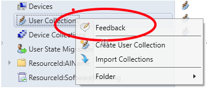

# What&#39;s new in version 1702 of System Center Configuration Manager

*Applies to: System Center Configuration Manager (Current Branch)*

Update 1702 for System Center Configuration Manager current branch is available as an in-console update for previously installed sites that run version 1602, 1606, or 1610. It is also available as a baseline version you can use when installing a new deployment.

> [!TIP]  
> To install a new site, you must use a baseline version of Configuration Manager.  
>  Learn more about:    
>   - [Installing new sites](https://technet.microsoft.com/library/mt590197.aspx)  
>   - [Installing updates at sites](https://technet.microsoft.com/library/mt607046.aspx)  
>   - [Baseline and update versions](/sccm/core/servers/manage/updates#a-namebkmkbaselinesa-baseline-and-update-versions)  

The following sections provide details about changes and new capabilities introduced in version 1702 of Configuration Manager.  

## Deprecated features and operating systems
Learn about support changes before they are implemented in [removed and deprecated features](/sccm/core/plan-design/changes/removed-and-deprecated-features).

Version 1702 drops support for the following products:
- **SQL Server 2008 R2**, for site database servers. Deprecation of support was [first announced](/sccm/core/plan-design/changes/removed-and-deprecated-features#deprecated-support-for-sql-server-versions-as-a-site-database) on July 10, 2015. This version of SQL Server remains supported when you use a Configuration Manager version prior to version 1702.
- **Windows Server 2008 R2**, for site system servers and most site system roles. Deprecation of support was [first announced](/sccm/core/plan-design/changes/removed-and-deprecated-features#deprecated-operating-systems) on July 10, 2015. This version of Windows remains supported when you use a Configuration Manager version prior to version 1702.  
- **Windows Server 2008**, for site system servers and most site system roles. Deprecation of support was [first announced](/sccm/core/plan-design/changes/removed-and-deprecated-features#deprecated-operating-systems) on  July 10, 2015.
- **Windows XP Embedded**, as a client operating system. Deprecation was [first announced](/sccm/core/plan-design/changes/removed-and-deprecated-features#deprecated-operating-systems) on  July 10, 2015. This version of Windows remains supported when you use a Configuration Manager version prior to version 1702.

## Site infrastructure

### Improvements for in-console search
The following are improvements to using search in the Configuration Manager console:
 - **Object Path:**  
  Many objects now support a column named **Object Path**.  When you search and include this column in your display results, you can view the path to each object. For example, if you run a search for apps in the Applications node and are also searching sub-nodes, the *Object Path* column in the results pane will show you the path to each object that is returned.   

- **Preservation of search text:**  
  When you enter text into the search text box, and then switch between searching a sub-node and the current node, the text that you typed will now persist and remain available for a new search without having to reenter it.

- **Preservation of your decision to search sub-nodes:**  
 The option that you choose for searching the *current node* or *all sub-nodes* now persists when you change the node you are working in. This new behavior means that you do not need to constantly reset this decision as you move around the console. By default, when you open the console the option is to search only the current node.

### Send feedback from the Configuration Manager console

 You can use the in-console feedback options to send feedback directly to the development team.

 You can find the **Feedback** option:
 -  In the ribbon, at the far left of the Home tab of each node.  
    

 -  When you right-click on any object in the console.   
        

 Choosing **Feedback** opens your browser to the [Configuration Manager UserVoice feedback website](https://go.microsoft.com/fwlink/?linkid=617029).

###  Changes for Updates and Servicing
The following are changes for Updates and Servicing:

- **Node location**   
  After installing version 1702, the **Updates and Servicing** node appears as a top-level node under **Administration**. It is no longer a child node below **Cloud Services**.

- **New update states**  
  When you view available updates in the console, there are two new states:  
  - **Available for install** - This is an update that has been downloaded and ready to install.
  - **Ready for download**  - This update is available, but has not been downloaded. You can choose to download this update, but it has been superseded by a more recent update.

- **Simpler update choices**  
  The next time your infrastructure qualifies for two or more updates, only the latest update is downloaded. For example, if your current site version is two or more older than the most recent version that is available, only that most recent update version is downloaded automatically.  

  You can choose to download and install the other available updates, even when they are not the most current version. If you download an older update, you will receive a warning that the update has been replaced by a newer one. To download an update that is *Available to Download*, select the update in the console and then click **Download**.

- **Improved cleanup of older updates**   
  We added an automatic clean-up function that deletes the unneeded downloads from the ‘EasySetupPayload’ folder on your site server. Because this is introduced with version 1702, cleanup begins to work after installing a subsequent update like an update rollup or future update version.  

### Data Warehouse service point
 Use the Data Warehouse service point to store and report on long-term historical data for your Configuration Manager deployment.

 The data warehouse supports up to 2 TB of data, with timestamps for change tracking. Storage of data is accomplished by automated synchronizations from the Configuration Manager site database to the data warehouse database. This information is then accessible from your Reporting Services point.

 For more information, see [The Data Warehouse service point](/sccm/core/servers/manage/data-warehouse).

### Peer Cache improvements
 Beginning with version 1702, a peer cache source computer will reject a request for content when the peer cache source computer meets any of the following conditions:  
  -  Is in low battery mode.
  -  CPU load exceeds 80% at the time the content is requested.
  -  Disk I/O has an *AvgDiskQueueLength* that exceeds 10.
  -  There are no more available connections to the computer.   
For more information, see **Limited access to a peer cache source** in [Peer Cache for Configuration Manager clients](/sccm/core/plan-design/hierarchy/client-peer-cache).   

Additionally, three new reports are added to your reporting point. You can use these reports to understand more details about rejected content requests, including which boundary group, computer, and content was involved. See [Monitoring](/sccm/core/plan-design/hierarchy/client-peer-cache#monitoring) in the peer cache topic.

### Content library cleanup tool
 Use the [content library cleanup tool](/sccm/core/plan-design/hierarchy/content-library-cleanup-tool) to remove content from distribution points when that content is no longer associated with an application.

### Use the OMS connector with the Azure Government cloud
You can use the OMS connector to connect to OMS Log Analytics in Microsoft Azure Government cloud. This requires you to modify a configuration file before you install the OMS connector so that the connector can work with the Government cloud. For more information, see [Use the OMS connector with the Azure Government cloud](/sccm/core/clients/manage/sync-data-microsoft-operations-management-suite#fairfaxconfig).

### Software update points are added to boundary groups
Beginning with version 1702, clients use boundary groups to find a new software update point, and to fallback and find a new software update point if their current one is no longer accessible. You can add individual software update points to different boundary groups to control which servers a client can find. For more information, see [software update points](/sccm/core/servers/deploy/configure/boundary-groups#software-update-points) in the [configuring boundary groups](/sccm/core/servers/deploy/configure/boundary-groups) topic.

<!-- ## Migration  -->

<!-- ## Client management  -->

## Compliance settings

### New compliance settings for iOS

We've added many new settings for iOS devices to match those available with Microsoft Intune.
For a list of all available settings, see [Create configuration items for iOS and Mac OS X devices managed with Intune](/sccm/mdm/deploy-use/create-configuration-items-for-ios-and-mac-os-x-devices-managed-without-the-client).

## Application Management

### Improved support for Windows Store for Business apps

You can now deploy online licensed apps from the Windows Store for Business to Windows 10 PCs that you manage using the Configuration Manager client.
For more information, see [Manage apps from the Windows Store for Business](/sccm/apps/deploy-use/manage-apps-from-the-windows-store-for-business).

### Check for running executable files before installing an application

In the **Properties** dialog box of a deployment type, on the **Install Behavior** tab, you can now specify one of more executable files that, if running, will block the installation of the deployment type. The user must close the running executable file (or it can be closed automatically for deployments with a purpose of required) before the deployment type can be installed.

If the application was deployed as **Available**, and an end user tries to install an application, they will be prompted to close any running executables you specified before they can proceed with the installation.

If the application was deployed as **Required**, and the option **Automatically close any running executables you specified on the install behavior tab of the deployment type properties dialog box** is selected, they will see a dialog box which informs them that executables you specified will be automatically closed when the application installation deadline is reached.

### App management improvements for hybrid MDM

- [Deploy volume-purchased iOS apps to device collections](#deploy-volume-purchased-ios-apps-to-device-collections)
- [Support for iOS Volume Purchase Program for Education](#support-for-ios-volume-purchase-program-for-education)
- [Support for multiple volume-purchase program tokens](#support-for-multiple-volume-purchase-program-tokens)

## Operating system deployment

### Expire stand-alone media
When you create standalone media, there are new options to set optional start and expiration dates on the media. These settings are disabled by default. The dates are compared to the system time on the computer before the stand-alone media runs. When the system time is earlier than the start time or later than the expiration time, the stand-alone media is not started. These options are also available by using the New-CMStandaloneMedia PowerShell cmdlet. For details, see [Create stand-alone media](/sccm/osd/deploy-use/create-stand-alone-media).

### Package ID displayed in task sequence steps
Any task sequence step that references a package, driver package, operating system image, boot image, or operating system upgrade package will now display the package ID of the referenced object. When a task sequence step references an application, it will display the object ID.

### Support for additional content in stand-alone media
Additional content is now supported in stand-alone media. You can select additional packages, driver packages, and applications to be staged on the media along with the other content referenced in the task sequence. Previously, only content referenced in the task sequence was staged on stand-alone media. For details, see [Create stand-alone media](/sccm/osd/deploy-use/create-stand-alone-media).

### Hardware inventory collects UEFI information
A new hardware inventory class (**SMS_Firmware**) and property (**UEFI**) are available to help you determine whether a computer starts in UEFI mode. When a computer is started in UEFI mode, the **UEFI** property is set to **TRUE**. This is enabled in hardware inventory by default. For more information about hardware inventory, see [How to configure hardware inventory](/sccm/core/clients/manage/inventory/configure-hardware-inventory).

### Improvements to Software Center warning messages for high-impact task sequences
This release includes the following improvements to Software Center warning messages for high-impact deployment task sequences:

- In the properties for the task sequence, you can now configure any task sequence, including non-operating system task sequences, as a high-risk deployment. Any task sequence that meets certain conditions is automatically defined as high-impact. For details, see [Manage high-risk deployments](/sccm/protect/understand/settings-to-manage-high-risk-deployments).
- In the properties for the task sequence, you can choose to use the default notification message or create your own custom notification message for high-impact deployments.
- In the properties for the task sequence, you can configure Software Center properties, which include make a restart required, the download size of the task sequence, and the estimated run time.
- The default high-impact deployment message for in-place upgrades now states that
your apps, data, and settings are automatically migrated. Previously, the default message for any operating system installation indicated that all apps, data, and settings would be lost, which was not true for an in-place upgrade.

For details, see [Configure high-impact task sequence settings](/sccm/osd/deploy-use/manage-task-sequences-to-automate-tasks#set-a-task-sequence-as-a-high-impact-task-sequence)

### Return to previous page when a task sequence fails
You can now return to a previous page when you run a task sequence and there is a failure. Prior to this release, you had to restart the task sequence when there was a failure. For example, you can use the **Previous** button in the following scenarios:

- When a computer starts in Windows PE, the task sequence bootstrap dialog might display before the task sequence is available. When you click Next in this scenario, the final page of the task sequence displays with a message that there are no task sequences available. Now, you can click **Previous** to search again for available task sequences. You can repeat this process until the task sequence is available.
- When you run a task sequence, but dependent content packages are not yet available on distribution points, the task sequence fails. You can now distribute the missing content (if it wasn’t distributed yet) or wait for the content to be available on distribution points, and then click **Previous** to have the task sequence search again for the content.

### Pre-cache content for available deployments and task sequences
Beginning in version 1702, for available deployments of task sequences, you can choose to use pre-cache content. Pre-cache content gives you the option to allow the client to only download the applicable content as soon as it receives the deployment. Therefore, when the user clicks **Install** in Software Center, the content is ready and the installation starts quickly because the content is on the local hard drive. For details, see [Configure pre-cache content](/sccm/osd/deploy-use/create-a-task-sequence-to-upgrade-an-operating-system#configure-pre-cache-content).

### Convert from BIOS to UEFI during an in-place upgrade
Windows 10 Creators Update introduces a simple conversion tool that automates the process to repartition the hard disk for UEFI-enabled hardware and integrates the conversion tool into the Windows 7 to Windows 10 in-place upgrade process. When you combine this tool with your operating system upgrade task sequence and the OEM tool that converts the firmware from BIOS to UEFI, you can convert your computers from BIOS to UEFI during an in-place upgrade to the Windows 10 Creators Update. For details, see [Task sequence steps to manage BIOS to UEFI conversion](/sccm/osd/deploy-use/task-sequence-steps-to-manage-bios-to-uefi-conversion#convert-from-bios-to-uefi-during-an-in-place-upgrade).

### Improvements to the Install Applications task sequence step
This version introduced the following improvements:
- Increased the maximum number of applications that you can install to 99 in the **Install Applications** task sequence step. The previous maximum number was 9 applications.
- When you add applications to the **Install Applications** task sequence step in the task sequence editor, you can now select multiple applications from the **Select the application to install** pane.

### Improvements to the Auto Apply Driver task sequence
New task sequence variables are now available to configure the timeout value on the Auto Apply Driver task sequence step when making HTTP catalog requests. The following variables and default values (in seconds) are available:
   - SMSTSDriverRequestResolveTimeOut  
     Default: 60
   - SMSTSDriverRequestConnectTimeOut  
     Default: 60
   - SMSTSDriverRequestSendTimeOut  
     Default: 60
   - SMSTSDriverRequestReceiveTimeOut  
     Default: 480

### Windows 10 ADK tracked by build version
The Windows 10 ADK is now tracked by build version to ensure a more supported experience when customizing Windows 10 boot images. For example, if the site uses the Windows ADK for Windows 10, version 1607, only boot images with version 10.0.14393 can be customized in the console. For details about customizing WinPE versions, see [Customize boot images](/sccm/osd/get-started/customize-boot-images).

### Default boot image source path can no longer be changed
Default boot images are managed by Configuration Manager and the default boot image source path can no longer be changed in the Configuration Manager console or by using the Configuration Manager SDK. You can continue to configure a custom source path for custom boot images.

### Default boot images are regenerated after upgrading Configuration Manager to a new version
Beginning in this release, when you upgrade the Windows ADK version and then use updates and servicing to install the latest version of Configuration Manager, Configuration Manager regenerates the default boot images. This includes the new Window PE version from the updated Windows ADK, the new version of the Configuration Manager client, drivers, customizations, etc. Custom boot images are not modified. For details, see [Manage boot images](/sccm/osd/get-started/manage-boot-images#BKMK_BootImageDefault).

## Software updates

### Deploy Office 365 apps to clients
Beginning in version 1702, from the Office 365 Client Management dashboard, you can start the Office 365 Installer that lets you configure Office 365 installation settings, download files from Office Content Delivery Networks (CDNs), and deploy the files as an application in Configuration Manager. For details, see [Manage Office 365 ProPlus updates](/sccm/sum/deploy-use/manage-office-365-proplus-updates#deploy-office-365-apps).

> [!IMPORTANT]
> The Office 365 app that you create and deploy by using the Office 365 Application Wizard in Configuration Manager is not automatically managed by Configuration Manager until you enable the **Enable management of the Office 365 Client Again** software updates client agent setting. For details, see [About client settings](/sccm/core/clients/deploy/about-client-settings).

### Manage Express installation files for Windows 10 updates
Beginning in version 1702, Configuration Manager supports express installation files for Windows 10 updates. When you use a supported version of Windows 10, you can use Configuration Manager settings to download only the changes between the current month's Windows 10 Cumulative Update and the previous month's update. Without express installation files, Configuration Manager downloads the full Windows 10 Cumulative Update (including all updates from previous months) each month. Using express installation files provides for smaller downloads and faster installation times on clients. For details, see [Manage express installation files for Windows 10 updates](/sccm/sum/deploy-use/manage-express-installation-files-for-windows-10-updates).

<!-- ## Reporting  -->

<!-- ## Inventory  -->

## Mobile device management

### Android and iOS versions are no longer targetable in creation wizards for hybrid MDM

Beginning in version 1702 for hybrid mobile device management (MDM), you no longer need to target specific versions of Android and iOS when creating new policies and profiles for Intune-managed devices. Instead, you choose one of the following device types:

- Android
- Samsung KNOX Standard 4.0 and higher
- iPhone
- iPad

This change affects the wizards for creating the following items:

- Configuration items
- Compliance policies
- Certificate profiles
- Email profiles
- VPN profiles
- Wi-Fi profiles

With this change, hybrid deployments can provide support more quickly for new Android and iOS versions without needing a new Configuration Manager release or extension. Once a new version is supported in Intune standalone, users will be able to upgrade their mobile devices to that version.

To prevent issues when upgrading from prior versions of Configuration Manager, mobile operating system versions are still available in the properties pages for these items. If you still need to target a specific version, you can create the new item, and then specify the targeted version on the properties page of the newly created item.

### Android for Work support
Starting with 1702, Hybrid mobile device management with Microsoft Intune now supports Android for Work device enrollment and management. Managed Android for Work device guidance:

- [Enroll Android for Work devices](/sccm/mdm/deploy-use/enroll-hybrid-android#enable-android-enrollment)
- [Approve and deploy Android for Work apps](/sccm/mdm/deploy-use/creating-android-applications#approve-and-deploy-android-for-work-apps)
- [Create configuration items for Android for Work](/sccm/mdm/deploy-use/create-configuration-items-for-android-and-samsung-knox-devices-managed-without-the-client#android-for-work-configuration-items)
- [Selective wipe on Android for Work devices](/sccm/mdm/deploy-use/wipe-lock-reset-devices#selective-wipe)
- [Email profiles for Android for Work](/sccm/mdm/deploy-use/create-exchange-activesync-profiles)
- [Compliance policies for Android for Work](/sccm/mdm/deploy-use/create-compliance-policy)

### Deploy volume-purchased iOS apps to device collections

You can now deploy licensed apps to devices as well as users. Depending on the apps ability to support device licensing, an appropriate license will be claimed when you deploy it, as follows:

|||||
|-|-|-|-|
|Configuration Manager version|App supports device licensing?|Deployment collection type|Claimed license|
|Earlier than 1702|Yes|User|User license|
|Earlier than 1702|No|User|User license|
|Earlier than 1702|Yes|Device|User license|
|Earlier than 1702|No|Device|User license|
|1702 and later|Yes|User|User license|
|1702 and later|No|User|User license|
|1702 and later|Yes|Device|Device license|
|1702 and later|No|Device|User license|

For more information about volume-purchased iOS apps, see [Manage volume-purchased iOS apps](/sccm/mdm/deploy-use/manage-volume-purchased-ios-apps).

### Support for iOS Volume Purchase Program for Education

You can now also deploy and track apps you purchased from the iOS Volume Purchase Program for Education.
For more information about volume-purchased iOS apps, see [Manage volume-purchased iOS apps](/sccm/mdm/deploy-use/manage-volume-purchased-ios-apps).

### Support for multiple volume-purchase program tokens

You can now associate multiple Apple volume-purchase program tokens with Configuration Manager.
For more information about volume-purchased iOS apps, see [Manage volume-purchased iOS apps](/sccm/mdm/deploy-use/manage-volume-purchased-ios-apps).

### Support for line of business apps in Windows Store for Business

You can now sync custom line of business apps from the Windows Store for Business.

### Conditional access device compliance policy improvements

A new device compliance policy rule is available to help you block access to corporate resources that support conditional access, when users are using apps that are part of a non-compliant list of apps. The non-compliant list of apps can be defined by the admin when adding the new compliant rule **Apps that cannot be installed**. This rule requires the admin to enter the **App Name**, the **App ID**, and the **App Publisher** (optional) when adding an app to the non-compliant list. This setting only applies to iOS and Android devices.

Additionally, this helps organizations to mitigate data leakage through unsecured apps, and prevent excessive data consumption through certain apps.

- Learn more [how device compliance policies work](/sccm/mdm/deploy-use/device-compliance-policies).
- Learn more [how to create device compliance policies](/sccm/mdm/deploy-use/create-compliance-policy).

### New Mobile Threat Defense monitoring tools

Beginning in version 1702, you have new ways to monitor the compliance status with your Mobile Threat Defense service provider.

- Learn more [how to monitor Mobile Threat Defense compliance](https://docs.microsoft.com/sccm/mdm/deploy-use/monitor-mobile-threat-defense-compliance).

## Protect devices

### Detect outdated antimalware client versions
Beginning with version 1702, you can configure an alert to ensure Endpoint Protection clients are not outdated. For more information, see [Alert for outdated malware client](/sccm/protect/deploy-use/endpoint-configure-alerts#detect-outdated-antimalware-client-versions).

### Device health attestation updates
Device health attestation service for on-premises clients can now be configured and managed from the management point. For more information, see [Health Attestation](/sccm/core/servers/manage/health-attestation).

### Certificate profiles for Windows Hello for Business

If you intend to store certificate profiles in the Windows Hello for Business key container, and the certificate profile uses the Smart Card Logon EKU, you must configure permissions for key registration to ensure the certificate is validated correctly.
For more information, see [Windows Hello for Business settings](/sccm/protect/deploy-use/windows-hello-for-business-settings).

### New Windows Hello for Business notification for end users
A new Windows 10 notification informs end users that they must take additional actions to complete Windows Hello for Business setup (for example, setting up a PIN).
