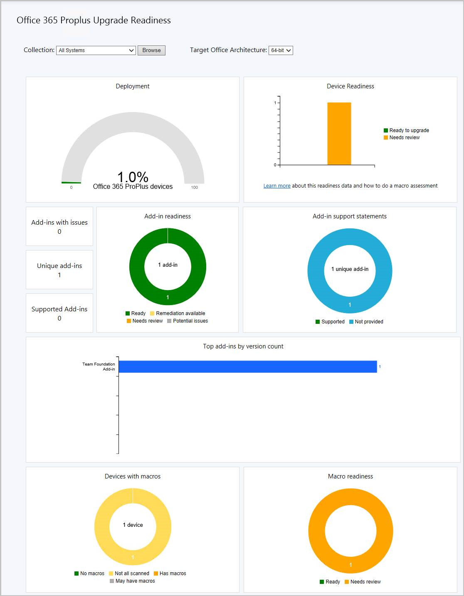
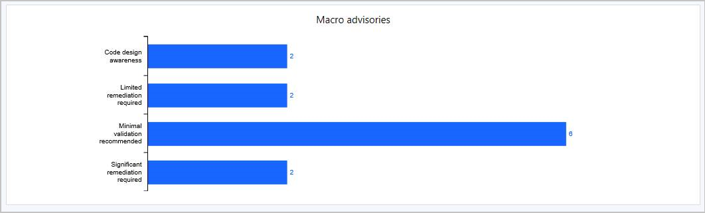

# What's new in version 1906 of Configuration Manager current branch

*Applies to: System Center Configuration Manager (Current Branch)*

Update 1906 for Configuration Manager current branch is available as an in-console update. Apply this update on sites that run version 1806, 1810, or 1902. <!-- baseline only statement:When installing a new site, it's also available as a baseline version.--> This article summarizes the changes and new features in Configuration Manager, version 1906.  

Always review the latest checklist for installing this update. For more information, see [Checklist for installing update 1906](/sccm/core/servers/manage/checklist-for-installing-update-1906). After you update a site, also review the [Post-update checklist](/sccm/core/servers/manage/checklist-for-installing-update-1906#post-update-checklist).

To take full advantage of new Configuration Manager features, after you update the site, also update clients to the latest version. While new functionality appears in the Configuration Manager console when you update the site and console, the complete scenario isn't functional until the client version is also the latest.

> [!Note]  
> This article currently lists all significant features in this version. However, not all sections yet link to updated content with further information on the new features. Keep checking this page regularly for updates. Changes are noted with the ***[Updated]*** tag. This note will be removed when the content is finalized.  

> [!Tip]  
> To get notified when this page is updated, copy and paste the following URL into your RSS feed reader:
> `https://docs.microsoft.com/api/search/rss?search=%22what%27s+new+in+version+1906+-+Configuration+Manager%22&locale=en-us`

##  Deprecated features and operating systems

Learn about support changes before they're implemented in [removed and deprecated items](/sccm/core/plan-design/changes/deprecated/removed-and-deprecated).

Version 1906 drops support for the following features:  

- Classic service deployment to Azure for cloud management gateway and cloud distribution point. For more information, see [Plan for CMG](/sccm/core/clients/manage/cmg/plan-cloud-management-gateway#azure-resource-manager).

##  Site infrastructure

### Site server maintenance task improvements
<!--3555894-->
Site server maintenance tasks can now be viewed and edited from their own tab on the details view of a site server. The new **Maintenance Tasks** tab gives you information such as:

- If the task is enabled
- The task schedule
- Last start time
- Last completion time
- If the task completed successfully

<!-- For more information, see [Maintenance tasks](sccm/core/servers/manage/maintenance-tasks). -->

### Configuration Manager update database upgrade monitoring
<!--4200581-->
When applying a Configuration Manager update, you can now see the state of the **Upgrade ConfigMgr database** task in the  installation status window.

- If the database upgrade is blocked, then you'll be given the warning **In progress, needs attention**.
   - The cmupdate.log will log the program name and sessionid from SQL that is blocking the database upgrade.
- When the database upgrade is no longer blocked, the status will be reset to **In progress** or **Complete**.
   - When the database upgrade is blocked, a check is done every 5 minutes to see if it's still blocked.

   

<!-- For more information, see [Install in-console updates](/sccm/core/servers/manage/install-in-console-updates#bkmk_install). -->

### Management insights rule for NTLM fallback

<!--4572953-->
Management insights includes a new rule that detects if you enabled the less secure NTLM authentication fallback method for the site: **NTLM fallback is enabled**.

For more information, see [Management insights](/sccm/core/servers/manage/management-insights#security).

### Add a SQL AlwaysOn node
<!--3127336-->
You can now add a new secondary replica node to an existing SQL AlwaysOn availability group. Instead of a [manual process](/sccm/core/servers/deploy/configure/configure-aoag#add-or-remove-synchronous-replica-members), use Configuration Manager setup to make this change.

<!--For more information on Configuration Manager support for SQL AlwaysOn, see the following articles:

- [Prepare to use SQL Server Always On availability groups](/sccm/core/servers/deploy/configure/sql-server-alwayson-for-a-highly-available-site-database)
- [Configure SQL Server Always On availability groups](/sccm/core/servers/deploy/configure/configure-aoag)-->

##  Cloud-attached management

<!--3555774 - moved as of 6/28
### Cloud services cost estimator

Some customers are concerned about the potential cost for attaching cloud services in Configuration Manager. This release introduces a new cost estimator tool in the Configuration Manager console. The tool uses the following data from your site database to estimate the cost of deploying the cloud management gateway:  

- Aggregate, average client usage of management points and distribution points  

- Azure pricing  

In the Configuration Manager console, go to the **Monitoring** workspace, and select the **Cloud Management** node.  

(New article) For more information, see [Planning for cloud usage](/sccm/core/clients/manage/cmg/plan-for-cloud-cost). -->

### Azure Active Directory user group discovery
<!--3611956-->

You can now discover user groups and members of those groups from Azure Active directory (Azure AD). Users found in Azure AD groups that haven't been previously discovered will be added as user resources in Configuration Manager. A user group resource record is created when the group is a security group.

<!-- For more information, see [Configure discovery methods](/sccm/core/servers/deploy/configure/configure-discovery-methods). -->

### Synchronize collection membership results to Azure Active Directory groups
<!--3607475-->
 
You can now enable the synchronization of collection memberships to an Azure Active Directory (Azure AD) group. This synchronization allows you to use your existing on premises grouping rules in the cloud. You can synchronize device collections. Only Azure AD-joined devices are synchronized to Azure AD.

The Azure AD synchronization is a one-way process, from Configuration Manager to Azure AD. Changes made in Azure AD aren't reflected in Configuration Manager collections, but aren't overwritten by Configuration Manager. For example, if the Configuration Manager collection has two devices, and the Azure AD group has three different devices, after synchronization the Azure AD group has five devices.

<!-- ? For more information, see [Create collections](/core/clients/manage/collections/create-collections). -->

<!--COMMENTING OUT DA FOR RIGHT NOW SINCE IT IS NOT ON TAP Feature list

##  Desktop Analytics

### DALogsCollector tool
<!--4622989--

The DALogsCollector tool is now included in the Configuration Manager media.

<!-- ? For more information, see [Configuration Manager Tools](/sccm/core/support/tools). 

### Changing the Desktop Analytics limiting collection on existing deployments
<!--3218073--

TBD

-->

##  Real-time management

### Add joins, additional operators and aggregators in CMPivot
<!--4054074-->

 For CMPivot, you now have additional arithmetic operators, aggregators, and the ability to add query joins such as using Registry and File together.

For more information, see [CMPivot](/sccm/core/servers/manage/cmpivot#bkmk_cmpivot1906).

### CMPivot standalone
<!--3555890, 4619340, 4692885 -->

You can now use CMPivot as a standalone app. CMPivot standalone is a **pre-release feature**. Run CMPivot outside of the Configuration Manager console to view the real-time state of devices in your environment. This change enables you to use CMPivot on a device without first installing the console.

You can share the power of CMPivot with other personas, such as helpdesk or security admins, who don’t have the console installed on their computer. These other personas can use CMPivot to query Configuration Manager alongside the other tools that they traditionally use. By sharing this rich management data, you can work together to proactively solve business problems that cross roles.

For more information, see [CMPivot](/sccm/core/servers/manage/cmpivot#bkmk_standalone).

### Added permissions to the Security Administrator role
<!--4683130-->

The following permissions have been added to Configuration Manager's built-in **Security Administrator** role:
 - Read on SMS Script
 - Run CMPivot on Collection
 - Read on Inventory Report

For more information, see [CMPivot](/sccm/core/servers/manage/cmpivot#bkmk_cmpivot_secadmin1906).

##  Content management

### Delivery Optimization download data in client data sources dashboard

<!--3555759-->
The client data sources dashboard now includes [Delivery Optimization](/sccm/core/plan-design/hierarchy/fundamental-concepts-for-content-management#delivery-optimization) data. This dashboard helps you understand from where clients are getting content in your environment.

For more information, see [Client Data Sources dashboard](/sccm/core/servers/deploy/configure/monitor-content-you-have-distributed#client-data-sources-dashboard).

### Use your distribution point as an in-network cache server for Delivery Optimization
<!--3555764-->

You can now install Delivery Optimization In-Network Cache server on your distribution points. By caching this content on-premises, your clients can benefit from the Delivery Optimization feature, but you can help to protect WAN links. 

This cache server acts as an on-demand transparent cache for content downloaded by Delivery Optimization. Use client settings to make sure this server is offered only to the members of the local Configuration Manager boundary group. 

This cache is separate from Configuration Manager's distribution point content. If you choose the same drive as the distribution point role, it stores content separately. 

> [!Note]  
> Delivery Optimization In-Network Cache server is a Windows Server feature that's still in development. It's tagged with a "beta" label in the Configuration Manager console.  

<!-- (new article and new section) For more information, see [Delivery Optimization In Network Cache (DOINC)](/sccm/core/plan-design/hierarchy/doinc) and [Content management delivery optimization](/sccm/core/plan-design/hierarchy/fundamental-concepts-for-content-management#delivery-optimization).-->

##  Client management

### Support for Windows Virtual Desktop
<!--3556025-->
[Windows Virtual Desktop](https://docs.microsoft.com/azure/virtual-desktop/) is a preview feature of Microsoft Azure and Microsoft 365. You can now use Configuration Manager technical preview to manage these virtual devices running Windows in Azure.

Similar to a terminal server, these virtual devices allow multiple concurrent active user sessions. To help with client performance, Configuration Manager now disables user policies on any device that allows these multiple user sessions. Even if you enable user policies, the client disables them by default on these devices, which include Windows Virtual Desktop and terminal servers.

The client only disables user policy when it detects this type of device during a new installation. For an existing client of this type that you update to this version, the previous behavior persists. On an existing device, it configures the user policy setting even if it detects that the device allows multiple user sessions.

If you require user policy in this scenario, and accept any potential performance impact, use the Configuration Manager SDK with the [SMS_PolicyAgentConfig server WMI class](/sccm/develop/reference/core/clients/config/sms_policyagentconfig-server-wmi-class). Set the new `PolicyEnableUserPolicyOnTS` property to `true`.

<!-- For more information, see [Supported OS versions for clients and devices](/sccm/core/plan-design/configs/supported-operating-systems-for-clients-and-devices). -->

### OneTrace (Preview)
<!--3555962-->
OneTrace is a new log viewer with Support Center. It works similarly to CMTrace, with the following improvements:

- A tabbed view
- Dockable windows
- Improved search capabilities
- Ability to enable filters without leaving the log view
- Scrollbar hints to quickly identify clusters of errors
- Fast log opening for large files

OneTrace works with many types of log files, such as:

- Configuration Manager client logs
- Configuration Manager server logs
- Status messages
- Windows Update ETW log file on Windows 10
- Windows Update log file on Windows 7 & Windows 8.1

<!-- For more information, see [Configuration Manager tools](/sccm/core/support/tools). -->

<!-- Commenting out item for now since it isn't in the TAP feature list 

### 1906 client won't install on legacy OS (SHA-1)
<!--4222696-->

### Configure client cache minimum retention period

<!--4485509-->
You can now specify the minimum time for the Configuration Manager client to keep cached content. This client setting controls how long the client stores content in the cache before deleting it. In the **Client cache settings** group of client settings, configure the following setting: **Minimum duration before cached content can be removed (minutes)**.

> [!Note]  
> In the same client setting group, the existing setting to **Enable Configuration Manager client in full OS to share content** is now renamed to **Enable as peer cache source**. The behavior of the setting doesn't change.  

For more information, see [Client cache settings](/sccm/core/clients/deploy/about-client-settings#client-cache-settings).

##  Co-management

### Improvements to co-management auto-enrollment
<!--3555961 -- info still needed-->
<!--4454491-->

A new co-managed device now automatically enrolls to the Microsoft Intune service based on its Azure Active Directory (Azure AD) device token. It doesn't need to wait for a user to sign in to the device for auto-enrollment to start. This change helps to reduce the number of devices with the [enrollment status](/sccm/comanage/how-to-monitor#co-management-enrollment-status) *Pending user sign in*.

To support this behavior, clients need to be running Windows 10 version 1803 or later.

If the device token fails, it falls back to previous behavior with the user token. Look in the **ComanagementHandler.log** for the following entry:
`Enrolling device with RegisterDeviceWithManagementUsingAADDeviceCredentials`

<!-- For more information, see [Enable co-management](/sccm/comanage/how-to-enable.md). -->

### Multiple pilot groups for co-management workloads
<!--3555750-->
You can now configure different pilot collections for each of the co-management workloads. Being able to use different pilot collections allows you to take a more  granular approach when shifting workloads. 

- In the **Enablement** tab, you can now specify an **Intune Auto Enrollment** collection. 
    - The **Intune Auto Enrollment** collection should contain all of the clients you want to onboard into co-management. It's essentially a superset of all the other staging collections.

  

- The **Workloads** tab hasn't changed and you can still choose which workloads to transition.

  

- In the **Staging** tab, instead of using one pilot collection for all workloads, you can now choose an individual collection for each workload.

    
  
These options are also available when you first [enable co-management](/sccm/comanage/how-to-enable.md).

<!-- For more information, see [Enable co-management](/sccm/comanage/how-to-enable.md). -->

<!--

### Co-management support for government cloud 
<!--4075452 - not sure if we need docs for 1906-->

<!-- ##  Compliance settings -->

##  Application management

### Filter applications deployed to devices
<!--4451056-->
 User categories for device-targeted application deployments now show as filters in Software Center. Specify a **user category** for an application on the **Software Center** page of its properties. Then open the app in Software Center and look at the available filters.

<!--For more information, see [Manually specify application information](/sccm/apps/deploy-use/create-applications#bkmk_manual-app) and [Applications in Software Center](/sccm/core/understand/software-center#applications).-->

### Application groups
<!--3555907-->
Create a group of applications that you can send to a user or device collection as a single deployment. The metadata you specify about the app group is seen in Software Center as a single entity. You can order the apps in the group so that the client installs them in a specific order.

<!--For more information, see [Create application group](/sccm/apps/deploy-use/create-app-group)and [Create application group](/sccm/apps/deploy-use/deploy-applications).-->

### Retry the install of pre-approved applications

<!--4336307-->
You can now retry the installation of an app that you previously approved for a user or device. The approval option is only for available deployments. If the user uninstalls the app, or if the initial install process fails, Configuration Manager doesn't reevaluate its state and reinstall it. This feature allows a support technician to quickly retry the app install for a user that calls for help.

For more information, see [Approve applications](/sccm/apps/deploy-use/app-approval).

### Install an application for a device

<!--4402180-->
From the Configuration Manager console, you can now install applications to a device in real time. This feature can help reduce the need for separate collections for every application.

For more information, see [Install applications for a device](/sccm/apps/deploy-use/install-app-for-device).

### Improvements to app approvals

<!--4224910-->
This release includes the following improvements to app approvals:

- If you approve an app request in the console, and then deny it, you can now approve it again. The app is reinstalled on the client after you approve it.  

- In the Configuration Manager console, **Software Library** workspace, under **Application Management**, the **Approval Requests** node is renamed **Application Requests**.<!-- SCCMDocs-pr#4028 -->

- There's a new WMI method, **DeleteInstance** to remove an app approval request. This action doesn't uninstall the app on the device. If it's not already installed, the user can't install the app from Software Center. The version 1810 blog post below includes a PowerShell script sample that you can adjust for use with this API.  

- Call the **CreateApprovedRequest** API to create a pre-approved request for an app on a device. To prevent automatically installing the app on the client, set the **AutoInstall** parameter to `FALSE`. The user sees the app in Software Center, but it's not automatically installed.

For more information, see [Approve applications](/sccm/apps/deploy-use/app-approval).

##  OS deployment

### Task sequence debugger
<!--3612274-->
The task sequence debugger is a new troubleshooting tool. You deploy a task sequence in debug mode to a collection of one device. It lets you step through the task sequence in a controlled manner to aid troubleshooting and investigation.

 <!--(New article) For more information, see [Task sequence debugger](/sccm/osd/deploy-use/debug-task-sequence).-->

### Clear app content from client cache during task sequence

<!--4485675-->
In the **Install Application** task sequence step, you can now delete the app content from the client cache after the step runs.

For more information, see [About task sequence steps](/sccm/osd/understand/task-sequence-steps#BKMK_InstallApplication).

> [!Important]  
> Update the target client to the latest version to support this new feature.

### Reclaim SEDO lock for task sequences

<!--3699337-->
If the Configuration Manager console stops responding, you can be locked out of making further changes to a task sequence. Now when you attempt to access a locked task sequence, you can now **Discard Changes**, and continue editing the object.

For more information, see [Manage task sequences](/sccm/osd/deploy-use/manage-task-sequences-to-automate-tasks#bkmk_sedo).

### Pre-cache driver packages and OS images

<!--4224642-->
Task sequence pre-cache now includes additional content types. Pre-cache content previously only applied to OS upgrade packages. Now you can use pre-caching to reduce bandwidth consumption of:

- OS images
- Driver packages
- Packages

For more information, see [Configure pre-cache content](/sccm/osd/deploy-use/configure-precache-content).

### Improvement to task sequence media creation
<!--4090666-->

 <!--? this is a DCR not on doc list for 1906- Looks like it was added in 1902 on multiple articles including /sccm/osd/deploy-use/create-stand-alone-media#process.-->

### Improvements to OS deployment 
<!--2839943,4447680-->
<!--4512937,4224642 (combined with the 422462 above)-->
<!--4668846, 2840337, 4512937-->
This release includes the following improvements to OS deployment:

- The following two PowerShell cmdlets were added to create and edit the [Run Task Sequence](/sccm/osd/understand/task-sequence-steps#child-task-sequence) step:  <!--2839943--> <!--For more information, see [Run Task Sequence](/sccm/osd/understand/task-sequence-steps#child-task-sequence).-->

    - **New-CMTSStepRunTaskSequence**

    - **Set-CMTSStepRunTaskSequence**

- A new task sequence variable was added, **SMSTSRebootDelayNext**. Use this new variable with the existing [SMSTSRebootDelay](/sccm/osd/understand/task-sequence-variables#SMSTSRebootDelay) variable. If you want any later reboots to happen with a different timeout than the first, set SMSTSRebootDelayNext to a different value in seconds. <!--4447680--> <!--For more information, see [Run Task Sequence](/sccm/osd/understand/task-sequence-steps#child-task-sequence).-->

    For example, you want to give users a 60-minute reboot notification at the start of a Windows 10 in-place upgrade task sequence. After that first long timeout, you want additional timeouts to only be 60 seconds. Set SMSTSRebootDelay to `3600`, and SMSTSRebootDelayNext to `60`.  

- The [Disable BitLocker](/sccm/osd/understand/task-sequence-steps#BKMK_DisableBitLocker) task sequence step has a new restart counter. Use this option to specify the number of restarts to keep BitLocker disabled. Instead of adding multiple instances of this step, set a value between 1 (default) and 15. You can also set this behavior with the task sequence variable **OSDBitlockerRebootCount**. <!--4512937--> <!--For more information, see [Disable BitLocker](/sccm/osd/understand/task-sequence-steps#BKMK_DisableBitLocker).-->

- This release further iterates on the improvement to the [Disable BitLocker](/sccm/osd/understand/task-sequence-steps#BKMK_DisableBitLocker) step. This release adds a new variable, **OSDBitLockerRebootCountOverride**. Set this value from 0 to 15, and it overrides the count set by the step or the OSDBitlockerRebootCount variable. While the other methods only accept values 1 to 15, if you set this variable to 0, BitLocker remains disabled indefinitely. This new variable is useful when the task sequence sets one value, but you want to set a separate value on a per-device or per-collection basis. <!-- 4512937 --> <!--For more information, see [Disable BitLocker](/sccm/osd/understand/task-sequence-steps#BKMK_DisableBitLocker).-->

- It's now easier to edit variables when you run a task sequence. After you select a task sequence in the Task Sequence Wizard window, the page to edit task sequence variables includes an **Edit** button. You can use accessible keyboard shortcuts to edit the variables. This change helps in cases where a mouse isn't available.<!-- 4668846 --><!--For more information, see [Run Task Sequence](/sccm/osd/understand/task-sequence-steps#child-task-sequence).-->

- The task sequence sets a new read-only variable **_SMSTSLastContentDownloadLocation**. This variable contains the last location where the task sequence downloaded or attempted to download content. Inspect this variable instead of parsing the client logs.<!-- 2840337 --> <!--For more information, see [Run Task Sequence](/sccm/osd/understand/task-sequence-steps#child-task-sequence).-->

##  Software Center

### Improvements to Software Center tab customizations
<!--4063773-->
You can now add up to five custom tabs in Software Center. You can also edit the order in which these tabs appear in Software Center.

<!--For more information, see [Software Center client settings](/sccm/core/clients/deploy/about-client-settings#software-center) and [Plan for Software Center](/sccm/apps/plan-design/plan-for-software-center).-->

### Software Center infrastructure improvements
<!--3555950-->

This release includes the following infrastructure improvements to Software Center:

- Software Center now communicates with a management point for apps targeted to users as available. It doesn't use the application catalog anymore. This change makes it easier for you to remove the application catalog from the site.
- Previously, Software Center picked the first management point from the list of available servers. Starting in this release, it uses the same management point that the client uses. This change allows Software Center to use the same management point from the assigned primary site as the client.
- The management point now checks the health of its user service every five minutes. It reports any issues via status messages for the SMS_MP_CONTROL_MANAGER site component.

> [!Important]  
> These iterative improvements to Software Center and the management point are to retire the application catalog roles. The Silverlight user experience isn't supported as of current branch version 1806. In the first current branch release after June 30, 2019, updated clients will automatically use the management point for user-available application deployments. You also won't be able to install new application catalog roles. In the first current branch release after October 31, 2019, support will end for the application catalog roles.  

<!--For more information, see [Remove the application catalog](/sccm/apps/plan-design/plan-for-and-configure-application-management#bkmk_remove-appcat) and [Plan for Software Center](/sccm/apps/plan-design/plan-for-software-center).-->

### Redesigned notification for newly available software
<!--3555904-->
The **New Software is Available** notification will only show once for a user for a given application and revision. The user will no longer see the notification each time they sign in. They'll only see another notification for an application if it has changed.

<!--For more information, see [Remove the application catalog](/sccm/apps/get-started/create-and-deploy-an-application#end-user-experience). -->

### More frequent countdown notifications for restarts
<!--3976435-->

End users will now be reminded more frequently of a pending restart with intermittent countdown notifications. You can define the interval for the intermittent notifications in **Client Settings** on the **Computer Restart** page. Change the value for **Specify the snooze duration for computer restart countdown notifications (hours)** to configure how often a user is reminded about a pending restart until the final countdown notification occurs.

Additionally, the maximum value for **Display a temporary notification to the user that indicates the interval before the user is logged off or the computer restarts (minutes)** increased from 1440 minutes (24 hours) to 20160 minutes (two weeks).

<!--For more information, see [Plan for Software Center](/sccm/apps/plan-design/plan-for-software-center#restart-required) and [About client settings](/sccm/core/clients/deploy/about-client-settings#computer-restart). -->

### Direct link to custom tabs in Software Center
<!--4655176-->

You can now provide users with a direct link to a [custom tab](/sccm/core/clients/deploy/about-client-settings#software-center-tab-visibility) in Software Center.

Use the following URL format to open Software Center to a particular tab:

`softwarecenter:page=CustomTab1`

The string `CustomTab1` is the first custom tab in order.

For example, type this URL in the Windows **Run** window.

You can also use this syntax to open default tabs in Software Center:

|Command line  |Tab  |
|---------|---------|
|`AvailableSoftware`|Applications|
|`Updates`|Updates|
|`OSD`|Operating Systems|
|`InstallationStatus`|Installation status|
|`Compliance`|Device compliance|
|`Options`|Options|

<!--For more information, see [custom tab](/sccm/core/clients/deploy/about-client-settings#software-center-tab-visibility).--> 

##  Software updates

### Additional options for WSUS maintenance
<!--4110109-->
You now have more granular control over the WSUS maintenance tasks that Configuration Manager runs to maintain healthy software update points. The WSUS maintenance occurs after every synchronization. In addition to declining expired updates in WSUS, Configuration Manager can now:

- Remove obsolete updates from the WSUS database.
- Add non-clustered indexes to the WSUS database to improve WSUS cleanup performance.

<!--For more information, see [Software updates maintenance](/sccm/sum/deploy-use/software-updates-maintenance).--> 

### Configure the default maximum run time for software updates
<!--3734426-->

You can now specify the maximum amount of time a software update installation has to complete. You can specify the following items in the **Maximum Run Time** tab on the Software Update Point:

- **Maximum run time for feature updates (minutes)**
   - **Feature updates** - An update that is in one of these three classifications:
      - Upgrades
      - Update rollups
      - Service packs

- **Maximum run time for non-feature updates (minutes)**
   - **Non-feature updates** - An update that isn't a feature upgrade and whose product is listed as one of the following:
      - Windows 10 (all versions)
      - Windows Server 2012
      - Windows Server 2012 R2
      - Windows Server 2016
      - Windows Server 2019
      - Office 365
- These settings only change the maximum runtime for new updates that are synchronized from Microsoft Update. It doesn't change the run time on existing feature or non-feature updates.
- All other products and classifications are not configurable with this setting. If you need to change the maximum run time of one of these updates, [configure the software update settings](/sccm/sum/get-started/manage-settings-for-software-updates#BKMK_SoftwareUpdatesSettings)

<!--For more information, see [Plan for software updates](/sccm/sum/plan-design/plan-for-software-updates#BKMK_UpdateLanguages) and [Install and configure a software update point](/sccm/sum/get-started/install-a-software-update-point).--> 

### Configure dynamic update during feature updates
<!--4062619-->

Use a new client setting to configure [dynamic updates for Windows 10](https://techcommunity.microsoft.com/t5/Windows-IT-Pro-Blog/The-benefits-of-Windows-10-Dynamic-Update/ba-p/467847) feature updates. Dynamic update can install language packs, features on demand, drivers, and cumulative updates during Windows setup. This setting changes the [setupconfig](https://docs.microsoft.com/windows-hardware/manufacture/desktop/windows-setup-automation-overview) file used during feature update installation. 

<!--For more information, see [Software update client settings](/sccm/core/clients/deploy/about-client-settings#software-updates) and [Manage Windows as a service](/sccm/osd/deploy-use/manage-windows-as-a-service).--> 

### New Windows 10, version 1903 and later product category
<!--4682946-->

**Windows 10, version 1903 and later** was added to Microsoft Update as its own product rather than being part of the **Windows 10**  product like earlier versions. This change caused you to do a number of manual steps to ensure that your clients see these updates. We've helped reduce the number of manual steps you have to take for the new product.

When you update to 1906 and have the **Windows 10** product selected for synchronization, the following actions occur automatically:

- The **Windows 10, version 1903 and later** product is added for synchronization.
- Automatic Deployment Rules containing the **Windows 10** product will be updated to include **Windows 10, version 1903 and later**.
- [Servicing plans](/sccm/osd/deploy-use/manage-windows-as-a-service) are updated to include the **Windows 10, version 1903 and later** product.

<!--For more information, see [Configure classifications and products to synchronize](/sccm/sum/get-started/configure-classifications-and-products) and [Manage Windows as a service](/sccm/osd/deploy-use/manage-windows-as-a-service).--> 

### Drill through required updates
<!--4224414-->
You can now drill through compliance statistics to see which devices require a specific software update. To view the device list, you need permission to view updates and the collections the devices belong to. To drill down into the device list, select the **View Required** hyperlink next to the pie chart in the **Summary** tab for an update. Clicking the hyperlink takes you to a temporary node under **Devices** where you can see the devices requiring the update.

The **View Required** hyperlink is available in the following locations:

   - **Software Library** > **Software Updates** > **All Software Updates**
   - **Software Library** > **Windows 10 Servicing** > **All Windows 10 Updates**
   - **Software Library** > **Office 365 Client Management** > **Office 365 Updates**

<!--For more information, see [Monitor software updates](/sccm/sum/deploy-use/monitor-software-updates),  [Manage Windows as a service](/sccm/osd/deploy-use/manage-windows-as-a-service) and [Using the Configuration Manger console](/sccm/core/servers/manage/admin-console#tips) .--> 

##  Office management

### Office 365 ProPlus upgrade readiness dashboard
<!--4021125-->

To help you determine which devices are ready to upgrade to Office 365 ProPlus, there's a new readiness dashboard. It includes the **Office 365 ProPlus upgrade readiness** tile that released in Configuration Manager current branch version 1902. In the Configuration Manager console, go to the **Software Library** workspace, expand **Office 365 Client Management**, and select the **Office 365 ProPlus Upgrade Readiness** node. The following new tiles on this dashboard help you evaluate Office add-in and macro readiness:

- Add-in readiness
- Add-in support statements
- Top add-ins by count of version
- Number of devices that have macros
- Macro readiness
- Macro advisories

<!--For more information on prerequisites and using this data, see [Integration for Office 365 ProPlus readiness](/sccm/sum/deploy-use/office-365-dashboard#bkmk_o365_readiness).-->

##  Inventory

### Improvement to Asset Intelligence
<!--4586547-->

We've increased the number of uncategorized software titles that can be uploaded at one time to Microsoft for categorization.

<!--For more information, see [Introduction to asset intelligence](/sccm/core/clients/manage/asset-intelligence/introduction-to-asset-intelligence).-->

<!-- ##  Phased deployments -->

##  Protection

### Windows Defender Application Guard file trust criteria
<!--3555858-->

There's a new policy setting that enables users to trust files that normally open in Windows Defender Application Guard (WDAG). Upon successful completion, the files will open on the host device instead of in WDAG.

<!--For more information, see [Create and deploy Windows Defender Application Guard policy](/sccm/protect/deploy-use/create-deploy-application-guard-policy).-->

##  Configuration Manager console

### Add SMBIOS GUID column to device and device collection nodes

<!--4526580-->
In both the **Devices** and **Device Collections** nodes, you can now add a new column for **SMBIOS GUID**. This value is the same as the **BIOS GUID** property of the System Resource class. It's a unique identifier for the device hardware.

### RBAC on folders
<!--3600867-->

You can now set security scopes on folders. If you have access to an object in the folder but don't have access to the folder, you'll be unable to see the object. Similarly, if you have access to a folder but not an object within it, you won't see that object. Right-click a folder, choose **Set Security Scopes**, then chose the security scopes you want to apply. 

<!--For more information, see [Using the Configuration Manager console](/sccm/core/servers/manage/admin-console#tips) and [Fundamentals of role-based administration](/sccm/core/understand/fundamentals-of-role-based-administration).-->

### Administration service support for security nodes

<!--4223683-->
You can now enable some nodes of the Configuration Manager console to use the administration service. This change allows the console to communicate with the SMS Provider over HTTPS instead of via WMI.

For more information, see [Administration service](/sccm/core/plan-design/hierarchy/plan-for-the-sms-provider#bkmk_admin-service).

> [!Note]
> Starting in version 1906, the **Client Computer Communication** tab on the site properties is now called **Communication Security**.<!-- SCCMDocs#1645 -->  

<!--
## Other updates

Aside from new features, this release also includes additional changes such as bug fixes. For more information, see [Summary of changes in Configuration Manager current branch, version 1906](https://support.microsoft.com/help/4498910).

For more information on changes to the Windows PowerShell cmdlets for Configuration Manager, see [PowerShell version 1906 release notes](https://docs.microsoft.com/powershell/sccm/1906-release-notes?view=sccm-ps).

The following update rollup (4486457) is available in the console starting on 25 January 2019: [Update rollup for Configuration Manager current branch, version 1902](https://support.microsoft.com/help/4486457).

### Hotfixes

The following additional hotfixes are available to address specific issues:

| ID | Title | Date | In-console |
|---------|---------|---------|---------|
| [4487960](https://support.microsoft.com/help/4487960) | Microsoft Intune connector certificate does not renew in Configuration Manager | 18 January 2019 | Yes |

> [!Note]  
> Starting in version 1902, in-console hotfixes now have supersedence relationships. For more information, see [Supersedence for in-console hotfixes](/sccm/core/servers/manage/updates#bkmk_supersede).
-->

## Next steps

When you're ready to install this version, see [Installing updates for Configuration Manager](/sccm/core/servers/manage/updates) and [Checklist for installing update 1906](/sccm/core/servers/manage/checklist-for-installing-update-1906).

> [!TIP]  
> To install a new site, use a baseline version of Configuration Manager.  
>
> Learn more about:
>
> - [Installing new sites](/sccm/core/servers/deploy/install/installing-sites)  
> - [Baseline and update versions](/sccm/core/servers/manage/updates#a-namebkmkbaselinesa-baseline-and-update-versions)  

For known, significant issues, see the [Release notes](/sccm/core/servers/deploy/install/release-notes).

After you update a site, also review the [Post-update checklist](/sccm/core/servers/manage/checklist-for-installing-update-1906#post-update-checklist).
