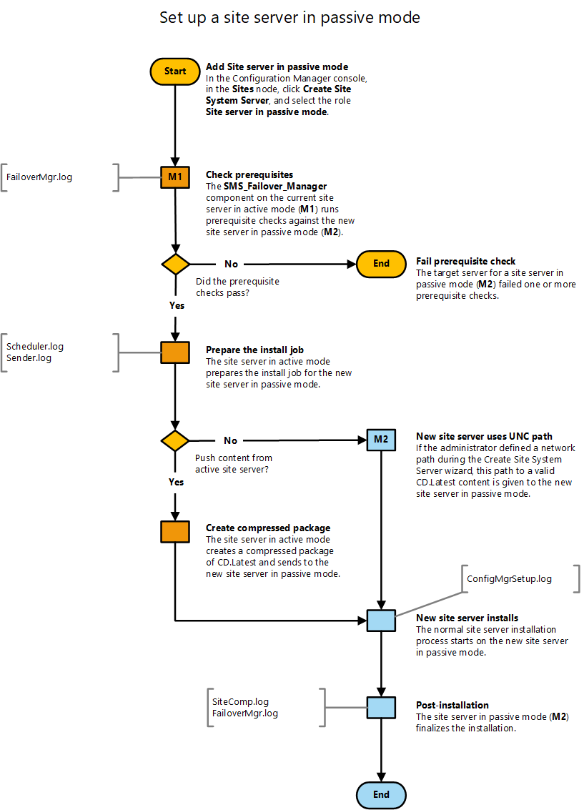

# Flowchart - Set up a site server in passive mode

*Applies to: System Center Configuration Manager (Current Branch)*

This flowchart diagram shows the process by which the site sets up a site server in passive mode. For more information, see the following articles:  
- [Site server high availability](/sccm/core/servers/deploy/configure/site-server-high-availability)
- [Flowchart - Promote site server (planned)](/sccm/core/servers/deploy/configure/promote-site-server-flowchart)
- [The content library](/sccm/core/plan-design/hierarchy/the-content-library)
- [Flowchart - Manage content library](/sccm/core/plan-design/hierarchy/manage-content-library-flowchart)

