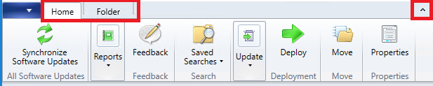

# Using the Configuration Manager console

*Applies to: System Center Configuration Manager (Current Branch)*

Administrators use the Configuration Manager console to manage the Configuration Manager environment. This article covers the fundamentals of navigating the console.  

## Connect to a site server

The console connects to your central administration site server or to your primary site servers. You can't connect a Configuration Manager console to a secondary site. You can [install the Configuration Manager console](/sccm/core/servers/deploy/install/install-consoles). During installation, you specified the fully qualified domain name (FQDN) of the site server to which the console connects. 

To connect to a different site server, use the following steps: 

1. Select the arrow at the top of the [ribbon](#ribbon), and choose **Connect to a New Site**.  

      

2. Type in the FQDN of the site server. If you've previously connected to site server, select the server from the drop-down list.  

      

3. Select **Connect**.  

Starting in version 1810, you can specify the minimum authentication level for administrators to access Configuration Manager sites. This feature enforces administrators to sign in to Windows with the required level. For more information, see [Plan for the SMS Provider](/sccm/core/plan-design/hierarchy/plan-for-the-sms-provider#bkmk_auth). <!--1357013-->  

## Navigation

Some areas of the console may not be visible depending on your assigned security role. For more information about roles, see [Fundamentals of role-based administration](/sccm/core/understand/fundamentals-of-role-based-administration). 

### Workspaces

The Configuration Manager console has four **workspaces**:  

- **Assets and Compliance**  

- **Software Library**  

- **Monitoring**  

- **Administration**  

  

Reorder workspace buttons by selecting the down arrow and choosing **Navigation Pane Options**. Select an item to **Move Up** or **Move Down**. Select **Reset** to restore the default button order.  

   

Minimize a workspace button by selecting **Show Fewer Buttons**. The last workspace in the list is minimized first. Select a minimized button and choose **Show More Buttons** to restore the button to its original size.   

  

### Nodes

Workspaces are a collection of **nodes**. One example of a node is the **Software Update Groups** node in the **Software Library** workspace. 

Once you are in the node, you can select the arrow to minimize the navigation pane.  

  

Use the **navigation bar** to move around the console when you minimize the navigation pane.  

  

In the console, nodes are sometimes organized into folders. Clicking directly on the folder usually takes you to a **navigation index** or a **dashboard**.  

  

### Ribbon 

The ribbon is at the top of the Configuration Manager console. The ribbon can have more than one tab and can be minimized using the arrow on the right. The buttons on the ribbon change based on the node. Most of the buttons in the ribbon are also available on context menus.  

   

### Details pane

You can get additional information about items by reviewing the details pane. The details pane can have one or more tabs. The tabs vary depending on the node.  

   

### Columns 

You can add, remove, reorder, and resize columns. These actions allow you to display the data you prefer. Available columns vary depending on the node. To add or remove a column from your view, right-click on an existing column heading and select an item. Reorder columns by dragging the column heading where you would like it to be.  

  

At the bottom of the column context menu, you can sort or group by a column. Additionally, you can sort by a column by selecting its header.  

  

## Command-line options

The Configuration Manager console has the following command-line options:

|Option|Description|  
|------------|-----------------|  
|`/sms:debugview=1`|A DebugView is included in all ResultViews that specify a view. DebugView shows raw properties (names and values).|  
|`/sms:NamespaceView=1`|Shows namespace view in the console.|  
|`/sms:ResetSettings`|The console ignores user-persisted connection and view states. The window size isn't reset.|  
|`/sms:IgnoreExtensions`|Disables any Configuration Manager extensions.|  
|`/sms:NoRestore`|The console ignores previous persisted node navigation.|  

## Tips

### Send feedback
<!--1357542-->

Starting in version 1806, submit product feedback from the console.  

- **Send a smile**: Send feedback on what you liked  

- **Send a frown**: Send feedback on what you didn't like  

- **Send a suggestion**: Takes you to UserVoice to share your idea  
 
For more information, see [Product Feedback](/sccm/core/understand/find-help#BKMK_1806Feedback).

### Assets and Compliance workspace

#### View users for a device
Starting in version 1806, the following columns are available in the **Devices** node:  

- **Primary user(s)** <!--1357280-->  

- **Currently logged on user** <!--1358202-->  

For more information on how to show a non-default column, see [Columns](#columns).

### Monitoring workspace

#### Copy details in monitoring views
<!--1357856-->
Starting in version 1806, copy information from the **Asset Details** pane for the following monitoring nodes:  

- **Content Distribution Status**  

- **Deployment Status**  

## Next steps

[Accessibility features](/sccm/core/understand/accessibility-features)

