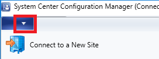

# System Center Configuration Manager console

*Applies to: System Center Configuration Manager (Current Branch)*

Administrators use the System Center Configuration Manager console to manage the Configuration Manager environment. The console connects to your central administration site server or to your primary site servers. However, you can't connect a Configuration Manager console to a secondary site. 

## Connect the console to a site server
If needed, [install the Configuration Manager console](../deploy/install/install-consoles.md). During installation, you specified the fully qualified domain name (FQDN) of the site server to which the Configuration Manager console connects. To connect to a different site server, use the following instructions: 

1. Click on the arrow at the top of the ribbon and select **Connect to a New Site**.
    
2. 