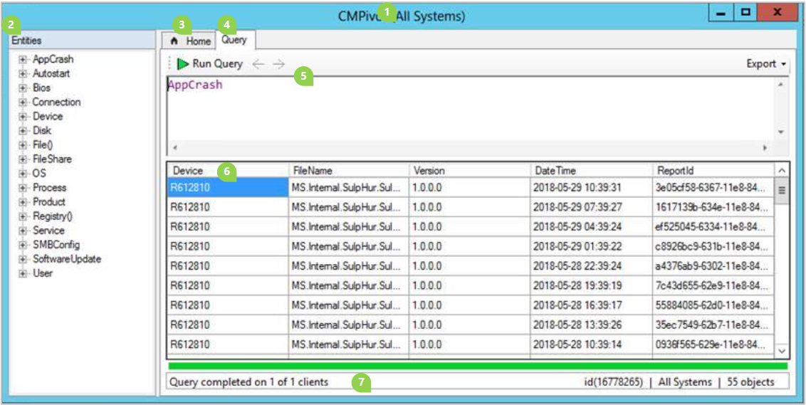

# CMPivot for real-time data in Configuration Manager

<!--1358456-->

*Applies to: System Center Configuration Manager (Current Branch)*

Configuration Manager has always provided a large centralized store of device data, which customers use for reporting purposes. The site typically collects this data on a weekly basis. Starting in version 1806, CMPivot is a new in-console utility that now provides access to real-time state of devices in your environment. It immediately runs a query on all currently connected devices in the target collection and returns the results. Then filter and group this data in the tool. By providing real-time data from online clients, you can more quickly answer business questions, troubleshoot issues, and respond to security incidents.

For example, in [mitigating speculative execution side channel vulnerabilities](https://blogs.technet.microsoft.com/configurationmgr/2018/01/08/additional-guidance-to-mitigate-speculative-execution-side-channel-vulnerabilities/), one of the requirements is to update the system BIOS. You can use CMPivot to quickly query on system BIOS information, and find clients that aren't in compliance.

## Prerequisites

The following components are required to use CMPivot:

- Upgrade the target devices to the latest version of the Configuration Manager client.  

- The Configuration Manager administrator needs the **Read** permission on the **SMS Scripts** object, and the **Run Scripts** permission on the **Collection** object. The **Scripts Runner** role has these permissions. For more information, see [Security roles for scripts](/sccm/apps/deploy-use/create-deploy-scripts#bkmk_ScriptRoles).  

- To gather data for the following entities, target clients require PowerShell version 5.0:  
    - Administrators
    - Connection
    - IPConfig
    - SMBConfig 

## Limitations

- In a hierarchy, connect the Configuration Manager console to a *primary site* to run CMPivot. The **Start CMPivot** action doesn't appear in the console when it's connected to a central administration site.  

- CMPivot only returns data for clients connected to the current site.  

- If a collection contains devices from another site, CMPivot results are only from devices in the current site.  

- You can't customize entity properties, columns for results, or actions on devices.  

- Only one instance of CMPivot can run at the same time on a computer that is running the Configuration Manager console.  

## Start CMPivot

1. In the Configuration Manager console, connect to the primary site. Go to the **Assets and Compliance** workspace, and select the **Device Collections** node. Select a target collection, and click **Start CMPivot** in the ribbon to launch the tool.  

    > [!Tip]  
    > If you don't see this option, check the following configurations:  
    > 
    > - Confirm with a site administrator that your account has the required permissions. For more information, see [Prerequisites](#prerequisites).  
    > 
    > - Connect the console to a *primary site*.  

2. The interface provides further information about using the tool.  

     - Manually enter query strings at the top, or click the links in the in-line documentation.  

     - Click one of the **Entities** to add it to the query string.  

     - The links for **Table Operators**, **Aggregation Functions**, and **Scalar Functions** open language reference documentation in the web browser. CMPivot uses the same query language as [Azure Log Analytics](https://docs.loganalytics.io/docs/Language-Reference/Change-log).  

3. Keep the CMPivot window open to view results from clients. When you close the CMPivot window, the session is complete.  

    > [!Note]  
    > If the query has been sent, then clients still send a state message response to the server.  

## How to use CMPivot

The CMPivot window contains the following elements:  

1. The collection that CMPivot currently targets is in the title bar at the top, and the status bar at the bottom of the window. For example, **All Systems** in the above screenshot.  

2. The pane on the left lists the **Entities** that are available on clients. Some entities rely upon WMI while others use PowerShell to get data from clients.   

    - Right-click an entity for the following actions:  

       - **Insert**: Add the entity to the query at the current cursor position. The query doesn't automatically run. This action is the default when you double-click an entity. Use this action when building a query.  

       - **Query all**: Run a query for this entity including all properties. Use this action to quickly query for a single entity.  

       - **Query by device**: Run a query for this entity and group the results. For example, `Disk | summarize dcount( Device ) by Name`  

    - Expand an entity to see specific properties available for each entity. Double-click a property to add it to the query at the current cursor position.  

3. The **Home** tab shows general information about CMPivot, including links to sample queries and supporting documentation.  

4. The **Query** tab displays the query pane, results pane, and status bar. The query tab is selected in the above screenshot example.  

5. The query pane is where you build or type a query to run on clients in the collection.  

    - CMPivot uses a subset of the same query language as [Azure Log Analytics](https://docs.loganalytics.io/docs/Language-Reference/Change-log).  

    - Cut, copy, or paste content in the query pane.  

    - By default, this pane uses IntelliSense. For example, if you start typing `D`, IntelliSense suggests all of the entities that start with that letter. Select an option and press Tab to insert it. Type a pipe character and a space `| `, and then IntelliSense suggests all of the table operators. Insert `summarize` and type a space, and IntelliSense suggests all of the aggregation functions. For more information on these operators and functions, click the **Home** tab in CMPivot.  

    - The query pane also provides the following options:  

        - Run the query.  

        - Move backwards and forwards in the history list of queries.  

        - Create a direct membership collection.  

        - Export the query results to CSV or the clipboard.  

6. The results pane displays the data returned by active clients for the query.  

    - The available columns vary based upon the entity and the query.  

    - Click a column name to sort the results by that property.  

    - Right-click on any column name to group the results by the same information in that column, or sort the results.  

    - Right-click on a device name to take the following additional actions on the device:  

       - **Pivot to**: Query for another entity on this device.  

       - **Run Script**: Launch the Run Script wizard to run an existing PowerShell script on this device. For more information, see [Run a script](/sccm/apps/deploy-use/create-deploy-scripts#run-a-script).  

       - **Remote Control**: Launch a Configuration Manager Remote Control session on this device. For more information, see [How to remotely administer a Windows client computer](/sccm/core/clients/manage/remote-control/remotely-administer-a-windows-client-computer).  

       - **Resource Explorer**: Launch Configuration Manager Resource Explorer for this device. For more information, see [View hardware inventory](/sccm/core/clients/manage/inventory/use-resource-explorer-to-view-hardware-inventory) or [View software inventory](/sccm/core/clients/manage/inventory/use-resource-explorer-to-view-software-inventory).  

    - Right-click on any non-device cell to take the following additional actions:  

       - **Copy**: Copy the text of the cell to the clipboard.  

       - **Show devices with**: Query for devices with this value for this property. For example, from the results of the `OS` query, select this option on a cell in the Version row: `OS | summarize countif( (Version == '10.0.17134') ) by Device | where (countif_ > 0)`  

       - **Show devices without**: Query for devices without this value for this property. For example, from the results of the `OS` query, select this option on a cell in the Version row: `OS | summarize countif( (Version == '10.0.17134') ) by Device | where (countif_ == 0) | project Device`  

       - **Bing it**: Launch the default web browser to www.bing.com with this value as the query string.  

    - Click any hyperlinked text to pivot the view on that specific information.  

    - The results pane doesn't show more than 20,000 rows. Either adjust the query to further filter the data, or restart CMPivot on a smaller collection.  

7. The status bar shows the following information (from left to right):  

    - The status of the current query to the target collection. This status includes:  
        - The number of active clients that completed the query (3)  
        - The number of total clients (5)  
        - The number of offline clients (2)  
        - Any clients that returned failure (0)  

        For example: `Query completed on 3 of 5 clients (2 clients offline and 0 failure)`  

    - The ID of the client operation. For example: `id(16780221)`  

    - The current collection. For example: `PM_Team_Machines`  

    - The total number of rows in the results pane. For example, `1 objects`  

## Example scenarios

The following sections provide examples of how you might use CMPivot in your environment:

### Example 1: Stop a running service

Your security administrator asks you to stop and disable the Computer Browser service as quickly as possible on all devices in the accounting department. You start CMPivot on a collection for all devices in accounting, and select **Query all** on the **Service** entity. 

`Service`

As results appear, you right-click on the **Name** column and select **Group by**. 

`Service | summarize dcount( Device ) by Name`

In the row for the **Browser** service, you click the hyperlinked number in the **dcount_** column. 

`Service | where (Name == 'Browser') | summarize count() by Device`

You multi-select all devices, right-click the selection, and choose **Run Script**. This action launches the Run Script wizard, from which you run an existing script you have for stopping and disabling a service. With CMPivot you quickly respond to the security incident for all active computers, viewing results in the Run Script wizard. You then followup to create a configuration baseline to remediate other computers in the collection as they become active in the future. 

### Example 2: Proactively resolve application failures  

To be proactive with operational maintenance, once a week you run CMPivot against a collection of servers that you manage, and select **Query all** on the **AppCrash** entity. You right-click the **FileName** column and select **Sort Ascending**. One device returns seven results for sqlsqm.exe with a timestamp about 03:00 every day. You select the file name in one of the rows, right-click it, and select **Bing It**. Browsing the search results in the web browser, you find a Microsoft support article for this issue with more information and resolution. 

### Example 3: BIOS version

To [mitigate speculative execution side channel vulnerabilities](https://blogs.technet.microsoft.com/configurationmgr/2018/01/08/additional-guidance-to-mitigate-speculative-execution-side-channel-vulnerabilities/), one of the requirements is to update the system BIOS. You start with a query for the **BIOS** entity. You then **Group by** the **Version** property. Then right-click a specific value, such as "LENOVO - 1140", and select **Show devices with**.  

`Bios | summarize countif( (Version == 'LENOVO - 1140') ) by Device | where (countif_ > 0)`

### Example 4: Free disk space

You need to temporarily store a large file on a network file server, but aren't sure which one has enough capacity. You start CMPivot against a collection of file servers, and query the **Disk** entity. You modify the query for CMPivot to quickly return a list of active servers with real-time storage data:  

`Disk | where (Description == 'Local Fixed Disk') | where isnotnull( FreeSpace ) | order by FreeSpace asc`

## Inside CMPivot

CMPivot sends queries to clients using the Configuration Manager "fast channel". This communication channel from server to client is also used by other features such as client notification actions, client status, and Endpoint Protection. Clients return results via the similarly quick state message system. State messages are temporarily stored in the database. 

The queries and the results are all just text. The entities **InstallSoftware** and **Process** return some of the largest result sets. During performance testing, the largest state message file size from one client for these queries was less than **1 KB**. Scaled to a large environment with 50,000 active clients, this one-time query would generate less than 50 MB of data across the network.  

A query times out after one hour. For example, a collection has 500 devices, and 450 of the clients are currently online. Those active devices receive the query and return the results almost immediately. If you leave the CMPivot window open, as the other 50 clients come online, they also receive the query, and return results. 

>[!TIP]
> CMPivot interations are logged to the following log files:

> Server Side:
> - SmsProv.log
> - bgbServer.log
> - StateSys.log

> Client Side:
> - CcmNotificationAgent.log
> - Scripts.log
> - StateMessage.log

> [For more Information on Configuration Manger log files](/sccm/core/plan-design/hierarchy/log-files)

## See also
[Create and run PowerShell scripts](/sccm/apps/deploy-use/create-deploy-scripts)
