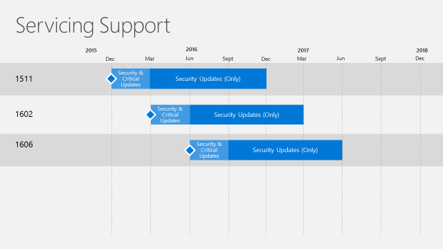

# Support for System Center Configuration Manager current branch versions

*Applies to: System Center Configuration Manager (Current Branch)*
Microsoft plans to release updates for System Center Configuration Manager current branch a few times per year. Each update version remains in support for 12 months from its general availability (GA) release date. Technical support is provided for the entire 12 months. However, our support structure is now dynamic, evolving into two distinct servicing phases that depend on the availability of the latest current branch version.  

-   Security and Critical Updates servicing phase - When running the latest current branch version of Configuration Manager, you receive both Security and Critical updates.  

-   Security Updates (Only) servicing phase - After a new current branch version releases, support for older branches will reduce to Security updates only for the remainder of the 12-month support lifecycle (shown in figure 1).  

   
Figure 1. Example of the release cycle overlap for current branch servicing support.

> [!NOTE]  
>  The latest current branch version is always in the Security and Critical Updates servicing phase. This means that in the event that you encounter a code defect that warrants a critical update, you must have the latest current branch version installed in order to receive a fix. All other supported current branch versions are eligible to receive only security updates. All support ends after the 12 month lifecycle for a current branch version has expired. At that time, customers must update to a supported current branch version.  

 **Version History**  

|Version|Availability Date|Support End Date|  
|-------------|-----------------------|----------------------|  
|1706|July 31, 2017|July 31, 2018|
|1702|March 27, 2017|March 27, 2018|
|1610|November 18, 2016|November 18, 2017|
|1606|July 22, 2016| July 22, 2017|
|1602|March 11, 2016|March 11, 2017|
|1511|December 8, 2015|December 8, 2016|  

For information about version numbers and availability as an in-console update or as a baseline, see [Baseline and update versions](/sccm/core/servers/manage/updates#a-namebkmkbaselinesa-baseline-and-update-versions).
