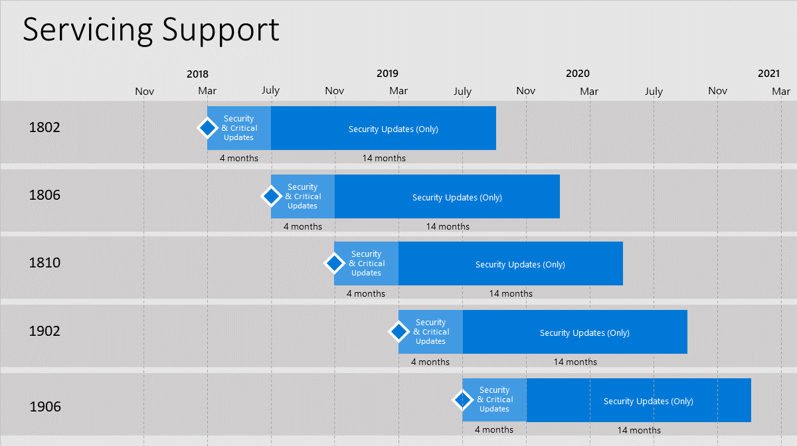

# Support for Configuration Manager current branch versions

*Applies to: System Center Configuration Manager (Current Branch)*

Microsoft plans to release updates for Configuration Manager current branch a few times per year. For versions of Configuration Manager released prior to 1710, support is for 12 months. Beginning with version 1710, each update version remains in support for 18 months from its general availability release date. Microsoft provides technical support for the entire period of support. There are two distinct servicing phases that depend on the availability of the latest current branch version.  

- **Security and Critical Updates** servicing phase - When running the latest current branch version of Configuration Manager, you receive both Security and Critical Updates.  

- **Security Updates (Only)** servicing phase - After the release of a new current branch version, Microsoft only supports security updates to older versions for the remainder of that version's support lifecycle (shown in Figure 1).  

    
  Figure 1. Example of the release cycle overlap for current branch servicing support. This example is for illustration of the cycle, and doesn't represent actual or expected release dates.

> [!NOTE]  
>  The latest current branch version is always in the **Security and Critical Updates** servicing phase. This support statement means that if you encounter a code defect that warrants a critical update, you must have the latest current branch version installed in order to receive a fix. All other supported current branch versions are eligible to receive only security updates.
> - For versions 1710 and later, all support ends after the 18-month lifecycle for a current branch version has expired.
> - For versions 1706 and earlier, support ends after the 12-month lifecycle expires.
> 
> Update your Configuration Manager environment to the latest version before support for your current version expires.

For a list of the current branch versions, see [Version details](/sccm/core/servers/manage/updates#version-details).

For more information about version numbers, and availability as an in-console update or as a baseline, see [Baseline and update versions](/sccm/core/servers/manage/updates#a-namebkmkbaselinesa-baseline-and-update-versions).
