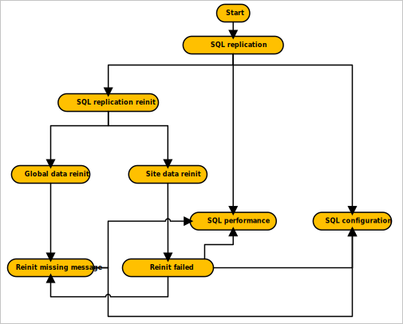

# Troubleshoot SQL replication

In a multi-site hierarchy, Configuration Manager uses SQL replication to transfer data between sites. For more information, see [Database replication](/sccm/core/plan-design/hierarchy/database-replication).

To better understand and help troubleshoot issues with SQL replication, use these diagrams.

- [SQL replication](/sccm/core/servers/manage/replication/sql-replication)
- [SQL configuration](/sccm/core/servers/manage/replication/sql-configuration)
- [SQL performance](/sccm/core/servers/manage/replication/sql-performance)
- [SQL replication reinitialization (reinit)](/sccm/core/servers/manage/replication/sql-replication-reinit)
- [Global data reinit](/sccm/core/servers/manage/replication/global-data-reinit)
- [Site data reinit](/sccm/core/servers/manage/replication/site-data-reinit)
- [Reinit missing message](/sccm/core/servers/manage/replication/reinit-missing-message)

These troubleshooting diagrams are interconnected. Use the following diagram to understand their relationships:

