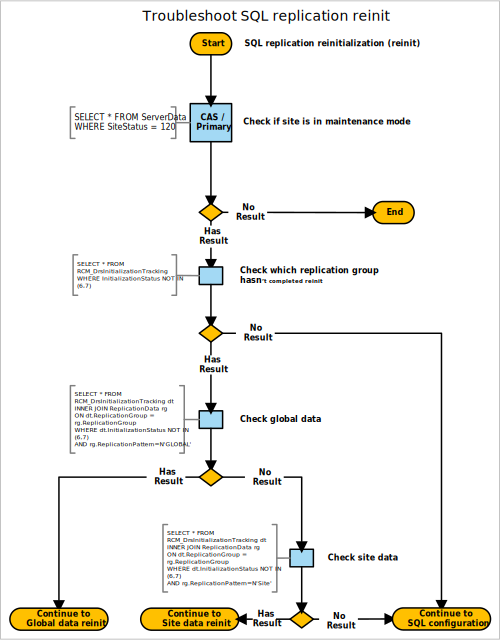

# SQL replication reinit

In a multi-site hierarchy, Configuration Manager uses SQL replication to transfer data between sites. For more information, see [Database replication](/sccm/core/servers/manage/data-transfers-between-sites#bkmk_dbrep).

Use the following diagram to start troubleshooting SQL replication reinitialization (reinit):



### Queries

This diagram uses the following queries:

#### Check if site is in maintenance mode

```sql
SELECT * FROM ServerData
WHERE Status = 120
```

#### Check which replication group hasn’t completed reinit

```sql
SELECT * FROM RCM_DrsInitializationTracking
WHERE InitializationStatus NOT IN (6,7)
```

#### Check global data

```sql
SELECT * FROM RCM_DrsInitializationTracking dt
INNER JOIN ReplicationData rg
ON dt.ReplicationGroup = rg.ReplicationGroup
WHERE dt.InitializationStatus NOT IN (6,7)
AND rg.ReplicationPattern=N'GLOBAL'
```

#### Check site data

```sql
SELECT * FROM RCM_DrsInitializationTracking dt
INNER JOIN ReplicationData rg
ON dt.ReplicationGroup = rg.ReplicationGroup
WHERE dt.InitializationStatus NOT IN (6,7)
AND rg.ReplicationPattern=N'Site'
```


### Next steps

- [Global data reinit](/sccm/core/servers/manage/replication/global-data-reinit)
- [Site data reinit](/sccm/core/servers/manage/replication/site-data-reinit)
- [SQL configuration](/sccm/core/servers/manage/replication/sql-configuration)
