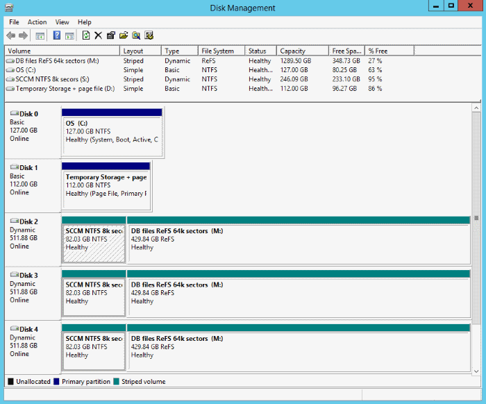

# Configuration Manager on Azure - Frequently Asked Questions
*Applies to: System Center Configuration Manager (Current Branch)*
The following questions and answers can help you understand when to use and how to configure Configuration Manager on Microsoft Azure.

## General Questions
### My company is trying to move as many physical servers as possible to Microsoft Azure, can I move Configuration Manager servers to Azure?
Certainly, this is a supported scenario.  See [Support for Virtualization Environments for System Center Configuration Manager](/sccm/core/plan-design/configs/support-for-virtualization-environments).

### Great! My environment requires multiple sites. Should all child primary sites be in Azure with the central administration site or on-premises? What about secondary sites?
Site-to-site communications (file-based and database replication) benefits from the proximity of being hosted in Azure. However, all client related traffic would be remote from site servers and site systems. If you use a fast and reliable network connection between Azure and your intranet with an unlimited data plan, hosting all your infrastructure in Azure is an option.

However, if you use a metered data plan and available bandwidth or cost is a concern, or the network connection between Azure and your intranet is not fast or can be unreliable, then consider placing specific sites (and site systems) on-premises and then use the bandwidth controls built into Configuration Manager.

### Is having Configuration Manager in Azure a SaaS scenario (Software as a Service)?
No, it is an IaaS (Infrastructure as a Service) because you host your Configuration Manager infrastructure servers in Azure virtual machines.

### What areas should I pay attention to when considering a move of my Configuration Manager infrastructure to Azure?
Great question, here are the areas that are most important when making this decision, each is explored in a separate section of this topic:
1.	Networking
2.	Availability
3.	Performance
4.	Cost
5.	User Experience

## Networking
### What about networking requirements, should I use ExpressRoute or an Azure VPN Gateway?
Networking is a very important decision. Network speeds and latency can affect functionality between the site server and remote site systems and any client communication to the site systems. Our recommendation is to use ExpressRoute. But there is no Configuration Manager limitation to stop you from using Azure VPN Gateway. You should carefully review your requirements (performance, patching, software distribution, operation system deployment) from this infrastructure and then make your decision. Some things to consider for each solution include:

 - **ExpressRoute** (recommended)
  - Natural extension to your datacenter (can tie together multiple datacenters)
  - Private connections between Azure datacenters and your infrastructure
  - Doesn’t go over the public Internet
  - Offers reliability, fast speeds, lower latency, high security
  - Offers up to 10gbps speeds and Unlimited Data plan options
 - **VPN Gateway**
  - Site-to-site/point-to-site VPNs
  - Traffic goes over the public Internet
  - Uses Internet Protocol Security (IPsec) and Internet Key Exchange (IKE)

### ExpressRoute has many different options like unlimited vs. metered, different speed options, and premium add-on. Which should I choose?
The options you select depend on the scenario you are implementing and how much data you plan to distribute. The transfer of Configuration Manager data can be controlled between site servers and distribution points, but site server-to-site server communication can’t be controlled.   When you use a metered data plan, placing specific sites (and site systems) on-premises and using [Configuration Manager's built-in bandwidth controls](/sccm/core/plan-design/hierarchy/fundamental-concepts-for-content-management) can help control the cost of using Azure.

### What about installation requirements like Active Directory domains? Do I still need to join my site servers to an Active Directory domain?
Yes. When you move to Azure, the [supported configurations](/sccm/core/plan-design/configs/supported-configurations) remain the same, including Active Directory requirements for installing Configuration Manager.

### I understand the need to join my site servers to an Active Directory domain, but can I use Azure Active Directory?
No, Azure Active Directory is not supported at this time. Your site servers still must be members of a [Windows Active Directory domain](/sccm/core/plan-design/configs/support-for-active-directory-domains).

## Availability
### One of the reasons I am moving infrastructure to Azure is the promise of high availability. Can I take advantage of high availability options like Azure VM Availability sets for VMs that I will use for Configuration Manager?
Yes! Azure VM Availability sets can be used for redundant site system roles like distribution points or management points.

You can also use them for the Configuration Manager site servers. For example, central administration sites and primary sites can all be in the same availability set which can help you ensure that they are not rebooted at the same time.

### How can I make my database highly available? Can I use Azure SQL Database? Or do I have to use Microsoft SQL Server in a VM?
You need to use Microsoft SQL Server in a VM. Configuration Manager does not support Azure SQL Server at this time. But you can use functionalities like AlwaysOn Availability Groups for your SQL server. [AlwaysOn Availability Groups](/sccm/core/servers/deploy/configure/sql-server-alwayson-for-a-highly-available-site-database) are recommended and are officially supported starting with version 1602 of Configuration Manager.

### Can I use Azure load balancers with site system roles like management points  or software update points?
While Configuration Manager is not tested with Azure load balancers, if the functionality is transparent to the application, it should not have any adverse effects on normal operations.

## Performance
### What factors affect performance in this scenario?
[Azure VM size and type](https://azure.microsoft.com/documentation/articles/virtual-machines-size-specs), Azure VM disks (premium storage is recommended, especially for SQL Server), networking latency, and speed are the most important areas.

### So, tell me more about Azure virtual machines; what size VMs should I use?
In general, your compute power (CPU and Memory) need to meet the [recommended hardware for System Center Configuration Manager](/sccm/core/plan-design/configs/recommended-hardware). But there are some differences between regular computer hardware and Azure VMs, especially when it comes to the disks these VMs use.  What size VMs you use depends on the size of your environment but here are some recommendations:
- For production deployments of any significant size we recommend “**S**” class Azure VMs. This is because they can leverage Premium Storage disks.  Non “S” class VMs use blob storage and in general will not meet the performance requirements necessary for an acceptable production experience.
- Multiple Premium Storage disks should be used for higher scale, and striped in the Windows Disk Management console for maximum IOPS.  
- We recommend using better or multiple premium disks during your initial site deployment (like P30 instead of P20, and 2xP30 in a striped volume instead of 1xP30). Then, if your site later needs to ramp up in VM size due to additional load, you can take advantage of the additional CPU and memory that a larger VM size provides. You will also have disks already in place that can take advantage of the additional IOPS throughput that the larger VM size allows.

The following tables list the initial suggested disk counts to utilize at primary and central administration sites for various size installations:

**Co-located site database** - Primary or central administration site with the site database on the site server:

| Desktop Clients    |Recommended VM size|Recommended Disks|
|--------------------|-------------------|-----------------|
|**Up to 25k**       |   DS4_V2          |2xP30 (striped)  |
|**25k to 50k**      |   DS13_V2         |2xP30 (striped)  |
|**50k to 100k**     |   DS14_V2         |3xP30 (striped)  |

**Remote site database** - Primary or central administration site with the site database on a remote server:

| Desktop Clients    |Recommended VM size|Recommended Disks |
|--------------------|-------------------|------------------|
|**Up to 25k**       | Site server: F4S  Database server: DS12_V2 | Site server: 1xP30  Database server: 2xP30 (striped)  |
|**25k to 50k**      | Site server: F4S  Database server: DS13_V2 | Site server: 1xP30  Database server: 2xP30 (striped)   |
|**50k to 100k**     | Site server: F8S  Database server: DS14_V2 | Site server: 2xP30 (striped)    Database server: 3xP30 (striped)   |

The following shows an example configuration for 50k to 100k clients on DS14_V2 with 3xP30 disks in a striped volume with separate logical volumes for the Configuration Manager install and database files:
   

## User Experience
### You mention that user experience is one of the main areas of importance, why is that?
The decisions you make for networking, availability, performance, and where you place your Configuration Manager site servers can affect your users directly. We believe a move to Azure should be transparent to your users so that they don’t experience a change in their day-to-day interactions with Configuration Manager.

### Ok, I get it. I plan to install a single stand-alone primary site on an Azure virtual machine and I want to make sure my costs are low. Should I place (remote) site systems (like management points, distribution points, and software update points) on Azure virtual machines as well or on-premises?
Except for communication from the site server to a distribution point, these server-to-server communications in a site can occur at any time and do not use mechanisms to control the use of network bandwidth. Because you cannot control the communication between site systems, any costs associated with these communications should be considered.

Network speeds and latency are other factors to consider as well. Slow or unreliable networks could impact functionality between the site server and remote site systems as well any client communication to the site systems. The number of managed clients that use a given site system as well as the features you actively use should also be considered.
In general, you can leverage the normal guidance as it relates to WAN links and site systems as a starting point. Ideally, the network throughput that you select and receive between Azure and your intranet will be consistent with a WAN that is well-connected with a fast network.

### What about content distribution and content management? Should standard distribution points be in Azure or on-premises, and should I use BranchCache or pull-distribution points on-premises? Or should I make exclusive use of Cloud Distribution Points?
The approach for content management is much the same as for site servers and site systems.
- If you use a fast and reliable network connection between Azure and your intranet with an unlimited data plan, hosting standard distribution points in Azure could be an option.
-  If you use a metered data plan and bandwidth cost is a concern or the network connection between Azure and your intranet is not fast or can be unreliable, then you might consider other approaches. These include locating standard or pull distribution points on-premises as well as using BranchCache. The use of cloud-based distribution points is also an option but there are some limits on the content types supported (for example, no support for software updates packages).

> [!NOTE]
>  If PXE support is required, you must use on-premises distribution points (standard or pull) to respond to boot requests. [WDS is currently not supported to run on Azure VMs](https://technet.microsoft.com/library/hh831764(v=ws.11).aspx).

### While I am OK with the limitations of cloud-based distribution points, I don't want to put my management point into a DMZ even though that is needed to support my Internet-based clients. Do I have any other options?
Yes! With the Configuration Manager version 1610, we introduced the [Cloud Management Gateway](/sccm/core/clients/manage/manage-clients-internet#cloud-management-gateway) as a pre-release feature. (This feature first appeared in the Technical Preview version 1606 as the [Cloud Proxy Service](/sccm/core/get-started/capabilities-in-technical-preview-1606#a-namecloudproxyacloud-proxy-service-for-managing-clients-on-the-internet)).

The **Cloud Management Gateway** provides a simple way to manage Configuration Manager clients on the Internet. The service, which is deployed to Microsoft Azure and requires an Azure subscription, connects to your on-premises Configuration Manager infrastructure using a new role called the cloud management gateway connector point. After it's deployed and configured, clients can access on-premises Configuration Manager site system roles regardless of whether they're connected to the internal private network or on the Internet.

You can start using the cloud management gateway in your environment and give us feedback to make this better. For information about pre-release features, see [Use pre-release features from updates](/sccm/core/servers/manage/install-in-console-updates#a-namebkmkprereleasea-use-pre-release-features-from-updates).

### I also heard that you have another new feature called Peer Cache introduced as a pre-release feature in version 1610. Is that different than BranchCache? Which one should I choose?
Yes, totally different. [Peer Cache](/sccm/core/plan-design/hierarchy/client-peer-cache) is a 100% native Configuration Manager technology where BranchCache is a feature of Windows. Both can be useful for you; BranchCache uses a broadcast to find the required content whereas Peer Cache uses Configuration Managers regular distribution workflow and boundary group settings.

You can configure any client to be a Peer Cache source. Then, when management points provide  clients information about content source locations, they provide details about both the distribution points and any Peer Cache sources that have the content that client requires.

## Cost
### OK tell me a bit about the cost. Will this be a cost-effective solution for me?
Hard to say since every environment is different. The best thing to do is to cost your environment using Microsoft Azure pricing calculator:  https://azure.microsoft.com/pricing/calculator/

## Additional Resources
**Fundamentals:**
http://azure.microsoft.com/documentation/articles/fundamentals-introduction-to-azure/

**Azure VM Machine Types:**
 - Azure Machine sizes: https://azure.microsoft.com/documentation/articles/virtual-machines-size-specs/  
 - VM Pricing: http://azure.microsoft.com/pricing/details/virtual-machines/  
 - Storage Pricing: http://azure.microsoft.com/pricing/details/storage/

**Disk Performance Considerations:**    
 - Premium Disk intro:  http://azure.microsoft.com/blog/2014/12/11/introducing-premium-storage-high-performance-storage-for-azure-virtual-machine-workloads/  
 - Deeper Premium Disk info: http://azure.microsoft.com/documentation/articles/storage-premium-storage-preview-portal/   
 - Handy collection of charts for max Sizes and Perf targets for Storage: https://azure.microsoft.com/documentation/articles/storage-scalability-targets/  
 - Another Intro + some cool uber-geek data on how Premium Storage works behind the covers:  http://azure.microsoft.com/blog/2015/04/16/azure-premium-storage-now-generally-available-2/

**Availability:**
 - Azure IaaS Uptime SLA's: https://azure.microsoft.com/support/legal/sla/virtual-machines/v1_0/  
 - Availability Sets Explained: https://azure.microsoft.com/documentation/articles/virtual-machines-manage-availability/

**Connectivity:**
 - Express route vs. Azure VPN: http://azure.microsoft.com/blog/2014/06/10/expressroute-or-virtual-network-vpn-whats-right-for-me/
 - Express Route Pricing: http://azure.microsoft.com/pricing/details/expressroute/
 - More about Express Route: http://azure.microsoft.com/documentation/articles/expressroute-introduction/

 
