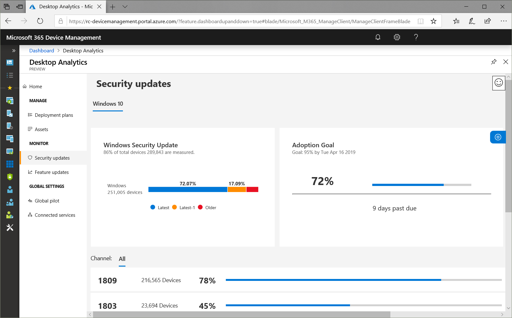
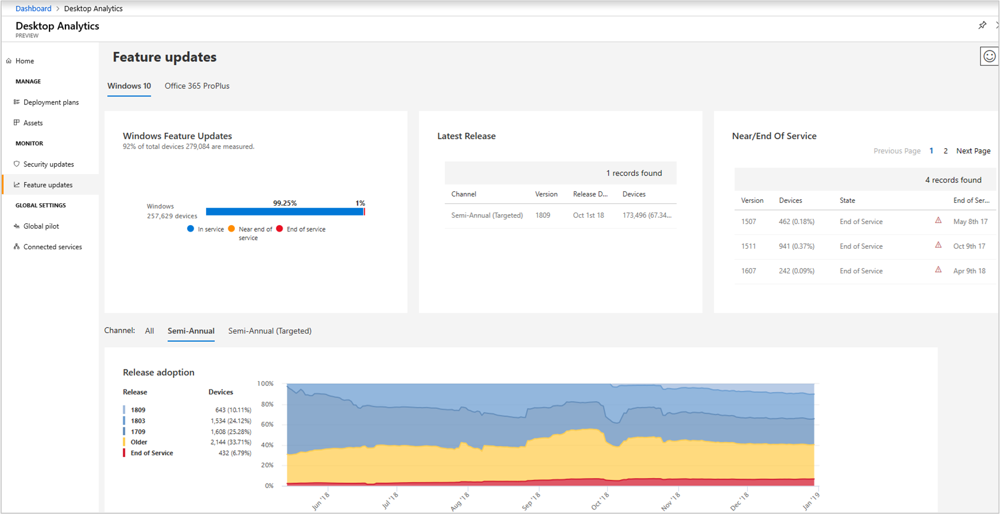

# Updates in Desktop Analytics 

> [!Note]  
> This information relates to a preview service which may be substantially modified before it's commercially released. Microsoft makes no warranties, express or implied, with respect to the information provided here.  

In the Desktop Analytics portal, view the status of security and feature updates. Select these nodes in the Monitor group of the Desktop Analytics main menu. These nodes give you insights into the status of these updates in your environment. 

## Security updates

To review the current status of security updates, select **Security updates** in the **Monitor** section of Desktop Analytics:

This view summarizes *security* updates for devices that are running Windows 10 or Office 365 ProPlus. Devices in the bar chart are categorized by the following labels:

#### Latest
Devices are running the latest security update for that version and channel.

#### Latest-1
Devices are running a security update one version older than the latest available update on that channel.

#### Older
Devices are running a security update older than Latest-1.

#### Not measured
Desktop Analytics hasn't assessed the device. 

- For Windows, this includes devices running Windows 7 or Windows 8.1  

- For Office, this includes devices with one of the following versions:  

    - Office 365 ProPlus, Insider channel  

    - A perpetual version of Office that uses Windows installer. For example, Office 2016, Office 2013, or Office 2010.  

    - Office 365 ProPlus on a device that hasn't returned sufficient data to assess the security status  

## Feature updates

To review the current status of feature updates, select **Feature updates** in the **Monitor** section of Desktop Analytics:

This view summarizes *feature* updates for devices that are running Windows 10 or Office 365 ProPlus. 

For more information on service periods, see the following articles: 
- [Windows lifecycle fact sheet](https://support.microsoft.com/help/13853/windows-lifecycle-fact-sheet)  
- [Update history for Office 365 ProPlus](https://docs.microsoft.com/officeupdates/update-history-office365-proplus-by-date)  

Devices in the bar chart are categorized by the following labels:

#### In service
Devices are running the latest feature update for that version and channel.  

#### Near end of service
Devices are running a feature update that's within 90 days of reaching end of service.

#### End of service
Devices are running a feature update that's past the end of service date. For details about end of service dates, see {xlink into relevant section of UDR_monitoring}|

#### Not measured
Desktop Analytics hasn't assessed the device. 

- For Windows, this includes devices running Windows 7 or Windows 8.1  

- For Office, this includes devices with one of the following versions:  

    - Office 365 ProPlus, Insider channel  

    - A perpetual version of Office that uses Windows installer. For example, Office 2016, Office 2013, or Office 2010.  

    - Office 365 ProPlus on a device that hasn't returned sufficient data to assess the security status  

## Next steps

- [Learn about Desktop Analytics assets](/sccm/desktop-analytics/about-assets): devices, apps, Office apps, Office add-ins, and Office macros  

- [Learn about deployment plans](/sccm/desktop-analytics/about-deployment-plans)  

