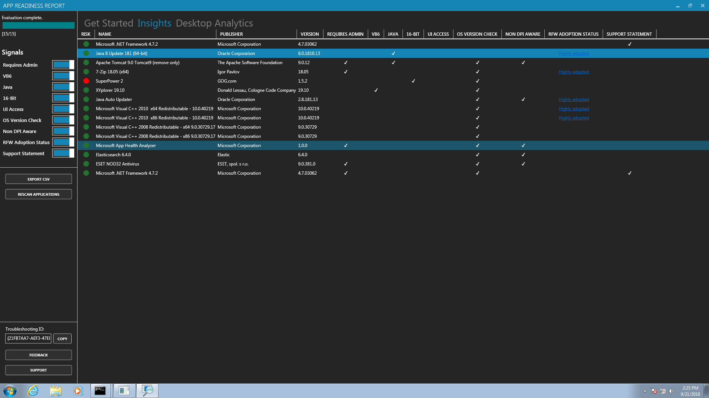
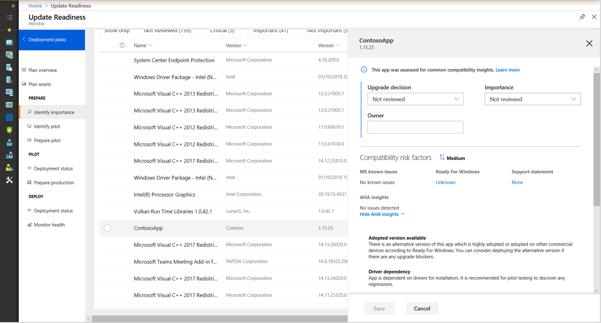

# How to assess compatibility with App Health Analyzer

> [!Note]  
> This information relates to a preview service which may be substantially modified before it's commercially released. Microsoft makes no warranties, express or implied, with respect to the information provided here.  

Use the App Health Analyzer toolkit for Desktop Analytics to evaluate desktop apps for compatibility issues. It helps to focus your validation efforts for desktop apps including line-of-business apps. The tool provides a risk rating along with possible remediation actions. It also includes an app readiness report to help you assess app readiness for your Windows 10 upgrades. 

## Download

Download the toolkit from the [Microsoft Download Center](https://www.microsoft.com/download/details.aspx?id=57276). Always use the most current version.

The download is a Windows Installer (MSI) file. Install the App Health Analyzer toolkit on a user's computer. When you run the toolkit, a wizard guides you through the process of creating an app readiness report. 

The toolkit includes sample scripts. If you need to automate the collection of readiness information from devices throughout your organization, use Configuration Manager to deploy these scripts. For more information, see [Automation](#automation). 

## How it works

The tool does a static analysis of applications that are already installed on a device. It doesn't do package analysis of an app installer. A user doesn't need to run the app. The tool assesses all installed applications registered with Windows on the device. 

App Health Analyzer doesn't require you to maintain installers for legacy apps that you don't actively manage. It identifies compatibility issues with the app in its installed state. All apps are assessed for predefined compatibility rules. These signals are common prevalent issues reported to Microsoft when customers upgrade to Windows 10. The compatibility insights also include possible remediation actions or fixes. If you have apps with issues, start with the suggested actions.

> [!Important]  
> The toolkit doesn't support features to repair or fix your apps. If you create an app readiness report, it provides insights and guidance to help you remediate your apps before upgrading to Windows 10.  

## Prerequisites

Before installing and using the toolkit, make sure the device meets the following requirements:  

- Windows 7 Service Pack 1 or later  

- You have administrator privileges on the device  

- Microsoft .NET Framework 4.5.1 or later  

- Enrolled in the Desktop Analytics service, which includes the following requirements:  

    - Latest compatibility update. For more information, see [Compatibility updates](/sccm/desktop-analytics/set-up#compatibility-updates).  

    - Diagnostic data level. For more information, see [Diagnostic data levels](/sccm/desktop-analytics/enable-data-sharing#diagnostic-data-levels).  

## Analyze 

1. Install the App Health Analyzer to the target device. By default, it installs to the following path: `C:\Program Files\Microsoft Corporation\Microsoft App Health Analyzer`  

2. Go to the Windows **Start** menu, expand the **Microsoft App Health Analyzer** group, and open the **App Health Analyzer** as an administrator.  

    > [!Note]  
    > If any of the required diagnostic data settings aren't configured, you'll see an error. Make sure you properly configure the prerequisite settings. For more information, see [Diagnostic data levels](/sccm/desktop-analytics/enable-data-sharing#diagnostic-data-levels).  

3. When the toolkit starts, a wizard guides you through all the apps assessed.  

<!--Need a new screenshot that follows guidelines-->

You can minimize the window and continue with other tasks while the toolkit runs in the background.

### App readiness report features

#### Get started
This tab gives you an overview of the supported signals in this current version. It also includes possible remediation actions. 

#### Insights
This tab provides a view of all the apps the tool assessed. It shows the risk assessment and the various signals used for identifying compatibility issues. 

- **Signals** menu: Filter these apps by signals using the menu on the left  

- **Export CSV**: Export these insights as a comma-separated values (CSV) file   

- **Rescan applications**: If you install any new applications, use this option to rerun the tool  

- **Troubleshooting ID**: If the device has installed apps but you see no insights in the report, give this ID to support  

#### Desktop Analytics
This tab provides an overview of how you can use App Health Analyzer to provide readiness insights for apps across your organization.

## Automation

To get these app insights on many devices, deploy the App Health Analyzer command-line version with Configuration Manager. Deploy it to a small set of representative devices within your organization. For example, use your Desktop Analytics *pilot* collection. The same [prerequisites](#prerequisites) apply for these devices.

Before doing a broader deployment, first verify a successful run. Make sure the data is showing up in Desktop Analytics. 

The App Health Analyzer toolkit includes a sample script, run_silent.cmd. By default, this script is in the following path: `C:\Program Files\Microsoft Corporation\Microsoft App Health Analyzer`. Use this script to automate the process with Configuration Manager.

### Tips

- Before upgrading to the target OS, deploy the App Health Analyzer to all devices in your pilot. To get effective readiness insights, run it at least once on the pilot group for a deployment plan.  

- Desktop Analytics has built-in functionality to recommend pilot groups for your deployment plans. Run the toolkit on all pilot devices to get full coverage on your important apps.  

- Schedule the tool to run when a user isn't signed in, or when not using the device.  

- Configure a recurring schedule. For example, run it every 30 days. This schedule gets the latest readiness insights from your devices to help them stay current.  

## Desktop Analytics integration

The following screenshot from Desktop Analytics shows the details of the ContosoApp version 1.15.25. 
- It has a **Medium** risk assessment  
- An adopted version is available  
- It has a driver dependency  

<!--need a current screenshot, red highlight the entire compatibility risk factors section?-->

## Troubleshooting

This section covers the troubleshooting steps and most common operational issues you might see with App Health Analyzer. For example:

- You don't see welcome screen in App Health Analyzer  

- There are apps installed on the device, but you don't see any insights in the app readiness report  

- Nothing happens when you run the tool  

#### Diagnostic data settings
Double-check the configurations for Windows diagnostic data settings. Configuration Manager should set these values when the device onboards to Desktop Analytics. You can use other methods such as script or group policy as a workaround. For more information, see [Diagnostic data levels](/sccm/desktop-analytics/enable-data-sharing#diagnostic-data-levels).  

#### Verbose mode
Run the tool in verbose mode with the run_verbose.cmd script. By default, the script is in the following path: `C:\Program Files\Microsoft Corporation\Microsoft App Health Analyzer\run_verbose.cmd`

Verbose mode generates additional logs, which can help you troubleshoot the potential issues. It saves the logs to the `LogCollection` folder in the installed location. For example, the default log collection path is: `C:\Program Files\Microsoft Corporation\Microsoft App Health Analyzer\LogCollection\`

Send the logs to AHASupport, who will follow up for further investigations. <!--do we really want to include this in public documentation?-->

