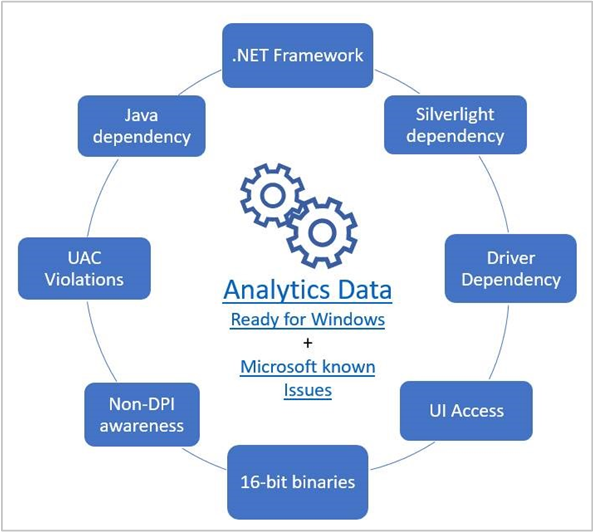
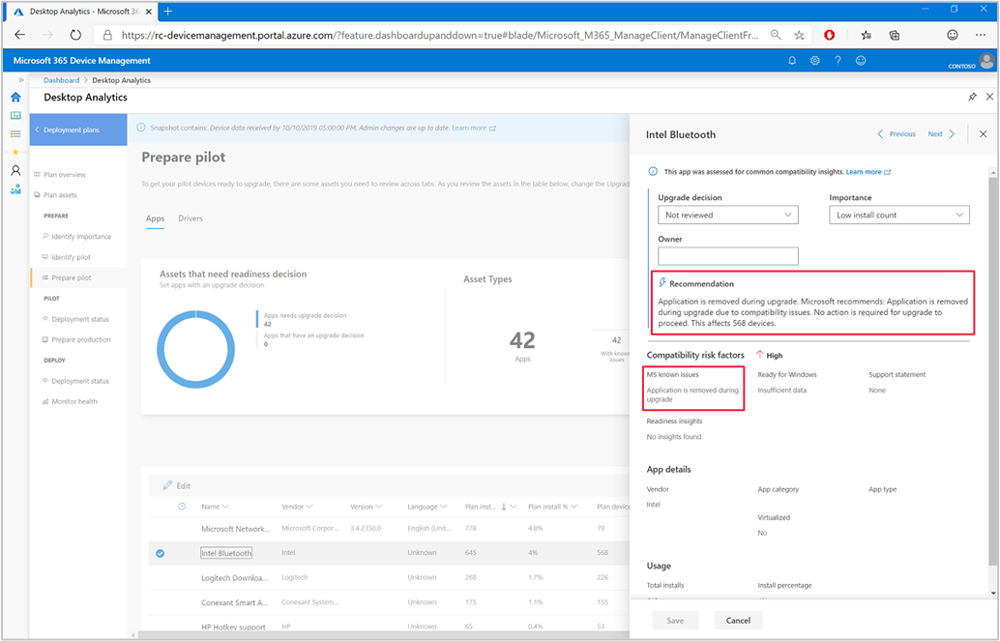

# Compatibility assessment in Desktop Analytics

Upgrade assessments in Windows Analytics were generic, for example: Attention Needed or Fix available. It doesn't provide any visual indicator on how to prioritize apps or drivers with issues or upgrade insights. Desktop Analytics replaces this feature with **Compatibility Risk**. Desktop Analytics shows the assessment for apps only in the deployment view for a pre-upgrade scenario. It categorizes the apps based on insights Microsoft gets from the machines included in a current deployment plan.

Desktop Analytics uses the following compatibility assessment categories:

- **Low**: The service found no signals to put this app at risk for a Windows upgrade. It's likely to work on the target OS as-is.  

- **Medium**: Analytics indicates that the application may have impaired functionality, although remediation is likely possible.  

- **High**: The application is almost certain to fail during or after upgrade. It may need a remediation.  

- **Unknown**: The app wasn't assessed. There are no other insights such as *MS Known Issues* or *Ready for Windows*.  

In the list of app or driver assets in a deployment plan, you'll see this value for each asset in the **Compatibility Risk** column.

## App risk assessment

There are several sources that Desktop Analytics uses to generate the assessment rating for applications:

- [Microsoft known issues](#microsoft-known-issues)
- [Ready for Windows catalog](#ready-for-windows)
- [Advanced insights](#advanced-insights)

You can find the assessment for each source on the app in Desktop Analytics. In the list of app assets in a deployment plan, select an individual app to open its properties flyout pane. You'll see an overall recommendation and assessment level. The **Compatibility risk factors** section shows the detail for these assessments.

## Microsoft known issues

Desktop Analytics looks at the Microsoft app compatibility database for any known issues. It uses this database to determine any existing compatibility blocks for publicly available applications from Microsoft or other publishers. This check only applies to the target OS for the deployment plan you select.

You'll see the following issues on the app properties pane as **MS known issues**:

### Application is removed during upgrade

Windows detected compatibility issues. The application won't migrate to the new OS version. No action is required for the upgrade to continue.

<!-- 3594545 -->
Windows can partially or fully remove these apps:

- Full removal: Windows setup completely removes the app from the device during upgrade.
- Partial removal: Windows setup partially removes the app from the device. You need to manually uninstall the app after you upgrade Windows.

In both the cases, the user can't use the app after you upgrade Windows.

To see this recommendation in the Desktop Analytics portal:

1. In a deployment plan, select **Prepare pilot**.
1. Select an asset from the list.
1. View the compatibility risk factors and recommendations in the side pane.

### Blocking upgrade

Windows detected blocking issues, and can't remove the application during upgrade. It may not work on the new OS version. Before upgrading, remove the application. Reinstall and test it on the new OS version.

### Blocking upgrade, but can be reinstalled after upgrading

The application is compatible with the new OS version, but won't migrate. Remove the application before upgrading Windows. Reinstall it on the new OS version.

### Blocking upgrade, update application to newest version

The existing version of the application isn't compatible with the new OS version and won't migrate. A compatible version of the application is available. Update the application before upgrading.

### Disk encryption blocking upgrade

The application's encryption features block the upgrade. Disable the encryption feature before you upgrade Windows and enable it after the upgrade.

### Does not work with new OS, but won't block upgrade

The application isn't compatible with the new OS version, but won't block the upgrade. No action is required for the upgrade to continue. Install a compatible version of the application on the new OS version.

### Does not work with new OS, and will block upgrade

The application isn't compatible with the new OS version and will block the upgrade. Remove the application before upgrading. A compatible version of the application may be available.

### Evaluate application on new OS

Windows will migrate the application, but it detected issues that may impact the app's performance on the new OS version. No action is required for the upgrade to continue. Test the application on the new OS version.

### May block upgrade, test application

Windows detected issues that may interfere with the upgrade, but need further investigation. Test the application's behavior during upgrade. If it blocks the upgrade, remove it before upgrading. Then reinstall it and test on the new OS version.

### Multiple

Multiple issues affect the application. Select **Query** to see details about the issues detected by Windows.

### Reinstall application after upgrading

The application is compatible with the new OS version, but you need to reinstall it after you upgrade Windows. The upgrade process removes the application. No action is required for the upgrade to continue. Reinstall the application on the new OS version.

## Ready for Windows

The [Ready for Windows](https://www.readyforwindows.com) application catalog correlates the following data sources:

- Diagnostic data from other customers who report the same apps
- Additional checks from Microsoft like compatibility blocks on a device

The possible categories are:

- **Highly adopted**: At least 100,000 commercial Windows 10 devices have installed this app.  

- **Adopted**: At least 10,000 commercial Windows 10 devices have installed this app.  

- **Insufficient data**: Too few commercial Windows 10 devices are sharing information for this app for Microsoft to categorize its adoption.

- **Contact developer**: There may be compatibility issues with this version of the app. Microsoft recommends contacting the software provider to learn more. For more information, see [Ready for Windows](https://www.readyforwindows.com/).  

- **Unknown**: There's no Ready for Windows information available for this version of this application. Information may be available for other versions of the application at [Ready for Windows](https://www.readyforwindows.com/).  

### Support statement

If the software provider supports one or more versions of this application on Windows 10, you'll see this statement on the app properties pane. In the Compatibility risk factors section, look at the **Support statement**.

## Advanced insights

Desktop Analytics can also detect issues using the following additional insights:

### Adopted version available

There's another version of this app that's highly adopted by other customers. This signal uses data from Ready for Windows. If there are any upgrade blockers with your current version, consider deploying the alternative version instead.

### Driver dependency

The app is dependent on a driver. Desktop Analytics recommends the app for pilot testing to discover any regressions. If you have any problems, contact the publisher to request a version that's compliant with Windows 10.

### Additional insights

<!-- 4021225 -->
When you update the Configuration Manager site and clients to version 1906, clients also report these additional insights:

> [!Important]  
> To take full advantage of new Configuration Manager features, after you update the site, also update clients to the latest version. This scenario isn't functional until the client version is also the latest.

#### 16-bit apps

Remove all 16-bit components from applications, and replace with 32-bit or 64-bit equivalents. For more information, see [The Windows Vista and Windows Server 2008 Developer Story: Application Compatibility Cookbook](https://docs.microsoft.com/previous-versions/aa480152\(v=msdn.10\)).

The other option is to enable NT Virtual DOS Machine (NTVDM) for support on Windows 10.

#### Requires admin privileges

The app requires the user to have administrative access to the device. Use an app manifest for these apps that require administrator permissions. For more information, see [Create and embed an application manifest](https://docs.microsoft.com/previous-versions/bb756929\(v=msdn.10\)).

Desktop Analytics recommends the app for pilot testing to discover any regressions.

#### Java dependency

Many Java applications rely on a separately installed Java Runtime Environment (JRE). While older JRE versions may continue to work on Windows 10, Oracle only supports the latest JRE versions. Using an older unsupported JRE may have security vulnerabilities. Check that your application runs on the latest JRE versions.

#### Not-DPI aware

The app may have display issues with advanced screen resolutions on Windows 10. Use an app manifest to avoid any issues with high DPI resolutions. For more information, see [Application manifests](https://docs.microsoft.com/windows/desktop/SbsCs/application-manifests).

Desktop Analytics recommends the app for pilot testing to discover any regressions.

#### Silverlight framework

Microsoft recommends that non-browser-based apps don't use Silverlight. The support end date for Silverlight 5 is October 2021.

Most current web browsers don't support Silverlight.

| Browser | Support |
|---------|---------|
| Google Chrome | End of support: September 2015 |
| Firefox | End of support: March 2017 |
| Microsoft Edge | No plugin available |

Desktop Analytics recommends the app for pilot testing to discover any regressions.

#### .NET Framework 1.0/1.1

The .NET Framework version 1.0 isn't supported on Windows 10. Version 1.1 isn't compatible on Windows 10. If the app is from a third-party publisher, contact the vendor to request a version that's compliant with Windows 10. Otherwise, redevelop the application to use a supported version of .NET.

#### .NET Framework 2.0/3.0

.NET 2.0 and 3.5 frameworks are supported on Windows 10. You may need to enable the Windows feature. For more information, see [Install the .NET Framework 3.5 on Windows 10](https://docs.microsoft.com/dotnet/framework/install/dotnet-35-windows-10).

#### UI access

Applications with UI access can bypass user interface control levels to drive input to higher privilege windows on the desktop. Only use this setting for user interface assistive technology applications.

If you're not using accessibility features in your app, set the UI access flag in the app manifest to false. For more information, see [Create and embed an application manifest](https://docs.microsoft.com/previous-versions/bb756929\(v=msdn.10\)).

Desktop Analytics recommends the app for pilot testing to discover any regressions.

## Driver risk assessment

Desktop Analytics also lists and groups by availability any drivers that won't migrate to the OS version.

You can find the assessment on the driver in Desktop Analytics. In the list of driver assets in a deployment plan, select an individual driver to open its properties flyout pane. You'll see an overall recommendation and assessment level. The **Compatibility risk factors** section shows the detail for these assessments.

| Driver availability | Action required? | What it means | Guidance |
|---------------------|------------------|---------------|----------|
| Available in-box | No, for awareness only | The currently installed version of an application or driver won't migrate to the new OS version. A compatible version is installed with the new OS version. | No action is required for the upgrade to continue. |
| Import from Windows Update | Yes | The currently installed version of a driver won't migrate to the new OS version. A compatible version is available from Windows Update. | If the computer automatically receives updates from Windows Update, no action is required. Otherwise, import a new driver from Windows Update after you upgrade Windows. |
| Available in-box and from Windows Update | Yes | The currently installed version of a driver won't migrate to the new OS version. Although a new driver is installed during upgrade, a newer version is available from Windows Update. | If the computer automatically receives updates from Windows Update, no action is required. Otherwise, import a new driver from Windows Update after you upgrade Windows. |
| Check with vendor | Yes | The driver won't migrate to the new OS version and Desktop Analytics can't locate a compatible version. | For a solution, check with the independent hardware vendor (IHV) who manufactures the driver, or the original equipment manufacturer (OEM) who provided the device. |

## See also

The FastTrack Center Benefit for Windows 10 provides access to **Desktop App Assure**. This benefit is a new service designed to address issues with Windows 10 and Office 365 ProPlus app compatibility. For more information, see [Desktop App Assure](https://docs.microsoft.com/fasttrack/win-10-desktop-app-assure).
