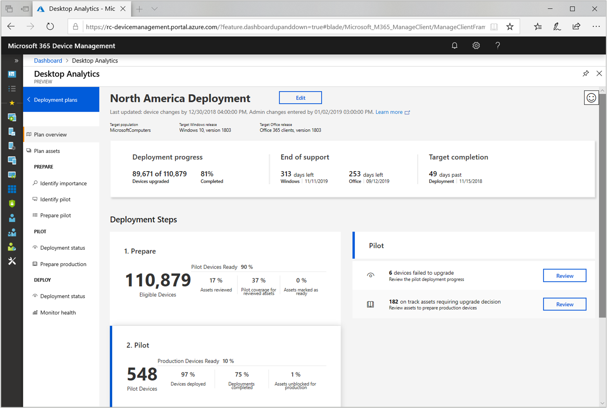

# How to deploy to pilot with Desktop Analytics

One of the benefits of Desktop Analytics is to help identify the smallest set of devices that provide the widest coverage of factors. It focuses on the factors that are most important to a pilot of Windows upgrades and updates. Making sure the pilot is more successful allows you to move more quickly and confidently to broad deployments in production.  

[!INCLUDE [Definition of pilot and production](includes/define-pilot-prod.md)]

## Identify devices

The first step is to identify devices to include in the pilot. Desktop Analytics recommends devices based on the reported data, and you can include or replace devices in this list.

1. Go to the [Desktop Analytics portal](https://aka.ms/desktopanalytics), and in the Manage group select **Deployment plans**.

1. Select a deployment plan.

1. In the Prepare group of the deployment plan menu, select **Identify pilot**.

You'll see the data from Desktop Analytics that shows the number of devices it recommends including for the best coverage. This algorithm is primarily based on the use of important and critical apps, and the breadth of hardware configurations.

Take the following actions for the additional recommended devices list:

- **Add all to pilot**: Adds all of the recommended devices to the pilot group
- **Add to pilot**: Only add individual devices
- **Replace** any specific devices from the pilot

As you add devices from the **recommended**  to the **included** pilot list, the coverage and redundancy for your critical and  important assets in the pilot increases. A higher redundancy means the assets covered have a statistically significant number of devices included in your pilot.

## Global Pilot

You can also make system-wide decisions about which Configuration Manager collections to include or exclude from pilots. In the main Desktop Analytics menu, in the Global Settings group, select **Global pilot**.

If you connect multiple Configuration Manager hierarchies to the same Desktop Analytics instance, a display name for the hierarchy prefixes the collection name in the global pilot configuration. This name is the **Display Name** property on the Desktop Analytics connection in the Configuration Manager console.<!-- 4814075 -->

- Don't include collections that contain more than 20% of your total enrolled devices to Desktop Analytics. If you include a large collection, the portal displays a warning. You can include multiple small collections without warning, but still be cautious about the number of devices in your pilot. <!-- 6079184 -->

- To get accurate pilot recommendations for deployment plans in a specific Configuration Manager hierarchy, only include collections from that hierarchy.

### Example

- You configure the Desktop Analytics connection in Configuration Manager to target the **All Systems** collection. This action enrolls all clients to the service.

- You also configure additional collections to sync with Desktop Analytics:

  - All Windows 10 clients (3,000 devices)

  - All IT devices (200 total devices, 150 of which run Windows 10)

  - CEO office (20 devices)

- In the **Global pilot** settings, you include the **All Windows 10 clients** collections. You exclude the **CEO office** collection.

- You create a deployment plan, and select **All IT devices** collection as your **Target group**. You intend this deployment plan only for devices in the IT department.

- The **Pilot devices included** list contains the subset of devices that are in both your **Target group**: **All IT devices** and the Global Pilot *inclusion* list: **All Windows 10 clients**. 150 devices are in this list, because only 150 devices in the **All IT devices** collection run Windows 10.

- The **Additional Recommended Devices** lists contains a set of devices from your **Target group** that provide maximum coverage and redundancy for your important assets. Desktop Analytics excludes from this list any devices in your global pilot *exclusion* list: **CEO office**.

## Address issues

Use the Desktop Analytics portal to review any reported issues with assets that might block your deployment. Then approve, reject, or modify the suggested fix. All items must be marked **Ready** or **Ready (with remediation)** before the pilot deployment starts.

1. Go to the [Desktop Analytics portal](https://aka.ms/desktopanalytics), and in the Manage group select **Deployment plans**.  

2. Select a deployment plan.  

3. In the Prepare group of the deployment plan menu, select **Prepare pilot**.  

4. On the **Apps** tab, review the apps that need your input.  

5. For each app, select the app name. In the information pane, review the recommendation, and select the upgrade decision. If you choose **Not reviewed** or **Unable**, then Desktop Analytics doesn't include devices with this app in the pilot deployment. If you choose **Ready (with remediation)**, use the   **Remediation notes** to capture the actions to take to address an issue, like *reinstall* or *find the manufacturer's recommended version*.

6. Repeat this review for other assets.  

For more information to help with this review process, see [Compatibility assessment](/configmgr/desktop-analytics/compat-assessment).

## Create software

Before you can deploy Windows, first create the software objects in Configuration Manager. For more information, see [Windows 10 in-place upgrade task sequence](https://docs.microsoft.com/sccm/osd/deploy-use/create-a-task-sequence-to-upgrade-an-operating-system).

## Deploy to pilot devices

Configuration Manager uses the data from Desktop Analytics to create collections for the pilot and production deployments. To make sure devices are healthy after each deployment phase, use the following procedure to create a Desktop Analytics-integrated phased deployment:

1. In the Configuration Manager console, go to the **Software Library**, expand **Desktop Analytics Servicing**, and select the **Deployment Plans** node.  

2. Select your deployment plan, and then select **Deployment Plan Details** in the ribbon.  

3. Select **Create Phased Deployment** in the ribbon. This action launches the Create Phased Deployment wizard.

    > [!Tip]  
    > If you want to create a classic task sequence deployment for just the pilot collection, select **Deploy** in the **Pilot status** tile. This action launches the Deploy Software Wizard. For more information, see [Deploy a task sequence](/sccm/osd/deploy-use/deploy-a-task-sequence).  

4. Enter a name for the deployment, and select the task sequence to use. Use the option to **Automatically create a default two phase deployment**, and then configure the following collections:  

    - **First Collection**: Find and select the **Pilot** collection for this deployment plan. The standard naming convention for this collection is `<deployment plan name> (Pilot)`.

    - **Second Collection**: Find and select the **Production** collection for this deployment plan. The standard naming convention for this collection is `<deployment plan name> (Production)`.

    > [!Note]  
    > With the Desktop Analytics integration, Configuration Manager automatically creates pilot and production collections for the deployment plan. Before you can use them, it can take time for these collections to synchronize. For more information, see [Troubleshoot - Data latency](/sccm/desktop-analytics/troubleshooting#data-latency).<!-- 4984639 -->
    >
    > These collections are reserved for Desktop Analytics deployment plan devices. Manual changes to these collections aren't supported.<!-- 3866460, SCCMDocs-pr 3544 -->  

5. Complete the wizard to configure the phased deployment. For more information, see [Create phased deployments](/sccm/osd/deploy-use/create-phased-deployment-for-task-sequence).

    > [!Note]  
    > Use the default setting to **Automatically begin this phase after a deferral period (in days)**. The following criteria must be met for the second phase to start:
    >
    > 1. The first phase reaches the **deployment success percentage** criteria for success. You configure this setting on the phased deployment.
    > 1. You need to review and make upgrade decisions in Desktop Analytics to mark important and critical assets as *ready*. For more information, see [Review assets that need an upgrade decision](/sccm/desktop-analytics/deploy-prod#bkmk_review).
    > 1. Desktop Analytics syncs to the Configuration Manager collections any production devices that meet the *ready* criteria.

> [!Important]  
> These collections continue to sync as their membership changes. For example, if you identify an issue with an asset and mark it as **Unable**, devices with that asset no longer meet the *ready* criteria. These devices are dropped from the production deployment collection.

## Monitor

### Configuration Manager console

Open the deployment plan. The **Preparing upgrade decisions - overall status** tile provides a summary of the status for the deployment plan. This status is for both your pilot and production collections. Devices can fall in one of the following categories:

- **Up to date**: Devices have upgraded to the target Windows version for this deployment plan

- **Upgrade decision complete**: One of the following states:

  - Devices with noteworthy assets that are **Ready** or **Ready with remediation**

  - The device state is **Blocked**, [**Replace device**](/sccm/desktop-analytics/about-deployment-plans#plan-assets) or **Reinstall device**

- **Not reviewed**: Devices with noteworthy assets **Not reviewed** or **Review in progress**

The device status updates in the **Pilot status** and **Production status** tiles with the following actions:

- You make changes on the compatibility assessment
- Devices get upgraded to the target version of Windows
- Your deployment progresses

You can also use Configuration Manager deployment monitoring the same as any other task sequence deployment. For more information, see [Monitor OS deployments](/sccm/osd/deploy-use/monitor-operating-system-deployments).

### Desktop Analytics portal

Use the [Desktop Analytics portal](https://aka.ms/desktopanalytics) to view the status of any deployment plan. Select the deployment plan, and then select **Plan overview**.

Select the **Pilot** tile. It summarizes the current state of the pilot deployment. This tile also displays data for the number of devices not started, in progress, completed, or returning issues.

Any devices reporting errors or other issues are also listed in the Pilot detail area to the right. To get details of the reported issue, select **Review**. This action changes the view to the **Deployment status** page

The **Deployment status** page lists devices in the following categories:

- Not started
- In progress
- Completed
- Needs attention - devices
- Needs attention - issues

The **Needs attention** categories show the same information, but sorted differently.

Select a specific listing in either view to get more details about the detected issue.

As you address these deployment issues, the dashboard continues to show the progress of devices. It updates as devices move from **Needs attention** to **Completed**.

## Next steps

Let the pilot run for a while to collect operational data. Encourage users of pilot devices to test apps.

When your pilot deployment meets your success criteria, go to the next article to deploy to production.
> [!div class="nextstepaction"]  
> [Deploy to production](/sccm/desktop-analytics/deploy-prod)  
