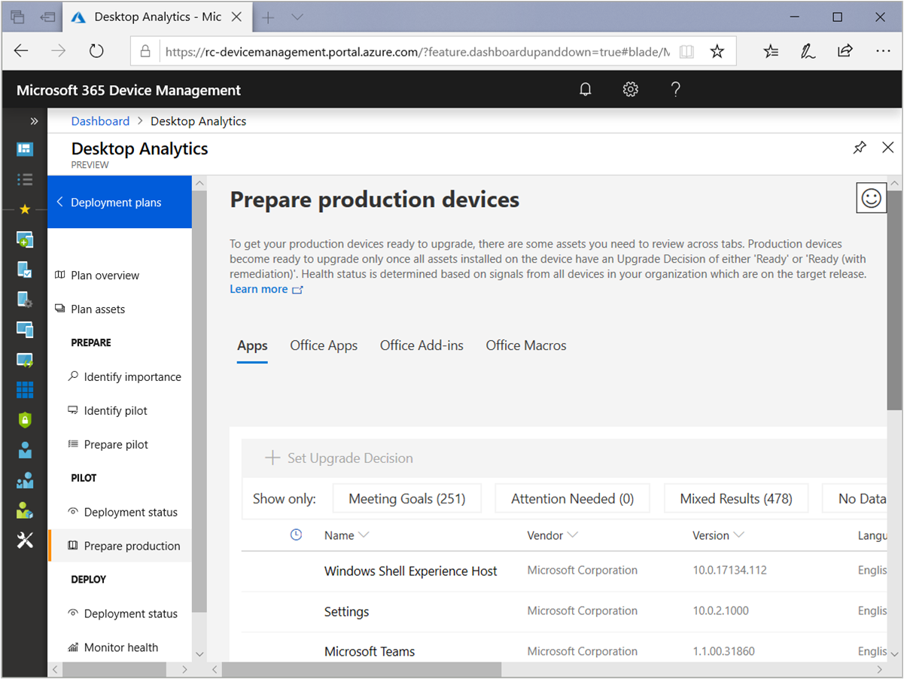
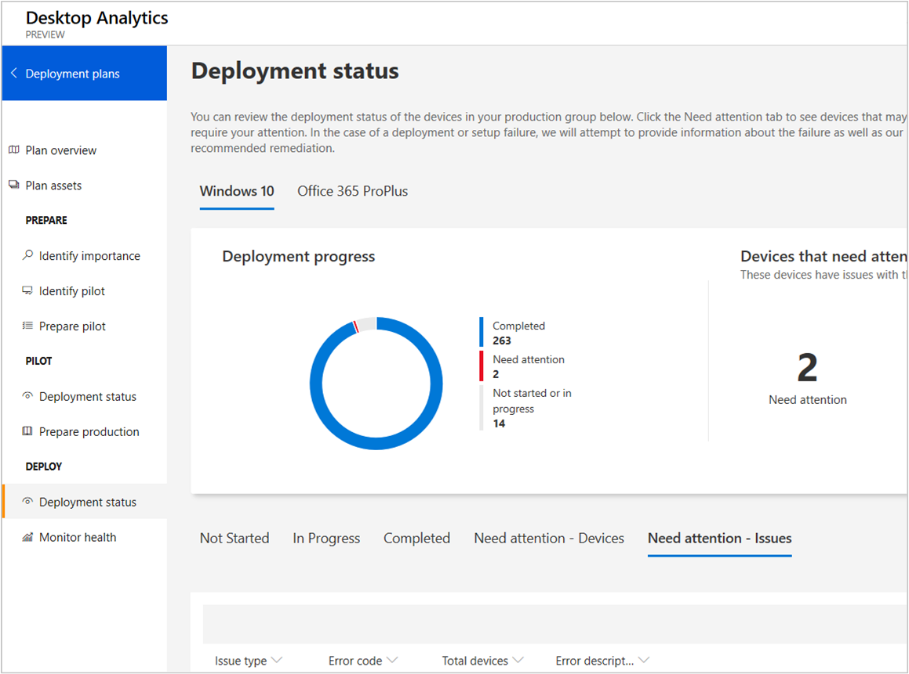

# How to deploy to production with Desktop Analytics

> [!Note]  
> This information relates to a preview service which may be substantially modified before it's commercially released. Microsoft makes no warranties, express or implied, with respect to the information provided here.  

After you've [deployed to pilot](/sccm/desktop-analytics/deploy-pilot) and have reviewed the status of your assets, you're ready to update the rest of your production environment. 

[!INCLUDE [Definition of pilot and production](includes/define-pilot-prod.md)]

There are three main parts to accomplishing the deployment of updates to production devices:

1. [Review assets that need an upgrade decision](#bkmk_review): To make devices ready for production deployment, their assets (apps, Office apps, Office add-ins, and Office macros) must have their upgrade decision set to **Ready** or **Ready, remediations required**.  

2. [Deploy to devices that are ready](#bkmk_deploy): Use Configuration Manager to update devices that are ready. Desktop Analytics provides the list of devices ready for production deployment, and reports for monitoring the success of the deployment.  

3. [Monitor the health of updated devices](#bkmk_monitor): As the update deployment progresses, monitor the health of important assets. If some need attention, troubleshoot and fix those issues. If you decide the issues can't be fixed, stop the deployment to the affected devices by setting their upgrade decision to **Unable**.  

> [!NOTE]  
> When you're confident in the success of the pilot deployment, start the production deployment at any time. There's no requirement that all pilot devices reach the "completed" state first.  

##  Review assets that need an upgrade decision

Desktop Analytics guides you through the process of reviewing your assets for production deployment. In the Azure portal, go to **Deployment plans**, select a deployment plan, and then select **Prepare production** in the left menu.

Review the state of apps, Office apps, Office add-ins, and Office macros. Use that information to set the upgrade decision for each of those assets.

Use each of the tabs to review the status of apps, Office apps, Office add-ins, and Office macros. In each tabbed view, you can filter the results to show devices that are on track for upgrade, need your attention, devices with mixed results, and those devices in an undetermined state.

The **Office Macros** view shows advisories related to macro-enabled files. It doesn't show the actual macro-enabled files. Select a specific advisory to see additional details. <!-- You can also export this list for later use, such as to run the Readiness Toolkit on this subgroup for still more detail about reported issues like the names of the files for which the advisories were raised. -->

Select **Meeting Goals** to filter the view to assets that are likely ready for production deployment based on the following criteria:

- Risk: a pre-upgrade assessment of known risks for updating devices that have this asset installed  

- Health status: a post-upgrade assessment of devices in other deployments and whether they experienced problems after the update was installed. For more information about health, see [Monitor the health of updated devices](#montor-the-health-of-updated-devices).  

To approve an asset for upgrade, select the name in the list, and then select one of the following options from the **Upgrade decision** list:
- Review in progress
- Ready
- Ready (with remediation)
- Unable
- Not reviewed

To set this value for multiple apps at once, use the first column to **Select this item**, and then choose **Set Upgrade Decision**. 

Select **No data** to view assets that couldn't be classified. These assets generally are assets that don't have enough coverage for Desktop Analytics to perform an analysis of the risk or health status. To improve the coverage, add additional devices with these assets to the pilot, or ask pilot users to try these assets.

There might also be assets in the **Attention Needed** or **Mixed Results** state. These assets may require additional review before you make an upgrade decision for them. 

Review all apps, Office apps, and Office add-ins. Once a given device has a positive upgrade decision for all assets, then its state changes to "ready for production." See the current count on the main page for the deployment plan by selecting the third deployment step, **Deploy**.

##  Deploy to devices that are ready

Configuration Manager uses the data from Desktop Analytics to create a collection for the production deployment. Don't deploy the application or task sequence using a traditional deployment. Use the following procedure to create a Desktop Analytics-integrated deployment:

1. In the Configuration Manager console, go to the **Software Library**, expand **Desktop Analytics Servicing**, and select the **Deployment Plans** node.  

2. Select your deployment plan, and then select **Deployment Plan Details** in the ribbon.  

3. In the **Production status** tile, choose one of the following object types from the drop-down list:  

    - **Application** for Office 365 ProPlus  

    - **Task sequence** for Windows 10  
  
   Select **Deploy**. This action launches the Deploy Software Wizard for the selected object type. 

For more information, see the following articles:  

- [Deploy an application](/sccm/apps/deploy-use/deploy-applications#bkmk_deploy)  

- [Deploy a task sequence](/sccm/osd/deploy-use/manage-task-sequences-to-automate-tasks#BKMK_DeployTS)  

If your deployment plan is for both Windows 10 and Office 365, repeat this process to create a second deployment. For example, if the first deployment is for the task sequence, create a second deployment for the application.

### Address deployment alerts

As with the pilot deployment, Desktop Analytics advises you of any issues that need your attention during the production deployment. In Desktop Analytics, go to the deployment plan, and select **Deployment status** in the left menu. The deployment status view lists devices in the following categories:  

- Not started
- In progress
- Completed
- Needs attention - Devices (sorted by device name)
- Needs attention - Issues (sorted by issue type)

##  Monitor the health of updated devices

The **Prepare production** page focuses on helping you make upgrade decisions for your assets. That page by default shows only those assets that aren't yet in the **Ready** state. The **Monitor health** page shows health issues on any noteworthy asset, even those assets that are marked **Ready**. If it discovers issues, you can troubleshoot and fix the problem, or change the upgrade decision to **Unable**. When you change the upgrade decision, this action prevents future upgrades on devices with that asset.

Filter this page by assets with the following health states:

| Health status filter | Description |
|----------------------|-------------|
| **Attention needed** | (Default filter) Desktop Analytics detects a statistically significant regression to some health metric for that asset
| **Meeting goals** | Desktop Analytics detects no regression in behavior |
| **Insufficient data** | Desktop Analytics doesn't have enough data about this asset to make any recommendations |
| **No data** | No usage data yet available for this asset | 

To show an unfiltered view of all assets, select the current filter. This action removes that filter.

> [!NOTE]  
> To reduce the number of assets with insufficient data, Desktop Analytics monitors the assets on all of your devices that have upgraded to the target Windows or Office version specified in your deployment plan. These devices include those not included in the specific deployment plan.  

The default sort order is by the number of devices that have had an incident with that particular asset, so you can quickly see which ones are causing the most problems. For example, when viewing **Apps**, it sorts by **Devices with app crashes last two weeks**.

If you want to look at health for all assets, even those assets with insufficient data for Desktop Analytics to make statistical inferences, use the following process:

1. Select the drop-down on the **Devices with incidents in last two weeks** column. Add a filter to only those assets that have had incidents on some minimum number of devices to be interesting. For example, show items with values **greater than** 100.  

2. Select the drop-down on the **% Devices with incidents in the last two weeks** column, and select to sort by **Descending**.  

    The resulting view shows the assets with the highest rate of incident at a minimum number of incidents.  

3. Select an asset to get more details or change its upgrade decision.  

For more information, see [Health status monitoring](/sccm/desktop-analytics/health-status-monitoring).
