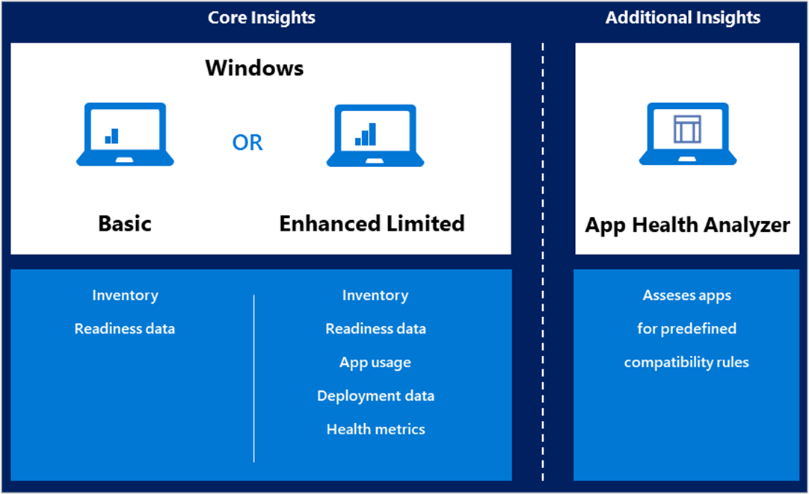

# How to enable data sharing for Desktop Analytics 

> [!Note]  
> This information relates to a preview service which may be substantially modified before it's commercially released. Microsoft makes no warranties, express or implied, with respect to the information provided here.  

To enroll devices to Desktop Analytics, they need to send diagnostic data to Microsoft. If your environment uses a proxy server, use this information to help configure the proxy. 

## Diagnostic data levels

When you integrate Configuration Manager with Desktop Analytics, you also use it to manage the diagnostic data level on devices. For the best experience, use Configuration Manager. 

You can also set the diagnostic data level on devices with the Desktop Analytics deployment script, by group policy, or Microsoft Intune. For more information, see [Methods to enroll devices](/sccm/desktop-analytics/set-up#methods-to-enroll-devices). 

The basic functionality of Desktop Analytics works at the **Basic** diagnostic data level. You won't get usage or health data for your updated devices without enabling the **Enhanced (Limited)** level. Microsoft recommends that you enable the **Enhanced (Limited)** diagnostic data level. 

On devices running Windows 10, version 1709 (or later), the Enhanced diagnostic data setting includes the **Enhanced (Limited)** data level. For more information, see [Windows 10 enhanced diagnostic data events and fields used by Windows Analytics](https://docs.microsoft.com/windows/privacy/enhanced-diagnostic-data-windows-analytics-events-and-fields)). 

For more information, see [Desktop Analytics privacy](/sccm/desktop-analytics/privacy).

The following articles are also good resources for better understanding Windows diagnostic data levels: 

- [Windows 10 and the GDPR for IT Decision Makers](https://docs.microsoft.com/windows/privacy/gdpr-it-guidance)  

- [Configure Windows diagnostic data in your organization](https://docs.microsoft.com/windows/privacy/configure-windows-diagnostic-data-in-your-organization)  

## Endpoints

To enable data sharing, configure your proxy server to whitelist the following endpoints:

| Endpoint  | Function  |
|-----------|-----------|
| `https://v10c.events.data.microsoft.com` | Connected user experience and diagnostic component endpoint. Used by devices running Windows 10, version 1703 or later, with the 2018-09 cumulative update or later installed. This update is one of the following IDs: KB4458469, KB4457136, KB4457141. |
| `https://v10.events.data.microsoft.com` | Connected user experience and diagnostic component endpoint. Used by devices running Windows 10, version 1803, or later, _without_ the 2018-09 cumulative update installed. |
| `https://v10.vortex-win.data.microsoft.com` | Connected user experience and diagnostic component endpoint. Used by devices running Windows 10, version 1709 or earlier. |
| `https://vortex-win.data.microsoft.com` | Connected user experience and diagnostic component endpoint. Used by devices running Windows 7 and Windows 8.1 |
| `https://settings-win.data.microsoft.com` | Enables the compatibility update to send data to Microsoft. |
| `http://adl.windows.com` | Allows the compatibility update to receive the latest compatibility data from Microsoft. |
| `https://watson.telemetry.microsoft.com` | Windows Error Reporting (WER). Required to monitor deployment health in Windows 10, version 1803 or earlier. |
| `https://umwatsonc.events.data.microsoft.com` | Windows Error Reporting (WER). Required for device health reports in Windows 10, version 1809 or later. |
| `https://ceuswatcab01.blob.core.windows.net`  `https://ceuswatcab02.blob.core.windows.net`  `https://eaus2watcab01.blob.core.windows.net`  `https://eaus2watcab02.blob.core.windows.net`  `https://weus2watcab01.blob.core.windows.net`  `https://weus2watcab02.blob.core.windows.net` | Windows Error Reporting (WER). Required to monitor deployment health in Windows 10, version 1809 or later. |
| `https://www.msftncsi.com` | Windows Error Reporting (WER). Required for device health to check connectivity. |
| `https://www.msftconnecttest.com` | Windows Error Reporting (WER). Required for device health to check connectivity. | 
| `https://kmwatsonc.events.data.microsoft.com` | Online Crash Analysis. Required for device health reports in Windows 10, version 1809 or later. |
| `https://oca.telemetry.microsoft.com`  | Online Crash Analysis (OCA). Required to monitor deployment health in Windows 10, version 1803 or earlier. |
| `https://login.live.com` | Required for better integrity of device health data. It provides a more reliable device identity for Desktop Analytics.    To disable end-user Microsoft account access, use policy settings instead of blocking this endpoint. For more information, see [The Microsoft account in the enterprise](https://docs.microsoft.com/windows/security/identity-protection/access-control/microsoft-accounts#block-all-consumer-microsoft-account-user-authentication). |
| `https://nexusrules.officeapps.live.com` | Used to request dynamic diagnostic data events from Office clients. This data is useful for drill-down and diagnostics purposes in the Desktop Analytics portal |
| `https://nexus.officeapps.live.com` | Used by Office clients to send diagnostic data events from Office 14, Office 15, and versions of Office 16 earlier than 16.0.8702. It's used to collect usage and reliability signals events for Desktop Analytics. |
| `https://office.pipe.aria.microsoft.com` | Used by Office clients to send diagnostic data events from universal/modern Office apps, and Win32 Office 16 versions later than 16.0.8702. It's used to collect usage and reliability signals events for Desktop Analytics. |

### SSL inspection

For privacy and data integrity, Windows checks for a Microsoft SSL certificate when communicating with the diagnostic data endpoints. SSL interception and inspection aren't possible. To use Desktop Analytics, exclude the above endpoints from SSL inspection.

## Proxy server authentication

Make sure that a proxy doesn't block the diagnostic data because of authentication. If your organization uses proxy server authentication for outbound traffic, use one or more of the following approaches:

- **Bypass** (recommended): Configure your proxy servers to not require proxy authentication for traffic to the diagnostic data endpoints. This option is the most comprehensive solution. It works for all versions of Windows 10.  

- **User proxy authentication**: Configure devices to use the signed-in user's context for proxy authentication. This method requires the devices to run Windows 10, version 1703 or later. Make sure that the users have proxy permission to reach the diagnostic data endpoints. This option requires that the devices have console users with proxy permissions, so you can't use this method with headless devices.  

- **Device proxy authentication**: 
    - Configure a system-level proxy server on the devices.  
    - Configure these devices to use device-based outbound proxy authentication.  
    - Configure proxy servers to allow the machine accounts to access the diagnostic data endpoints.  

## Next steps

Advance to the next article to connect Configuration Manager with Desktop Analytics.
> [!div class="nextstepaction"]  
> [Connect Configuration Manager](/sccm/desktop-analytics/connect-configmgr)  
