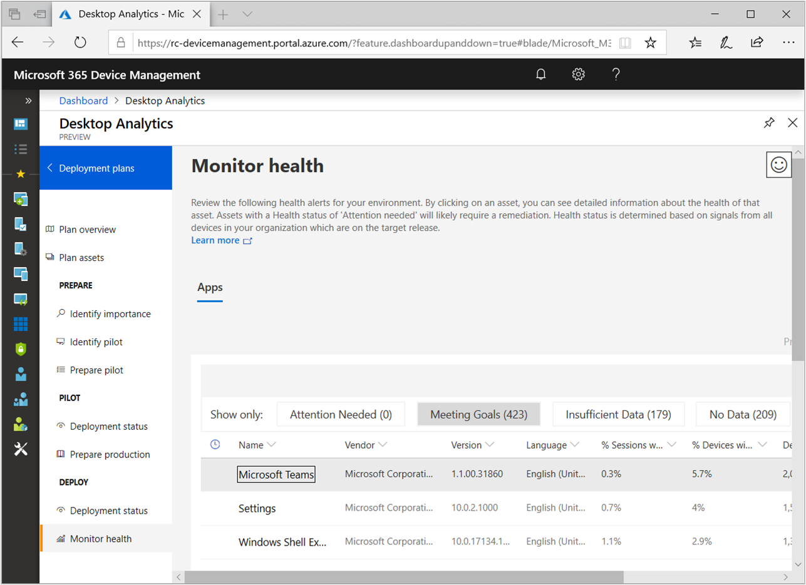
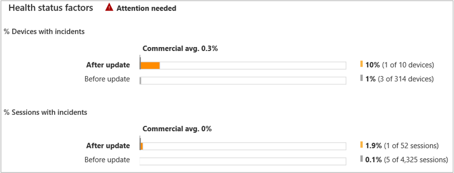

# Health status monitoring in Desktop Analytics

As you [deploy an update to production](/sccm/desktop-analytics/deploy-prod), use Desktop Analytics to help monitor the health state of your devices. This article explains in detail how health monitoring works.

For more information on how to use this feature, see [Monitor the health of updated devices](/sccm/desktop-analytics/deploy-prod#bkmk_monitor).

> [!NOTE]  
> Desktop Analytics only collects health data from devices that provide usage data it can use as a denominator. This means it doesn't include devices running Windows 7 and Windows 10 that aren't set to share diagnostic data at the Enhanced level. If more than 10% of devices running Windows 10 are set to share diagnostic data at levels other than Enhanced, the **Monitor health** page displays a warning in the banner area.  

To view more information about a specific app, add-in, or macro advisory, select it in the list. 

## Apps and Office apps

Desktop Analytics monitors the following health status factors for apps and Office apps:

- **% Devices with crashes**: For the last two weeks, the number of devices on which this particular app has crashed divided by the number of devices on which the app has been used. This view lets you see whether the app stability has increased or decreased on the new OS version. Desktop Analytics calculates this percentage for the following sets:  

    - **After update**: Devices that have updated to the target OS version specified in the deployment plan. To reduce the number of assets with insufficient data, Desktop Analytics collects this data for all of your updated devices. This set includes those devices not in the deployment plan.  

    - **Before update**: Devices that are on an OS version earlier than what's specified in the deployment plan. This list doesn't include devices running Windows 7.   

    - **Commercial avg**: The average (avg) crash rate across all commercial devices. This average is calculated across *all* versions of the app. If your version shows a crash rate above the commercial average, there may be a more stable version available.  

- **% Sessions with crashes**: Similar to the preceding, but counts the percentage of sessions with crashes in the last two weeks.  

To determine the health status of an app, Desktop Analytics requires data from at least 20 devices. Otherwise it reports **Insufficient data** for the app. The service calculates the health status based on the *session crash rate* from these devices. The device crash rate is provided for information only. It isn't used in the health status calculation.

At the bottom of the app details page, the following three tabs can help you troubleshoot:

- **Other versions**: A list of alternative versions of this app. For each version, it shows the relative changes to the crash rates within your organization and the commercial average. If you find a later version of the app with a lower crash rate, updating the app may help.  

    It also shows if the version has a **Ready for Windows** signal. For more information, see [Compatibility risk for Windows apps](/sccm/desktop-analytics/compat-risk#risk-assessment-engine).  

- **Top issues**: A list of the most frequent failure IDs by instance count. A failure ID identifies the stack trace associated with the crash. You can use this ID when you call the app vendor for support.  

- **Recent crashes**:  A list of devices on which the app recently crashed. You can filter by failure ID and other criteria. Use this information to troubleshoot the issue by gathering logs or trying fixes on specific devices before trying a broader deployment.  

If you find a serious health regression that you're unable to fix, change the app's **Upgrade decision** to **Unable**. This action prevents future deployment of the update to devices with this asset.

## Office add-ins

Desktop Analytics monitors the following health status factors for Office add-ins:

- **% Devices with incidents**: An incident is something that prevents an add-in from working properly. For example, it fails to load or becomes unresponsive. This section shows for the past two weeks the number of devices on which the selected add-in had an incident divided by the number of devices on which the add-in is installed. Desktop Analytics calculates this percentage for the following sets:  

    - **After update**: Devices that have updated to the target Office version specified in the deployment plan. To reduce the number of assets with insufficient data, Desktop Analytics collects this data for all of your updated devices. This set includes those devices not in the deployment plan.  

    - **Before update**: Devices running any version of Office older than the version that the deployment plan targets. <!-- This does not include {include min version of Office}  --> To assess the health of the add-in, compare this metric to the **After update** percentage.  

    - **Commercial avg**: The average (avg) incident rate across all commercial devices that use the same version of the add-in on the same version of Office. Use this rate to compare against devices in your organization. If this add-in version is having a higher incident rate than the commercial average, you may have some environmental factor contributing to the incidents.  

- **% Sessions with incidents**: Similar to the preceding, but counts the percentage of sessions with crashes in the last two weeks.  

To determine the health status of add-ins, Desktop Analytics requires at least three devices for the device incident rate and at least 10 sessions for the session incident rate. For both rates, it compares the before and after values to determine if there's a regression. No regression is considered towards meeting goals. 

Desktop Analytics calculates the overall health status of the Office add-in based on a combination of both device and session incident rates using the following matrix:

|  | Insufficient data for device crashes  | Healthy device crash metrics | Regression in device crash metrics |
|----------------|---------------------|-----------------------|------------------------|
| **Insufficient data for sessions with incidents**| Insufficient data| Meeting goals | Insufficient data |
| **Healthy metrics for sessions with incidents** | Meeting goals | Meeting goals | Meeting goals |
| **Regression in metrics for sessions with incidents** | Insufficient data | Meeting goals | Attention needed |

The Office add-in details page also includes the following detail to help you troubleshoot: 

- **Recent incidents**: A list of the devices on which an add-in incident recently occurred. Use this list to troubleshoot the issue by gathering logs or trying fixes on those specific devices before trying a broader rollout.  

## Office macros

Desktop Analytics reports health status on *macro advisories*. Macro advisories are potential issues detected in Office files containing macros. These issues are specific to an Office application. For example, Word, Excel, PowerPoint, or Visio. 

Desktop Analytics monitors the following health status factors for Office macros:

- **% Devices with compile error**: For the past two weeks, the number of devices on which errors related to the advisory occurred during macro enablement divided by the number of devices on which the advisory was detected. Desktop Analytics calculates this percentage for the following sets: 

    - **After update**: The devices on which the version of Office is the same as the deployment plan's target  

    - **Before update**: The devices running any version of Office older than the deployment plan's target  

    - **Commercial avg**: The average (avg) of all commercial devices running the same version of Office as the deployment plan's target  

- **% Devices with runtime error** Similar to the preceding, but for the past two weeks, the devices on which errors related to the advisory occurred during macro execution divided by the number of devices on which the advisory was detected.  

The Office macros details page also includes the following detail to help you troubleshoot: 

- **Recent incidents**: A list of devices on which macro runtime and compile errors recently occurred. Use this list to troubleshoot the issue by gathering logs or trying fixes on those specific devices before trying a broader rollout.

## See also

- [Compatibility risk for Windows apps in Desktop Analytics](/sccm/desktop-analytics/compat-risk)  

- [How to deploy to production with Desktop Analytics](/sccm/desktop-analytics/deploy-prod)  
