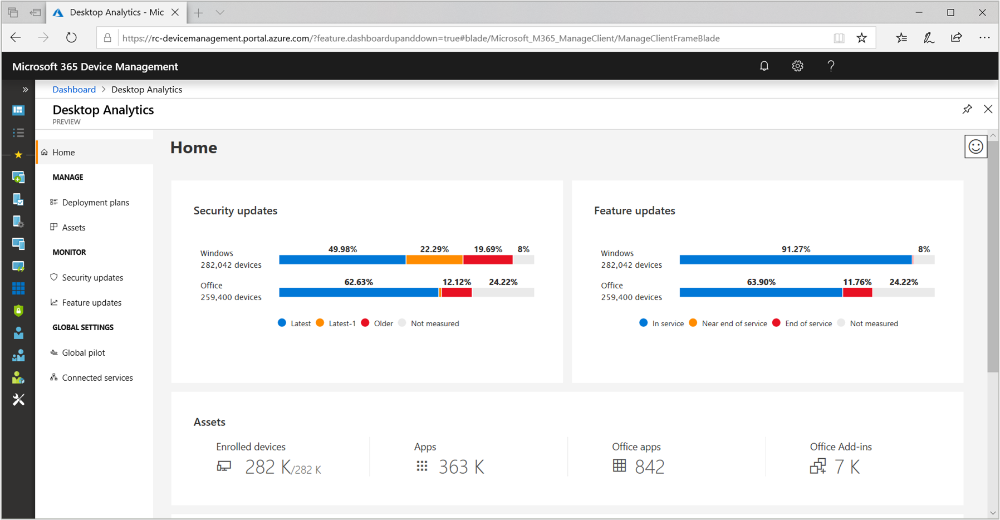

# What is Desktop Analytics?

> [!Note]  
> This information relates to a preview service which may be substantially modified before it's commercially released. Microsoft makes no warranties, express or implied, with respect to the information provided here.  

Desktop Analytics is a cloud-based service that integrates with Configuration Manager. The service provides insight and intelligence for you to make more informed decisions about the update readiness of your Windows and Office clients. It combines data from your organization with data aggregated from millions of devices connected to Microsoft cloud services. 

Use Desktop Analytics with Configuration Manager to:  

- Create an inventory of apps running in your organization  

- Assess app compatibility with the latest feature updates of Windows 10 and Office 365 ProPlus  

- Identify compatibility issues, and receive mitigation suggestions based on cloud-enabled data insights  

- Create pilot groups that represent the entire application and driver estate across a minimal set of devices  

- Deploy Windows 10 and Office 365 ProPlus to pilot and production-managed devices  

> [!Note]  
> Desktop Analytics is a successor of Windows Analytics. The *Windows Analytics* service includes Upgrade Readiness, Update Compliance, and Device Health. 
> 
> All of these capabilities are combined in the *Desktop Analytics* service. Desktop Analytics also is more tightly integrated with Configuration Manager, and includes both Windows and Office. 

## Benefits

Many customers have challenges with getting and staying current with Windows 10 and Office 365 ProPlus. The primary challenge is testing applications. This process is typically manual. It's time-consuming for IT administrators and application owners to continually analyze existing applications. Then remediate any issues that arise. 

Desktop Analytics provides the following benefits:

- **Device and software inventory**: Inventory of key factors such as apps, add-ins, macros, and versions of Office and Windows.  

- **Pilot identification**: Identification of the smallest set of devices that provide the widest coverage of factors. It focuses on the factors that are most important to a pilot of Windows and Office upgrades and updates. Making sure the pilot is more successful allows you to proceed more quickly and confidently to broad deployments in production.  

- **Issue identification**: Using aggregated market data along with data from your environment, the service predicts potential issues to getting and staying current with Windows and Office. It then suggests potential mitigations.  

- **Configuration Manager integration**: The service cloud-enables your existing on-premises infrastructure. Use this data and analysis to deploy and manage Windows and Office on your devices.  

## Prerequisites

To use Desktop Analytics, make sure your environment meets the following prerequisites. 

### Technical

- An active Azure subscription, with **Company Admin** permissions  

- Configuration Manager, version 1810 with hotfix KB4482615 or later. For more information, see [Update Configuration Manager](/sccm/desktop-analytics/connect-configmgr#bkmk_hotfix).  

- Devices running Windows 7, Windows 8.1, or Windows 10  

    - Install the latest updates. For more information, see [Update devices](/sccm/desktop-analytics/enroll-devices#update-devices).  

    - Devices also need to have the Configuration Manager client, version 1810 with hotfix KB4482615 or later. For more information, see [Update Configuration Manager](/sccm/desktop-analytics/connect-configmgr#bkmk_hotfix).  

- Windows diagnostics data. For more information, see the following articles:  

    - [Diagnostic data levels](/sccm/desktop-analytics/enable-data-sharing#diagnostic-data-levels)  

    - [Desktop Analytics privacy](/sccm/desktop-analytics/privacy)  

- Network connectivity from devices to the Microsoft cloud. For more information, see [How to enable data sharing](/sccm/desktop-analytics/enable-data-sharing)  

### Licensing

Most features in Desktop Analytics don't require any additional licenses or subscriptions. 

To access Windows health insights or to export data, there are additional license requirements. If you don't have one of the following subscriptions, you can still set up and use Desktop Analytics, but you aren't licensed to use Windows health insights or to export data:

- Windows 10 Enterprise or Windows 10 Education: per-device with active Software Assurance  

- Windows 10 Enterprise E3 or E5: per-device or per-user subscription (included with Microsoft 365 F1, E3, or E5)  

- Windows 10 Education A3 or A5 (included with Microsoft 365 Education A3 or A5)  

- Windows Virtual Desktop Access E3 or E5: per-device of per-user subscription  

> [!Note]  
> For per-device licenses, you don't have to activate each device with a license. You just need enough licenses for devices enrolled in Desktop Analytics.  

<!-- 
## Top task
> *Optional*  
> *An effective way to structure your overview article is to create an H2 for the top customer tasks and describe how the product/service helps customers with that task.*  
> *Create a new H2 for each task you list.*  
 -->

## Next steps

The following tutorial provides a step-by-step guide to getting started with Desktop Analytics and Configuration Manager:  

- [Deploy Office 365 to a pilot](/sccm/desktop-analytics/tutorial-office-365)  

<!-- for future
- [Deploy Windows 10 to a pilot](/sccm/desktop-analytics/tutorial-windows)  
-->
