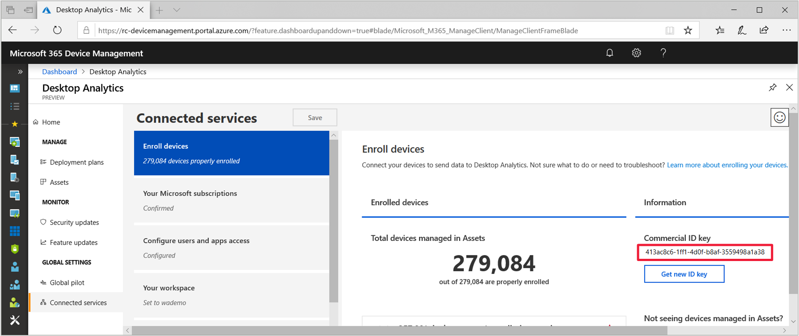

# How to set up Desktop Analytics 

> [!Note]  
> This information relates to a preview service which may be substantially modified before it's commercially released. Microsoft makes no warranties, express or implied, with respect to the information provided here.  

Use this procedure to sign in to Desktop Analytics and configure it in your subscription. This procedure is a one-time process to set up Desktop Analytics for your organization.  

## Initial onboarding

1. Open the [Desktop Analytics portal](https://aka.ms/m365aprod) in Microsoft 365 Device Management as a user with **Company Admin** permissions. Select **Start**.  

2. On the **Accept service agreement** page, review the service agreement, and select **Accept**.  

3. On the **Confirm your subscription** page, review the list of required qualifying licenses. Switch the setting to **Yes** next to **Do you have one of the supported or higher subscriptions**, and then select **Next**.  

4. On the **Give users access** page, Desktop Analytics pre-configures two security groups in Azure Active Directory:  

    - **Workspace Owners**: Create and manage workspaces. These accounts need owner access to the Azure subscription.  

    - **Workspace Contributors**: Create and manage deployment plans in this workspace. They don't need any additional Azure access.  
  
   To add a user to either group, type their name or e-mail address in the **Enter name or email address** section of the appropriate group. When finished, select **Next**. 

5. On the page to **Set up your workspace**:  

    - To use an existing workspace for Desktop Analytics, select it, and continue with the next step. If you're already using Windows Analytics, select that workspace. Desktop Analytics transfers your data and configurations.  

    - To create a workspace for Desktop Analytics, select **Add workspace**.  

        1. Enter a **Workspace name**.<!--do we have any guidance for this name?-->  

        2. Select the drop-down list to **Select the Azure subscription name for this workspace**, and choose the Azure subscription for this workspace.  

        3. Select the **Region** from the list, and then select **Add**.  

6. Select a new or existing workspace, and then select **Set as Desktop Analytics workspace**.  Then select **Continue** in the **Confirm and grant access** dialog.  

7. In the new browser tab, pick an account to use to sign in. Select the option to **Consent on behalf of your organization** and select **Accept**.  

8. Back on the page to **Set up your workspace**, select **Next**.  

9. On the **Last steps** page, select **Go to Desktop Analytics**. 

The Azure portal shows the Desktop Analytics **Home** page.

## Assign application role

Assign the MALogAnalyticsReader application the Log Analytics Reader role for the workspace.  

1. Go to the [Azure portal](http://portal.azure.com), and select **All resources**. Select the workspace of type **Log Analytics**.  

2. In the workspace menu, select **Access control (IAM)**, then select **Add**.  

3. In the **Add permissions** panel, configure the following settings:  

    - **Role**: **Log Analytics Reader**  

    - **Assign access to**: **Azure AD user, group, or application**  

    - **Select**: **MALogAnalyticsReader**  
  
4. Select **Save**. 

The portal shows a notification that it added the role assignment.

##  Update Configuration Manager

First, make sure that your Configuration Manager site is running at least version 1810. For more information, see [Install in-console updates](/sccm/core/servers/manage/install-in-console-updates).

You also need to install hotfix KB4482615 to support integration with Desktop Analytics. 

1. Update the site  

    1. If you opted into the 1810 update by running a PowerShell script in late November or early December 2018, then first update to the generally available version.  

        1. First disable [automatic client upgrade](/sccm/core/clients/manage/upgrade/upgrade-clients-for-windows-computers#to-configure-automatic-client-upgrades). This action makes sure that clients don't upgrade twice.  

        2. Install the prerequisite 1810 GA rollup update **KB4479288**. (Package ID 930FA45E-530F-4B08-B1BF-DE3F5267B03C) This update is generally available in early January to all customers on the "fast ring" version of 1810.  

        > [!Note]  
        > If you updated to version 1810 when it was generally available after 19 December 2018, you don't need update KB4479288.  

    2. Download hotfix **KB4482615** from the [Microsoft Download Center](). (Package ID 86450B7D-3574-4CF7-8B11-486A2C1F62A6) <!--link will be available once the package is published-->  

    2. [Use the update registration tool to import hotfixes](/sccm/core/servers/manage/use-the-update-registration-tool-to-import-hotfixes)  

2. Update clients. To simplify this process, consider using automatic client upgrade. For more information, see [Upgrade clients](/sccm/core/clients/manage/upgrade/upgrade-clients#automatic-client-upgrade).  

## Create app for Configuration Manager

Create an app in Azure AD for Configuration Manager.

1. In the [Azure portal](http://portal.azure.com), go to **Azure Active Directory**, and select **App registrations**. Then select **New application registration**.  

2. In the **Create** panel, configure the following settings:  

    - **Name**: a unique name that identifies the app, for example: `Desktop-Analytics-Connection`  

    - **Application type**: **Web app / API**  

    - **Sign-on URL**: this value isn't used by Configuration Manager, but required by Azure AD. Enter a unique and valid URL, for example: `https://configmgrapp`  
  
   Select **Create**.  

3. Select the app, and note the **Application ID**. This value is a GUID that's used to configure the Configuration Manager connection.  

4. Select **Settings** on the app, and then select **Keys**. In the **Passwords** section, enter a **Key description**, specify an expiration **Duration**, and then select **Save**. Copy the **Value** of the key, which is used to configure the Configuration Manager connection. 

    > [!Important]  
    > This is the only opportunity to copy the key value. If you don't copy it now, you need to create another key.  
    > 
    > Save the key value in a secure location.  

5. On the app **Settings** panel, select **Required permissions**.  

    1. On the **Required permissions** panel, select **Add**.  

    2. In the **Add API access** panel, **Select an API**.  

    3. Search for the **Configuration Manager Microservice** API. Select it, and then choose **Select**.  

    4. On the **Enable Access** panel, select both of the application permissions: **Write CM Collection Data** and **Read CM Collection Data**. Then choose **Select**.  

    5. On the **Add API access** panel, select **Done**.  

6. On the **Required permissions** page, select **Grant permissions**. Select **Yes**.  

7. Copy the Azure AD tenant ID. This value is a GUID that's used to configure the Configuration Manager connection. Select **Azure Active Directory** in the main menu, and then select **Properties**. Copy the **Directory ID** value.  

## Compatibility updates

The compatibility update runs diagnostics on the Windows device to evaluate its compatibility status with the latest versions of the Windows 10.

Microsoft regularly increments these updates, but the associated KB number doesn't change. Make sure that you always have the latest version of the update.

Restart devices after you install the compatibility updates for the first time.

> [!Tip]  
> Configure your update management tool to automatically install the latest version of these updates. 
> 
> There's a related optional update, [KB 3150513](https://catalog.update.microsoft.com/v7/site/Search.aspx?q=3150513). This update provides updated configuration and definitions for older compatibility updates. For more information, see [Latest compatibility definition update for Windows](https://support.microsoft.com/help/3150513).  

#### Windows 10
Windows 10 includes the compatibility update. To get the latest compatibility update, install the latest Windows 10 cumulative update.

#### Windows 8.1
Download the update: [KB 2976978](http://catalog.update.microsoft.com/v7/site/Search.aspx?q=KB2976978) 

Runs diagnostics on the Windows 8.1 systems that participate in the Windows Customer Experience Improvement Program. These diagnostics help determine whether you might have compatibility issues when upgrading to Windows 10.

For more information, see [Compatibility update for keeping Windows up-to-date in Windows 8.1](https://support.microsoft.com/help/2976978).

#### Windows 7 with Service Pack 1
Download the update: [KB 2952664](http://catalog.update.microsoft.com/v7/site/Search.aspx?q=KB2952664) 

Runs diagnostics on the Windows 7 with Service Pack 1 (SP1) systems that participate in the Windows Customer Experience Improvement Program. These diagnostics help determine whether you might have compatibility issues when upgrading to Windows 10.

For more information, see [Compatibility update for keeping Windows up-to-date in Windows 7](https://support.microsoft.com/help/2952664).

## Device enrollment

The Desktop Analytics service has no agents to install. Device enrollment requires configuring settings on the devices you want it to monitor. These settings control to which Desktop Analytics instance the device should send its data, and other configuration options.

> [!NOTE]  
> If you're already using Windows Analytics, select the same workspace from the displayed list. All of those devices automatically show up in your Desktop Analytics workspace. You don't need to reenroll them. 
> 
> If you chose to configure a different workspace, first split your entries between devices that you monitor with Windows Analytics and devices that you monitor with Desktop Analytics. Then enroll devices you want Desktop Analytics to monitor.  

### Commercial ID

Microsoft uses a unique commercial ID to map information from user computers to your Desktop Analytics workspace. The service should automatically generate this ID. 

When you integrate Configuration Manager with Desktop Analytics, it automatically queries the service for this ID. If you're not using Configuration Manager, use the following procedure to copy your Commercial ID:  

1. Go to the Desktop Analytics portal, and select **Connected services** in the Global Settings group.  

2. In the **Connected services** pane, the **Enroll devices** pane is selected by default. In the Enroll devices pane, the Information section displays your Commercial ID key.  

> [!Important]  
> Only **Get new ID key** when you can't use the current one. If you regenerate the commercial ID, deploy the new ID to your devices. This process might result in loss of diagnostic data during the transition.  

### Methods to enroll devices

There are several methods to enroll devices with Desktop Analytics. Microsoft recommends using Configuration Manager.

#### Configuration Manager
Configuration Manager provides an integrated experience for managing and deploying these settings to clients. For the best experience, use Configuration Manager. 

For more information, see [How to connect Configuration Manager with Desktop Analytics](/sccm/desktop-analytics/connect-configmgr).

#### Microsoft Intune
You can also configure devices by using a mobile device management tool such as Intune.

Use Intune to set the Commercial ID on managed devices. Use a custom device configuration setting to add the following OMA-URI: `./Vendor/MSFT/DMClient/Provider/ProviderID/CommercialID`. Set your organization's commercial ID as the value. For more information, see [Use custom settings for Windows 10 devices in Intune](https://docs.microsoft.com/intune/custom-settings-windows-10).

For more information on setting diagnostic data with Intune, see [Device restrictions for Windows 10 settings in Intune](https://docs.microsoft.com/intune/device-restrictions-windows-10#reporting-and-telemetry).

Configure these and other settings using the Intune management extension for Windows PowerShell. For more information, see [Manage PowerShell scripts in Intune for Windows 10 devices](https://docs.microsoft.com/intune/intune-management-extension).

#### Script
For more information, see ["Understanding connectivity scenarios and the deployment script"](https://blogs.technet.microsoft.com/upgradeanalytics/2017/03/10/understanding-connectivity-scenarios-and-the-deployment-script/) on the Windows Analytics blog. This post includes a summary of setting the ClientProxy for the script. This setting enables the script to properly check for diagnostic data endpoint connectivity.

#### Group policy
All policies described in this section also have *preference* registry keys. Set these keys by using the deployment script. If both are set, policy settings override preference settings.

These group policy objects are under `Microsoft\Windows\DataCollection`:

| Policy   | Value  |
|----------|--------|
| **CommercialId** | In order for a device to show up in Desktop Analytics, configure it with your organization’s Commercial ID. |
| **AllowTelemetry**  |	Set `1` for **Basic**, `2` for **Enhanced**, or `3` for **Full** diagnostic data. Desktop Analytics requires at least basic diagnostic data. More features are available when you use the Enhanced level. For example, Device Health requires Enhanced diagnostic data. Desktop Analytics only collects app usage and site discovery data on Windows 10 devices with Enhanced diagnostic data. For more information, see [Configure Windows diagnostic data in your organization](https://docs.microsoft.com/windows/configuration/configure-windows-diagnostic-data-in-your-organization). |
| **LimitEnhancedDiagnosticDataWindowsAnalytics** |	This setting only applies when the AllowTelemetry setting is `2`. It limits the Enhanced diagnostic data events sent to Microsoft to just those events needed by Desktop Analytics. For more information, see [Windows 10, version 1709 enhanced diagnostic data events and fields used by Windows Analytics](https://docs.microsoft.com/windows/configuration/enhanced-diagnostic-data-windows-analytics-events-and-fields).|
| **AllowDeviceNameInTelemetry** | To enable Windows 10, version 1803, devices to send the device name, enable this separate opt-in setting. |

Configure these settings in **Computer Configuration** > **Administrative Templates** > **Windows Components** > **Data Collection and Preview Builds**. 

## Next steps

Advance to the next article to enable sharing diagnostic data with Desktop Analytics.
> [!div class="nextstepaction"]  
> [Enable data sharing](/sccm/desktop-analytics/enable-data-sharing)  
