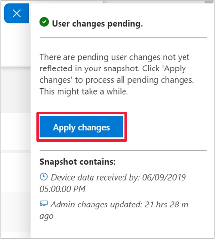

# Troubleshoot Desktop Analytics

Use the details in this article to help you troubleshoot issues with Desktop Analytics integrated with Configuration Manager.


## Confirm prerequisites

Many common issues are caused by missing prerequisites. First confirm the following configurations:

- [Prerequisites](/sccm/desktop-analytics/overview#prerequisites)  

- [Windows component updates](/sccm/desktop-analytics/enroll-devices#update-devices)  

- [How to enable data sharing](/sccm/desktop-analytics/enable-data-sharing), which covers the following topics:  

    - Internet endpoints to which clients need to connect  

    - Proxy server authentication  

    - Diagnostic data levels  


## Monitor connection health

Use the **Connection Health** dashboard in Configuration Manager to drill down into categories by device health. In the Configuration Manager console, go to the **Software Library** workspace, expand the **Desktop Analytics Servicing** node, and select the **Connection Health** dashboard.  

For more information, see [Monitor connection health](/sccm/desktop-analytics/monitor-connection-health).


## Log files

For more information, see [Log files for Desktop Analytics](/sccm/core/plan-design/hierarchy/log-files#desktop-analytics)

### Enable verbose logging

1. On the service connection point, go to the following registry key: `HKLM\Software\Microsoft\SMS\Tracing\SMS_SERVICE_CONNECTOR`  
2. Set the **LoggingLevel** value to `0`  
3. (Optional) Run the following SQL command on the site database:  

    ```SQL
    DELETE FROM M365AProperties WHERE Name = 'M365ATenantUpdateInfo_LastUpdateTime'
    ```

4. Restart the **SMS_EXECUTIVE** service on the site server


## <a name="bkmk_AzureADApps"></a> Azure AD applications

Desktop Analytics adds the following applications to your Azure AD:

- **Configuration Manager Microservice**: Connects Configuration Manager with Desktop Analytics. This app has no access requirements.  

- **MALogAnalyticsReader**: Retrieves OMS groups and devices created in Log Analytics. For more information, see [MALogAnalyticsReader application role](#bkmk_MALogAnalyticsReader).  

If you need to provision these apps after completing setup, go to the **Connected services** pane. Select **Configure users and apps access**, and provision the apps.  

- **Azure AD app for Configuration Manager**. If you need to provision or troubleshoot connection issues after completing setup, see [Create and import app for Configuration Manager](#create-and-import-app-for-configuration-manager). This app requires  **Write CM Collection Data** and **Read CM Collection Data** on the **Configuration Manager Service** API.  


### Create and import app for Configuration Manager

After completing the [Initial onboarding](/sccm/desktop-analytics/set-up#initial-onboarding) on the Desktop Analytics portal, use the following steps to manually create and import the app for Configuration Manager if you can't create this Azure AD app from the Configure Azure Services wizard.

#### Create app in Azure AD

1. Open the [Azure portal](http://portal.azure.com) as a user with *Global Admin* permissions, go to **Azure Active Directory**, and select **App registrations**. Then select **New registration**.  

2. In the **Create** panel, configure the following settings:  

    - **Name**: a unique name that identifies the app, for example: `Desktop-Analytics-Connection`  

    - **Supported account types**: **Accounts in this organizational directory only (Contoso)**

    - **Redirect URI (optional)**: **Web**  

    <!--     - **Sign-on URL**: this value isn't used by Configuration Manager, but required by Azure AD. Enter a unique and valid URL, for example: `https://configmgrapp`   -->
  
    Select **Register**.  

3. Select the app, note the **Application (client) ID** and **Directory (tenant) ID**. The values are GUIDs that are used to configure the Configuration Manager connection.  

4. In the **Manage** menu, select **Certificates & secrets**. Select **New client secret**. Enter a **Description**, specify an expiration duration, and then select **Add**. Copy the **Value** of the key, which is used to configure the Configuration Manager connection.

    > [!Important]  
    > This is the only opportunity to copy the key value. If you don't copy it now, you need to create another key.  
    >
    > Save the key value in a secure location.  

5. In the **Manage** menu, select **API permissions**.  

    1. On the **API permissions** panel, select **Add a permission**.  

    2. In the **Request API permissions** panel, switch to **APIs my organization uses**.  

    3. Search for and select the **Configuration Manager Microservice** API.  

    4. Select the **Application permissions** group. Expand **CmCollectionData**, and select both of the following permissions: **Write CM Collection Data** and **Read CM Collection Data**.  

    5. Select **Add permissions**.  

6. On the **API permissions** panel, select **Grant admin consent...**. Select **Yes**.  


#### Import app in Configuration Manager

1. In the Configuration Manager console, go to the **Administration** workspace, expand **Cloud Services**, and select the **Azure Services** node. Select **Configure Azure Services** in the ribbon.  

2. On the **Azure Services** page of the Azure Services Wizard, configure the following settings:  

    - Specify a **Name** for the object in Configuration Manager.  

    - Specify an optional **Description** to help you identify the service.  

    - Select **Desktop Analytics** from the list of available services.  
  
   Select **Next**.  

3. On the **App** page, select the appropriate **Azure environment**. Then select **Import** for the web app. Configure the following settings in the **Import Apps** window:  

    - **Azure AD Tenant Name**: This name is how it's named in Configuration Manager  

    - **Azure AD Tenant ID**: The **Directory ID** you copied from Azure AD  

    - **Client ID**: The **Application ID** you copied from the Azure AD app  

    - **Secret Key**: The key **Value** you copied from the Azure AD app  

    - **Secret Key Expiry**: The same expiration date of the key  

    - **App ID URI**: This setting should automatically populate with the following value: `https://cmmicrosvc.manage.microsoft.com/`  
  
   Select **Verify**, and then select **OK** to close the Import Apps window. Select **Next** on the App page of the Azure Services Wizard.  

To continue the rest of the wizard on the **Diagnostic Data** page, see [Connect to the service](/sccm/desktop-analytics/connect-configmgr#bkmk_connect).

#### Troubleshoot app in Configuration Manager

If you're having problems creating or importing the app, first check **SMSAdminUI.log** for the specific error. Then check the following configurations:

- You've successfully enrolled the tenant to the Desktop Analytics service. For more information, see [How to set up Desktop Analytics](/sccm/desktop-analytics/set-up).

- All required endpoints are accessible. For more information, see [Endpoints](/sccm/desktop-analytics/enable-data-sharing#endpoints).

- Make sure the user who signs in has the correct permissions. For more information, see [Prerequisites](/sccm/desktop-analytics/overview#prerequisites).

- Make sure that the user can sign in to Azure in general. This action determines if there are any general Azure AD authentication issues.

- Check status messages for the **SMS_SERVICE_CONNECTOR** component regarding the *Desktop Analytics worker*.


### <a name="bkmk_MALogAnalyticsReader"></a> MALogAnalyticsReader application role

When you set up Desktop Analytics, you consent on behalf of your organization. This consent is to assign the MALogAnalyticsReader application the Log Analytics Reader role for the workspace. This application role is required by Desktop Analytics.

If there's a problem with this process during setup, use the following process to manually add this permission:

1. Go to the [Azure portal](http://portal.azure.com), and select **All resources**. Select the workspace of type **Log Analytics**.  

2. In the workspace menu, select **Access control (IAM)**, then select **Add**.  

3. In the **Add permissions** panel, configure the following settings:  

    - **Role**: **Reader**  

    - **Assign access to**: **Azure AD user, group, or application**  

    - **Select**: **MALogAnalyticsReader**  

4. Select **Save**.

The portal shows a notification that it added the role assignment.


## Data latency

<!-- 3846531 -->
When you first set up Desktop Analytics, the reports in Configuration Manager and the Desktop Analytics portal may not show complete data right away. It can take 2-3 days for the following steps to occur:

- Active devices send diagnostic data to the Desktop Analytics service
- The service processes the data
- The service synchronizes with your Configuration Manager site

When syncing device collections from your Configuration Manager hierarchy to Desktop Analytics, it can take up to 10 minutes for those collections to appear in the Desktop Analytics portal. Similarly, when you create a deployment plan in Desktop Analytics, it can take up to 10 minutes for the new collections associated with the deployment plan to appear in your Configuration Manager hierarchy. The primary sites create the collections, and the central administration site synchronizes with Desktop Analytics.

Within the Desktop Analytics portal, there are two types of data: **Administrator data** and **diagnostic data**:

- **Administrator data** refers to any changes you make to your workspace configuration. For example, when you change an asset's **Upgrade Decision** or **Importance** you're changing administrator data. These changes often have a compounding effect, as they can alter the readiness state of a device with the asset in question installed.

- **Diagnostic data** refers to the system metadata uploaded from client devices to Microsoft. This data powers Desktop Analytics. It includes attributes such as device inventory, and security and feature update status.

By default, all data in the Desktop Analytics portal is automatically refreshed daily. This refresh includes changes in diagnostics data and any changes that you make to the configuration (administrator data). It should be visible in your Desktop Analytics portal by 08:00 AM UTC each day.

When you make changes to administrator data, you can trigger an on-demand refresh of the administrator data in your workspace. From any page in the Desktop Analytics portal, open the data currency flyout:


Then select **Apply changes**:



This process generally takes between 15-60 minutes. The timing depends on the size of your workspace and the scope of the changes that need processes. When you request an on-demand data refresh, it doesn't result in any changes to diagnostic data.  For more information, see the [Desktop Analytics FAQ](/sccm/desktop-analytics/faq#can-i-reduce-the-amount-of-time-it-takes-for-data-to-refresh-in-my-desktop-analytics-portal).

If you aren't seeing changes updated within the time frames indicated above, wait another 24 hours for the next daily refresh. If you see longer delays, check the service health dashboard. If the service reports as healthy, contact Microsoft support.<!-- 3896921 -->
