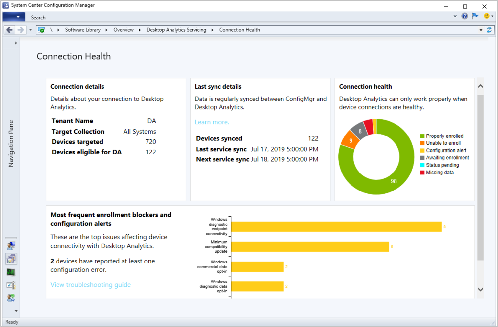
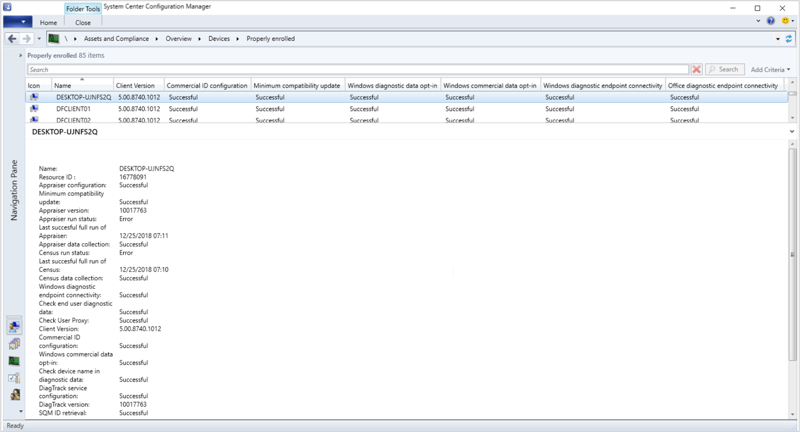

# Troubleshooting Desktop Analytics

Use the details in this article to help you troubleshoot issues with Desktop Analytics integrated with Configuration Manager.


## Confirm prerequisites

Many common issues are caused by missing prerequisites. First confirm the following configurations:

- [Prerequisites](/sccm/desktop-analytics/overview#prerequisites)  

- [Compatibility updates](/sccm/desktop-analytics/set-up#compatibility-updates)  

- [How to enable data sharing](/sccm/desktop-analytics/enable-data-sharing), which covers the following topics:  

    - Internet endpoints to which clients need to connect  

    - Proxy server authentication  

    - Diagnostic data levels  


## Monitor connection health

Use the **Connection Health** dashboard in Configuration Manager to drill down into categories by device health. In the Configuration Manager console, go to the **Software Library** workspace, expand the **Microsoft 365 Servicing** node, and select the **Connection Health** dashboard.  



If you think some devices aren't showing in Desktop Analytics, first check the percentage of **Connected devices**. If it's less than 100%, make sure the devices are supported by Desktop Analytics. For more information, see [Prerequisites](/sccm/desktop-analytics/overview#prerequisites).


### Connection health states

Next review the **Connection health** chart. It displays the number of devices in the following health categories:  

- [Properly enrolled](#properly-enrolled)  
- [Configuration issues](#configuration-issues)  
- [Client not installed](#client-not-installed)  
- [Waiting for enrollment](#waiting-for-enrollment)  
- [Missing prerequisites](#missing-prerequisites)  
- [Missing data](#missing-data)  

Select the category name to remove or add it from the chart. This action helps to zoom the chart so you can see the relative sizes of smaller segments. 

#### Properly enrolled
The device has the following attributes:  
- A Configuration Manager client version 1810 or later  
- There are no configuration errors  
- Desktop Analytics received complete diagnostic data from this device in the past 28 days  
- Desktop Analytics has a complete inventory of the device's configuration and installed apps  

#### Configuration issues
Configuration Manager detects one or more issues with the configuration required for Desktop Analytics. For more information, see the list of [Desktop Analytics device properties in Configuration Manager](#bkmk_config-issues).  

#### Client not installed
The device is targeted for Desktop Analytics, but isn't a Configuration Manager client. 

The Configuration Manager client is required to configure and manage the device for Desktop Analytics. For more information, see [Client installation methods](/sccm/core/clients/deploy/plan/client-installation-methods).  

#### Waiting for enrollment
Desktop Analytics doesn't have diagnostic data for this device. This issue can be because the device was recently added to the target collection and hasn't yet sent data. It can also mean the device isn't properly communicating with the service, and the latest diagnostic data is more than 28 days old. 

Make sure the device is able to communicate with the service. For more information, see [Endpoints](/sccm/desktop-analytics/enable-data-sharing#endpoints).  

#### Missing prerequisites
The Configuration Manager client isn't at least version 1806 (5.0.8740). 

Update the client to the latest version. Consider enabling automatic client upgrade for the Configuration Manager site. For more information, see [Upgrade clients](/sccm/core/clients/manage/upgrade/upgrade-clients#automatic-client-upgrade).  

#### Missing data
Desktop Analytics can't create a compatibility assessment. It doesn't have a complete data set for the device's configuration (census) or installed apps (inventory). 

This issue is often fixed automatically when the device retries. If it persists, make sure the device is able to communicate with the service. For more information, see [Endpoints](/sccm/desktop-analytics/enable-data-sharing#endpoints).  


### Device list

To see a specific list of devices by status, start with the **Connection Health** dashboard. Select one of the segments of the **Connection health** tile and drill down to a list of devices in this category. This custom device view displays the following Desktop Analytics columns by default:
- Commercial ID configuration
- Minimum compatibility update
- Windows diagnostic data opt-in
- Windows commercial data opt-in
- Windows diagnostic endpoint connectivity
- Office diagnostic endpoint connectivity

These columns correspond to the key [prerequisites](/sccm/desktop-analytics/overview#prerequisites) for devices to communicate with Desktop Analytics. 



Select a device to see the full list of available properties in the detail pane. You can also add any of these properties as columns to the device list. 


### <a name="bkmk_config-issues"></a> Desktop Analytics device properties in Configuration Manager

The following columns are available in the device list:
- [Appraiser configuration](#appraiser-configuration)  
- [Minimum compatibility update](#minimum-compatibility-update)  
- [Appraiser version](#appraiser-version)  
- [Last successful full run of Appraiser](#last-successful-full-run-of-appraiser)  
- [Appraiser data collection](#appraiser-data-collection)  
- [Last successful full run of Census](#last-successful-full-run-of-census)  
- [Census data collection](#census-data-collection)  
- [Windows diagnostic endpoint connectivity](#windows-diagnostic-endpoint-connectivity)  
- [Check end-user diagnostic data](#check-end-user-diagnostic-data)  
- [Check user proxy](#check-user-proxy)  
- [Commercial ID configuration](#commercial-id-configuration)  
- [Windows commercial data opt-in](#windows-commercial-data-opt-in)  
- [Check device name in diagnostic data](#check-device-name-in-diagnostic-data)  
- [DiagTrack service configuration](#diagtrack-service-configuration)  
- [DiagTrack version](#diagtrack-version)  
- [SQM ID retrieval](#sqm-id-retrieval)  
- [Unique device identifier retrieval](#unique-device-identifier-retrieval)  
- [Windows diagnostic data opt-in](#windows-diagnostic-data-opt-in)  
- [Office diagnostic endpoint connectivity](#office-diagnostic-endpoint-connectivity)  

#### Appraiser configuration
<!--20,21-->
If this check is successful, then the appraiser component is properly configured on the device. 

Otherwise, it might display one of the following errors:

- Can't configure device app compatiblity data collection (SetRequestAllAppraiserVersions). Check the logs for the exception details  

- Can't configure device app compatiblity data collection (SetRequestAllAppraiserVersions). Check the logs for the exception details  

- Can't write the RequestAllAppraiserVersions to registry key `HKLM:\SOFTWARE\Microsoft\WindowsNT\CurrentVersion\AppCompatFlags\Appraiser`. Check permissions  

Check the permissions on this registry key. Make sure that the local System account can access this key for the Configuration Manager client to set.  

For more information, review M365AHandler.log on the client.  


#### Minimum compatibility update
<!--18,19,32-->
The compatibility update (appraiser.dll) isn't installed or out of date on the device. It's older than the minimum requirement for Desktop Analytics. 

Install the latest compatibility update. For more information, see [Compatibility updates](/sccm/desktop-analytics/set-up#compatibility-updates).


#### Appraiser version
This property displays the current version of the Appraiser component on the device. It shows the file version on `%windir%\System32\appraiser.dll`, without the decimal points. For example, file version 10.0.17763 displays as 10017763. 


#### Last successful full run of Appraiser
This property displays the date and time that the device last successfully ran Appraiser.


#### Appraiser data collection
<!--Appraiser run status-->
<!--22,33-->
This property shows the latest result from Windows running the appraiser component. 

If not successful, it might show one of the following errors: 

- Can't collect app compatibility data (RunAppraiser). Check the logs for details  

- App compatibility data collection (CompatTelRunner.exe) ended with an error code  

For more information, review M365AHandler.log on the client. 

Check for the following file: `%windir%\System32\CompatTelRunner.exe`. If it doesn't exist, reinstall the required [compatibility updates](/sccm/desktop-analytics/set-up#compatibility-updates). Make sure no other system component is removing this file, such as group policy or an antimalware service. 


#### Last successful full run of Census
This property displays the date and time that the device last successfully ran Census. 

#### Census data collection
<!-- Census run status -->
<!--51,52-->
This property shows the latest result from Windows running the census component.

If not successful, it might show one of the following errors: 

- Can't collect data about the device and its configuration (RunCensus). Check the logs for the exception details  

- Device and configuration data collection tool (devicecensus.exe) not found  

For more information, review M365AHandler.log on the client. 

Check for the following file: `%windir%\System32\DeviceCensus.exe`. If it doesn't exist, reinstall the required [compatibility updates](/sccm/desktop-analytics/set-up#compatibility-updates). Make sure no other system component is removing this file, such as group policy or an antimalware service. 


#### Windows diagnostic endpoint connectivity
<!--12,15-->
If this check is successful, then the device is able to connect to the connected user experience and telemetry endpoint (Vortex). 

Otherwise, it may show one of the following errors:  

- Can't connect to the connected user experience and telemetry endpoint (Vortex). Check your network/proxy settings  

- Can't check connectivity to the connected user experience and telemetry endpoint (CheckVortexConnectivity). Check the logs for the exception details  

Windows 10 devices verify connectivity with a GET request to `https://v10.vortex-win.data.microsoft.com/health/keepalive` or `https://v10c.vortex-win.data.microsoft.com/health/keepalive`. Windows 7 and Windows 8.1 devices verify connectivity with a GET request to `https://vortex-win.data.microsoft.com/health/keepalive`. 

Make sure the device is able to communicate with the service. For more information, see [Endpoints](/sccm/desktop-analytics/enable-data-sharing#endpoints).  

For more information, review M365AHandler.log on the client.  


#### Check end-user diagnostic data
<!--1004-->

If this check isn't successful, a user selected a lower Windows diagnostic data on the device.

Depending upon your business requirements, you can disable user choice via group policy. Use the setting to **Configure telemetry opt-in setting user interface**. For more information, see [Configure Windows diagnostic data in your organization](https://docs.microsoft.com/windows/privacy/configure-windows-diagnostic-data-in-your-organization#enterprise-management).


#### Check user proxy
<!--30,35-->

The DisableEnterpriseAuthProxy setting is enabled by default for Windows 7. For Windows 8.1 computers, Configuration Manager sets the DisableEnterpriseAuthProxy setting to 0 (not disabled).

This property may display the following errors:

- Authentication proxy is enabled. Set DisableEnterpriseAuthProxy to 0 in `HKLM\Software\Policies\Microsoft\Windows\DataCollection` 

- Can't check for the Authentication proxy status. Check the logs for the exception details

For more information, review M365AHandler.log on the client.  

Check the permissions on this registry key. Make sure that the local System account can access this key for the Configuration Manager client to set.  


#### Commercial ID configuration
<!--9, 11, 53-->
Microsoft uses a unique commercial ID to map information from devices to your Desktop Analytics workspace. Configuration Manager should automatically apply this ID to clients to which you target Desktop Analytics settings. 

If this check is successful, then the device is properly configured with a commercial ID.

Otherwise, it may show one of the following errors:

- Can't write the CommercialId to registry key `HKLM:\SOFTWARE\Microsoft\Windows\CurrentVersion\Policies\DataCollection`. Check permissions  

- Can't update the CommercialId in registry key `HKLM:\SOFTWARE\Microsoft\Windows\CurrentVersion\Policies\DataCollection`. Check the logs for the exception details   

- Provide the correct CommercialId value at `HKLM:\SOFTWARE\Policies\Microsoft\Windows\DataCollection`  

For more information, review M365AHandler.log on the client.  

Check the permissions on this registry key. Make sure that the local System account can access this key for the Configuration Manager client to set.  

There's a different ID for the device. This registry key is used by group policy. It takes precedence over the ID provided by Configuration Manager.  


#### Windows commercial data opt-in
<!--64-->

This property is specific to devices running Windows 7 or Windows 8.1. It runs similar tests as [Windows diagnostic data opt-in](#windows-diagnostic-data-opt-in), except for the CommercialDataOptIn value.


#### Check device name in diagnostic data
<!--56,58-->

If this check is successful, then the device is properly configured to share the device name.

Otherwise, it may show one of the following errors:

- Can't check for the device name to be sent to Microsoft as part of the Windows diagnostic data. Check the logs for the exception details  

- Can't write AllowDeviceNameInTelemetry to registry key `HKLM:\SOFTWARE\Policies\Microsoft\Windows\DataCollection`. Check permissions  

For more information, review M365AHandler.log on the client.  

Check the permissions on this registry key. Make sure that the local System account can access this key for the Configuration Manager client to set.  

Make sure that another policy mechanism, such as group policy, isn't disabling this setting. 


#### DiagTrack service configuration
<!--44,45,50-->
If this check is successful, then the DiagTrack component is properly configured on the device. 

Otherwise, it might display one of the following errors:

- Connected User Experience and Telemetry (diagtrack.dll) component is outdated. Check requirements  

- Can't find the Connected User Experience and telemetry (diagtrack.dll) component. Check requirements  

- Enable and start the Connected User Experiences and Telemetry service to send data to Microsoft  

<!--
 - An updated Connected User Experience and Telemetry (diagtrack.dll) component is available. Check requirements - this is for the newer version that improves performance
 -->

<!--include something about diagtrack perf update https://go.microsoft.com/fwlink/?linkid=2011593-->

Install the latest compatibility update. For more information, see [Compatibility updates](/sccm/desktop-analytics/set-up#compatibility-updates).

Make sure that the **Connected User Experiences and Telemetry** service on the device is running.

#### DiagTrack version
This property displays the current version of the Connected User Experience and Telemetry component on the device. It shows the file version on `%windir%\System32\diagtrack.dll`, without the decimal points. For example, file version 10.0.10242 displays as 10010242. 

#### SQM ID retrieval
<!--38-->

This property is primarily for Windows 7 devices. It may be used by later OS versions as a fallback identifier. 

If not successful, it may display the following error:

- Can't retrieve the legacy device telemetry identifier (SQM ID)

For more information, review M365AHandler.log on the client.  

Make sure you don't have duplicate IDs in your environment. For example, if devices were deployed with an OS image that wasn't generalized. 


#### Unique device identifier retrieval
<!--54-->
Desktop Analytics uses the Microsoft Account service for a more reliable device identity. 

Make sure the **Microsoft Account Sign-In Assistant** service isn't disabled. The startup type should be **Manual (Trigger Start)**.

To disable end-user Microsoft account access, use policy settings instead of blocking this endpoint. For more information, see [The Microsoft account in the enterprise](https://docs.microsoft.com/windows/security/identity-protection/access-control/microsoft-accounts#block-all-consumer-microsoft-account-user-authentication).


#### Windows diagnostic data opt-in
<!--8,40,55,62-->
This property checks that Windows is properly configured to allow diagnostic data. It checks the AllowTelemetry value in the following registry keys:

- `HKLM:\SOFTWARE\Microsoft\Windows\CurrentVersion\Policies\DataCollection`
- `HKLM:\SOFTWARE\Policies\Microsoft\Windows\DataCollection`

Check the permissions on these registry keys. Make sure that the local System account can access these keys for the Configuration Manager client to set.  

For more information, review M365AHandler.log on the client.  


#### Office diagnostic endpoint connectivity
<!-- 1001,1002,1003 -->

If this check is successful, then the device is able to connect to the Office diagnostic endpoints. 

Otherwise, it may show one of the following errors:

- Can't connect to the Office diagnostic endpoint (Aria). Check your network/proxy settings  

- Can't connect to the Office diagnostic endpoint (Nexusrules). Check your network/proxy settings  

- Can't connect to the Office diagnostic endpoint (Nexus). Check your network/proxy settings  

Make sure the device is able to communicate with the service. For more information, see [Endpoints](/sccm/desktop-analytics/enable-data-sharing#endpoints).  


## Log files

Use the following log files to help troubleshoot issues with Desktop Analytics integrated with Configuration Manager. 


### Service connection point

The following log files are on the service connection point in the following directory: `C:\Program Files\Configuration Manager\Logs\M365A`:

| Log | Description |
|---------|---------|
| **M365ADeploymentPlanWorker.log** | Information about deployment plan sync from Desktop Analytics cloud service to on-premises Configuration Manager |
| **M365ADeviceHealthWorker.log** | Information about device health upload from Configuration Manager to Microsoft cloud |
| **M365AUploadWorker.log** | Information about collection and device upload from Configuration Manager to Microsoft cloud |


### Configuration Manager client

The following log files are on the Configuration Manager client in the following directory: `C:\Windows\CCM\logs`:

| Log | Description |
|---------|---------|
| **M365Handler.log** | Information about the Desktop Analytics settings policy |


### Enable verbose logging 

1. On the service connection point, go to the following registry key: `HKLM\Software\Microsoft\SMS\Tracing\SMS_SERVICE_CONNECTOR`  
2. Set the **LogLevel** value to `0`  
3. Run the following SQL command on the site database:  

    ```SQL
    DELETE FROM M365AProperties WHERE Name = 'M365ATenantUpdateInfo_LastUpdateTime'
    ```

4. Restart the **SMS_EXECUTIVE** service on the site server

