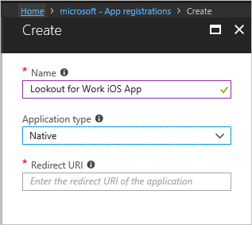

# Configure and deploy Lookout for Work apps

*Applies to: System Center Configuration Manager (Current Branch)*

This article explains how to configure and deploy the Lookout for Work app for Android and iOS devices.

## Android (Google Play store app)
1.  In the Configuration Manager console, click **Software Library** > **Application Management** > **Applications**.  

2.  On the **General** page of the Deploy Software Wizard, specify the following information:  
    - Type: select **App package for Android on Google Play**.
    - Location: copy the Lookout for work app link from the Google Play store as paste it here
    - Publisher: Lookout Mobile Security
    - Name: Lookout for Work
    - Description: Lookout offers the best protection against mobile threats to keep your device safe. When the Lookout app is installed, the app protects your device from threats. If it finds any threats, it alerts you and your IT administrator.
    - Administrative category: Computer Management  

    Upon successful completion, you see the Lookout for Work app in your list of applications.  

3.  On the **Home** tab, in the **Deployment** group, choose **Deploy** to deploy the Lookout for Work app to users.   
    >[!IMPORTANT]  
    >You must select the same users added in to the Enrollment Management option in the Lookout MTP console.  

    Choose the **Required Install** option. This option requires the Lookout app to install on the user’s device.  

## iOS (enterprise-signed version of Lookout app)

1. Make sure iOS management is set up on your devices. For instructions on how to set up your device for iOS management, see [Set up iOS and Mac device management](/sccm/mdm/deploy-use/enroll-hybrid-ios-mac).  

2. Re-sign the Lookout for Work iOS app. Lookout distributes its Lookout for Work iOS app outside of the iOS App Store. Before distributing the app, you must re-sign the app with your iOS Enterprise Developer Certificate. For detailed instructions to re-sign the Lookout for Work iOS apps, see [Lookout for Work iOS app re-signing process](https://personal.support.lookout.com/hc/articles/114094038714) on the Lookout site.  

3. Enable Azure Active Directory (Azure AD) authentication for the iOS users.
   1.  Sign in to the [Azure AD blade of the Azure portal](https://portal.azure.com/#blade/Microsoft_AAD_IAM/ActiveDirectoryMenuBlade/Overview), and navigate to the app registrations page.  
   2.  Specify the Name as **Lookout for Work iOS app**, and select **Native** as the Application Type.  
   

   3.  For this Redirect URI, use the following format: `lookoutwork://com.lookout.enterprise.<yourcompanyname>`, replacing `<yourcompanyname>` with your company name. For example: `lookoutwork://com.lookout.enterprise.contoso`
   4. Click **Create** to create the app. 
   5.  Open the new app, click **Settings**, and add an additional Redirect URI. Use the following format: `companyportal://code/<originalURI>`, where `<originalURI>` is a URL-encoded version of your original Redirect URI. For example, `companyportal://code/lookoutwork%3A%2F%2Fcom.lookout.enterprise.contoso`
   6.  In the app settings, go to **Required permissions** and click **Add**. Select the following delegated permissions:  

       | API  | Permission  |
       |---------|---------|
       | Lookout MTP     | Access Lookout MTP         |
       | Microsoft Graph     | Sign in and read user profile        |  

   For more information, see [Configure a native client application](/azure/app-service/app-service-mobile-how-to-configure-active-directory-authentication#optional-configure-a-native-client-application).  

4. In Configuration Manager, upload the re-signed .ipa file. Set the minimum OS version to iOS 8.0 or later. For more information, see [Create iOS applications](/sccm/apps/get-started/creating-ios-applications).   

5. Create the managed app configuration policy. For more information, see [Configure iOS apps with mobile app configuration policies](/sccm/apps/deploy-use/configure-ios-apps-with-app-configuration-policies).  

6. Deploy the Lookout for Work app to users. For more information, see [Deploy applications](/sccm/apps/deploy-use/deploy-applications).  

   Select the same users that were added to the Enrollment Management option in the Lookout console. Choose the **Required Install** option. This option requires the Lookout app to install on the user’s device.

## What happens when the deployed app is opened on the device

When the user opens the Lookout for Work on the device, it prompts them to activate the app. They should choose to sign in with the Azure AD option. A detailed walkthrough with the end-user flow is in the following articles:

- [You are prompted to install Lookout for Work on your Android device](/intune-user-help/you-are-prompted-to-install-lookout-for-work-android)

- [You need to resolve a threat that Lookout for Work found on your Android device](/intune-user-help/you-need-to-resolve-a-threat-found-by-lookout-for-work-android)

## Next steps
- [Enable device threat protection rule in the compliance policy](enable-device-threat-protection-rule-compliance-policy.md)
