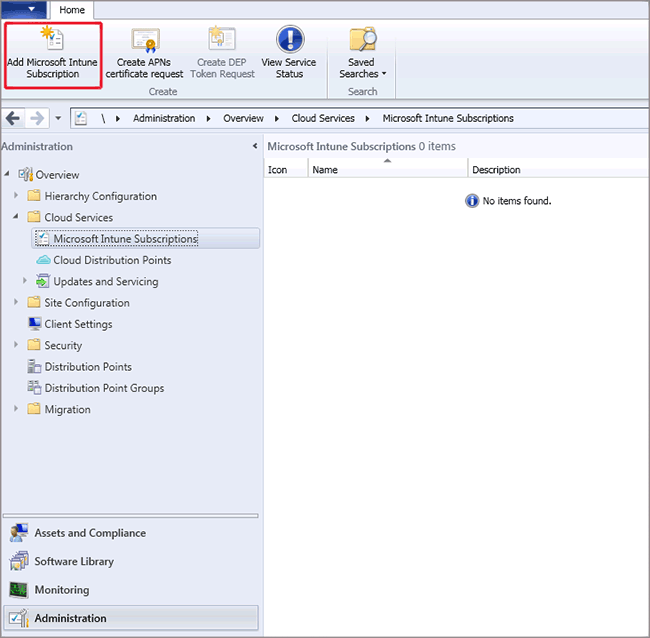

# Configure your Intune subscription with System Center Configuration Manager and Microsoft Intune

*Applies to: System Center Configuration Manager (Current Branch)*

The Intune subscription lets you manage devices over the internet. This includes specifying which user collection can enroll devices and defining information presented to users. While creating the Intune subscription, you can also add company branding to the Intune company portal with your company logo and custom color schemes.

The Intune subscription does the following:

-   Retrieves the certificate that the service connection point requires to connect to the Intune service
-   Defines the user collection that enables users to enroll mobile devices
-   Defines and configures the mobile platforms that you want to support

> [!IMPORTANT]
>  Creating a subscription for Microsoft Intune in Configuration Manager will put your site's service connection point in "online mode." See [About the service connection point in System Center Configuration Manager](../../core/servers/deploy/configure/about-the-service-connection-point.md).

## To create the Microsoft Intune subscription

1.  If you haven't already, sign up for a Microsoft Intune account at [Microsoft Intune](http://go.microsoft.com/fwlink/?LinkID=258216).  After creating your Intune account, you do not need to add any users to the Intune account or perform additional settings configurations.

2.  In the Configuration Manager console, click **Administration**.

3.  In the **Administration** workspace, expand **Cloud Services**, and click **Microsoft Intune Subscriptions**. On the **Home** tab, click **Add Microsoft Intune Subscription**.

4. On the **Introduction** page of the Create Microsoft Intune Subscription Wizard, review the text and click **Next**.

5. On the **Subscription** page, click **Sign in** and sign in by using your work or school account. In the **Set the Mobile Device Management Authority** dialog, select the check box to only manage mobile devices by using Configuration Manager through the Configuration Manager console. To continue with your subscription, you must select this option.

   > [!IMPORTANT]
   >  Once you select Configuration Manager as your management authority, you can only change your management authority to Microsoft Intune in Configuration Manager version 1610 or later and Microsoft Intune version 1705 without having to contact Microsoft Support, and without having to unenroll and reenroll your existing managed devices. For details, see [Change your MDM authority](/sccm/mdm/deploy-use/change-mdm-authority).

6. Click the privacy links to review them, and then click **Next**.

7. On the **General** page, specify the following options, and then click **Next**.

   - **Collection**: Specify a user collection that contains users who will enroll their mobile devices.

     > [!NOTE]
     >  If a user is removed from the collection, the user's device will continue to be managed for up to 24 hours when the user record is removed from the user database.

   - **Company name**: Specify your company name.

   - **URL to company privacy documentation**: If you publish your company privacy information to a link that is accessible from the Internet, provide a link that users can access from the company portal, for example http://www.contoso.com/CP_privacy.html. Privacy information can clarify what information users are sharing with your company.

   - **Color scheme for company portal**: Optionally, change the default color of blue for the company portals.

   - **Configuration Manager site code**: Specify a site code for a primary site to manage the mobile devices.

   > [!NOTE]
   >  Changing the site code affects only new enrollments and does not affect existing enrolled devices.

8. On the **Company Contact Information** page, specify the company contact information that is displayed to users under **Contact IT** in the Company Portal app. Provide contact information for your company, and then click **Next**.

9. On the **Company Logo** page, you can choose whether to display logos in the company portal, and then click **Next**.

10. Complete the wizard.

> [!div class="button"]
> [< Previous step](confirm-dns.md)  [Next step >](terms-and-conditions.md)
