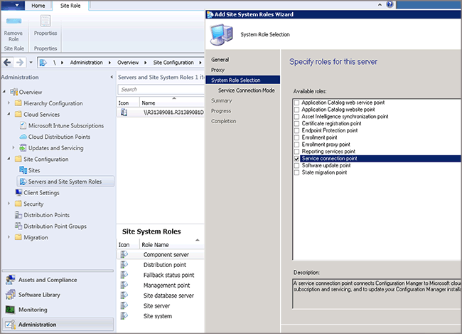

# Create a service connection point with System Center Configuration Manager and Microsoft Intune

*Applies to: System Center Configuration Manager (Current Branch)*

When you have created your subscription, you can then install the service connection point site system role that lets you connect to the Intune service. This site system role will push settings and applications to the Intune service.

 The service connection point sends settings and software deployment information to Configuration Manager and retrieves status and inventory messages from mobile devices. The Configuration Manager service acts as a gateway that communicates with mobile devices and stores settings.

> [!NOTE]
>  The service connection point site system role may only be installed on a central administration site or stand-alone primary site. The service connection point must have Internet access.

## Configure the service connection point role

1.  In the Configuration Manager console, click **Administration**.

2.  In the **Administration** workspace, expand **Site Configuration**, then click **Servers and Site System Roles**.

3.  Add the **Service connection point** role to a new or existing site system server by using the associated step:

    -   New site system server: On the **Home** tab, in the **Create** group, click **Create Site System Server** to start the Create Site System Server Wizard.

    -   Existing site system server: Click the server on which you want to install the service connection point role. Then, on the **Home** tab, in the **Server** group, click **Add Site System Roles** to start the Add Site system Roles Wizard.

4.  On the **System Role Selection** page, select **Service connection point**, and click **Next**.

* Complete the wizard.

## How does the service connection point authenticate with the Microsoft Intune service?
 The service connection point extends Configuration Manager by establishing a connection to the cloud-based Intune service that manages mobile devices over the Internet. The service connection point authenticates with the Intune service as follows:

1.  When you create an Intune subscription in the Configuration Manager console, the Configuration Manager admin is authenticated by connecting to Azure Active Directory, which redirects to the respective ADFS server to prompt for user name and password. Then, Intune issues a certificate to the tenant.

2.  The certificate from step 1 is installed on the service connection point site role and is used to authenticate and authorize all further communication with the Microsoft Intune service.

> [!div class="button"]
[< Previous step](terms-and-conditions.md)  [Next step >](enable-platform-enrollment.md)
