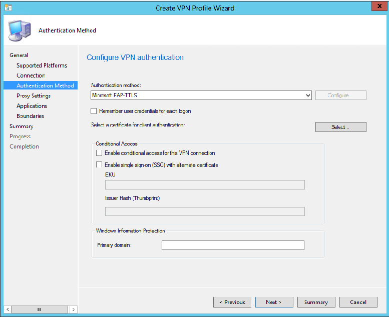

# VPN Profiles on mobile devices in System Center Configuration Manager

*Applies to: System Center Configuration Manager (Current Branch)*

Use VPN profiles in Configuration Manager to deploy VPN settings to mobile device users in your organization. When you deploy these settings, you minimize the end-user effort that's required to connect to resources on the company network.  

For example, you want to set up all iOS devices to connect to a file share on the corporate network. Create a VPN profile that has the necessary connection settings. Then deploy this profile to all users with iOS devices. These users see the VPN connection in the list of available networks and can connect to this network with little effort.  

When you create a VPN profile, you can include a wide range of security settings. For example, you can specify certificates for server validation and client authentication that have been set up by using Configuration Manager certificate profiles. For more information, see [Certificate profiles](../../protect/deploy-use/introduction-to-certificate-profiles.md).  

## VPN profiles when using Configuration Manager together with Intune

To deploy profiles to iOS, Android, Windows Phone, and Windows 8.1 devices, they must be enrolled in Microsoft Intune. Devices on other platforms can also be enrolled to Intune. For information about how to enroll, see [Enroll devices in Microsoft Intune](/intune/device-enrollment). 

This table shows the connection type that is supported for each device platform:  

 |Connection type|iOS and macOS X|Android|Windows 8.1|Windows RT|Windows RT 8.1|Windows Phone 8.1|Windows 10 Desktop and Mobile|  
 |---------------|---------------|-------|-----------|----------|--------------|-----------------|-----------------------------|  
 |Cisco AnyConnect|Yes1|Yes|No|No|No|No|No|
 |Cisco (IPSec)|iOS only|No|No|No|No|No|No|  
 |Pulse Secure|Yes|Yes|Yes|No|Yes|Yes|Yes|  
 |F5 Edge Client|Yes|Yes|Yes|No|Yes|Yes|Yes|  
 |Dell SonicWALL Mobile Connect|Yes|Yes|Yes|No|Yes|Yes|Yes|  
 |Check Point Mobile VPN|Yes|Yes|Yes|No|Yes|Yes|Yes|  
 |Microsoft SSL (SSTP)|No|No|Yes|Yes|Yes|No|No|  
 |Microsoft Automatic|No|No|Yes|Yes|Yes|No|Yes|  
 |IKEv2|Yes (Custom policy, iOS 9 and later)|No|Yes|Yes|Yes|Yes|Yes|  
 |PPTP|Yes|No|Yes|Yes|Yes|No|Yes|  
 |L2TP|Yes|No|Yes|Yes|Yes|No|Yes (OMA-URI)|  

1 Starting in version 1802, usage of the Cisco AnyConnect connection type varies.<!--1357393-->  
   - Use the **Cisco Legacy AnyConnect** option for VPN profiles on the following versions:
       - iOS with Cisco AnyConnect version 4.0.5 or earlier
       - macOS with any version of Cisco AnyConnect
   - Use the **Cisco AnyConnect** option for VPN profiles on the following versions:
       - iOS with Cisco AnyConnect version 4.0.7 or later

     > [!Note]  
     > Cisco AnyConnect 4.0.07x and later for iOS is a pre-release feature. To enable it, see [Pre-release features](/sccm/core/servers/manage/pre-release-features).  

## Windows 10 VPN features available when using Configuration Manager with Intune  

The following options are available to all connection types on Windows 10:

- **Bypass VPN when connected to company Wi-Fi network**: The VPN connection isn't used when the device is connected to the company Wi-Fi network. Enter the trusted network name that's used to determine if the device is connected to the company network.  

- **Network traffic rules**: Set the protocols, local port, remote port, and address ranges to enable for the VPN connection.  

     > [!Note]  
     > If you don't create a network traffic rule, all protocols, ports, and address ranges are enabled. After you create a rule, only the protocols, ports, and address ranges that you specify in that rule or in additional rules are used by the VPN connection.  
  
- **Routes**: Routes that use the VPN connection. Creation of more than 60 routes may cause the policy to fail.  

- **DNS servers**: DNS servers that are used by the VPN connection after the connection has been established.  

- **Apps that automatically connect to the VPN**: You can add apps or import lists of apps that automatically use the VPN connection. The type of app determines the app identifier. For a desktop app, provide the file path of the app. For a universal app, provide the package family name (PFN). To learn how to find the PFN for an app, see [Find a package family name for per-app VPN](../../protect/deploy-use/find-a-pfn-for-per-app-vpn.md).  

     > [!IMPORTANT]  
     > Secure all lists of associated apps that you compile for use in configuration of per-app VPN. If an unauthorized user changes your list and you import it to the per-app VPN app list, you potentially authorize VPN access to apps that should not have access. One way you can secure app lists is by using an access control list (ACL).  

## Create VPN profiles

1. In the Configuration Manager console, in the **Assets and Compliance** workspace, expand **Compliance Settings**, expand **Company Resource Access**, and select **VPN Profiles**. 

2. Click **Create VPN Profile** in the ribbon.  

3. On the **General** page, specify a **Name**, and then select the **VPN profile type**.   
     > [!NOTE]  
     > The name of a VPN profile that uses Windows 10 VPN features cannot be in Unicode or include special characters.

4. If the **Supported Platforms** page is available, select the OS versions for the previously specified VPN profile type. Choose **Select all** to install the VPN profile on all available OS versions.  

5. Configure the VPN connection on the **Connection** page. For more information on these options, see the step on the Connection page in [Create a VPN profile](/sccm/protect/deploy-use/create-vpn-profiles#create-a-vpn-profile).  

6.  On the **Authentication Method** page, specify the following settings:  

    -   **Authentication method**: Select the authentication method that the VPN connection uses. Available methods depend on the connection type as shown in this table.  

        |Authentication method|Supported&nbsp;connection&nbsp;types|  
        |---------------------------|--------------------------------|  
        |**Certificates**   **Notes:**<ul><li>If the client certificate authenticates to a RADIUS server, like a Network Policy Server, set the Subject Alternative Name in the certificate to the User Principal Name.</li><li>For Android deployments, select the EKU identifier and the certificate issuer thumbprint hash value. Otherwise, users must select the appropriate certificate manually.</li></ul>  |<ul><li>Cisco AnyConnect</li><li>Cisco Legacy AnyConnect</li><li>Pulse Secure</li><li>F5 Edge Client</li><li>Dell SonicWALL Mobile Connect</li><li> Check Point Mobile VPN</li></ul>|  
        |**Username and Password**|<ul><li>Pulse Secure</li><li>F5 Edge Client</li><li>Dell SonicWALL Mobile Connect</li><li> Check Point Mobile VPN</li></ul>|  
        |**Microsoft EAP-TTLS**|<ul><li>Microsoft SSL (SSTP)</li><li>Microsoft Automatic</li><li>PPTP</li><li>IKEv2</li><li>L2TP</li></ul>|  
        |**Microsoft protected EAP (PEAP)**|<ul><li>Microsoft SSL (SSTP)</li><li>Microsoft Automatic</li><li>IKEv2</li><li>PPTP</li><li>L2TP</li></ul>|  
        |**Microsoft secured password (EAP-MSCHAP v2)**|<ul><li>Microsoft SSL (SSTP)</li><li>Microsoft Automatic</li><li>IKEv2</li><li>PPTP</li><li>L2TP</li></ul>|  
        |**Smart Card or other certificate**|<ul><li>Microsoft SSL (SSTP)</li><li>Microsoft Automatic</li><li>IKEv2</li><li>PPTP</li><li>L2TP</li></ul>|  
        |**MSCHAP v2**|<ul><li>Microsoft SSL (SSTP)</li><li>Microsoft Automatic</li><li>IKEv2</li><li>PPTP</li><li>L2TP</li></ul>|  
        |**RSA SecurID** (iOS only)|<ul><li>Microsoft SSL (SSTP)</li><li>Microsoft Automatic</li><li>PPTP</li><li>L2TP</li></ul>|  
        |**Use machine certificates**|<ul><li>IKEv2</li></ul>|  

         Depending on the selected options, you might be asked to specify more information, like:  

        -   **Remember the user credentials at each logon**: User credentials are remembered so that users don't have to enter them each time they connect.  

        -   **Select a client certificate for client authentication**: Select the previously created client [SCEP certificate](create-pfx-certificate-profiles.md) that is used to authenticate the VPN connection.   

            > [!NOTE]  
            >  For iOS devices, the SCEP profile that you select is embedded in the VPN profile. For other platforms, an applicability rule is added to ensure that the VPN profile isn't installed if the certificate isn't present or isn't compliant.  
            >   
            >  If the SCEP certificate that you specify isn't compliant or hasn't been deployed, then the VPN profile
            >  isn't installed on the device.
            >  
            >  Devices that run iOS support only RSA SecurID and MSCHAP v2 for the authentication method when the connection type is PPTP. To avoid reporting errors, deploy a separate PPTP VPN profile to devices that run iOS.   

        - **Conditional access**  
			- Choose **Enable conditional access for this VPN connection** to ensure that devices that connect to the VPN are tested for conditional access compliance before connecting. For more information, see [Device compliance policies](/sccm/protect/deploy-use/device-compliance-policies).  

			- Choose **Enable single sign-on (SSO) with alternate certificate** to choose a certificate other than the VPN Authentication certificate for device compliance. If you choose this option, provide the **EKU** (comma-separated list) and **Issuer Hash**, for the correct certificate that the VPN client should locate.  

         - For **Windows Information Protection**, provide the enterprise-managed corporate identity, which is usually your organization's primary domain, for example, *contoso.com*. You can specify multiple domains that your organization owns by separating them with the "|" character. For example, *contoso.com|newcontoso.com*. For more information, see [Create and deploy a Windows Information Protection app protection policy with Intune](/intune/windows-information-protection-policy-create).   

         

         When the Windows client version supports it, the option to **Configure** the authentication method is available. This option opens the Windows properties dialog box to configure the authentication method. If **Configure** is disabled, use a different means to configure authentication method properties.  

3.  On the **Proxy Settings** page of the **Create VPN Profile Wizard**, check the **Configure proxy settings for this VPN profile** box if your VPN connection uses a proxy server. Then, provide the proxy server information. For more information, see the Windows Server documentation.  

	> [!NOTE]  
	>  On Windows 8.1 computers, the VPN profile will not show the proxy information until you connect to the VPN by using that computer.  

4. Configure further DNS settings, if necessary.  

5. Finish the wizard. The **VPN Profiles** node in the **Assets and Compliance** workspace shows the new VPN profile.  

## Next steps  
For more information on how to deploy VPN profiles, see [Deploy Wi-Fi, VPN, email, and certificate profiles](../../protect/deploy-use/deploy-wifi-vpn-email-cert-profiles.md).

 Use the following articles to help you plan for, set up, operate, and maintain VPN profiles:  

-   [Prerequisites for VPN profiles](../../protect/plan-design/prerequisites-for-wifi-vpn-profiles.md)  

-   [Security and privacy for VPN profiles](../../protect/plan-design/security-and-privacy-for-wifi-vpn-profiles.md)
