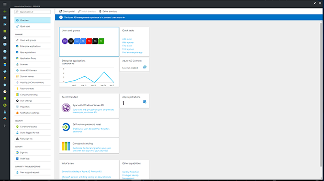
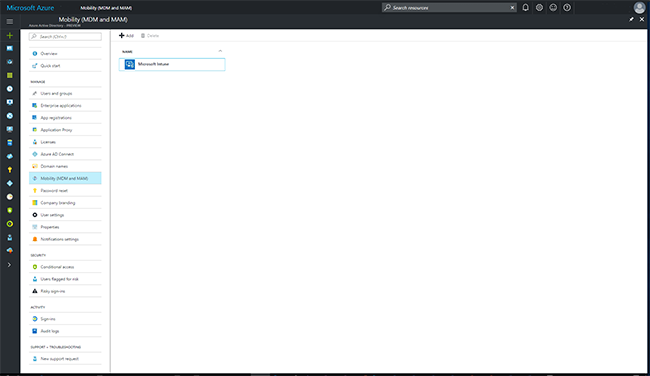
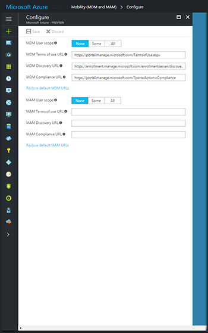

# Set up Windows hybrid device management with System Center Configuration Manager and Microsoft Intune

*Applies to: System Center Configuration Manager (Current Branch)*

This topic tells IT admins how they can enable their users to bring Windows PCs and mobile devices into management using Configuration Manager and Microsoft Intune.

## Enable Windows device management
To enable Windows device management for either PCs or mobile devices, use the following steps:

1.  Before you set up enrollment for any platform, complete the prerequisites and procedures in [Setup hybrid MDM](setup-hybrid-mdm.md).  
2.  In the Configuration Manager console in the **Administration** workspace, go to **Overview** > **Cloud Services** > **Microsoft Intune Subscriptions**.  
3.  In the ribbon, click **Configure Platforms**, and then select the Windows platform:
    - **Windows** for Windows PCs and laptops, then perform the following steps:
      1. In the **General** tab, click the **Enable Windows enrollment** checkbox.
      2. If you use a certificate to code-sign and deploy the Company Portal app, browse to the **Code-signing certificate**. Device users can also install the Company Portal app from the Windows Store or you can deploy the app from the Windows Store for Business without code-signing.
      3. You can also configure [Windows Hello for Business settings](windows-hello-for-business-settings.md).
    - **Windows Phone** for Windows phones and tablets, then perform the following steps:
      1. In the **General** tab, click the **Windows Phone 8.1 and Windows 10 Mobile** checkbox. Windows Phone 8.0 is no longer supported.
      2. If your organization needs to sideload company apps, you can upload the required token or file. For more information about sideloading apps, see [Create Windows apps](https://docs.microsoft.com/sccm/apps/get-started/creating-windows-applications).
        - **Application enrollment token**
        - **.pfx file**
        - **None**
      If you use a Symantec certificate, you can specify **Show an alert before Symantec certificates expire**.
4. Click **OK** to close the dialog box.  To simplify the enrollment process using the Company Portal, you should create a DNS alias for device enrollment. You can then tell users how to enroll their devices.

## Choose how to enroll Windows devices

Once you have assigned Intune licenses to users, Windows devices can be enrolled without any additional steps, but you can make enrollment easier for users.

Two factors determine how you can simplify Windows device enrollment:
- **Do you use Azure Active Directory Premium?**  [Azure AD Premium](https://docs.microsoft.com/azure/active-directory/active-directory-get-started-premium) is included with Enterprise Mobility + Security and other licensing plans.
- **What versions of Windows clients will enroll?**  Windows 10 devices can automatically enroll by adding a work or school account. Earlier versions must enroll using the Company Portal app.

||**Azure AD Premium**|**Other AD**|
|----------|---------------|---------------|  
|**Windows 10**|[Automatic enrollment](#enable-windows-10-automatic-enrollment) |[User enrollment](#enable-windows-enrollment-without-azure-ad-premium)|
|**Earlier Windows versions**|[User enrollment](#enable-windows-enrollment-without-azure-ad-premium)|[User enrollment](#enable-windows-enrollment-without-azure-ad-premium)|

## Enable Windows 10 automatic enrollment

Automatic enrollment lets users enroll either company-owned or personal Windows 10 PCs and Windows 10 mobile devices in Intune by adding a work or school account and agreeing to be managed. Simple as that. In the background, the user's device registers and joins Azure Active Directory. Once registered, the device is managed with Intune.

**Prerequisites**
- Azure Active Directory Premium subscription ([trial subscription](http://go.microsoft.com/fwlink/?LinkID=816845))
- Microsoft Intune subscription

### Configure automatic MDM enrollment

1. Sign in to the [Azure management portal](https://portal.azure.com) (https://manage.windowsazure.com), and select **Azure Active Directory**.

  

2. Select **Mobility (MDM and MAM)**.

  

3. Select **Microsoft Intune**.

  

4. Configure **MDM User scope**. Specify which users’ devices should be managed by Microsoft Intune. These users’ Windows 10 devices will be automatically enrolled for management with Microsoft Intune.

    - **None**
    - **Some**
    - **All**

   

5. Use the default values for the following URLs:
    - **MDM Terms of use URL**
    - **MDM Discovery URL**
    - **MDM Compliance URL**

6. Select **Save**.

By default, two-factor authentication is not enabled for the service. However, two-factor authentication is recommended when registering a device. Before requiring two-factor authentication for this service, you must configure a two-factor authentication provider in Azure Active Directory and configure your user accounts for multi-factor authentication. See [Getting started with the Azure Multi-Factor Authentication Server](https://docs.microsoft.com/azure/multi-factor-authentication/multi-factor-authentication-get-started-cloud).

## Enable Windows enrollment without Azure AD Premium
You can let users enroll their devices without Azure AD Premium automatic enrollment. Once you assign licenses, users can enroll after adding their work account to their personally-owned devices or joining their corporate-owned devices to your Azure AD. Creating a DNS alias (CNAME record type) makes it easier for users to enroll their devices. If you create DNS CNAME resource records, users connect and enroll in Intune without having to enter the Intune server name.

### Create CNAMEs to simplify enrollment
Create CNAME DNS resource records for your company’s domain. For example, if your company’s website is contoso.com, you would create a CNAME in DNS that redirects EnterpriseEnrollment.contoso.com to enterpriseenrollment-s.manage.microsoft.com.

Although creating CNAME DNS entries is optional, CNAME records make enrollment easier for users. If no enrollment CNAME record is found, users are prompted to manually enter the MDM server name, enrollment.manage.microsoft.com.

|Type|Host name|Points to|TTL|  
|----------|---------------|---------------|---|
|CNAME|EnterpriseEnrollment.company_domain.com|EnterpriseEnrollment-s.manage.microsoft.com| 1 hour|

If you have more than one UPN suffix, you need to create one CNAME for each domain name and point each one to EnterpriseEnrollment-s.manage.microsoft.com. For example, if users at Contoso use name@contoso.com, but also use name@us.contoso.com, and name@eu.constoso.com as their email/UPN, the Contoso DNS admin would need to create the following CNAMEs.

|Type|Host name|Points to|TTL|  
|----------|---------------|---------------|---|
|CNAME|EnterpriseEnrollment.contoso.com|EnterpriseEnrollment-s.manage.microsoft.com|1 hour|
|CNAME|EnterpriseEnrollment.us.contoso.com|EnterpriseEnrollment-s.manage.microsoft.com|1 hour|
|CNAME|EnterpriseEnrollment.eu.contoso.com|EnterpriseEnrollment-s.manage.microsoft.com| 1 hour|

`EnterpriseEnrollment-s.manage.microsoft.com` – Supports a redirect to the Intune service with domain recognition from the email’s domain name

Changes to DNS records might take up to 72 hours to propagate. You cannot verify the DNS change in Intune until the DNS record propagates.

## Tell users how to enroll devices  

 Once you're set up, you'll need to let your users know how to enroll their devices. See [What to tell users about enrolling their devices](https://docs.microsoft.com/intune/deploy-use/what-to-tell-your-end-users-about-using-microsoft-intune) for guidance. You can direct users to [Enroll your Windows device in Intune](https://docs.microsoft.com/intune/enduser/enroll-your-device-in-intune-windows). This information applies to both Microsoft Intune and Configuration Manager-managed mobile devices.

> [!div class="button"]
[< Previous step](create-service-connection-point.md)  [Next step >](set-up-additional-management.md)
