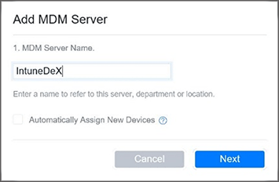
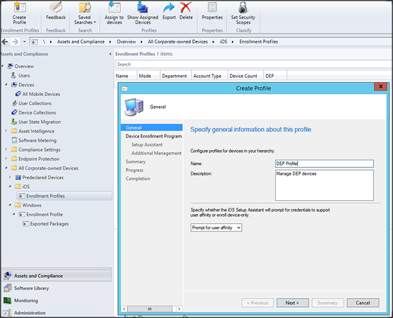
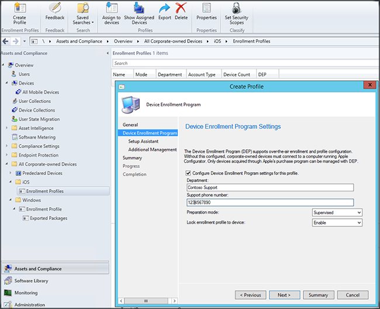
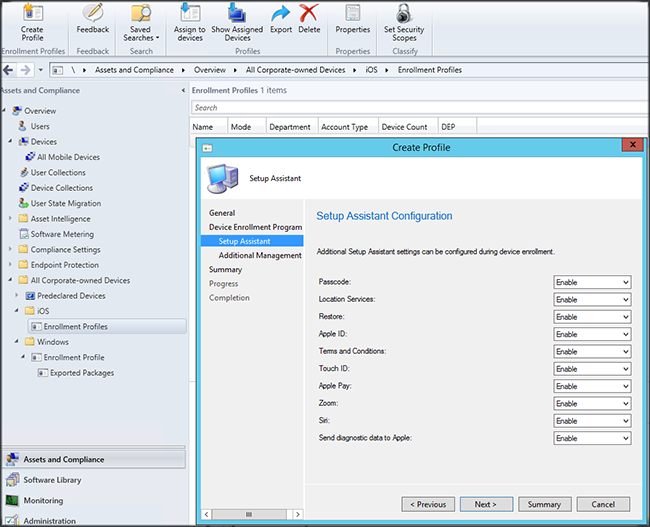
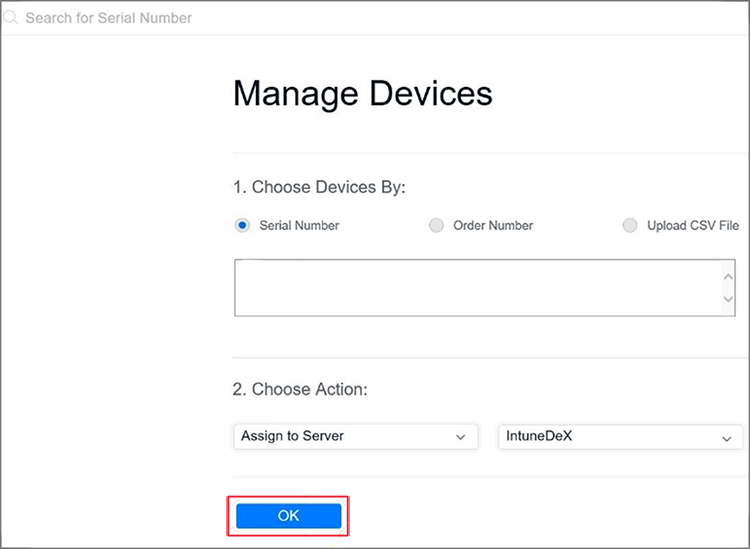
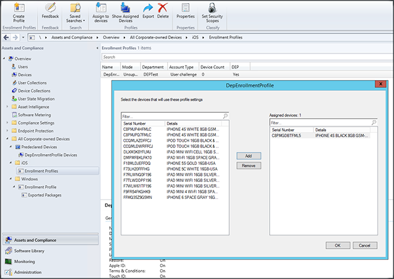

# iOS Device Enrollment Program (DEP) enrollment for hybrid deployments with Configuration Manager

*Applies to: System Center Configuration Manager (Current Branch)*

Companies can purchase iOS devices through Apple's device enrollment program and then manage them using Microsoft Intune. To manage corporate-owned iOS devices with the Apple Device Enrollment Program (DEP), companies must complete the steps with Apple to participate in the program and acquire devices through that program. Details of that process are available at:  [https://deploy.apple.com](https://deploy.apple.com). Advantages of the program include hands-free set up of devices without USB-connecting each device to a computer.  

 Before you can enroll corporate-owned iOS devices with the DEP, you need a DEP token from Apple. This token allows Intune to sync information about DEP-participating devices owned by your corporation. It also lets Intune upload enrollment profiles to Apple and assign devices to those profiles.  

## Apple DEP enrollment for iOS devices  
 The following procedures describe how to specify iOS devices purchased through Apple DEP as Intune-managed company-owned devices. When the user first powers up the device it will receive the DEP management profile and run the Setup Assistant and bring them into management.  

##  Enable DEP enrollment in Configuration Manager with Intune  

1.  **Start managing iOS devices with Configuration Manager**   
    Before you can enroll iOS Device Enrollment Program (DEP) devices, you must complete steps to [Set up Hybrid mobile device management](../../mdm/deploy-use/setup-hybrid-mdm.md) including [steps to support iOS enrollment](../deploy-use/enroll-hybrid-ios-mac.md).
2.  **Create a DEP token request**   
    In the Configuration Manager console, in the **Administration** workspace, expand **Hierarchy Configuration**, expand **Cloud Services**, and click **Microsoft Intune Subscriptions**. Click **Create DEP Token Request** on the **Home** tab, click **Browse** to specify the download location for the DEP token request, and then click **Download**. Save the DEP token request (.pem) file locally. The .pem file is used to request a trusted token (.p7m) from the Apple Device Enrollment Program portal.  
3.  **Get a Device Enrollment Program token**   
    Go to the [Device Enrollment Program portal](https://deploy.apple.com) (https://deploy.apple.com) and sign in with your company Apple ID. This Apple ID must be used in future to renew your DEP token.  
    1.  In the [Device Enrollment Program portal](https://deploy.apple.com), go to **Device Enrollment Program** > **Manage Servers**, and then click **Add MDM Server**.  
    
    2.  Enter the **MDM Server Name**, and then click **Next**. The server name is for your reference to identify the MDM server. It is not the name or URL of the Intune or Configuration Manager server.  
    3.  The **Add <ServerName\>** dialog box opens. Click **Choose File…** to upload the .pem file that you created in the previous step, and then click **Next**.  
    4.  The **Add <ServerName\>** dialog box displays a **Your Server Token** link. Download the server token (.p7m) file to your computer, and then click **Done**.  

     This certificate (.p7m) file is used to establish a trust relationship between Intune and Apple’s Device Enrollment Program servers.  
4.  **Add the DEP token to Configuration Manager**   
    In the Configuration Manager console, in the **Administration** workspace, expand **Hierarchy Configuration** and click **Microsoft Intune Subscriptions**. Click **Configure Platforms** on the **Home** tab and click **iOS**. Select **Enable Device Enrollment Program**, browse to the certificate (.p7m) file, click **Open**, click **Upload**, and then click **OK**.  

## Add a Corporate Device Enrollment Policy  

1. In the Configuration Manager console, in the **Assets and Compliance** workspace, expand **Overview**, expand **All Corporate-owned Devices**, expand **iOS**, and click **Enrollment Profiles**. Click **Create Profile** on the **Home** tab to open the Create Profile wizard. Configure the settings on the following pages:  
2. On the **General** page, specify the following information, and then click **Next**.  
  -   **Name** – Name of the device enrollment profile. (Not visible to users)  
  -   **Description** - Description of the device enrollment profile. (Not visible to users)  
  -   **User affinity** – Specifies how devices are enrolled. See [User affinity for hybrid managed devices in Configuration Manager](../../mdm/deploy-use/user-affinity-for-hybrid-managed-devices.md).  

      -  **Prompt for user affinity**: The device must be affiliated with a user during initial setup and could then be permitted to access company data and email as that user.  User affinity should be configured for DEP-managed devices that belong to users and need to use the company portal (i.e. to install apps).  
      > [!NOTE]
      > DEP with user affinity requires ADFS WS-Trust 1.3 Username/Mixed endpoint to be enabled to request user token.

      -   **No user affinity**: The device is not affiliated with a user. Use this affiliation for devices that perform tasks without accessing local user data. Apps requiring user affiliation won’t work.  
    

3. On the **Device Enrollment Program Settings** page, specify the following information, and then click **Next**.  
    -   **Department**: This information appears when users tap "About Configuration" during activation.  
    -   **Support phone number**: Displayed when the user clicks the **Need Help** button during activation.
       

    - **Preparation mode**: This state is set during activation and cannot be changed without factory resetting the device:  
        -   **Unsupervised** - Limited management capabilities  
        -   **Supervised** - Enables more management options and disables Activation Lock by default  
    - **Lock enrollment profile to device**: This state is set during activation and cannot be changed without a factory reset.  
      -   **Disable** - Allows the management profile to be removed from the **Settings** menu  
      -   **Enable** - (Requires **Preparation Mode** = **Supervised**) Disables iOS settings that could allow removal of the management profile  

4.  On the **Setup Assistant** page, configure the settings that customize the iOS Setup Assistant that starts when the device is first powered on, and then click **Next**. These settings include:  
  -   **Passcode** - Prompt for passcode during activation. Always require a passcode unless the device will be secured or have access controlled in some other manner (i.e. kiosk mode that restricts the device to one app).  
  -   **Location Services** - If enabled, Setup Assistant prompts for the service during activation  
  -   **Restore** - If enabled, Setup Assistant prompts for iCloud backup during activation  
  -   **Apple ID** - An Apple ID is required to download iOS App Store apps, including those installed by Intune. If enabled, iOS will prompt users for an Apple ID when Intune attempts to install an app without an ID.  
  -   **Terms and Conditions** - If enabled, Setup Assistant prompts users to accept Apple's terms and conditions during activation  
  -   **Touch ID** - If enabled, Setup Assistant prompts for this service during activation
  -   **Apple Pay** - If enabled, Setup Assistant prompts for this service during activation
  -   **Zoom** - If enabled, Setup Assistant prompts for this service during activation
  -   **Siri** - If enabled, Setup Assistant prompts for this service during activation  
  -   **Send diagnostic data to Apple** - If enabled, Setup Assistant prompts for this service during activation  
    
5.  On the **Additional Management** page, specify whether a USB connection can be used for additional management settings. When you select **Require certificate**, you must import an Apple Configurator management certificate to use for this profile.  Set to **Disallow** to prevent syncing files with iTunes or management via Apple Configurator. Microsoft recommends you set to **Disallow**, export any further configuration from Apple Configurator, and then deploy as a Custom iOS configuration profile, rather than use this setting to allow manual deployment with or without a certificate.  

  -   **Disallow** - Prevents the device from communicating via USB (disables pairing)  
  -   **Allow** - Allows device communicate via USB connection with any PC or Mac  
  -   **Require certificate**- Allows pairing with a Mac with a certificate imported to the enrollment profile  

## Assign DEP Devices for management

1. Go to the [Device Enrollment Program portal](https://deploy.apple.com) (https://deploy.apple.com) and sign in with your company Apple ID.
2. Go to **Deployment Program** > **Device Enrollment Program** > **Manage Devices**. Specify how you will **Choose Devices**, provide device information and specify details by device **Serial Number**, **Order Number**, or **Upload CSV File**. Next, select **Assign to Server** and select the <*ServerName*> that you specified in step 3, and then click **OK**.  

3.  **Synchronize DEP-managed devices**   
    In the **Assets and Compliance** workspace, go to **All Corporate-owned Devices** > **Predeclared Devices**. On the **Home** tab, click **DEP Sync**. A sync request is sent to Apple. After synchronization completes, the DEP-managed devices are displayed.

    > [!NOTE]
    > In the Hybrid configuration, the DEP Sync operation is manually triggered by clicking **DEP Sync** in the Configuration Manager console.

4.  **Assign DEP profile** In the **Assets and Compliance** workspace, go to **All Corporate-owned Devices** > **iOS** > **Enrollment Profiles**. Select the DEP enrollment profile and then, in the **Home** tab, click **Assign to devices**. Select the devices that will use this enrollment profile, click **Add**, and then click **OK**.   
     

## Distribute devices to users
You can now give your corporate-owned devices to users. The **Enrollment Status** for managed devices reads **Not contacted** until the device is powered on and runs the Setup Assistant to enroll the device. When an iOS device is turned on it will be enrolled for management by Intune.
