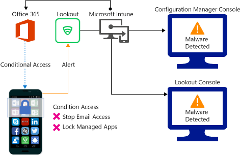

# Manage access to company resource based on device, network, and application risk

*Applies to: System Center Configuration Manager (Current Branch)*

You can control access from mobile devices to corporate resources, based on risk assessment conducted by Lookout, a device threat protection solution that is integrated with Microsoft Intune. The risk is based on telemetry that the Lookout service collects from devices for operating system (OS) vulnerabilities, installed malicious apps, and malicious network profiles. 

Based on Lookout's reported risk assessment enabled through System center configuration manager (SCCM) compliance policies, you can  configure conditional access policies and allow or block devices that have been determined to be noncompliant due to threats detected on those devices.

The [hybrid MDM deployment (SCCM with Intune)](https://docs.microsoft.com/sccm/mdm/understand/choose-between-standalone-intune-and-hybrid-mobile-device-management) gives you the ability to control the access to company resources and data based on risk assessment that device threat protection solutions like Lookout provides.

## How do the hybrid MDM deployment and Lookout device threat protection help protect company resources?
Lookout’s mobile app (Lookout for work), running on mobile devices, captures file system, network stack, device and application telemetry (where available) and sends it to the Lookout device threat protection cloud service to calculate an aggregate device risk for mobile threats. You can also change the classification of the risk level for the threats in the Lookout console to suit your requirements.  

The compliance policy in SCCM now includes a new rule for Lookout mobile threat protection that is based on the Lookout device threat risk assessment. When this rule is enabled, the device is evaluated for compliance.

If the device is determined as noncompliant with the compliance policy, access to resources like Exchange Online and SharePoint Online can blocked using conditional access policies. When access is blocked, the end-users are provided with a walkthrough to  help resolve the issue and gain access to company resources. This walkthrough is launched through the Lookout for work app.

## Supported platforms:
* **Android 4.1 and later**, and enrolled in Microsoft Intune.
* **iOS 8 and later**, and enrolled in Microsoft Intune.
For information about platforms and languages that Lookout supports, see this [article](https://personal.support.lookout.com/hc/en-us/articles/114094140253).

## Prerequisites:
* [Hybrid MDM deployment](https://docs.microsoft.com/sccm/mdm/understand/choose-between-standalone-intune-and-hybrid-mobile-device-management)
* A subscription to Microsoft Intune, and Azure Active Directory.
* A enterprise subscription to Lookout Mobile EndPoint Security.  For more information, see [Lookout Mobile Endpoint Security](https://www.lookout.com/products/mobile-endpoint-security)

## Example scenarios
Following are some common scenarios:
### Control access based on threat from malicious apps:
When malicious apps such as malware is detected on the device, you can block such devices from:
* Connecting to corporate e-mail before resolving the threat.
* Synchronizing corporate files using the OneDrive for Work app.
* Accessing business-critical apps.

**Access blocked when malicious apps are detected:**

**Device unblocked and is able to access company resources when the threat is remediated:**

### Control access based on threat to network:
Detect threats to your network such as Man-in-the-middle attacks and restrict access to WiFi networks based on the device risk.

**Access to network through WiFi blocked:**

**Access granted on remediation:**

### Control access to SharePoint Online based on threat to network:

Detect threats to your network such as Man-in-the-middle attacks, and prevent synchronization of corporate files based on the device risk.

**Access blocked SharePoint Online based on network threat detected on the device:**

**Access granted on remediation:**

## Next steps
Here are the main steps you must do to implement this solution:
1.	[Set up your subscription with Lookout mobile threat protection](set-up-your-subscription-with-lookout.md)
2.	[Enable Lookout MTP connection in Intune](enable-lookout-connection-in-intune.md)
3.  [Configure and deploy Lookout for work application](configure-and-deploy-lookout-for-work-apps.md)
4.	[Configure compliance policy](enable-device-threat-protection-rule-compliance-policy.md)
5.	[Troubleshoot Lookout integration](troubleshoot-lookout-integration.md)
