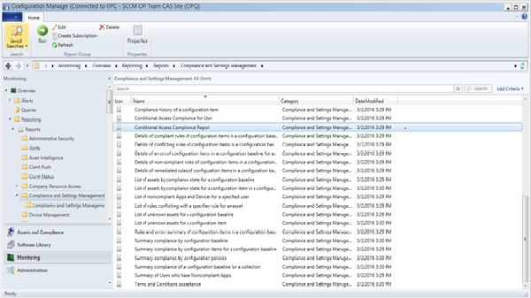

# Manage access to O365 services for PCs managed by System Center Configuration Manager

*Applies to: System Center Configuration Manager (Current Branch)*

Beginning with version 1602 of Configuration Manager, you can configure conditional access for PCs managed by System Center Configuration Manager.  

> [!Tip]  
> This feature was first introduced in version 1602 as a [pre-release feature](/sccm/core/servers/manage/pre-release-features). Beginning with version 1702, this feature is no longer a pre-release feature.

For information on configuring conditional access for devices enrolled and managed by Microsoft Intune, see [Manage access to services in System Center Configuration Manager](../../protect/deploy-use/manage-access-to-services.md). That article also covers devices that are domain joined and not evaluated for compliance.

## Supported Services  

-   Exchange Online
-   SharePoint Online

## Supported PCs  

-   Windows 7
-   Windows 8.1
-   Windows 10

## Supported Windows Servers

-   2008 R2
-   2012
-   2012 R2
-   2016

	> [!IMPORTANT]
	> For Windows Servers that may have multiple users signed in simultaneously, the same conditional access policies must be deployed to all of the users signed in.

## Configure conditional access  
 To set up conditional access, you must first create a compliance policy and configure conditional access policy. When you configure conditional access policies for PCs, you can require that the PCs be compliant with the compliance policy in order to access Exchange Online and SharePoint Online services.  

### Prerequisites  

-   ADFS Sync, and an O365 subscription. The O365 subscription is for setting up Exchange Online and SharePoint Online.  

-   A Microsoft Intune Subscription. The Microsoft Intune Subscription should be configured in Configuration Manager Console. The Intune subscription is used to relay device compliance state to Azure Active Directory and for user licensing.  

 The PCs must meet the following requirements:  

-   [Prerequisites](https://azure.microsoft.com/en-us/documentation/articles/active-directory-conditional-access-automatic-device-registration/?rnd=1) for automatic device registration with Azure Active Directory  

     You can register PCs with Azure AD through the compliance policy.  

    -   For Windows 8.1 and Windows 10 PCs, you can use an Active Directory Group Policy to configure your devices to register automatically with Azure AD.  

    -   o   For Windows 7 PCs, you must deploy the device registration software package to your Windows 7 PC through System Center Configuration Manager. The [Automatic device registration with Azure Active Directory for Windows Domain-Joined Devices](https://azure.microsoft.com/en-us/documentation/articles/active-directory-conditional-access-automatic-device-registration/?rnd=1) article has more details.  

-   Must use Office 2013 or Office 2016 with modern authentication [enabled](https://support.office.com/en-US/article/Using-Office-365-modern-authentication-with-Office-clients-776c0036-66fd-41cb-8928-5495c0f9168a).  

 The following steps apply to both Exchange Online and SharePoint Online  

### Step 1. Configure compliance policy  
 In the Configuration Manager Console, create a compliance policy with the following rules:  

-   **Require registration in Azure Active Directory:** This rule checks if the user's device is work-place joined to Azure AD, and if not, the device is automatically registered in Azure AD. Automatic registration is only supported on Windows 8.1. For Windows 7 PCs, deploy an MSI to perform the auto registration. For more information, see [Automatic device registration with Azure Active Directory](https://azure.microsoft.com/en-us/documentation/articles/active-directory-conditional-access-automatic-device-registration/?rnd=1)  

-   **All required updates installed with a deadline older than a certain number of days:** This rule checks if the user's device has all required updates (specified in the Required automatic updates rule) within deadline and grace period specified by you, and automatically install any pending required updates.  

-   **Require BitLocker drive encryption:** This rule checks if the primary drive (for example, C:\\) on the device is BitLocker encrypted. If Bitlocker encryption is not enabled on the primary device, access to email and SharePoint services is blocked.  

-   **Require Antimalware:** This rule checks if System Center Endpoint Protection or Windows Defender is enabled and running. If it is not enabled, access to email and SharePoint services is blocked.  

-   **Reported as healthy by Health Attestation Service:** This condition includes four subrules to check the device compliance against the device health attestation service. For more information, see [Health attestation](/sccm/core/servers/manage/health-attestation). 

    - **Require BitLocker to be enabled on the device**
    - **Require Secure Boot to be enabled on the device** 
    - **Require Code Integrity to be enabled on the device**
    - **Require Early Launch Anti-Malware to be enabled on the device**

>[!Tip]
> Introduced with version 1710, the conditional access criteria for device health attestation is a pre-release feature. To enable this feature, see [Pre-release features](/sccm/core/servers/manage/pre-release-features). 

### Step 2. Evaluate the effect of conditional access  
 Run the Conditional Access Compliance Report. It can be found in Monitoring section under Reports >Compliance and Settings Management. This report displays the compliance status for all devices.  Devices reporting as not compliant are blocked from accessing Exchange Online and SharePoint Online.  

   

### Configure Active Directory Security Groups  
 You target conditional access policies to groups of users depending on the policy types. These groups contain the users that the policy targets, or exempt from the policy. When a policy targets a user, each device they use must be compliant in order to access the service.  

 Active Directory security user groups. These user groups should be synchronized to Azure Active Directory. You can also configure these groups in the Office 365 admin center, or the Intune account portal.  

 You can specify two group types in each policy. :  

-   **Targeted groups** - User groups  to which the policy is applied. The same group should be used both for compliance and conditional access policy.  

-   **Exempted groups** - User groups that are exempt from the policy (optional)  
    If a user is in both, they are exempt from the policy.  

     Only the groups, which are targeted by the conditional access policy, are evaluated.  

### Step 3.  Create a conditional access policy, for Exchange Online and SharePoint Online  

1.  In the Configuration Manager console, click **Assets and Compliance**.  

2.  To create a policy for Exchange Online, select **Enable conditional access policy for Exchange Online**.  

     To create a policy for SharePoint Online, select **Enable conditional access policy for Exchange Online**.  

3.  On the **Home** tab, in the **Links** group, click **Configure Conditional Access Policy in the Intune Console**. You might need to supply the user name and password of the account used to connect Configuration Manager with Intune.  

     The Intune admin console opens.  

4.  For Exchange Online, in the Microsoft Intune administration console, click **Policy > Conditional Access > Exchange Online Policy**.  

     For SharePoint Online, in the Microsoft Intune administration console, click **Policy > Conditional Access > SharePoint Online Policy**.  

5.  Set the Windows PC requirement  to**Devices must be compliant option**.  

6.  Under **Targeted Groups**, click **Modify** to select the Azure Active Directory security groups to which the policy will apply.  

    > [!NOTE]  
    >  The same security user group should be used for deploying compliancy policy and the Targeted Group for conditional access policy.  

     Under **Exempted Groups**, optionally, click **Modify** to select the Azure Active Directory security groups that are exempt from this policy.  

7.  Click **Save** to create and save the policy  

Users view compliance information in Software Center. When blocked due to noncompliance, initiate a new policy evaluation after remediating compliance issues.  

## See also

- [Protect data and site infrastructure with System Center Configuration Manager](../../protect/understand/protect-data-and-site-infrastructure.md)
- [Conditional access troubleshooting flow-chart for Configuration Manager](https://gallery.technet.microsoft.com/Conditional-access-fd747c1a?redir=0)
