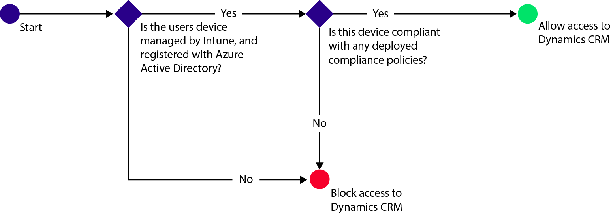

# Manage Dynamics CRM Online access in System Center Configuration Manager

*Applies to: System Center Configuration Manager (Current Branch)*

You can control access to Microsoft Dynamics CRM Online from iOS and Android devices with Microsoft Intune conditional access.  Intune conditional access has two components:
* [Device compliance policy](../../protect/deploy-use/device-compliance-policies.md) that the device must comply with in order to be considered compliant.
* [Conditional access policy](../../protect/deploy-use/manage-access-to-services.md) that where you specify the conditions that the device must meet in order to access the service.

To learn more about how conditional access works, read the [Manage access to services](../../protect/deploy-use/manage-access-to-services.md) article.

When a targeted user attempts to use the Dynamics CRM app on their device, the following evaluation occurs:

The device that needs access to Dynamics CRM Online must:
* Be an **Android** or **iOS** device.
* Be **enrolled** with Microsoft Intune.
* Be **compliant** with any deployed Microsoft Intune compliance policies.

The device state is stored in Azure Active Directory which grants or blocks access, based on the conditions you specify.

If a condition is not met, the user is presented with one of the following messages when they log in:
* If the device is not enrolled with Microsoft Intune, or is not registered in Azure Active Directory, a message is displayed with instructions about how to install the company portal app and enroll.
* If the device is not compliant, a message is displayed that directs the user to the Microsoft Intune Company Portal website or Company Portal app where they can find information about the problem, and how to remediate it.

## Configure conditional access for Dynamics CRM Online  
### Step 1: Configure Active Directory security groups

Before you start, configure Azure Active Directory security groups for the conditional access policy. You can configure these groups in the **Office 365 admin center**. These groups will be used to target, or exempt users from the policy. When a user is targeted by a policy, each device they use must be compliant in order to access resources.

You can specify two group types to use for the Dynamics CRM policy:
* **Targeted groups** – Contains groups of users to which the policy will apply.
* **Exempted groups** – Contains groups of users that are exempt from the policy.

If a user is in both groups, they will be exempt from the policy.

### Step 2: Configure and deploy a compliance policy
[Create and deploy](../../protect/deploy-use/device-compliance-policies.md) a compliance policy to all devices that will be affected by the policy. These would be all the devices that are used by the users in the Targeted groups.

> [!NOTE]
> While compliance policies are deployed to Microsoft Intune groups, conditional access policies are targeted to Azure Active Directory security groups.

> [!IMPORTANT]
> If you have not deployed a compliance policy, the devices will be treated as compliant.

When you are ready, continue to Step 3.
### Step 3: Configure the Dynamics CRM policy
Next, configure the policy to require that only managed and compliant devices can access Dynamics CRM. This policy will be will be stored in Azure Active Directory.

1.  In the Microsoft Intune administration console, choose **Policy > Conditional Access > Dynamics CRM Online Policy**.

     

2.  Select **Enable conditional access** policy.
3.  Under **Application access**, you can choose to apply conditional access policy to:
  * **iOS**
  * **Android**
4.  Under **Targeted Groups**, choose **Modify** to select the Azure Active Directory security groups to which the policy will apply. You can choose to target this to all users or just a select group of users.
5.  Under **Exempted Groups**, optionally, choose **Modify** to select the Azure Active Directory security groups that are exempt from this policy.
6.  When you are done, choose **Save**.

You have now configured conditional access for Dynamics CRM. You do not have to deploy the conditional access policy, it takes effect immediately.
##  Monitor the compliance and conditional access policies

In the **Groups** workspace, you can view the conditional access status of your devices.

Select any mobile device group and then, on the **Devices** tab, select one of the following **Filters**:
* **Devices that are not registered with AAD** – These devices are blocked from Dynamics CRM.
* **Devices that are not compliant** – These devices are blocked from Dynamics CRM.
* **Devices that are registered with AAD and compliant** – These devices can access Dynamics CRM.

###  See also
[Manage access to email](../../protect/deploy-use/manage-email-access.md)

[Manage access to SharePoint Online](../../protect/deploy-use/manage-sharepoint-online-access.md)

[Manage access to Skype for Business Online](../../protect/deploy-use/manage-skype-for-business-online-access.md)
