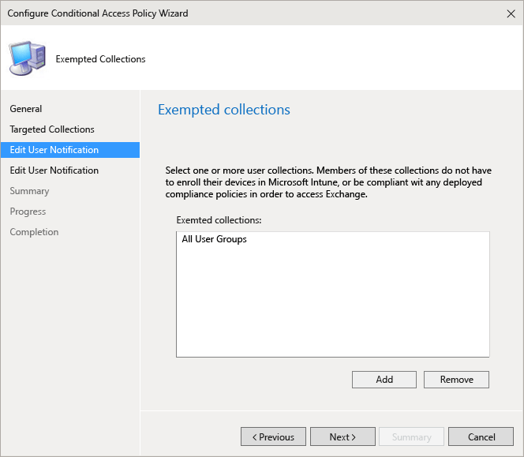

# Manage email access in Configuration Manager

*Applies to: System Center Configuration Manager (Current Branch)*

Use Configuration Manager conditional access to manage access to Exchange email based on conditions you specify.  

You can manage access to:  

- Microsoft Exchange On-premises  

- Microsoft Exchange Online  

- Exchange Online Dedicated  

You can control access to Exchange Online and Exchange On-premises from the built-in email client on the following platforms:  

- Android 4.0 and later, Samsung KNOX Standard 4.0 and later  

- iOS 9.0 and later  

- Windows Phone 8.1 and later  

- Mail application on Windows 8.1 and later  

Office desktop applications can access Exchange Online on PCs running:  

- Office desktop 2013 and later with [modern authentication](https://support.office.com/article/Using-Office-365-modern-authentication-with-Office-clients-776c0036-66fd-41cb-8928-5495c0f9168a) enabled.  

- Windows 7.0 or Windows 8.1  

> [!NOTE]  
> PCs should be domain-joined or be complaint with the policies set in Intune.  

## Device requirements
If you configure conditional access, before a user can connect to their email, the device they use must:  

- Be enrolled with Intune or a domain joined PC.  

- Register the device in Azure Active Directory (this happens automatically when the device is enrolled with Intune (for Exchange Online only). Additionally, the client Exchange ActiveSync ID must be registered with Azure Active Directory (does not apply to Windows and Windows Phone devices connecting to Exchange On-premises).  

    For a domain joined PC, you must set it to automatically register with Azure Active Directory. The **Conditional access for PCs** section in the [Manage access to services](../../protect/deploy-use/manage-access-to-services.md) article lists the full set of requirements to enable conditional access for PCs.  

- Be compliant with any Configuration Manager compliance policies deployed to that device  

    If a conditional access condition isn't met, the user is presented with one of the following messages when they log in:  

- If the device isn't enrolled with Intune, or isn't registered in Azure Active Directory, a message is displayed with instructions about how to install the company portal app, enroll the device, and (for Android and iOS devices), activate email, which associates the device's Exchange ActiveSync ID with the device record in Azure Active Directory.  

- If the device isn't compliant, a message is displayed that directs the user to the Intune web portal where they can find information about the problem and how to remediate it.  

#### For mobile devices

You can restrict access to **Outlook Web Access (OWA)** on Exchange Online when accessed from a browser on **iOS** and **Android** devices. Access will only be allowed from only supported browsers on compliant devices:  

- Safari (iOS)  
- Chrome (Android)  
- Managed Browser (iOS and Android)  

Unsupported browsers will be blocked. The OWA apps for iOS and Android aren't supported. They should be blocked through ADFS claims rules:  

- Setup ADFS claims rules to block non-modern authentication protocols. Detailed instructions are provided in scenario 3 to [block all access to O365 except browser based applications](https://technet.microsoft.com/library/dn592182.aspx).  

#### For PCs

- If the conditional access policy requirement is to allow **domain joined** or **compliant**, a message with instructions about how to enroll the device is displayed. If the PC does not meet either of the requirements, the user will be asked to enroll the device with Intune.  

- If the conditional access policy requirement is set to allow only domain joined windows devices, the device is blocked and a message to contact the IT admin is displayed.  

You can block access to Exchange email from the devices built-in Exchange ActiveSync email client on the following platforms:  

- Android 4.0 and later, Samsung KNOX Standard 4.0 and later  

- iOS 9.0 and later  

- Windows Phone 8.1 and later  

- The **Mail** application on Windows 8.1 and later  

Outlook app for iOS and Android, and Outlook desktop 2013 and above is supported for only Exchange Online.  

The **on-premises Exchange connector** between Configuration Manager and Exchange is required for conditional access to work.  

You can configure a conditional access policy for Exchange On-premises from the Configuration Manager console. When you configure a conditional access policy for Exchange Online, you can begin the process in the Configuration Manager console, which launches the Intune console where you can complete the process.  

## Configure conditional access

### Step 1: Evaluate the effect of the conditional access policy  

Once you have configured the **on-premises Exchange connector**, you can use the Configuration Manager **List of devices by Conditional Access State** report to identify devices that will be blocked from accessing Exchange after you configure the conditional access policy. This report also requires:  

- A subscription to Intune  

- The service connection point should be configured and deployed  

In the report parameters, select the Intune group you want to evaluate and, if required, the device platforms to which the policy will apply.  

For more information about how to run reports, see [Reporting in Configuration Manager](/sccm/core/servers/manage/reporting).  

After you run the report, examine these four columns to determine whether a user will be blocked:  

- **Management Channel**: The device is managed by Intune, Exchange ActiveSync, or both.  

- **Registered with AAD**: The device is registered with Azure Active Directory (known as workplace join).  

- **Compliant**: The device is compliant with any compliance policies you deployed.  

- **EAS Activated**: iOS and Android devices are required to have their Exchange ActiveSync ID associated with the device registration record in Azure Active Directory. This happens when the user clicks the **Activate Email** link in the quarantine email.  

    > [!NOTE]  
    > Windows Phone devices always display a value in this column.  

Devices that are part of a targeted group or collection will be blocked from accessing Exchange unless the column values match those listed in the following table:  

|Management channel|AAD registered|Compliant|EAS Activated|Resulting action|  
|------------------------|--------------------|---------------|-------------------|----------------------|  
|**Managed by Microsoft Intune and Exchange ActiveSync**|Yes|Yes|**Yes** or **No** is displayed|Email access allowed|  
|Any other value|No|No|No value is displayed|Email access blocked|  

You can export the contents of the report and use the **Email Address** column to help you inform users that they will be blocked.  

### Step 2: Configure user groups or collections for the conditional access policy  

You target conditional access policies to different groups or collections of users depending on the policy types. These groups contain the users that will be targeted, or exempt from the policy. When a user is targeted by a policy, each device they use must be compliant in order to access email.  

- **For the Exchange Online policy**: to Azure Active Directory security user groups. You can configure these groups in the **Office 365 admin center**, or the **Intune account portal**.  

- **For the Exchange On-premises policy**: to Configuration Manager user collections. You can configure these in the **Assets and Compliance** workspace.  

You can specify two group types in each policy:  

- **Targeted groups**: User groups or collections to which the policy is applied  

- **Exempted groups**: User groups or collections that are exempt from the policy (optional)  

If a user is in both, they will be exempt from the policy.  

Only the groups or collections which are targeted by the conditional access policy are evaluated for Exchange access.  

### Step 3: Configure and deploy a compliance policy  

Ensure that you have created and deployed a compliance policy to all devices that the Exchange conditional access policy will be targeted to.  

For details about how to configure the compliance policy, see [Manage device compliance policies](device-compliance-policies.md).  

> [!IMPORTANT]  
> If you haven't deployed a compliance policy and then enable an Exchange conditional access policy, all targeted devices will be allowed access.  

### Step 4: Configure the conditional access policy  

#### For Exchange Online (and tenants in the new Exchange Online Dedicated environment)

> [!NOTE]  
> You can also create conditional access policy in the Azure AD management console. Azure AD management console allows you to create the Intune device conditional access policies (referred to as the device-based conditional access policy in Azure AD) in addition to other conditional access policies like multi-factor authentication. You can also set conditional access policies for third-party Enterprise apps like Salesforce and Box that Azure AD supports. For more details, see [How To: Require managed devices for cloud app access with conditional access](https://docs.microsoft.com/azure/active-directory/conditional-access/require-managed-devices).  

The following flow is used by conditional access policies for Exchange Online to evaluate whether to allow or block devices.  

  

To access email, the device must:  

- Enroll with Intune  

- PCs must either be domain-joined or be enrolled and compliant with the policies set in Intune  

- Register the device in Azure AD. This happens automatically when the device is enrolled with Intune. For domain joined PCs, you must set it up to [automatically register the device](https://docs.microsoft.com/azure/active-directory/devices/hybrid-azuread-join-manual-steps) with Azure AD.  

- Have activated email, which associates the device's Exchange ActiveSync ID with the device record in Azure Active Directory (applies to iOS and Android devices only).  

- Be compliant with any deployed compliance policies  

The device state is stored in Azure Active Directory which grants or blocks access to email, based on the evaluated conditions.  

If a condition isn't met, the user is presented with one of the following messages when they sign in:  

- If the device isn't enrolled, or registered in Azure AD, a message is displayed with instructions about how to install the company portal app and enroll  

- If the device isn't compliant, a message is displayed that directs the user to the Intune Company Portal website or the Company Portal app where they can find information about the problem and how to remediate it.  

- For a PC:  

    - If the policy is set to require domain join, and the PC isn't domain-joined, a message is displayed to contact the IT admin.  

    - If the policy is set to require domain join or compliant, and the PC doesn't meet either requirement, a message is displayed with instructions about how to install the company portal app and enroll.  

The message is displayed on the device for Exchange Online users and tenants in the new Exchange Online Dedicated environment, and is delivered to the users email inbox for Exchange On-premises and legacy Exchange Online Dedicated devices.  

> [!NOTE]  
> Configuration Manager conditional access rules override, allow, block and quarantine rules that are defined in the Exchange Online admin console.  
> 
> Conditional access policy must be configured in the Intune console. The following steps begin by accessing the Intune console through Configuration Manager. If prompted, sign in using the same credentials that were used to set up the service connection point between Configuration Manager and Intune.  

##### To enable the Exchange Online policy  

1. In the Configuration Manager console, select **Assets and Compliance**.  

2. Expand **Compliance Settings**, expand **Conditional Access**, and then select **Exchange Online**.  

3. On the **Home** tab, in the **Links** group, select **Configure Conditional Access Policy in the Intune Console**. You might need to provide the user name and password of the account used to connect Configuration Manager with any global administrator for the Intune service. The Intune admin console opens.  

4. In the Microsoft Intune portal, select **Policy** > **Conditional Access** > **Exchange Online Policy**.  

      

5. On the **Exchange Online Policy** page, select **Enable conditional access policy for Exchange Online**. If you check this, the device must be compliant. If this isn't checked then conditional access isn't applied.  

    > [!NOTE]  
    > If you haven't deployed a compliance policy and then enable the Exchange Online policy, all targeted devices are reported as compliant.  
   >   
   >  Regardless of the compliance state, all users who are targeted by the policy will be required to enroll their devices with Intune.  

6. Under **Application access**, for Outlook and other apps using modern authentication, you can choose to restrict access only to devices that are compliant for each platform. Windows devices must either be domain joined, or be enrolled in Intune and compliant.  

    > [!TIP]  
    > **Modern authentication** brings Active Directory Authentication Library (ADAL)-based sign in to Office clients.  
    > 
    > - The ADAL based authentication enables Office clients to engage in browser-based authentication (also known as passive authentication). To authenticate, the user is directed to a sign-in web page.  
    > - This new sign-in method enables new scenarios such as, conditional access, based on **device compliance** and whether **multi-factor authentication** was performed.  
    > 
    >  For more information, see [How modern authentication works for Office 2013 and Office 2016 client apps](https://docs.microsoft.com/office365/enterprise/modern-auth-for-office-2013-and-2016).  

    Using Exchange Online with Configuration Manager and Intune, you can not only manage mobile devices with conditional access, but also desktop computers as well. PCs must either be domain-joined, or be enrolled in Intune and compliant. You can set the following requirements:  

    - **Devices must be domain joined or compliant.** PCs must either be domain-joined or compliant with the policies. If a PC doesn't meet either of these requirements, the user is prompted to enroll the device with Intune.  

    - **Devices must be domain joined.** PCs must be domain-joined to access Exchange Online. If a PC isn't domain-joined, access to email is blocked and the user is prompted to contact the IT admin.  

    - **Devices must be compliant.** PCs must be enrolled in Intune and compliant. If a PC isn't enrolled, a message with instructions on how to enroll is displayed.  

7. Under **Outlook web access (OWA)**, you can choose to allow access to Exchange Online only through the supported browsers: Safari (iOS), and Chrome (Android). Access from other browsers will be blocked. The same platform restrictions you selected for Application access for Outlook also apply here.  

    - On **Android** devices, users must enable the browser access. To do this action, the user must enable the "Enable Browser Access" option on the enrolled device as follows:  

        1. Launch the **Company Portal app**.  

        2. Go to the **Settings** page from the triple dots (...) or the hardware menu button.  

        3. Press the **Enable Browser Access** button.  

        4. In the Chrome browser, sign out of Office 365 and restart Chrome.  

    - On **iOS and Android** platforms, to identify the device that's used to access the service, Azure AD will issue a TLS certificate to the device. The device displays the certificate with a prompt to the user to select the certificate as seen in the screenshots below. The user must select this certificate before they can continue to use the browser.  

        - **iOS**  

          

        - **Android**  

          

8. For**Exchange ActiveSync mail apps**, you can choose to block email from accessing Exchange Online if the device is noncompliant, and select whether to allow or block access to email when Intune cannot manage the device.  

9. Under **Targeted Groups**, select the Active Directory security groups of users to which the policy will apply.  

    > [!NOTE]  
    > For users that are in the targeted groups, the Intune polices will replace Exchange rules and policies.  
    > 
    > Exchange will only enforce Exchange allow, block and quarantine rules, and Exchange policies if:  
    > 
    > - The user is not licensed for Intune.  
    > - The user is licensed for Intune, but the user doesn't belong to any security groups targeted in the conditional access policy.  

10. Under **Exempted Groups**, select the Active Directory security groups of users that are exempt from this policy. If a user is in both the targeted and exempted groups, they will be exempt from the policy and will have access to their email.  

11. When you are finished, click **Save**.  

Review the following notes about this policy:  

- You don't have to deploy the conditional access policy; it takes effect immediately.  

- After a user creates an email account, the device is blocked immediately.  

- If a blocked user enrolls the device with Intune (or remediates noncompliance), email access is unblocked within 2 minutes.  

- If the user un-enrolls their device, email is blocked after about 6 hours.  

### For Exchange on-premises (and tenants in the legacy Exchange Online Dedicated environment)  
The following flow is used by conditional access policies for Exchange on-premises and tenants in the legacy Exchange Online Dedicated environment to evaluate whether to allow or block devices.  

  

#### To enable the Exchange On-premises policy  

1. In the Configuration Manager console, select **Assets and Compliance**.  

2. Expand **Compliance Settings**, expand **Conditional Access**, and then select **On-Premises Exchange**.  

3. On the **Home** tab, in the **On-Premises Exchange** group, select **Configure Conditional Access Policy**.  

4. On the **General** page of the **Configure Conditional Access Policy Wizard**, specify whether you want to override the Exchange Active Sync default rule. Select this option if you want enrolled and compliant devices to always have access to email, even when the default rule is set to quarantine or block access.  

    > [!NOTE]  
    > There's an issue with the default override for Android devices. If the default access rule of the Exchange server is set to **Block** and the Exchange conditional access policy is enabled with the default rule override option, then the Android devices of the targeted users may not get unblocked even after the devices are Intune enrolled and compliant. To workaround this issue, set the Exchange default access rule to **Quarantine**. The device doesn't get access to Exchange by default, and the administrator can get a report from the Exchange server on the list of devices that are being quarantined.  

    If you haven't setup a notification email account when you set up the Exchange connector, you'll see a warning on this page, and the **Next** button is disabled.  Before you can proceed, you must first configure the notification email settings in the Exchange Connector and then  come back to the **Configure Conditional Access Policy Wizard** to complete the process.  

       

5. On the **Targeted Collections** page, add one or more user collections. In order to access Exchange, users in these collections must enroll their devices with Intune and also be compliant with any compliance policies you deployed.  

       

6. On the **Exempted Collections** page, add any user collections that you want to be exempt from the conditional access policy. Users in these groups, don't need to enroll their devices with Intune and don't need to be compliant with any deployed compliance policies in order to access Exchange.  

       

    If a user appears in both the targeted and exempted lists, they will be exempt from the conditional access policy.  

7. On the **Edit User Notification** page, configure the email that Intune sends to users with instructions about how to unblock their device (in addition to the email that Exchange sends).  

    You can edit the default message and use HTML tags to format how the text appears. You can also send an email in advance to your employees notifying them of the upcoming changes and providing them with instructions about enrolling their devices.  

       

    > [!NOTE]  
    > Because the Intune notification email containing remediation instructions is delivered to the user's Exchange mailbox, in the event that the user's device gets blocked before they receive the email message, they can use an unblocked device or other method to access Exchange and view the message.  
    > 
    > In order for Exchange to send the notification email, configure the account that will be used to send the notification email. You do this when you configure the properties of the Exchange Server connector.  
    >   
    > For more information, see [Manage mobile devices with Configuration Manager and Exchange](/sccm/mdm/deploy-use/manage-mobile-devices-with-exchange-activesync).  

8. On the **Summary** page, review your settings, and then complete the wizard.  

Review the following notes about this policy:  

- You don't have to deploy the conditional access policy, it takes effect immediately.  

- After a user sets up an Exchange ActiveSync profile, it might take one to three hours for the device to be blocked (if it isn't managed by Intune).  

- If a blocked user then enrolls the device with Intune (or remediates noncompliance), email access will be unblocked within two minutes.  

- If the user un-enrolls from Intune it might take one to three hours for the device to be blocked.  

## See also  

[Manage access to services](/sccm/protect/deploy-use/manage-access-to-services)
