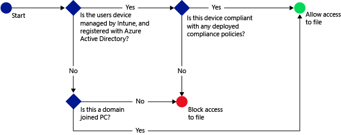
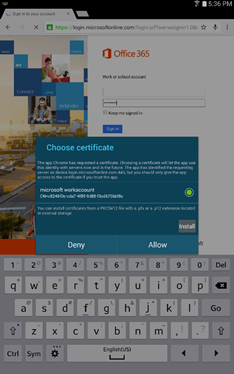

# Manage SharePoint Online access in System Center Configuration Manager

*Applies to: System Center Configuration Manager (Current Branch)*

The Configuration Manager conditional access policy for **SharePoint Online** manages access to OneDrive for Business files, which are stored on SharePoint Online. Access is based on conditions you specify.
You can control access to SharePoint Online from the following apps for the listed platforms:  

-   Microsoft Office Mobile (Android)  

-   Microsoft OneDrive (Android and iOS)  

-   Microsoft Word (Android and iOS)  

-   Microsoft Excel (Android and iOS)  

-   Microsoft PowerPoint (Android and iOS)  

-   Microsoft OneNote (Android and iOS)

Office desktop applications can access SharePoint Online on PCs running:  

-   Office desktop 2013 and later with [modern authentication](https://support.office.com/article/Using-Office-365-modern-authentication-with-Office-clients-776c0036-66fd-41cb-8928-5495c0f9168a) enabled.  

-   Windows 7.0 or Windows 8.1  

> [!NOTE]  
>  PCs should be domain joined or be complaint with the policies set in Intune.  

 When a targeted user tries to connect to a file using a supported app such as OneDrive on their device, the following evaluation occurs:  

   

 To connect to the required files, the device running OneDrive must:  

- Be enrolled with Microsoft Intune or a domain joined PC.  

- Register the device in Azure Active Directory (Azure AD). This registration happens automatically when the device is enrolled with Intune.  

   For domain joined PCs, you must set it up to [automatically register](/azure/active-directory/device-management-hybrid-azuread-joined-devices-setup) with Azure AD.  

- Be compliant with any deployed Configuration Manager compliance policies  

  Azure AD stores the device state. It grants or blocks access to the files, based on the conditions you specify.  

  If a condition isn't met, the user is presented with one of the following messages when they log in:  

- If the device isn't enrolled with Intune, or isn't registered in Azure AD, a message is displayed with instructions about how to install the Company Portal app and enroll.  

- If the device isn't compliant, a message is displayed that directs the user to the Intune web portal. There they can find information about the problem, and how to remediate it.  

- For mobile devices:

  You can restrict access to SharePoint Online when accessed from a browser on **iOS** and **Android** devices. Access is only allowed from supported browsers on compliant devices:  
  - Safari (iOS)
  - Chrome (Android)
  - Managed Browser (iOS and Android)  

    Unsupported browsers are blocked.  

- For a PC:  

  -   If the policy is set to require domain join, and the PC isn't domain joined, a message is displayed to contact the IT admin.  

  -   If the policy is set to require domain join or compliant, and the PC doesn't meet either requirement, a message is displayed with instructions about how to install the Company Portal app and enroll.  

You can block access to SharePoint Online from the following apps:  

-   Microsoft Office Mobile (Android)  

-   Microsoft OneDrive (Android and iOS)  

-   Microsoft Word (Android and iOS)  

-   Microsoft Excel (Android and iOS)  

-   Microsoft PowerPoint (Android and iOS)  

-   Microsoft OneNote (Android and iOS)  

## Configure conditional access for SharePoint Online  

### Step 1: Configure Active Directory security groups  
 Before you start, configure Azure AD security groups for the conditional access policy. You can configure these groups in the **Office 365 admin center**, or the **Intune account portal**. These groups include the users that are targeted, or exempt from the policy. When a user is targeted by a policy, each device they use must be compliant to access resources.  

 You can specify two group types in a SharePoint Online policy:  

- **Targeted groups**: Contains groups of users to which the policy applies  

- **Exempted groups**: Contains groups of users that are exempt from the policy (optional)  

  If a user is in both groups, they're exempt from the policy.  

### Step 2: Configure and deploy a compliance policy  
 Create and deploy a compliance policy to all devices to which you target the SharePoint Online policy.  

> [!NOTE]   
>  While compliance policies are deployed to Intune groups, or Configuration Manager collections, conditional access policies are targeted to Azure AD security groups.  

 For details about how to configure the compliance policy, see [Manage device compliance policies in System Center Configuration Manager](../../protect/deploy-use/device-compliance-policies.md).  

> [!IMPORTANT]  
>  If you haven't deployed a compliance policy, and then enable the SharePoint Online policy, all targeted devices are allowed access.  

   

###   Step 3: Configure the SharePoint Online policy  

 Next, configure the policy to require that only managed and compliant devices can access SharePoint Online. This policy is stored in Azure AD.

 >[!NOTE]
 >You can also create conditional access policy in the Azure AD management console. The Azure AD management console allows you to create the Intune device conditional access policies. Azure AD refers to these policies as the device-based conditional access policy. You can also create other conditional access policies, like multi-factor authentication. In the portal, you can set conditional access policies for third-party enterprise apps that Azure AD supports, like Salesforce and Box. For more information, see [How to set Azure AD device-based conditional access policy for access control to Azure AD connected applications](/azure/active-directory/active-directory-conditional-access-policy-connected-applications).  

1. In the Configuration Manager console, click **Assets and Compliance**.  

2. Select **Enable conditional access policy for SharePoint Online**.  

      

3. Under **Application access** for Outlook and apps that use modern authentication, you can choose to restrict access to only devices that are compliant for each platform.  

   > [!TIP]
   >  **Modern authentication** brings Active Directory Authentication Library (ADAL)-based sign-in to Office clients.  
   > 
   > - The ADAL-based authentication enables Office clients to engage in browser-based authentication (also known as passive authentication). To authenticate, the user is directed to a sign-in web page.  
   >   -   This new sign-in method enables new scenarios like conditional access based on **device compliance**, and whether **multi-factor authentication** was performed.  
   > 
   >   For more information, see [How modern authentication works for Office 2013 and Office 2016 client apps](https://support.office.com/article/How-modern-authentication-works-for-Office-2013-and-Office-2016-client-apps-e4c45989-4b1a-462e-a81b-2a13191cf517).  

    For windows PCs, the PC must either be domain joined, or enrolled with Intune and compliant. You can set the following requirements:  

   -   **Devices must be domain joined or compliant**: The PCs must either be domain joined or compliant with the policies set in Intune. If the PC doesn't meet either of these requirements, the user is prompted to enroll the device with Intune.  

   -   **Devices must be domain joined**: The PCs must be domain joined to access Exchange Online. If the PC is not domain joined, access to email is blocked, and the user is prompted to contact the IT admin.  

   -   **Devices must be compliant**: The PCs must be enrolled in Intune and compliant. If the PC isn't enrolled, a message with instructions on how to enroll is displayed.  

4. Under **Browser access** to SharePoint Online and OneDrive for Business, you can choose to allow access to Exchange Online only through the supported browsers: Safari (iOS), and Chrome (Android). Access from other browsers is blocked. The same platform restrictions you selected for Application access for OneDrive also apply here.

   On **Android** devices, users must enable the **Enable Browser Access** option on the enrolled device as follows:
   1.  Launch the **Company Portal app**.
   2.  Go to the **Settings** page from the triple dots (...) or the hardware menu button.
   3.  Press the **Enable Browser Access** button.
   4.  In the Chrome browser, sign out of Office 365 and restart Chrome.

   On **iOS and Android** platforms, To identify the device that is used to access the service, Azure AD issues a TLS certificate to the device. The device displays the certificate with a prompt to the end user to select the certificate as seen in the following screenshots: The end user must select this certificate before they can continue to use the browser.

    **iOS**

    

    **Android**

     

5. On the **Home** tab, in the **Links** group, click **Configure Conditional Access Policy in the Intune Console**. You might need to supply the user name and password of the account used to connect Configuration Manager with Intune.  

    The Intune admin console opens.  

6. In the [Microsoft Intune administration console](https://manage.microsoft.com), click **Policy** > **Conditional Access** > **SharePoint Online Policy**.  

7. Select **Block apps from accessing SharePoint Online if the device is noncompliant**.  

8. Under **Targeted Groups**, click **Modify** to select the Azure AD security groups to which the policy applies.  

9. Under **Exempted Groups**, optionally, click **Modify** to select the Azure AD security groups that are exempt from this policy.  

10. When you are done, click **Save**.  

    You don't have to deploy the conditional access policy, it takes effect immediately.  

    See [Manage SharePoint Online access with Microsoft Intune](/intune-classic/deploy-use/restrict-access-to-sharepoint-online-with-microsoft-intune) for information about how you can monitor the policy from the Intune console.  

### See also  

 [Manage access to services in System Center Configuration Manager](../../protect/deploy-use/manage-access-to-services.md)
