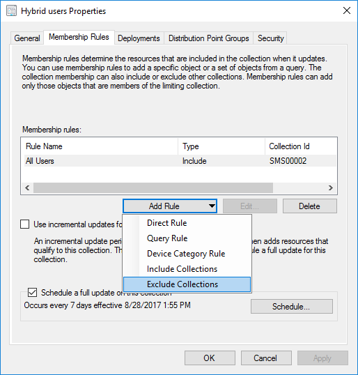
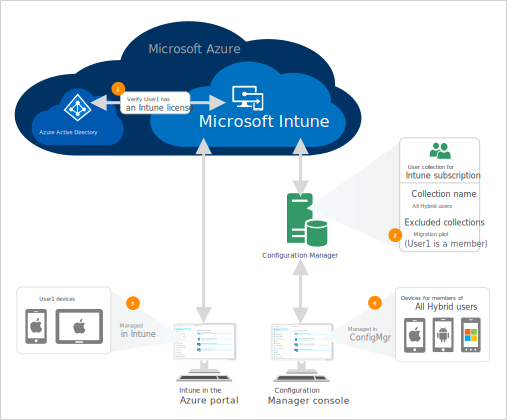

---
# required metadata

title: Change the MDM authority for specific users (mixed MDM authority) 
description:
keywords:
author: dougeby
manager: dougeby
ms.date: 09/12/2017
ms.topic: article
ms.prod: configmgr-hybrid
ms.service:
ms.technology:
ms.assetid: 6f0201d7-5714-4ba0-b2bf-d1acd0203e9a

# optional metadata

#ROBOTS:
#audience:
#ms.devlang:
#ms.reviewer: [ALIAS]
#ms.suite: ems
#ms.tgt_pltfrm:
#ms.custom:

---
# Change the MDM authority for specific users (mixed MDM authority) 

*Applies to: System Center Configuration Manager (Current Branch)*

You can configure a mixed MDM authority in the same tenant by selecting some users to be managed in Intune and others to be managed with hybrid MDM (Intune integrated with Configuration Manager). This topic provides information about how to start moving users to Intune standalone and assumes that you have completed the following steps:
- Used the data import tool to [import Configuration Manager objects to Intune](migrate-import-data.md).
- [Prepared Intune for user migration](migrate-prepare-intune.md) to ensure users and their devices continue to be managed after they are migrated.

Migrated users and their devices will be managed in Intune and other devices will continue to be managed in Configuration Manager. You will start with a small test group of users to verify that everything is working as expected. Then, you will gradually migrate additional groups of users until you are ready to switch the tenant-level MDM authority from Configuration Manager to Intune standalone. 

## Things to consider
- During the phased migration, any existing MDM policies or apps in Configuration Manager continue to apply to hybrid MDM devices.
- Users are added to an AAD group that you designate as your migration group. All devices associated with users in the migration group are managed in Intune.
- If devices are added to the AAD group, they are ignored unless they are a device without an associated user.
- Users not in an AAD group marked for migration automatically inherit the tenant-level MDM authority (Configuration Manager).
- When you migrate a user to Intune, the user and devices will appear in the Intune on Azure portal after about 15 minutes.  
- When you migrate users to Intune standalone, the following settings continue to be managed from Configuration Manager for both Intune standalone and hybrid MDM devices:
    - [Apple Push Notification service (APNs) certificate](/sccm/mdm/deploy-use/enroll-hybrid-ios-mac)
    - [Device Enrollment Program](/sccm/mdm/deploy-use/ios-device-enrollment-program-for-hybrid)
    - Enrollment profiles
    - [Volume Purchase Program (VPP) licenses](sccm/mdm/deploy-use/manage-volume-purchased-ios-apps)
    - Corporate identifiers 
    - [Code Signing certificates](/sccm/mdm/deploy-use/enroll-hybrid-windows)
    - [Device categories](/sccm/core/clients/manage/collections/automatically-categorize-devices-into-collections)
    - [Enrollment managers](/sccm/mdm/plan-design/device-enrollment-methods)
    - Windows SLKs
    - Company Portal branding
    - Migrate users to Intune

To test that your Intune configurations are working as expected, first migrate a small set of users and their devices. Then, after you confirm things are working as expected, you can start migrating more AAD groups with more users and their devices.

## Migrate a test group of users to Intune standalone
The devices for the users in the collection associated with the Intune subscription can enroll in hybrid MDM. When you remove a user from the collection, their enrolled devices are migrated to Intune standalone if the user has an assigned Intune license. If you haven’t already assigned licenses to users that you plan to migrate, see [Assign Intune licenses to your user accounts](https://docs.microsoft.com/intune/licenses-assign). In the collection for the Intune subscription, you can exclude user collections from your main collection to migrate the users in the excluded collection. 

In the following example, the Hybrid users collection contains all members from the All Users collection. This allows any user to enroll a device into hybrid MDM. To migrate users to Intune standalone, you select Exclude Collections and add a collection with the users to migrate. When you are ready to migrate more users, you can add additional excluded collections that include those users. 

> [!Note] 
> When you have the **All users** collection selected for the Intune subscription, you are not allowed to add a rule to exclude collections. Create a new collection based on the **All users** collection, verify that the collection contains the users that you expect, and then edit the Intune subscription to use the new collection. You can exclude user collections from the new collection to migrate users. 

To migrate a test group of users to Intune, create a user collection that contain the users to migrate, and then exclude the user collection from the collection used for the Intune subscription.   
In the following diagram, the Intune subscription uses a collection named **All Hybrid users** and contains a rule to exclude users in the **Migration pilot** collection. **User1** is a member of the **Migration pilot** collection, is excluded from the **All Hybrid users** collection, and has an Intune license. Therefore, **User1**’s devices are now managed from Intune in the Azure portal. All other devices are managed from the Configuration Manager console. 

 

## Verify Intune standalone functionality
After you have migrated a small set of users, verify that the user’s devices are listed in Intune. Go to the **Devices** blade and select **All devices**. 

Then, verify that your policies, profiles, apps, etc. are working as expected on the user devices.

## Migrate additional users
After you have verified that Intune standalone is functioning as you expect, you can start migrating additional users. Just as you created a collection with a set of test users, create collections that contain users to migrate and exclude those collections from the collection associated with the Intune subscription. For details, see [Collection associated with your Intune subscription](#collection-associated-with-your-intune-subscription).

## Next steps
After you have migrated users and tested Intune functionality, consider whether you are ready to [change the MDM authority](change-mdm-authority.md) of your Intune tenant from Configuration Manager to Intune. 