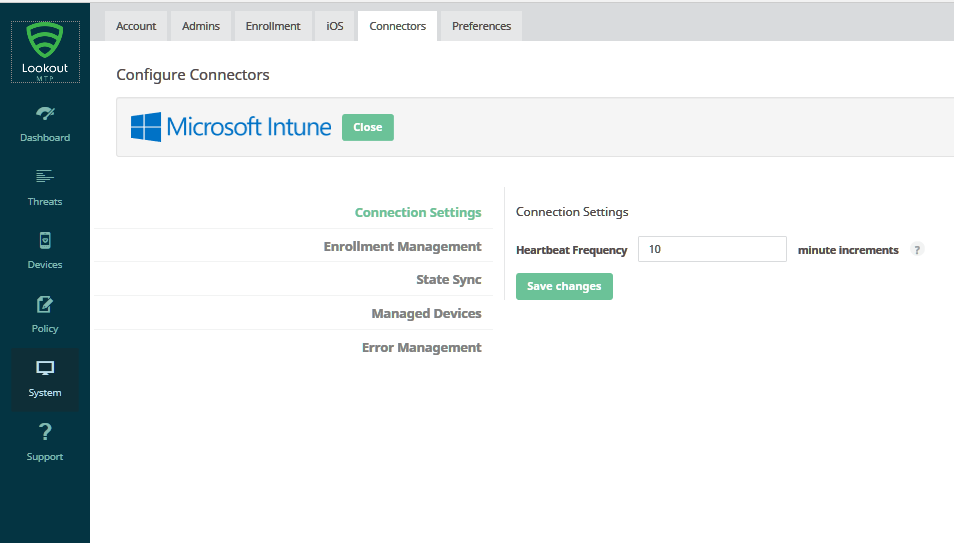

# Set up your subscription for  Lookout device threat protection

*Applies to: System Center Configuration Manager (Current Branch)*

To get your subscription ready for the Lookout device threat protection service, Lookout support (enterprisesupport@lookout.com) needs the following information about your Azure Active Directory (Azure AD) subscription. Your Lookout Mobility Endpoint Security tenant will be associated with your Azure AD subscription to integrate Lookout with Intune. 

* **Azure AD Tenant ID**
* **Azure AD Group Object ID** for **full** Lookout console access
* **Azure AD Group Object ID** for **restricted** Lookout console access (optional)

> [!IMPORTANT]
> An existing Lookout Mobile Endpoint Security tenant that is not already associated with your Azure AD tenant cannot be used for the integration with Azure AD and Intune. Contact Lookout support to create a new Lookout Mobile Endpoint Security tenant. Use the new tenant to onboard your Azure AD users.

Use the following section to gather the information you need to give to the Lookout support team.  

## Get your Azure AD information
### Azure AD tenant ID
Sign in to the [Azure AD management portal](https://manage.windowsazure.com) and select your subscription. 

When you choose the name of your subscription, the resulting URL  includes the subscription ID.  If you have any issues finding your subscription ID, see this [Microsoft support article](https://support.office.com/en-us/article/Find-your-Office-365-tenant-ID-6891b561-a52d-4ade-9f39-b492285e2c9b?ui=en-US&rs=en-US&ad=US) for tips on finding your subscription ID.   
### Azure AD Group ID
The Lookout console supports 2 levels of access:  
* **Full Access:** The Azure AD admin can create a group for users that will have Full Access and optionally create a group for users that will have Restricted Access.  Only users in these groups will be able to login to the **Lookout console**.
* **Restricted Access:** The users in this group will have no access to several configuration and enrollment related modules of the Lookout console, and have read-only access to the **Security Policy** module of the Lookout console.  

For more details on the permissions, read [this article](https://personal.support.lookout.com/hc/en-us/articles/114094105653) on the Lookout website.

The **Group Object ID** is on the **Properties** page of the group in the **Azure AD management console**.

Once you have gathered this information, contact Lookout support (email: enterprisesupport@lookout.com).

Lookout Support will work with your primary contact to onboard your subscription and create your Lookout Enterprise account, using the information that you collected.

## Configure your subscription with Lookout device threat protection
### Step 1: Set up your device threat protection
After Lookout support creates your Lookout Enterprise account, you can sign in to the Lookout console.   An email from Lookout is sent to the primary contact for your company  with a link to the login url:https://aad.lookout.com/les?action=consent

You must use a user account with the Azure AD role of Global Admin when you first log in to the Lookout console, since Lookout requires this information to register your Azure AD tenant.   Subsequent sign in will not require the user to have this level of Azure AD privilege.  In this first login, a consent page is displayed. Choose **Accept** to complete the registration.

Once you have accepted and consented, you are redirected to the Lookout Console. Subsequent logins after the initial registration can be done using the URL:  https://aad.lookout.com

See the [troubleshooting article]()  if you run into login issues.

The next steps outline the tasks that you must do to complete the Lookout set up within the [Lookout Console](https://aad.lookout.com).

### Step 2: Configure the Intune connector

1.  In the Lookout console, from the **System** module, choose the **Connectors** tab, and select **Intune**.

  

2.  In the connection settings option, configure the heartbeat frequency in minutes.  Your Intune connector is now ready.  

  

### Step 3: Configure enrollment groups
On the **Enrollment Management** option, define a set of users whose devices should be enrolled with Lookout. The best practice is to start with a small group of users to test and become familiar with how the integration works.  Once you are satisfied with your test results, you can extend the enrollment to additional groups of users.

To get started with enrollments groups,  first define an Azure AD security group that would be a good first set of users to enroll in Lookout device threat protection. Once you have the group created in Azure, AD, in the Lookout Console, go to the **Enrollment Management** option and add the Azure AD security group **Display Name(s)** for enrollment.

When a user is in an enrollment group, any of their devices that are identified and supported in Azure AD are enrolled and eligible for activation in Lookout device threat protection.  The first time they open the Lookout for Work app on their supported device, the device is activated in Lookout.

The best practice is to use the default (5 minutes) for the increment of time to check for new devices.

>[!IMPORTANT]
> The display name is case sensitive.  Use the **Display Name** as shown the in the **Properties** page of the security group in the Azure portal. Note in the picture below that the **Properties** page of the security group, the Display Name is camel case.  The title however is displayed in all lower case and should not be used to enter into the Lookout console.
>

The current release has the following limitations:  
* There is no validation for the group display names.  Make sure to use the value in the **DISPLAY NAME** field shown in the Azure portal for the Azure AD security group.
* Creating groups within groups is not currently supported.  Azure AD security groups specified may only contain users and not nested groups.

### Step 4: Configure state sync
In the **State Sync** option, specify the type of data that should be sent to Intune.  Currently, you must enable both device status and threat status in order for the Lookout Intune integration to work correctly.  These are enabled by default.
### Step 5: Configure error report email recipient information
In the **Error Management** option, enter the email address that should receive the error reports.

### Step 6. Configure enrollment settings
In the **System** module, on the **Connectors** page, specify the number of days before a device is considered as disconnected.  Disconnected devices are considered as non-compliant and will be blocked from accessing your company applications based on the SCCM conditional access policies. You can specify values between 1 and 90 days.

### Step 7: Configure email notifications
If you want to receive email alerts for threats, sign in to the [Lookout console](https://aad.lookout.com) with the user account that should receive the notifications. On the **Preferences** tab of the **System** module, choose the desired notifications and set them to **ON**. Save your changes.

If you no longer want to receive email notifications, set the notifications to **OFF** and save your changes.
### Step 8: Configure threat classification
Lookout device threat protection classifies mobile threats of various types. The [Lookout threat classifications](http://personal.support.lookout.com/hc/en-us/articles/114094130693) have default risk levels associated with them. These can be changed at any time to suite your company requirements.

>[!IMPORTANT]
> The risk levels specified here are an important aspect of device threat protection because the Intune integration calculates device compliance according to these risk levels at runtime. In other words, the Intune administrator sets a rule in policy to identify a device as non-compliant if the device has an active threat with a minimum level of: high, medium, or low. The threat classification policy in Lookout device threat protection directly drives the device compliance calculation in Intune.

## Watching enrollment
Once the setup is complete, Lookout device threat protection starts to poll Azure AD for devices that correspond to the specified enrollment groups.  You can find information about the devices enrolled on the Devices module.  The initial status for devices is shown as pending.  The device status changes once the Lookout for Work app is installed, opened, and activated on the device.  For details on how to get the Lookout for Work app pushed to the device, see the [Configure and deploy Lookout for work apps](configure-and-deploy-lookout-for-work-apps.md) topic.
## Next steps
[Enable Lookout MTP connection Intune](enable-lookout-connection-in-intune.md)
