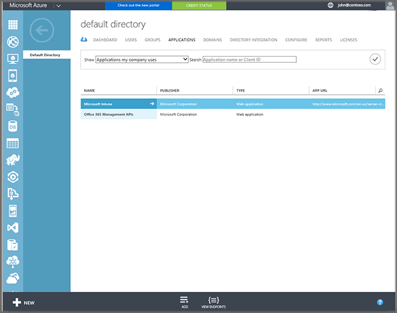

---
title: "Setup hybrid MDM with System Center Configuration Manager and Microsoft Intune"
ms.custom: na
ms.date: 09/20/2016
ms.prod: configuration-manager
ms.reviewer: na
ms.suite: na
ms.technology:
  - configmgr-hybrid
ms.tgt_pltfrm: na
ms.topic: get-started-article
ms.assetid: bb95154b-f63e-4491-896e-41d732c802f8
caps.latest.revision: 34
caps.handback.revision: 0
author: NathBarn
manager: angrobe

---
# Setup hybrid mobile device management (MDM) with System Center Configuration Manager and Microsoft Intune

Before you can manage iOS, Windows, and Android devices with Configuration Manager, they must be enrolled with Intune. Use the following steps to setup hybrid device enrollment with Configuration Manager using Intune.

 |Steps|Details|  
 |-----------|-------------|  
 |**Step 1:** [Create an MDM collection](#step-1-create-an-mdm-collection)|Create a Configuration Manager user collection with users whose devices can be enrolled|  
 |**Step 2:** [Domain name and Active Directory requirements](#step-2-domain-name-and-active-directory-requirements)|Confirm your organization's domain name service (DNS) and Active Directory user management meets MDM requirements|
 |**Step 3:** [Configure an Intune Subscription](#step-3-configure-microsoft-intune-subscription)|The Intune service lets you manage devices over the Internet.|  
 |**Step 4:** [Add terms and conditions for enrollment](#step-4-add-terms-and-conditions-for-enrollment)| Create terms and conditions to which users must agree before they can use the Company Portal app|
 |**Step 5:** [Configure service connection point site system role](#step-5-create-service-connection-point-site-system-role)|The service connection point sends settings and software deployment information to Configuration Manager and retrieves status and inventory messages from mobile devices. |  
 |**Step 6:** [Enable platform enrollment](#step-6-enable-mobile-device-platform-enrollment)|MDM enrollment for [iOS](#ios-and-mac-enrollment-setup) and [Windows](#windows-enrollment-setup) devices require additional steps for communication between the service and devices. Android requires no additional configuration.|  
 |**Step 7:** [Enable management](#step-7-set-up-additional-management)|(Optional) Set up configuration items and conditional access for enrolled devices|
 |**Step 8:** [Verify mobile device management configuration](#step-8-verify-mobile-device-management-configuration)|View log files to confirm that the service connection point was created successfully and user accounts are synchronizing.|
 |**Step 9:** [Enroll devices](step-9-enroll-devices)|Either tell users how to enroll their devices or begin enrolling company-owned devices to meet your organization's needs|

Looking for Intune without Configuration Manager?
> [!div class="button"]
[View Intune docs >](https://docs.microsoft.com/intune/deploy-use/enroll-devices-in-microsoft-intune)

## Step 1: Create an MDM collection
You will need a Configuration Manager user collection to specify users who can enroll devices into management. Only user collections can be targeted because Intune licenses are assigned to users. For testing purposes you can set up a **Direct rule** and add specific users who can enroll devices. In athe Configuration Manager console, choose, **Assets and Compliance** > **User Collections**, click the **Home** tab > **Create** group, and then click **Create User Collection**. For broader distribution you should use **Query rules** to define users. For more information about collections, see [How to create collections](https://technet.microsoft.com/library/mt629371.aspx).


## Step 2: Domain name and Active Directory requirements

If necessary, take the following steps to satisfy any dependencies external to Configuration Manager:

1.  Make sure that you have a publicly registered domain name and each user has a public domain UPN  that can be verified by Intune. GoDaddy or Symantec are typical examples of companies that provide domain names.

     Before synchronizing the Active Directory user account, you must verify that user accounts have a public domain UPN. For more information, see [Add User Principal Name Suffixes](http://go.microsoft.com/fwlink/?LinkID=271122) in the Active Directory documentation library.

     You can create a Configuration Manager custom report to verify that the UPN of the users who are discovered is consistent with the Intune Account Portal by using the following SQL query:

    ```
    SELECT UserPrincipalName,
    COUNT(*) AS NumOfOccurances FROM (SELECT RIGHT(User_Principal_Name0,
    LEN(User_Principal_Name0)-PATINDEX('%@%',
    User_Principal_Name0)) AS UserPrincipalName FROM CM_EC1.dbo.v_R_User)
    AS sub GROUP BY UserPrincipalName
    ```

2.  Optional, but strongly recommended: Deploy and configure Active Directory Federation Services (AD FS).

     When you set up single sign-on, your users can sign in with their corporate credentials to access the services in Intune.

     For more information, see the following topics:

    -   [Prepare for single sign-on](http://go.microsoft.com/fwlink/?LinkID=271124)
    -   [Plan for and deploy AD FS 2.0 for use with single sign-on](http://go.microsoft.com/fwlink/?LinkID=271125)

3.  Deploy and configure directory synchronization.

     Directory synchronization lets you populate Intune with synchronized user accounts. The synchronized user accounts and security groups are added to Intune. Failure to enable Directory Synchronization is a common cause of devices not being able to enroll when setting up Configuration Manager MDM with Microsoft Intune.

     For more information, see [Directory integration](http://go.microsoft.com/fwlink/?LinkID=271120) in the Active Directory documentation library.

4.  Optional, not recommended: If you are not using Active Directory Federation Services, reset users' Microsoft Online passwords.

     If you are not using AD FS, you must set a Microsoft Online password for each user.


## Step 3: Configure Microsoft Intune subscription
 The Intune subscription lets you manage devices over the internet. This includes specifying which user collection can enroll devices and defining information presented to users. The Intune subscription does the following:

-   Retrieves the certificate that the service connection point requires to connect to the Intune service
-   Defines the user collection that enables users to enroll mobile devices
-   Defines and configures the mobile platforms that you want to support

> [!IMPORTANT]
>  Creating a subscription for Microsoft Intune in Configuration Manager will put your site's service connection point in "online mode." See [About the service connection point in System Center Configuration Manager](../../core/servers/deploy/configure/about-the-service-connection-point.md).

### To create the Microsoft Intune subscription

1.  If you haven't already, sign up for a Microsoft Intune account at [Microsoft Intune](http://go.microsoft.com/fwlink/?LinkID=258216).  After creating your Intune account, you do not need to add any users to the Intune account or perform additional settings configurations.

2.  In the Configuration Manager console, click **Administration**.

3.  In the **Administration** workspace, expand **Cloud Services**, and click **Microsoft Intune Subscriptions**. On the **Home** tab, click **Add Microsoft Intune Subscription**.


4.  On the **Introduction** page of the Create Microsoft Intune Subscription Wizard, review the text and click **Next**.

5.  On the **Subscription** page, click **Sign in** and sign in by using your work or school account. In the **Set the Mobile Device Management Authority** dialog, select the check box to only manage mobile devices by using Configuration Manager through the Configuration Manager console. To continue with your subscription, you must select this option.

    > [!IMPORTANT]
    >  Once you select Configuration Manager as your management authority, you cannot change the management authority to Microsoft Intune in the future.

6.  Click the privacy links to review them, and then click **Next**.

7.  On the **General** page, specify the following options, and then click **Next**.

  -   **Collection**: Specify a user collection that contains users who will enroll their mobile devices.

      > [!NOTE]
      >  If a user is removed from the collection, the user's device will continue to be managed for up to 24 hours when the user record is removed from the user database.

  -   **Company name**: Specify your company name.

  -   **URL to company privacy documentation**: If you publish your company privacy information to a link that is accessible from the Internet, provide a link that users can access from the company portal, for example http://www.contoso.com/CP_privacy.html. Privacy information can clarify what information users are sharing with your company.

  -   **Color scheme for company portal**: Optionally, change the default color of blue for the company portals.

  -   **Configuration Manager site code**: Specify a site code for a primary site to manage the mobile devices.

    > [!NOTE]
    >  Changing the site code affects only new enrollments and does not affect existing enrolled devices.

8.  On the **Company Contact Information** page, specify the company contact information that is displayed to users under **Contact IT** in the Company Portal app. Provide contact information for your company, and then click **Next**.

9. On the **Company Logo** page, you can choose whether to display logos in the company portal, and then click **Next**.

10. Complete the wizard.

## Step 4: Add terms and conditions for enrollment
 Once you've configured Intune management for mobile devices, you can create **Terms and Conditions**. Use terms and conditions to explain to users what happens when they enroll their devices. Users must accept the terms and conditions before they can enroll a device. In the Configuration Manager console, go **Assets and Compliance** > **Overview** > **Compliance Settings** > **Terms and Conditions**, and then click **Create Terms and Conditions**. See [Terms and Conditions in System Center Configuration Manager](terms-and-conditions.md).

##  Step 5: Create service connection point site system role
When you have created your subscription, you can then install the service connection point site system role that lets you connect to the Intune service. This site system role will push settings and applications to the Intune service.

 The service connection point sends settings and software deployment information to Configuration Manager and retrieves status and inventory messages from mobile devices. The Configuration Manager service acts as a gateway that communicates with mobile devices and stores settings.

> [!NOTE]
>  The service connection point site system role may only be installed on a central administration site or stand-alone primary site. The service connection point must have Internet access.


### Configure the service connection point role

1.  In the Configuration Manager console, click **Administration**.

2.  In the **Administration** workspace, expand **Sites**, and then click **Servers and Site System Roles**.

3.  Add the **Service connection point** role to a new or existing site system server by using the associated step:

    -   New site system server: On the **Home** tab, in the **Create** group, click **Create Site System Server** to start the Create Site System Server Wizard.

    -   Existing site system server: Click the server on which you want to install the service connection point role. Then, on the **Home** tab, in the **Server** group, click **Add Site System Roles** to start the Add Site system Roles Wizard.

4.  On the **System Role Selection** page, select **Service connection point**, and click **Next**.


5.  Complete the wizard.

### How does the service connection point authenticate with the Microsoft Intune service?
 The service connection point extends Configuration Manager by establishing a connection to the cloud-based Intune service that manages mobile devices over the Internet. The service connection point authenticates with the Intune service as follows:

1.  When you create an Intune subscription in the Configuration Manager console, the Configuration Manager admin is authenticated by connecting to Azure Active Directory, which redirects to the respective ADFS server to prompt for user name and password. Then, Intune issues a certificate to the tenant.

2.  The certificate from step 1 is installed on the service connection point site role and is used to authenticate and authorize all further communication with the Microsoft Intune service.

## Step 6: Enable mobile device platform enrollment
  Different device platforms require additional configuration to enable device enrollment:
  - [iOS and Mac enrollment setup](#ios-and-mac-enrollment-setup): Get an Apple MDM Push certificate
  - [Windows enrollment setup](#windows-enrollment-setup): Configure DNS and enable enrollment for both Windows PCs, Windows 10 Mobile, and Windows Phone devices
  - Android: Android devices require no additional steps to enable enrollment

### iOS and Mac enrollment setup
  The following steps enable management for Apple devices by uploading an Apple MDM Push certificate to the Intune service.

  1.  **Download a certificate signing request** - A certificate signing request file (.csr) is required to request an APNs certificate from Apple.  

      1.  In the Configuration Manager console in the **Administration** workspace, go to **Cloud Services**> **Microsoft Intune Subscriptions**.  

      2.  On the **Home** tab, click **Create APNs certificate request**. The **Request Apple Push Notification Service Certificate Signing Request** dialog box opens.  

      3.  **Browse** to the path to save the new certificate signing request (.csr) file. Save the certificate signing request (.csr) file locally.  

      4.  Click **Download**. The new Microsoft Intune .csr file downloads and is saved by Configuration Manager. The .csr file is used to request a trust relationship certificate from the Apple Push Certificates Portal.  

  2.  **Request an APNs certificate from Apple** - The Apple Push Notification service (APNs) certificate is used to establish a trust relationship between the management service, Intune, and enrolled iOS mobile devices.  

      1.  In a browser, go to the [Apple Push Certificates Portal](http://go.microsoft.com/fwlink/?LinkId=269844) and sign in with your company Apple ID. This Apple ID must be used in future to renew your APNs certificate.  

      2.  Complete the wizard using the certificate signing request (.csr) file. Download the APNs certificate and save the .pem file locally. This APNs certificate (.pem) file is used to establish a trust relationship between the Apple Push Notification server and Intune's mobile device management authority.  

  3.  **Enable enrollment and upload the APNs certificate** - To enable iOS enrollment, upload the APNs certificate.  

      1.  In the Configuration Manager console in the **Administration** workspace, go to **Cloud Services** > **Microsoft Intune Subscription**.  

      2.  On the **Home** tab in the **Subscription** group, click **Configure Platforms** > **iOS**.  

          > [!NOTE]  
          >  Do not upload the Apple Push Notification service (APNs) certificate until you enable iOS enrollment in the Configuration Manager console.  

      3.  In the **Microsoft Intune Subscription Properties** dialog box, select the **iOS** tab and click to select the **Enable iOS enrollment** checkbox.  

      4.  Click **Browse**, and go to the APNs certificate (.cer) file downloaded from Apple. Configuration Manager displays the APNs certificate information. Click **OK** to save the APNs certificate to Intune.    

### Windows enrollment setup  
A DNS alias (CNAME record type) makes it easier for users to enroll their devices by automatically populating the server name during device enrollment. You can then enable enrollment for Windows PCs mobile devices.  
1. (Optional) Create a DNS alias (CNAME record type) in your company's DNS records that redirects requests sent to a URL in your company's domain to Microsoft's cloud service servers.  For example, if your company's domain is contoso.com, you should to create a CNAME in DNS that redirects EnterpriseEnrollment.contoso.com to EnterpriseEnrollment-s.manage.microsoft.com.  

  |Type|Host name|Points to|  
  |----------|---------------|---------------|  
  |CNAME|EnterpriseEnrollment.company_domain.com|EnterpriseEnrollment-s.manage.microsoft.com|  
  |CNAME|EnterpriseRegistration.company_domain.com|EnterpriseRegistration.windows.net|  

2.  In the Configuration Manager console in the **Administration** workspace, go to **Cloud Services** > **Microsoft Intune Subscriptions**.  

   > [!WARNING]  
   >  If other Configuration Manager dialog boxes are open, close them before continuing with this procedure.  

3. In the Configuration Manager console in the **Administration** workspace, go to **Cloud Services** > **Microsoft Intune Subscriptions**, then do the following:  
  - **Windows PCs:** On the **Home** tab, click **Configure Platforms**, and then click **Windows**. On the **General** tab, select **Enable Windows enrollment**.  
  - **Windows 10 Mobile and Windows Phone:** On the **Home** tab, click **Configure Platforms**, and then click **Windows Phone**.  On the **General** tab, choose  **Windows Phone 8.1 and Windows 10 Mobile**.

#### Azure Active Directory enrollment

  Automatic enrollment lets users enroll either company-owned or personal Windows 10 PCs and Windows 10 Mobile devices in Intune by adding a work or school account and agreeing to be managed. Simple as that. In the background, the user's device registers and joins Azure Active Directory. Once registered, the device is managed with Intune.

  **Prerequisites**
  - Azure Active Directory Premium subscription ([trial subscription](http://go.microsoft.com/fwlink/?LinkID=816845))
  - Microsoft Intune subscription

  1. In the [Azure management portal](https://manage.windowsazure.com) (https://manage.windowsazure.com), navigate to the **Active Directory** node and select your directory.

  2. Click the **Applications** tab and you should see **Microsoft Intune** in the list of applications.

      

  3. Click on the arrow for **Microsoft Intune** and you should see a page that enables you to configure Microsoft Intune.

  4. Click **Configure** to start configuring automatic MDM enrollment with Microsoft Intune.

  5. Specify the URLs for Intune:

    - **MDM Enrollment URL** – Use `https://enterpriseenrollment-s.manage.microsoft.com/EnrollmentServer/Discovery.svc` for the MDM Enrollment URL.
    - **MDM Terms of Use URL** – Use the default value. This URL displays terms of use for users when enrolling devices.
    - **MDM Compliance URL** – Use the default value. If a device is found to be out of compliance, an **Access denied** message is displayed with this URL. The URL points to a page that helps users understand why their device is not compliant with policy and how they can bring it back into compliance.

  6.  Specify which users’ devices should be managed by Microsoft Intune. These users’ Windows 10 devices will be automatically enrolled for management with Microsoft Intune.

    - **All**
    - **Groups**
    - **None**

  7. Choose **Save**.

## Step 7: Set up additional management
(Optional) You can set up additional management before devices are enrolled. These management solutions can be created and deployed after devices are enrolled, although many organizations prefer to deploy them as devices are brought into management.

**Configuration items** let you manage settings such as requiring a PIN or requiring encryption on enrolled devices based on device platform:
- [Windows 10 and Windows 8.1 devices](../compliance/deploy-use/create-configuration-items-for-windows-8.1-and-windows-10-devices-managed-without-the-client)
- [Windows Phone devices](../compliance/deploy-use/create-configuration-items-for-windows-phone-devices-managed-without-the-client)
- [iOS and Mac devices](../compliance/deploy-use/create-configuration-items-for-ios-and-mac-os-x-devices-managed-without-the-client)
- [Android and Samsung KNOX devices](../compliance/deploy-use/create-configuration-items-for-ios-and-mac-os-x-devices-managed-without-the-client)

**Applications** can be deployed to managed devices:
- [iOS applications](../../apps/get-started/creating-ios-applications.md)
- [Mac applications](,,/../apps/get-started/creating-ios-applications.md)
- [Windows PC applications](../../apps/get-started/creating-windows-application.md)
- [Windows Phone applications](../../apps/get-started/creating-windows-phone-applications.md)
- [Android applications](../../apps/get-started/creating-android-applications.md)

**Conditional access** lets you manage access to company resources including:  
- [Email access](../../protect/deploy-use/manage-email-access.md)
- [SharePoint access](../../protect/deploy-use/manage-sharepoint-online-access.md)
- [Skype for Business access](../../protect/deploy-use/manage-skype-for-business-online-access)
- [Dynamic CRM Online](../../protect/deploy-use/manage-dynamics-crm-online-access.md)

## Step 8: Verify mobile device management configuration

 You can verify certain device management components by checking the following log files:

-   Check the Cloudusersync.log to verify that user accounts are successfully synchronized.

-   Check the Sitecomp.log to verify that the service connection point was created successfully.

## Step 9: Enroll devices
Hybrid setup is now complete. Devices can be enrolled in Configuration Manager in a number of ways:
- User-owned (BYOD) devices: [Inform users how to enroll their devices](https://docs.microsoft.com/en-us/intune/deploy-use/what-to-tell-your-end-users-about-using-microsoft-intune) - Enrollment guidance is the same for Intune- and Hybrid-managed devices
- Company-owned (COD) devices: [Enroll company-owned devices](enroll-company-owned-devices.md) provides guidance on different platform-specific ways to enroll company owned devices.

### Managing Intune subscriptions associated with Configuration Manager
 If you add a Microsoft Intune (either a trial subscription or paid subscription) to Configuration Manager, and then need to switch to a different Intune subscription, you must delete both the  **Microsoft Intune Subscription** and the **Service connection point** from the Configuration Manager console before you can add a new subscription.

#### How to delete an Intune subscription from Configuration Manager

1.  In the Configuration Manager console, click **Administration**.

2.  In the **Administration** workspace, expand **Overview**, go to **Cloud Services**, and click **Microsoft Intune Subscriptions**.

3.  Right-click **Microsoft Intune Subscription** and then click **Delete**. The **Microsoft Intune Subscription**.

    > [!IMPORTANT]
    >  All content including user enrollments, policies, and app deployments configured for the Intune evaluation subscription will be lost.

4.  In the **Administration** workspace, expand **Overview**, go to **Site Configuration**, and select **Servers and Site System Roles**.

5.  Select the server that hosts the **Service connection point** role.

6.  In the **Site System Roles** list, select **Service connection point** and then click **Remove Role** in the ribbon. Confirm you want to remove the role. The service connection point is deleted.

7.  You can now create a new service connection point, add a new Intune subscription to Configuration Manager, and set Configuration Manager as the MDM Authority.
