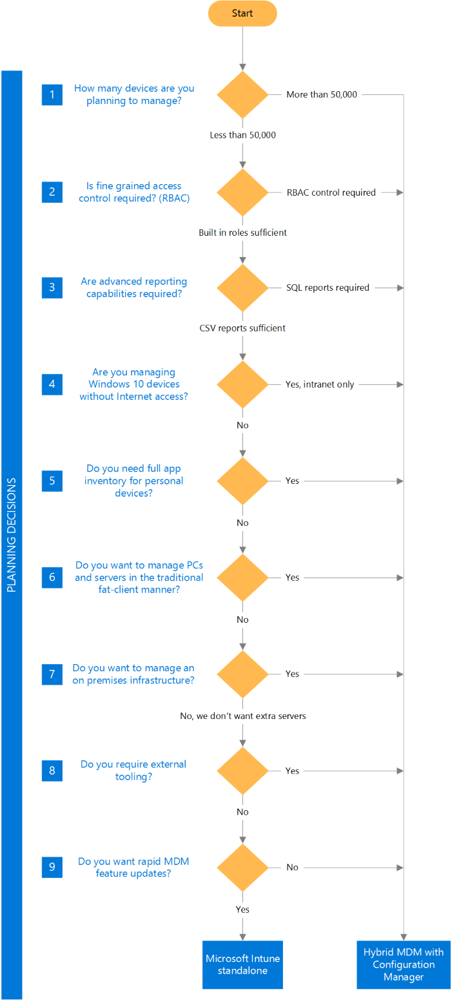

# Choose between Microsoft Intune standalone and hybrid mobile device management with System Center Configuration Manager
One of the most commonly asked questions regarding mobile device management (MDM) with Microsoft Intune is "Should I deploy hybrid MDM with Intune and Configuration Manager or run Intune standalone in the cloud only configuration?" It’s an important decision, and one that is not easily changed after implementation.  
  
 An Intune standalone deployment involves no on-premises infrastructure, and is managed via a web console. It is agile and lightweight, and popular with cloud-first minded organizations.  
  
 A hybrid MDM deployment involves Intune and Configuration Manager, and is managed using tools familiar to experienced Configuration Manager admins. It offers “single pane of glass” management of MDM and traditional clients, as well as scale in large environments.  
  
 **In this article:**  
  
 [What does Intune standalone mean?](#Intune)   
 [What does hybrid MDM mean?](#hybrid)   
 [Planning choices and Intune deployment timelines](#choices_timelines)   
 [Pros and Cons of Intune standalone](#IntuneProCon)   
 [Pros and Cons of hybrid MDM](#HybridProCon)   
 [Planning decisions](#DecsionTree)  
  
##   What does Intune standalone mean?  
 Intune at its core is a cloud service. There are Intune datacenters hosted in North America, Europe and Asia providing mobile devices with security policies, email and Wi-Fi profiles, applications, inventory, and more.  
  
 An Intune standalone implementation does not require any on-premises infrastructure. All configuration, management, deployment and reporting are performed via a web-based console, which is accessible from anywhere in the world.  
  
 For working with on-premises applications, such as Microsoft Exchange and Network Device Enrollment Service (NDES), on-premises connectors are available to provide connectivity into the Intune service.  
  
 Being a cloud service, Intune can be built and deployed in a short timeframe.  
  
##   What does hybrid MDM mean?  
 For organizations who want to maximize their Configuration Manager investment, customers who need fine-grained control, or customers who exceed scale limitations of Intune, a hybrid  implementation that uses Intune to manage mobile devices  is available.  
  
 Hybrid deployments require  Microsoft System Center 2012 Configuration Manager SP1 or above.  
  
 The Intune service is connected to Configuration Manager with the Service Connection Point site system role (formally known as the Microsoft Intune Connector), which installed at either central administration or primary site of a Configuration Manager hierarchy. An Intune tenant can only be connected to one Configuration Manager hierarchy, and a Configuration Manager hierarchy can only be connected to one Intune tenant.  
  
 In a hybrid MDM configuration, some of the processing and storage overhead is performed by Configuration Manager infrastructure on-premises. This efficiency gain allows hybrid MDM to scale further than Intune standalone.  
  
 A hybrid deployment allows the use of tools that are familiar to Configuration Manager admins. Advanced functionality such as Role Based Administration Control (RBAC), SQL Server Reporting Services (SSRS), and complex device and user grouping using Collection Membership Queries become available for mobile devices when hybrid MDM is implemented.  
  
##   Planning choices and Intune deployment timelines  
 Intune innovation and evolution is occurring at a rapid pace with monthly updates providing new or enhanced features, enhanced scale, new admin-console experiences through the Azure Portal, dynamic groups through Azure Active Directory, and more. As such, any design decisions should take into account the future direction of the product.  
  
 Many of the unique abilities that a hybrid configuration currently provides will be functionally replicated in Intune standalone as the service is developed in the short, medium, and long term.  
  
 If you're deciding between standalone and hybrid, you should take into consideration the deployment timelines. It is common for customers to go through multiple deployment iterations including design, build, user acceptance testing, and pilot phases, often taking many months to complete, before they are ready to deploy into production. For this reason, when choosing an Intune hierarchy design, take into consideration the time in which the actual deployment will occur and the short, medium,  and long term direction of the service.  
  
 As the Intune service continues to evolve, our goal is to simplify your configuration choice. In the future, the only reason for choosing a hybrid MDM environment should be for customers who require a single management console for both traditional clients and mobile devices.  We’re doing a lot of work to enhance scalability, adding role-based access through the Azure Portal, and dynamic groups through deeper Azure Active Directory integration, all aligned to short and medium term service updates.  
  
 Finally, we’re also working to assure that whatever configuration choice you make today, you’re able to move easily between hybrid and standalone configuration choices in a frictionless way. Switching MDM authorities today requires manual intervention from Microsoft Support, and significant effort by the tenant. To simplify this, our goal is to allow coexistence of hybrid and Intune standalone, allowing you to move users between the two types of management, but not requiring you to choose one configuration over the other.  This change also removes today’s challenges of having to call support and eliminates un-enrolling and re-enrolling devices.  
  
##   Pros and Cons of Intune standalone  
  
|Pros|Cons|  
|----------|----------|  
|Rapid build and deployment   No on-premises infrastructure   More frequent updates and feature releases   Low learning curve   Admin console available externally|Limited reporting capabilities   Limited security role restriction   No external tooling (such as PowerShell, etc.)   Limited app inventory   Basic user and device grouping capabilities   Silverlight required|  
  
##   Pros and Cons of hybrid MDM  
  
|Pros|Cons|  
|----------|----------|  
|Ability to scale   Advanced tooling (such as Configuration Manager console, PowerShell, logging, etc.)   Role Based Access Control (RBAC)   Advanced reporting   “Single pane of glass” management for MDM + traditional clients   Extended app inventory   Advanced user and device grouping   Multiple Exchange on-premises and Exchange Online connectors supported   Multiple NDES/CRP roles supported   Ability to mark devices as "company owned"   Greater troubleshooting capabilities   Configuration Manager user CALs included in subscription|On-premises complexity (configuration and management)   Steep learning curve   Servicing required for updates and feature releases   Additional licensing requirements (such as Windows, SQL Server, etc.)|  
  
##   Planning decisions  
   
  
|||  
|-|-|  
||**How many devices are you planning to manage?**   Intune standalone supports up to 50,000 devices. Hybrid MDM  supports up to 300,000 devices.   For any deployment of significant size – standalone or hybrid MDM – we suggest you contact your Microsoft accounts team. Your Microsoft accounts team can put you in contact with Intune specialists who can discuss scale and limitations further.|  
||**Is fine-grained access control required? (RBAC)**   Role Based Access Control (RBAC)  was added to System Center 2012 Configuration Manager. RBAC allows Configuration Manager administrators to design and deploy complex permission-sets, to restrict admin access to Configuration Manager objects and functions.   Intune standalone provides only two administrator roles: Full Access and Read-only Access.   If your organization needs to scope certain admins to certain users, devices, functions, or objects, Configuration Manager with RBAC is required.   If your organization has a small administrative team, and you don’t need the complexity of fine-grained access control, Intune with built-in security roles is the best fit.|  
||**Are advanced reporting capabilities required?**   Hybrid MDM with Configuration Manager includes advanced reporting functionality using SQL Server Reporting Services (SSRS). Configuration Manager comes with 34 built-in MDM reports and over 400 standard Configuration Manager reports. SSRS also allows admins and business analysts to write their own custom reports. Further, the Configuration Manager database can be queried by external tools, such as orchestration tools, to provide specific functions such as custom alerting. Being Configuration Manager run reports, all reports can also include non-MDM data, such as traditional PC inventory side-by-side with mobile device inventory.   Intune standalone provides 9 reports. These reports are not customizable, and offer limited input variables. Reports can be printed, or exported into CSV or HTML.   If your organization requires advanced reporting functions, and has the bandwidth and knowledge to manage SSRS, hybrid MDM is the best fit.   If your organization wants a simple to use reporting engine and predefined reports, Intune standalone’s reporting functionality should be sufficient.|  
||**Are you managing Windows 10 devices without Internet access?**   In Configuration Manager (current branch), Windows 10 devices can be managed via the MDM channel using only  on-premises infrastructure.   The On\-premises Mobile Device Management feature is designed to allow MDM management for non-Internet accessible clients, and is primarily targeted at single use devices (such as kiosk devices) and IoT devices.   Due to Intune standalone’s cloud-only approach, all managed devices must have Internet access. If your organization wants to manage Windows 10 devices via On\-premises Mobile Device Management, an hybrid MDM configuration is required. Note that On\-premises Mobile Device Management does not support managing both Internet and intranet mobile devices at the same time.|  
||**Do you need full app Inventory?**   By default, Intune standalone will only collect app inventory for apps that Intune manages and deploys. This means inventory reports will not contain information for side-loaded apps that have been installed by users outside of the Intune Company Portal.   Hybrid MDM with Configuration Manager allows admins to designate certain devices as "company owned". When a device is set as a company-owned device, extended app inventory is gathered, providing access to a devices full app list.   If your organization requires information about personally installed apps from managed devices, hybrid MDM is required. Before making a decision based on this choice, consider the impact to your end user’s privacy.|  
||**Do you want to manage PC’s in the traditional fat-client manner?**   One benefit hybrid MDM offers over a standalone configuration is "single pane of glass" management. This means an organization can manage their entire fleet of desktop computers, servers, and mobile devices from the one management tool, the Configuration Manager console. Also with the Configuration Manager client, advanced management functions such as hardware and software inventory, software update management, software deployment, and operating system deployment are available for non-mobile devices.   If your organization wishes to manage traditional Windows, Linux/UNIX, and Mac clients, Configuration Manager is the premier management platform.   Intune standalone also offers traditional PC management (Windows 7, 8.1, and 10) using the Intune PC management client. It offers basic PC management, include hardware inventory, Windows updates, Endpoint Protection, and simple software deployment. The client does not work with Configuration Manager, so can be used in both Intune standalone and hybrid MDM deployments.|  
||**Do you want to manage on-premises infrastructure?**   A certain level of management overhead and complexity comes with any on-premises infrastructure. Configuration Manager is a product that requires significant knowledge, experience, and investment to manage and maintain its infrastructure.   At a minimum, hybrid MDM requires a single Configuration Manager primary site, with the database role, reporting services role, and the service connection point role. If traditional PC management is required, the management point, distribution point, software update point, and application catalog roles may also be required. Advanced functions, such as certificate deployment, Mac management, and Endpoint Protection add even more roles and complexity.   The Configuration Manager hierarchy requires significant management and maintenance to ensure it’s healthy and functioning as required.   If the overhead of a Configuration Manager hierarchy is not desired, an Intune standalone deployment is your best option.|  
||**Do you require external tooling?**   Configuration Manager is a mature, enterprise grade product and includes many ways to interact with the service without using the console. A hybrid MDM deployment allows admins to use the Configuration Manager SDK or PowerShell to programmatically manage mobile devices. It also allows admins to utilize tools such as System Center Orchestrator, PowerBI , and various third party add-ins.   In an Intune standalone deployment, all administration must be performed via the Silverlight console and no external tooling is available.|  
||**Do you want rapid MDM feature updates?**   Even though Configuration Manager (current branch) offers rapid servicing of updates and features, the development of cloud services, such as  Intune, lends itself well to even faster production deployment.   Intune standalone will likely receive new features before a hybrid MDM deployment.   If your organization likes to be cutting edge, Intune standalone will offer the newest MDM features in the timeliest manner.|