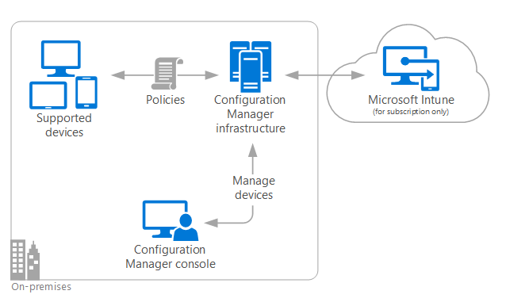

# On-premises Mobile Device Management (MDM) in System Center Configuration Manager

*Applies to: System Center Configuration Manager (Current Branch)*

System Center Configuration Manager On\-premises Mobile Device Management is a device management solution that relies on the built-in management capabilities of device operating systems (based on the Open Mobile Alliance Device Management  or OMA DM standard) while using an enterprise's Configuration Manager infrastructure to manage and maintain the devices. On\-premises Mobile Device Management requires Microsoft Intune to set up the management capability, but it's only needed for the subscription (and at times to help notify devices to check in for policy changes), but it's not used to manage devices or store data about them.  

   

 On\-premises Mobile Device Management differs from Microsoft Intune, which also relies on built-in  OMA DM capabilities, but all of the management functions are delivered through cloud services.  On\-premises Mobile Device Management also differs from the client-based management solution traditionally offered by Configuration Manager in that it relies on similar enterprise infrastructure but does not use separately installed client software on the computers and devices it manages.  

 The table below lists the advantages and disadvantages of On\-premises Mobile Device Management as compared to traditional client-based management:  

|Advantages|Disadvantages|  
|----------------|-------------------|  
|**Simplified infrastructure** - Fewer site system roles are required.   **Easier to maintain** - Because management functionality is built-in to the device operating system, new versions of the client software are not required when new management features are introduced to the Configuration Manager system.   **On-premises** - All management and data kept on-premises.|**Less client management functionality** - No orchestration, software metering, third-party integration, task sequencing, or software center support.   **Limited device support** - currently On\-premises Mobile Device Management only supports devices running Windows 10 and Windows 10 Mobile.|  

 The following topics provides information you can use to plan, prepare, and enroll devices for On\-premises Mobile Device Management:  

-   [Plan for On-premises Mobile Device Management in System Center Configuration Manager](../plan-design/plan-on-premises-mdm.md)  

     Learn about what to consider when setting up the Configuration Manager infrastructure and planning for device enrollment in On\-premises Mobile Device Management.  

-   [Preparation steps for On-premises Mobile Device Management in System Center Configuration Manager](../get-started/preparation-steps-for-on-premises-mdm.md)  

     Learn about how to get the Configuration Manager system ready for On\-premises Mobile Device Management by setting up the Microsoft Intune subscription, setting up certificates, installing site system roles, and setting up device enrollment.  

-   [Enroll devices for On-premises Mobile Device Management in System Center Configuration Manager](../deploy-use/enroll-devices-on-premises-mdm.md)  

     Learn about how enrollment occurs, how users can enroll their own devices, and how to bulk-enroll devices with an enrollment package.  
